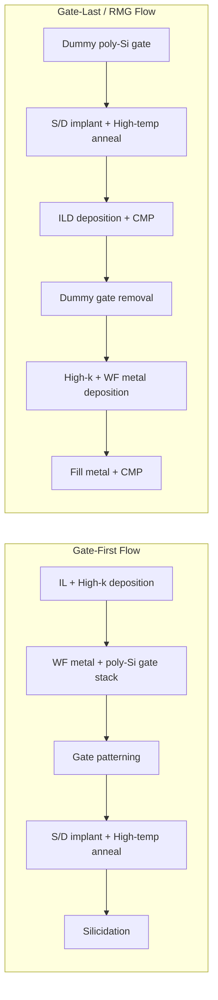

## Gate First versus Gate Last Integration

### Overview

Gate-first and gate-last are the two principal process integration schemes for building high-k metal gate (HKMG) CMOS transistors. They differ in the sequence in which the gate stack is finalized relative to the high-temperature source/drain (S/D) activation anneal, and this sequencing has significant downstream consequences for threshold voltage control, mobility, and manufacturability.

### Core Process Sequence Comparison

**Gate-First Integration**

1. Interfacial layer (IL) growth on silicon channel
2. High-k dielectric deposition (e.g., $HfO_2$)
3. Work-function metal deposition and patterning (N-metal/P-metal)
4. Polysilicon or metal cap deposition
5. Gate stack lithography and etch (full gate stack patterned as a single film stack)
6. Source/drain implant
7. High-temperature activation anneal (~1000°C) — **gate stack is present and exposed to full thermal budget**
8. Silicidation, contacts, back-end processing

**Gate-Last (Replacement Metal Gate, RMG) Integration**

1. Dummy (sacrificial) polysilicon gate formed with conventional oxide or thin high-k
2. Spacer formation, source/drain implant
3. High-temperature activation anneal — **only dummy poly gate present, no work-function metal exposed**
4. Interlayer dielectric (ILD) deposition and chemical-mechanical polishing (CMP) to expose dummy gate
5. Dummy gate selectively etched out
6. Interfacial layer regrowth/clean, high-k deposition (or high-k retained from step 1 in "high-k first" gate-last variants)
7. Work-function metal deposition, patterning
8. Fill metal deposition ($W$ or $Al$)
9. CMP planarization

### Thermal Budget Exposure — the Central Distinction

**Key Points**

- In gate-first, the complete high-k/metal gate stack must survive the full S/D activation anneal (~950–1050°C), since it is formed before this step.
- In gate-last, the high-k and work-function metal are deposited **after** the high-temperature anneal, so they are only exposed to lower-temperature back-end-compatible processing (typically well under 500°C).
- This single difference in thermal sequencing is the root cause of most of the electrical and manufacturability trade-offs between the two approaches.

### Electrical and Reliability Consequences

| Characteristic | Gate-First | Gate-Last (RMG) |
| --- | --- | --- |
| Thermal exposure of WF metal/high-k | Full anneal budget | Low thermal budget only |
| Fermi-level pinning | More pronounced — anneal drives interfacial reactions that compress EWF range | Substantially reduced |
| Threshold voltage ($V_t$) stability | Harder to control precisely; anneal-induced EWF drift | Better $V_t$ precision and reproducibility |
| Channel mobility | Degraded by remote phonon scattering and interface state generation exacerbated by thermal exposure | Improved due to lower thermal damage to high-k/IL interface |
| Boron penetration (PMOS) | Present if poly-Si used in stack, mitigated but not eliminated by high-k barrier | Not applicable in true metal-gate-last flows |
| Work function metal material choice | Restricted to materials thermally stable at anneal temperature | Wider material choice — including metals that would not survive high-temp anneal |
| Multi-$V_t$ flexibility | Limited, since metal/dipole layers must all survive anneal | Greater flexibility for dipole/cap-layer $V_t$ tuning schemes |

### Process Complexity and Manufacturability Trade-offs

**Gate-First Advantages**

- [Inference] Fewer total process steps overall, since there is no dummy gate formation, removal, or re-deposition sequence — generally regarded as the simpler and lower-cost integration scheme when it is electrically viable.
- No CMP-critical dummy gate removal/replacement step, avoiding associated planarity and gate-length-dependent RMG fill challenges.
- No risk of "seam" or void defects that can occur in gate-last narrow-trench metal fill.

**Gate-First Disadvantages**

- Constrained selection of work-function metals (must survive full thermal budget without excessive EWF drift or interfacial reaction).
- Fermi-level pinning between high-k and poly-Si (in poly-capped gate-first schemes) compresses achievable $V_t$ split.
- More difficult to achieve tight $V_t$ control across a wafer given the sensitivity of EWF to anneal-induced changes.

**Gate-Last (RMG) Advantages**

- Wider material selection for work-function metals since thermal exposure is minimal.
- Better $V_t$ control and reduced Fermi-level pinning, critical for scaled nodes requiring multiple precise $V_t$ flavors.
- Improved channel mobility due to reduced interface damage.

**Gate-Last (RMG) Disadvantages**

- Additional process steps: dummy gate formation, ILD CMP, dummy gate removal, high-k/metal re-deposition, fill CMP.
- Metal gate fill in narrow, high-aspect-ratio trenches (especially at scaled gate pitch) is prone to voids, seams, or incomplete fill, which becomes progressively more challenging as gate length shrinks.
- CMP process control for both the dummy-gate-exposure step and the final metal-fill planarization step is more demanding, adding cost and potential yield risk.
- Precise dummy gate critical dimension (CD) control is required so the replacement gate trench matches the intended final gate length.

### Industry Adoption History

$HfO_2$-based high-k metal gates were first introduced in volume manufacturing at the 45 nm logic node (2007), with different foundries and IDMs initially pursuing different integration paths. [Inference] Gate-last (RMG) became the dominant approach broadly across the industry from roughly the 32/28 nm nodes onward, as the increasingly stringent $V_t$ control and mobility requirements of scaled devices favored RMG's superior electrical characteristics despite its added process complexity — though the specific node and integration choice varied by manufacturer and continued to evolve with FinFET and multi-$V_t$ requirements.

### Extension to 3D Device Architectures

**Key Points**

- In FinFET and gate-all-around (GAA) architectures, gate-last/RMG integration is effectively mandatory: the gate stack must conformally wrap around fin sidewalls or fully surround nanosheet channels, which requires depositing high-k and work-function metal via ALD after channel release/fin formation — incompatible with a gate-first flow that patterns the full stack before channel definition.
- The dummy-gate/replacement-gate approach also enables tighter gate length control in FinFET processes, since the dummy gate can be patterned with simpler lithography before the more delicate replacement metal deposition sequence.

(svg_diagram)

<svg xmlns="http://www.w3.org/2000/svg" viewBox="0 0 640 260">

<title>Gate-First vs Gate-Last Thermal Exposure Timeline (svg_diagram)</title>
<rect width="640" height="260" fill="#ffffff" />

<text x="20" y="30" font-size="14" fill="`#1a1a1a`" font-weight="bold">Gate-First</text>

<line x1="20" y1="60" x2="600" y2="60" stroke="#888" stroke-width="2" />

<rect x="60" y="45" width="120" height="30" fill="`#6090d0`" />

<text x="65" y="65" font-size="10" fill="#fff">HK+Metal Gate</text>

<rect x="220" y="45" width="140" height="30" fill="`#c04040`" />

<text x="230" y="65" font-size="10" fill="#fff">1000C Anneal</text>

<text x="225" y="40" font-size="10" fill="`#c04040`">Stack exposed!</text>

<text x="20" y="130" font-size="14" fill="`#1a1a1a`" font-weight="bold">Gate-Last (RMG)</text>

<line x1="20" y1="160" x2="600" y2="160" stroke="#888" stroke-width="2" />

<rect x="60" y="145" width="120" height="30" fill="`#909090`" />

<text x="70" y="165" font-size="10" fill="#fff">Dummy Poly Gate</text>

<rect x="220" y="145" width="140" height="30" fill="`#c04040`" />

<text x="230" y="165" font-size="10" fill="#fff">1000C Anneal</text>

<rect x="400" y="145" width="140" height="30" fill="`#40a040`" />

<text x="408" y="165" font-size="10" fill="#fff">HK+Metal Gate</text>

<text x="400" y="140" font-size="10" fill="`#206020`">Low-temp only</text>

</svg>

### Summary Decision Factors

**Key Points**

- Choose gate-first when process simplicity and cost are prioritized and $V_t$/mobility requirements are relatively relaxed (largely a legacy/early-node consideration).
- Choose gate-last when precise multi-$V_t$ control, mobility optimization, and 3D device architecture compatibility are required — effectively the default for all scaled logic nodes and non-planar device architectures.
- [Unverified] Specific process choices, integration variants (e.g., "high-k first" vs. "high-k last" sub-flavors within gate-last), and node-specific adoption timing differ across foundries and IDMs, and should be verified against the specific technology platform being studied.

**Next Steps**

- Dummy gate formation and removal process details
- Replacement metal gate fill challenges in scaled pitch
- High-k-first vs. high-k-last RMG sub-variants
- FinFET/GAA-specific gate stack conformality requirements
- CMP process control in RMG flows
- Fermi-level pinning mechanisms and mitigation