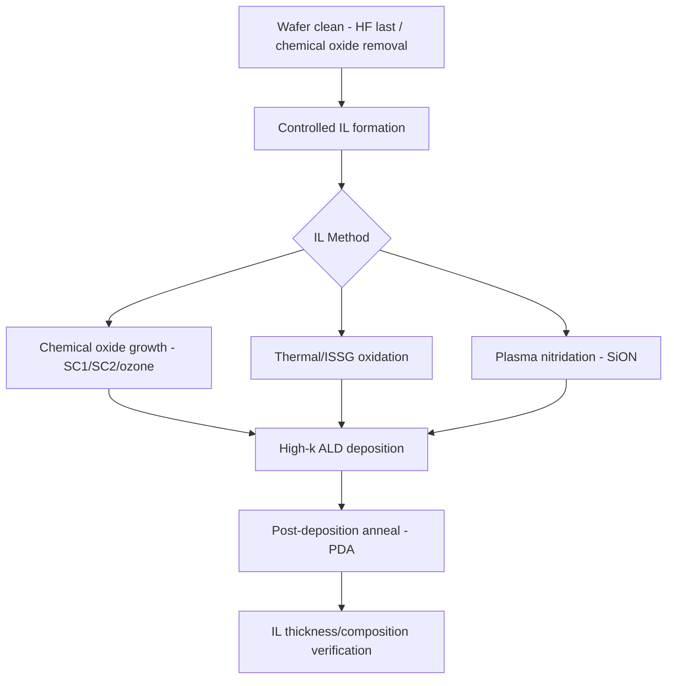

## Interface Layer Control

### Overview

Interface layer (IL) control refers to the process techniques used to form, regulate, and stabilize the thin interfacial dielectric — typically $SiO_2$ or silicon oxynitride ($SiON$) — that persists between the high-k dielectric and the silicon channel in modern gate stacks. Although the goal of high-k adoption was to move away from $SiO_2$, a residual IL is almost universally retained because direct deposition of high-k material on bare silicon produces unacceptably high interface trap density and poor channel mobility.

### Why the Interfacial Layer Is Necessary

**Key Points**

- High-k dielectrics deposited directly on silicon form a chemically and electronically poor interface, with high densities of interface traps ($D_{it}$), dangling bonds, and fixed charge.
- A thin, high-quality $SiO_2$-like IL provides a chemically stable, low-defect-density interface to the silicon channel, similar in quality to thermally grown $SiO_2$ gate oxides used historically.
- The IL also acts as a diffusion barrier, suppressing metal or oxygen species from the high-k film reacting with or diffusing into the channel during subsequent thermal processing.
- The trade-off: because $SiO_2$ has a low $k$ (3.9) compared to the high-k film above it, the IL contributes disproportionately to total EOT despite its small physical thickness, so its thickness must be tightly minimized and controlled.

### Contribution to Equivalent Oxide Thickness

Total EOT is the series combination of the IL and high-k contributions:

$$EOT_{total} = EOT_{IL} + EOT_{high-k} = t_{IL} \times \frac{3.9}{k_{IL}} + t_{high-k} \times \frac{3.9}{k_{high-k}}$$

**Example**

For an IL of $SiO_2$ ($k = 3.9$) at $t_{IL} = 0.6\ nm$ and an $HfO_2$ film ($k \approx 20$) at $t_{high-k} = 2.0\ nm$:

$$EOT_{IL} = 0.6\ nm \times \frac{3.9}{3.9} = 0.6\ nm$$

$$EOT_{high-k} = 2.0\ nm \times \frac{3.9}{20} = 0.39\ nm$$

$$EOT_{total} = 0.6 + 0.39 = 0.99\ nm$$

This example illustrates why, at sub-1 nm total EOT targets, the IL alone can account for well over half of the total EOT budget — making IL thickness minimization a first-order scaling lever.

### IL Formation Methods

**Chemical Oxide Growth**

- Wet chemical treatments (e.g., $SC1$/$SC2$ cleans, ozonated water) grow a thin, self-limiting chemical oxide (~0.6–0.8 nm) prior to high-k deposition.
- Provides a reproducible, low-defect starting surface but offers limited control over final thickness beyond the self-limiting regime.

**Thermal/In-Situ Steam Generation (ISSG) Oxidation**

- A brief, controlled thermal oxidation step (often using ISSG or rapid thermal oxidation) grows a very thin, high-quality oxide with better interface state density than chemical oxide alone.
- Offers tighter thickness control via time/temperature tuning but adds thermal budget.

**Post-Deposition IL Growth (Oxidation Through High-k)**

- In some flows, a very thin (near-native) oxide or no deliberate IL is formed prior to high-k deposition, and the IL instead grows or thickens during subsequent anneal steps as oxygen diffuses through the high-k film to the silicon interface.
- [Inference] This approach can achieve thinner starting ILs but requires precise control of anneal ambient and duration, since uncontrolled oxygen diffusion during high-k crystallization or PDA (post-deposition anneal) steps can cause unintended IL regrowth and EOT increase.

**Nitridation (SiON Formation)**

- Plasma or thermal nitridation incorporates nitrogen into the IL, raising its effective dielectric constant slightly (SiON $k \approx 4$–7 depending on nitrogen content) and acting as a diffusion barrier against boron penetration and high-k constituent diffusion.
- Excessive nitrogen concentration at the channel interface can degrade channel mobility, so nitrogen profile (peak concentration and depth) is carefully controlled, often to keep nitrogen away from the immediate Si interface while concentrating it near the IL/high-k boundary.

### IL Thickness Control Techniques

**Key Points**

- **Surface preparation**: pre-deposition clean chemistry (HF-last vs. chemical-oxide-retaining cleans) sets the starting point for IL nucleation and strongly influences final IL thickness and uniformity.
- **Process temperature and time**: for thermal/ISSG oxidation, tighter control of temperature ramp and dwell time is used to hit sub-angstrom thickness targets.
- **Post-deposition anneal (PDA) ambient**: anneal atmosphere (inert $N_2$ vs. oxidizing $O_2$/$NO$) and temperature directly affect whether the IL grows further during high-k densification anneal — inert ambients minimize unwanted IL regrowth, while controlled oxidizing ambients can be used deliberately to improve IL/channel interface quality at the cost of added EOT.
- **In-situ monitoring**: ellipsometry and X-ray photoelectron spectroscopy (XPS) are commonly used metrology techniques to verify IL thickness and composition during process development, since IL thickness at the sub-nanometer scale is below the resolution of many standard inline metrology tools.

### Interface Trap Density and Mobility Impact

The quality of the IL — not just its thickness — governs channel mobility and interface trap density ($D_{it}$):

| IL Characteristic | Mobility/Reliability Impact |
| --- | --- |
| Thin, high-quality $SiO_2$-like IL | Near-$SiO_2$-level mobility, low $D_{it}$ |
| Nitrogen too close to Si interface | Degraded mobility due to increased Coulomb/phonon scattering from N-related traps |
| IL too thin / discontinuous | Increased tunneling leakage, high-k constituents (Hf, O) can diffuse to channel, degrading mobility and introducing fixed charge |
| IL regrowth during anneal (uncontrolled) | Increases EOT beyond target, undermining the capacitance benefit of high-k adoption |

[Inference] Because IL quality directly determines channel mobility in high-k gate stacks, IL engineering is often treated as being as electrically consequential as the high-k material choice itself, even though the IL is only a fraction of a nanometer thick.

### Scaling Challenges at Advanced Nodes

**Key Points**

- As total EOT targets shrink below ~0.9–1.0 nm, the IL becomes the dominant EOT contributor, creating pressure to scale IL thickness toward its practical minimum (a few angstroms) while still maintaining adequate interface quality.
- In FinFET and gate-all-around architectures, IL formation must be conformal around 3D channel surfaces (fin sidewalls, nanosheet surfaces), making surface-sensitive thermal/chemical oxidation processes more difficult to control uniformly compared to planar substrates.
- [Unverified] Some advanced-node processes pursue "IL-free" or "near-zero IL" schemes using specialized surface passivation or direct high-k nucleation control; the maturity and adoption breadth of such approaches vary by fab and are not treated here as an established universal standard.

### Interfacial Layer in Overall Gate Stack Reliability

The IL/high-k interface (in addition to the high-k/metal interface addressed in work-function engineering) is a significant location for:

- **Bulk and interface trap generation**, contributing to Bias Temperature Instability (BTI).
- **Time-Dependent Dielectric Breakdown (TDDB)** initiation sites, since defects or non-uniformities at the IL/high-k boundary can act as localized weak points under electric field stress.
- [Unverified] The relative contribution of IL-related versus high-k-bulk-related trap mechanisms to overall gate stack reliability is process-specific and generally requires dedicated stress-test characterization (e.g., constant voltage stress, TDDB testing) on the actual integrated stack rather than generalization from material-level studies alone.

**Next Steps**

- Post-deposition anneal (PDA) optimization for IL/high-k stacks
- Nitrogen profile engineering in SiON interfacial layers
- Metrology techniques for sub-nanometer IL characterization (XPS, HRTEM, ellipsometry)
- IL scaling limits and near-zero IL process schemes
- IL conformality in FinFET/GAA 3D channel geometries
- Relationship between IL quality and BTI/TDDB reliability