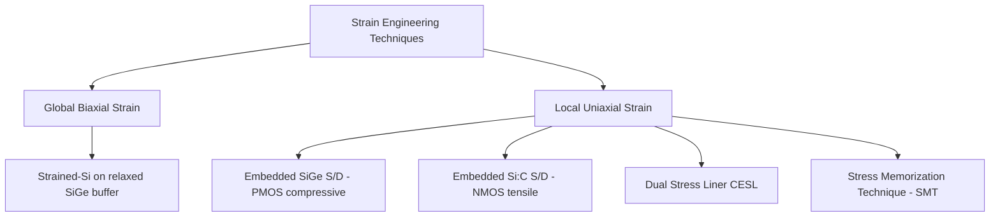

## Mobility Enhancement Mechanisms

### Overview

Mobility enhancement mechanisms are the physical techniques used to increase carrier mobility (electron and hole) in the MOSFET channel beyond what unstrained bulk silicon provides. Since drive current scales approximately linearly with mobility ($I_{d,sat} \propto \mu \cdot C_{ox} \cdot (V_{gs}-V_t)$), and geometric scaling alone became insufficient to sustain performance gains, mobility engineering became a primary performance lever from roughly the 90 nm node onward.

### Physical Basis: Why Mobility Can Be Enhanced

**Key Points**

- Carrier mobility in silicon depends on the effective mass and scattering rate of carriers in the conduction band (electrons) or valence band (holes).
- Mechanical strain alters the silicon crystal lattice spacing, which modifies the band structure — splitting degenerate energy valleys/bands and changing effective carrier mass and inter-valley scattering rates.
- The band structure changes produced by strain are **anisotropic** and differ fundamentally between electrons and holes, meaning strain techniques must be tailored separately for NMOS and PMOS.

### Strain Effects on Electron Mobility (NMOS)

Silicon's conduction band has six equivalent valleys along the crystal axes. Under unstrained conditions, all six are degenerate (equal energy). Applying **tensile strain** (biaxial or uniaxial along the channel direction) splits this degeneracy:

- The two valleys oriented perpendicular to the wafer surface (out-of-plane, "$\Delta_2$" valleys) are lowered in energy relative to the four in-plane valleys ("$\Delta_4$").
- Electrons preferentially populate the lower-energy $\Delta_2$ valleys, which have a **lower effective mass** in the transport direction.
- This repopulation reduces inter-valley phonon scattering (fewer electrons available to scatter between valleys) and reduces the conductivity effective mass, both increasing electron mobility.

[Inference] Tensile strain along the channel direction is generally the most effective and widely reported strain condition for enhancing NMOS electron mobility, consistent with this valley-splitting mechanism, though the precise mobility enhancement magnitude depends on strain type (biaxial vs. uniaxial), strain magnitude, and crystal orientation.

### Strain Effects on Hole Mobility (PMOS)

Silicon's valence band structure near the band edge consists of heavy-hole and light-hole bands that are degenerate at zero strain. Applying **compressive strain** (typically uniaxial, along the channel direction) causes:

- Splitting of the heavy-hole and light-hole bands, warping the band structure.
- Holes preferentially occupy the band with lower effective mass in the transport direction.
- Reduced heavy-hole/light-hole scattering and reduced conductivity effective mass, increasing hole mobility.

Compressive uniaxial strain along the channel is the standard condition for PMOS hole mobility enhancement — the opposite strain sign from what benefits NMOS, which is the fundamental reason NMOS and PMOS require different, independently engineered strain techniques.

| Device | Beneficial Strain Type | Mechanism |
| --- | --- | --- |
| NMOS | Tensile (biaxial or uniaxial, channel direction) | Conduction band valley splitting → lower effective mass, reduced inter-valley scattering |
| PMOS | Compressive (uniaxial, channel direction) | Valence band warping (heavy-hole/light-hole splitting) → lower effective mass |

(svg_diagram)

<svg xmlns="http://www.w3.org/2000/svg" viewBox="0 0 640 300">

<title>Strain-Induced Band Splitting: NMOS vs PMOS (svg_diagram)</title>
<rect width="640" height="300" fill="#ffffff" />

<text x="40" y="30" font-size="14" font-weight="bold" fill="`#1a1a1a`">NMOS: Tensile Strain</text>

<line x1="40" y1="80" x2="280" y2="80" stroke="#333" stroke-width="1.5" />

<text x="290" y="84" font-size="11" fill="#333">6-fold degenerate valleys (unstrained)</text>

<line x1="40" y1="150" x2="140" y2="150" stroke="`#2060c0`" stroke-width="2" />

<text x="10" y="145" font-size="10" fill="`#2060c0`">Δ2 (lower E)</text>

<line x1="180" y1="170" x2="280" y2="170" stroke="`#c04040`" stroke-width="2" />

<text x="180" y="190" font-size="10" fill="`#c04040`">Δ4 (higher E)</text>

<line x1="90" y1="80" x2="90" y2="150" stroke="#888" stroke-width="1" stroke-dasharray="3,3" />

<line x1="230" y1="80" x2="230" y2="170" stroke="#888" stroke-width="1" stroke-dasharray="3,3" />

<text x="40" y="210" font-size="10" fill="#333">Electrons populate lower-mass Δ2 valleys</text>

<text x="360" y="30" font-size="14" font-weight="bold" fill="`#1a1a1a`">PMOS: Compressive Strain</text>

<line x1="360" y1="80" x2="600" y2="80" stroke="#333" stroke-width="1.5" />

<text x="400" y="74" font-size="11" fill="#333">Degenerate HH/LH bands (unstrained)</text>

<line x1="360" y1="150" x2="460" y2="150" stroke="`#40a040`" stroke-width="2" />

<text x="360" y="145" font-size="10" fill="`#206020`">Light-hole (lower mass)</text>

<line x1="500" y1="170" x2="600" y2="170" stroke="`#c04040`" stroke-width="2" />

<text x="500" y="190" font-size="10" fill="`#c04040`">Heavy-hole</text>

<line x1="410" y1="80" x2="410" y2="150" stroke="#888" stroke-width="1" stroke-dasharray="3,3" />

<line x1="550" y1="80" x2="550" y2="170" stroke="#888" stroke-width="1" stroke-dasharray="3,3" />

<text x="360" y="210" font-size="10" fill="#333">Holes populate lower-mass light-hole band</text>

</svg>

### Strain Engineering Techniques

**Biaxial Global Strain (Strained Silicon-on-Insulator)**

- A thin silicon layer grown epitaxially on a relaxed silicon-germanium ($SiGe$) buffer layer adopts the larger $SiGe$ lattice constant, inducing biaxial tensile strain across the entire wafer.
- Benefits NMOS more than PMOS; PMOS mobility enhancement from biaxial tensile strain is comparatively limited or can be counterproductive at high strain levels, which is part of why uniaxial (local) strain techniques became preferred for PMOS.
- Process complexity and defect density (threading dislocations from the SiGe buffer) are key manufacturing challenges.

**Uniaxial Local Strain (Process-Induced Strain)**

Became the dominant approach from roughly the 90 nm node onward because it allows independent, device-type-specific strain engineering within the same wafer:

- **Embedded SiGe Source/Drain (eSiGe) — PMOS**: epitaxially grown $SiGe$ source/drain regions have a larger lattice constant than silicon, inducing uniaxial **compressive** strain in the adjacent PMOS channel. Germanium content (typically 20–40 atomic %) tunes strain magnitude.
- **Embedded Silicon-Carbon Source/Drain (eSi:C) — NMOS**: epitaxial $Si_{1-x}C_x$ source/drain regions have a smaller lattice constant than silicon (carbon is smaller than silicon), inducing uniaxial **tensile** strain in the adjacent NMOS channel. Carbon content is typically limited to low atomic percentages due to solubility constraints.
- **Stress Liner Films (Contact Etch Stop Layer, CESL)**: silicon nitride films deposited over the transistor with intrinsically tensile or compressive stress (tuned via deposition conditions such as plasma-enhanced CVD parameters) transmit strain into the channel through the overlying film. Dual-stress liner (DSL) processes deposit tensile nitride over NMOS and compressive nitride over PMOS regions selectively.
- **Stress Memorization Technique (SMT)**: a stressed dielectric capping layer is deposited prior to or during source/drain activation anneal; recrystallization of the amorphized source/drain region under the stressed cap "memorizes" a tensile strain state that persists in the channel even after the capping layer is removed, primarily used for NMOS.

### Crystal Orientation Effects

**Key Points**

- Mobility is inherently anisotropic with respect to crystal orientation; standard bulk CMOS historically used (100)-oriented wafers with the channel aligned along the $<110>$ direction, which offers a reasonable compromise for both electron and hole mobility.
- [Inference] Hole mobility on (110)-oriented silicon surfaces is generally reported to be higher than on (100) surfaces, which motivated exploration of hybrid orientation technology (HOT) combining different surface orientations for NMOS and PMOS regions on the same wafer, though this approach saw limited broad manufacturing adoption compared to strain engineering.

### Mobility Enhancement in Non-Planar and Advanced Architectures

**FinFET Devices**

- Strain engineering techniques (eSiGe, eSi:C, stress liners) were adapted to fin geometries, though the effectiveness and specific implementation differ from planar devices due to the 3D channel shape and confined source/drain volume available for embedded epitaxy.
- Fin sidewall crystal orientation and fin width influence strain transfer efficiency and achievable mobility enhancement.

**Gate-All-Around (Nanosheet/Nanowire) Devices**

- [Unverified] Strain engineering in fully-wrapped channel geometries (nanosheets, nanowires) is an active area of process development; the relative effectiveness of conventional embedded-source/drain and liner-stress techniques compared to planar and FinFET predecessors depends on channel dimensions and specific integration schemes that continue to evolve and should be verified against current published research for the specific technology generation being studied.

**High-Mobility Channel Materials**

Beyond strain, mobility can also be enhanced by replacing or supplementing the silicon channel material itself:

- **Germanium channels**: intrinsically higher hole mobility than silicon, explored for high-performance PMOS.
- **III-V compound semiconductors** (e.g., $InGaAs$, $GaAs$): intrinsically higher electron mobility than silicon, explored for high-performance NMOS, though integration challenges (lattice mismatch with silicon substrates, interface state density with gate dielectrics) have limited broad manufacturing adoption relative to strained-silicon approaches.

### Trade-offs and Limitations

**Key Points**

- Strain magnitude that can be practically induced is limited by defect generation (dislocations, stacking faults) if lattice mismatch or strain level exceeds critical thresholds for the given film thickness.
- As gate pitch and source/drain volume shrink with each technology node, the available volume for embedded epitaxial source/drain regions decreases, reducing achievable strain magnitude and diminishing mobility enhancement — a recognized scaling challenge for uniaxial local strain techniques.
- Strain techniques interact with the gate stack (high-k, metal gate, spacers) and thermal budget of the overall process flow; excessive thermal exposure after strain-inducing epitaxy or liner deposition can partially relax induced strain.
- [Unverified] The relative contribution of strain-induced mobility enhancement versus other performance levers (gate stack optimization, parasitic resistance/capacitance reduction) at the most advanced nodes is process- and node-specific and is generally quantified through device-level characterization rather than assumed from general principles.

**Next Steps**

- Embedded SiGe/Si:C source-drain process integration details
- Dual stress liner (DSL) deposition and patterning techniques
- Stress memorization technique (SMT) process flow
- Crystal orientation engineering and hybrid orientation technology
- Strain relaxation mechanisms and thermal budget interactions
- High-mobility channel materials (Ge, III-V) integration challenges
- Strain engineering in FinFET and gate-all-around architectures