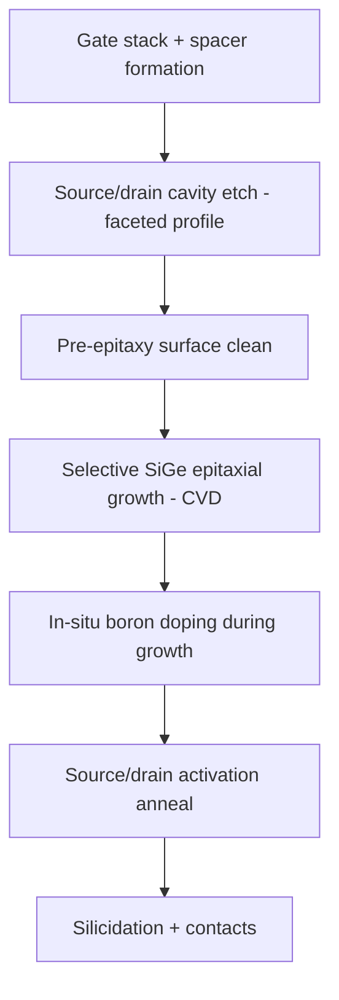

## Embedded Silicon Germanium Source and Drain

### Overview

Embedded silicon germanium source/drain (eSiGe) is a process-induced uniaxial strain technique that grows epitaxial silicon-germanium in recessed source/drain regions of PMOS transistors. Because $SiGe$ has a larger natural lattice constant than pure silicon, the epitaxial film is constrained by the surrounding silicon lattice, and this lattice mismatch induces uniaxial compressive strain in the adjacent channel — directly enhancing hole mobility.

### Physical Mechanism

**Key Points**

- Germanium atoms are larger than silicon atoms, so a relaxed $Si_{1-x}Ge_x$ alloy has a larger lattice constant than pure silicon, with lattice mismatch increasing roughly linearly with germanium content $x$.
- When $SiGe$ is grown epitaxially inside a silicon source/drain cavity, it is constrained to match the silicon lattice spacing at the growth interface, storing mechanical strain energy in the film and transmitting compressive stress into the adjacent channel region.
- This compressive strain, oriented along the channel (source-to-drain) direction, splits the degenerate valence band structure (heavy-hole/light-hole bands), reducing the effective hole mass and inter-band scattering, thereby increasing hole mobility as detailed under general strain mechanisms.
- Because the strain is induced locally at the source/drain, adjacent to a specific device, it is classified as a **uniaxial, process-induced (local) strain** technique, distinct from global biaxial strain approaches such as strained-silicon-on-insulator.

### Process Integration Flow

1. **Gate stack and spacer formation**: dummy or final gate stack patterned; offset spacers formed to define the source/drain recess boundary relative to the channel.
2. **Source/drain recess etch**: selective anisotropic or crystallographic (typically wet TMAH or dry etch with crystallographic facet control) etch removes silicon in the source/drain regions to a controlled depth, often producing a faceted (e.g., sigma- or diamond-shaped) cavity profile that maximizes strain transfer proximity to the channel.
3. **Pre-epitaxy clean**: surface preparation (HF-last clean, in-situ bake) removes native oxide and contamination to ensure high-quality epitaxial nucleation.
4. **Selective epitaxial growth**: $Si_{1-x}Ge_x$ is grown selectively within the recessed cavities using chemical vapor deposition (CVD), typically with precursor gases such as $SiH_4$ or $Si_2H_6$ (silicon source) and $GeH_4$ (germanium source), often combined with an etching-component gas (e.g., $HCl$) to maintain selectivity so that epitaxy occurs only on exposed silicon and not on dielectric spacer/mask surfaces.
5. **In-situ doping**: boron is typically incorporated in-situ during epitaxial growth (using a precursor such as $B_2H_6$) to simultaneously form the doped source/drain junction and the strain-inducing film in a single growth step, reducing thermal budget compared to separate implant/anneal doping.
6. **Source/drain activation anneal**: a rapid thermal anneal activates dopants and (in gate-first schemes) may also affect the gate stack; anneal conditions are tuned to avoid excessive strain relaxation.
7. **Silicidation and contact formation**: standard back-end contact processing follows.

### Key Process Parameters

**Germanium Content**

- Typical germanium concentrations range from approximately 20–40 atomic %, with higher Ge content producing greater lattice mismatch and thus greater compressive strain magnitude in the channel.
- [Inference] Germanium content is generally limited by the critical thickness for defect-free (dislocation-free) epitaxial growth — above a material- and thickness-dependent critical Ge fraction, strain relaxation via misfit dislocation formation occurs, degrading both strain transfer efficiency and junction leakage, so process development typically balances Ge content against this defect-generation threshold.

**Cavity Geometry (Faceting)**

- Source/drain recess etches are often engineered to produce specific crystallographic facets (e.g., $\Sigma$-shaped or diamond-shaped cavities using anisotropic wet etches such as TMAH that expose $\{111\}$ crystal planes).
- Facet geometry determines the proximity of the strained $SiGe$ film to the channel edge, directly influencing strain transfer efficiency — cavities that bring the $SiGe$ volume closer to and partially underneath the gate edge generally transfer more strain into the channel.

**In-Situ Boron Doping**

- In-situ doped epitaxy allows abrupt, box-like doping profiles and reduces the need for separate high-energy implant steps, which helps control short-channel effects and reduces parasitic source/drain series resistance.
- Boron incorporation during $SiGe$ growth is sensitive to growth temperature, precursor ratios, and germanium content, requiring careful process co-optimization to simultaneously achieve target doping concentration and target strain level.

### Strain Transfer Efficiency and Scaling Challenges

**Key Points**

- Strain transfer efficiency depends on proximity of the strained volume to the channel, source/drain volume, and gate pitch — as gate pitch scales down with each technology node, the physical volume available for embedded epitaxy shrinks, reducing the total strain that can be induced.
- [Inference] This volume-scaling limitation is a widely recognized challenge for uniaxial embedded-epitaxy strain techniques generally, and is part of the motivation for exploring complementary or alternative mobility-enhancement approaches (e.g., higher Ge content, alternative channel materials, or stress-liner contributions) as pitch continues to shrink, though the specific magnitude of diminishing returns is node- and process-specific.
- Recess depth and facet shape must also be co-optimized with short-channel effect control, since deeper or more aggressive recess/facet profiles that maximize strain can interact with junction leakage and parasitic capacitance.

### Reliability and Defect Considerations

- **Threading/misfit dislocations**: if germanium content or film thickness exceeds the critical strain-relaxation threshold for the given epitaxial geometry, dislocations form, which can act as leakage paths and degrade junction quality.
- **Facet-related junction leakage**: aggressive faceting to maximize strain proximity can, if not well controlled, bring the doped $SiGe$ closer to the gate edge in ways that increase gate-induced drain leakage (GIDL) or short-channel effects if not co-optimized with spacer and extension implant design.
- [Unverified] Specific defect density and leakage trade-off curves are highly dependent on the particular recess etch chemistry, epitaxial reactor conditions, and germanium/boron concentration profile used in a given fab's process, and are generally established through process characterization rather than predicted from general principles alone.

### Extension to FinFET and Advanced Architectures

**Key Points**

- In FinFET devices, eSiGe source/drain is grown on the exposed fin sidewalls in the recessed source/drain regions, often merging between adjacent fins to form a continuous epitaxial volume — this merged-fin epitaxy geometry differs from planar embedded source/drain and requires distinct process control for merge height and strain uniformity across the fin array.
- [Unverified] The specific strain transfer characteristics and optimal germanium content in FinFET and gate-all-around nanosheet architectures continue to evolve with device geometry, and current published figures for a specific technology node/architecture should be verified against up-to-date process literature rather than assumed to directly extend from planar embedded source/drain behavior.

### Comparison to NMOS Counterpart Technique

eSiGe is the PMOS analog to embedded silicon-carbon (eSi:C) source/drain used for NMOS: both are local, uniaxial, process-induced strain techniques using lattice-mismatched epitaxial source/drain material, but they induce opposite strain signs (compressive for eSiGe/PMOS, tensile for eSi:C/NMOS) consistent with the opposite band-structure requirements of electrons and holes.

**Next Steps**

- Embedded Si:C source/drain (NMOS tensile strain counterpart)
- Source/drain recess etch and facet engineering techniques
- In-situ doped epitaxy process optimization (boron incorporation control)
- Strain relaxation and critical thickness/defect formation limits
- FinFET merged-source/drain epitaxy integration
- Parasitic resistance and short-channel effect trade-offs with recess geometry