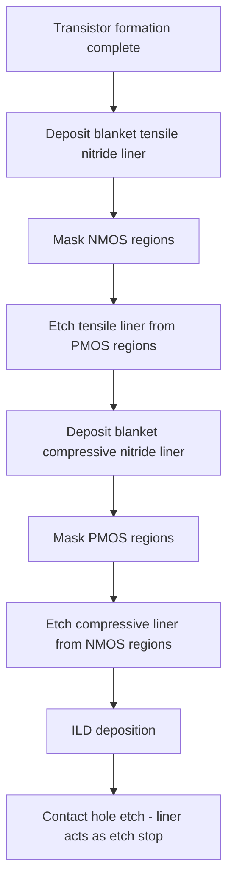

## Stress Liners and Contact Etch Stop Layers

### Overview

Stress liners, also known as contact etch stop layers (CESL), are thin dielectric films — typically silicon nitride ($Si_3N_4$) — deposited over completed transistor structures that serve a dual function: providing a chemically selective etch stop for downstream contact hole patterning, and transmitting intrinsic mechanical stress into the underlying channel to enhance carrier mobility. Because a single film can be tuned to either tensile or compressive intrinsic stress, dual-stress-liner (DSL) integration allows independent strain optimization for NMOS and PMOS on the same wafer.

### Dual Function: Etch Stop and Strain Engineering

**Etch Stop Function**

- After transistor formation, an interlayer dielectric (ILD, typically $SiO_2$-based) is deposited over the entire structure, and contact holes must be etched through the ILD down to source/drain and gate terminals.
- $Si_3N_4$ has high etch selectivity relative to $SiO_2$ under standard fluorocarbon-based contact etch chemistries, so a thin nitride liner beneath the ILD acts as a reliable etch stop, preventing overetch into the underlying silicide or silicon and protecting shallow junctions from etch damage.

**Strain Engineering Function**

- Plasma-enhanced chemical vapor deposition (PECVD) silicon nitride films can be deposited with a wide range of intrinsic film stress — from highly tensile to highly compressive — by tuning deposition process parameters.
- A liner deposited directly over a transistor mechanically couples to the channel region beneath it: a tensile liner pulls the channel into tensile strain, while a compressive liner pushes the channel into compressive strain.
- As established under general mobility enhancement mechanisms, tensile strain benefits NMOS electron mobility and compressive strain benefits PMOS hole mobility, making liner stress polarity a direct, tunable mobility lever.

### Dual Stress Liner (DSL) Process Integration

Because NMOS and PMOS require opposite strain polarities, a single blanket liner cannot optimally benefit both device types. The dual stress liner process deposits and selectively patterns two separate nitride films:

1. **First liner deposition**: a blanket highly tensile-stress nitride film is deposited over the entire wafer (covering both NMOS and PMOS regions).
2. **Lithography and masking**: photoresist patterns protect the NMOS regions.
3. **Selective removal from PMOS**: the tensile liner is etched away from PMOS regions (typically via wet or dry etch selective to underlying layers), leaving tensile nitride only over NMOS.
4. **Second liner deposition**: a blanket highly compressive-stress nitride film is deposited over the entire wafer, covering both the already-patterned NMOS tensile liner and the exposed PMOS regions.
5. **Lithography and masking**: photoresist protects PMOS regions (where compressive liner should remain).
6. **Selective removal from NMOS**: the compressive liner is etched away from NMOS regions, exposing the underlying tensile liner and leaving compressive nitride only over PMOS.
7. **ILD deposition and contact patterning**: standard interlayer dielectric deposition and contact hole etch proceed, using the retained dual-stress liners as the contact etch stop.

(svg_diagram)

<svg xmlns="http://www.w3.org/2000/svg" viewBox="0 0 640 260">

<title>Dual Stress Liner Cross-Section (svg_diagram)</title>
<rect width="640" height="260" fill="#ffffff" />

<rect x="40" y="180" width="560" height="40" fill="#d8d8d8" stroke="#333" />
<text x="280" y="205" font-size="11" fill="#333">Silicon Substrate</text>

<rect x="100" y="140" width="60" height="40" fill="#909090" stroke="#333" />
<text x="105" y="135" font-size="10" fill="#333">NMOS Gate</text>

<rect x="480" y="140" width="60" height="40" fill="#909090" stroke="#333" />
<text x="485" y="135" font-size="10" fill="#333">PMOS Gate</text>

<path d="M 60 180 L 60 140 L 100 140 L 100 120 L 160 120 L 160 140 L 200 140 L 200 180 Z" fill="#4080e0" fill-opacity="0.6" stroke="#2060c0" />
<text x="70" y="110" font-size="10" fill="#2060c0">Tensile Liner (NMOS)</text>
<text x="70" y="200" font-size="9" fill="#2060c0">Channel: Tensile strain →</text>

<path d="M 440 180 L 440 140 L 480 140 L 480 120 L 540 120 L 540 140 L 580 140 L 580 180 Z" fill="#e08040" fill-opacity="0.6" stroke="#c05000" />
<text x="440" y="110" font-size="10" fill="#c05000">Compressive Liner (PMOS)</text>
<text x="440" y="200" font-size="9" fill="#c05000">Channel: Compressive strain →</text>
</svg>

### Deposition Process Control

**Key Points**

- PECVD silicon nitride film stress is controlled primarily through deposition parameters: RF plasma power, frequency (high-frequency vs. low-frequency or dual-frequency deposition), deposition pressure, precursor gas ratios ($SiH_4$, $NH_3$, $N_2$), and substrate temperature.
- [Inference] High-frequency plasma deposition conditions tend to produce more tensile-stressed films, while low-frequency or dual-frequency conditions with different ion bombardment characteristics tend to produce more compressive-stressed films, though the exact process window and stress magnitude achievable are specific to each PECVD tool and recipe, and are typically established through process characterization on the actual deposition equipment rather than treated as universal fixed process rules.
- Film stress magnitude achievable in production processes has historically been reported in the range of roughly 1–2 GPa (tensile or compressive) or higher, though the specific achievable stress level depends on the deposition tool, chemistry, and film thickness used in a given process.
- Film thickness is also a factor in total strain transferred, requiring co-optimization of thickness against layout-dependent stress transfer and downstream gap-fill/planarization requirements.

### Layout and Proximity Dependence

**Key Points**

- Strain transferred to the channel via a stress liner is a "layout-dependent effect" (LDE): the magnitude of mobility enhancement depends on transistor geometry factors such as source/drain diffusion length, gate-to-shallow-trench-isolation (STI) spacing, and the physical area of liner directly covering the active region.
- Devices with shorter source/drain diffusion lengths (closer proximity to STI edges) generally couple more effectively to liner stress, while longer diffusion regions dilute the strain transferred to the channel — this dependency requires strain-aware compact modeling in circuit design to accurately predict device performance across different layout configurations.
- [Unverified] The precise functional relationship between diffusion length, STI proximity, and mobility enhancement is process- and technology-node-specific and is typically captured through empirically calibrated layout-dependent-effect models in the process design kit (PDK) rather than derived from first principles for general use.

### Interaction with Other Strain Techniques

**Key Points**

- Stress liners are frequently used in combination with embedded source/drain strain techniques (eSiGe for PMOS, eSi:C for NMOS), providing an additive or complementary strain contribution rather than functioning as the sole strain source.
- [Inference] Because embedded-epitaxy strain contribution tends to diminish as source/drain volume shrinks with gate pitch scaling, stress liner contribution has often been regarded as a relatively more layout-flexible complementary strain source at scaled nodes, though the relative balance between liner-induced and epitaxy-induced strain contribution varies by specific technology generation and process integration choice.
- Stress memorization technique (SMT), which uses a temporary stressed capping layer during source/drain anneal, is a related but distinct technique from the permanent CESL stress liner — SMT strain is "memorized" into the recrystallized source/drain structure and the stress film is typically removed, whereas the CESL liner remains as a permanent structural and strain-transferring film through to final device.

### Process and Integration Challenges

- **Gap-fill in scaled geometries**: as gate pitch shrinks, conformal deposition of liner films between tightly spaced gate structures without voids becomes more difficult, often requiring transition from standard PECVD to more conformal deposition techniques for advanced nodes.
- **Stress relaxation during subsequent thermal processing**: liner films deposited before any remaining high-temperature process steps can experience partial stress relaxation, so liner stress engineering must account for the thermal budget of the remaining process flow.
- **Etch selectivity and residue control** during the dual-liner patterning sequence (steps 3 and 6 above) must avoid damaging the underlying retained liner or exposed silicide/junction regions, since etch residue or incomplete removal can create defects or unwanted stress non-uniformity at liner boundaries.
- [Unverified] Specific film stress targets, thickness values, and DSL boundary/overlap design rules are proprietary to individual fabs and technology nodes and vary considerably across manufacturers; general figures cited in literature should not be assumed to directly apply to a specific production process without verification.

**Next Steps**

- PECVD process parameter tuning for tensile vs. compressive nitride films
- Layout-dependent-effect (LDE) modeling for strain-based devices
- Stress memorization technique (SMT) process details
- Gap-fill and conformality challenges in scaled-pitch liner deposition
- Combined strain budget optimization (liner + embedded epitaxy)
- Contact etch selectivity and process integration with dual liners