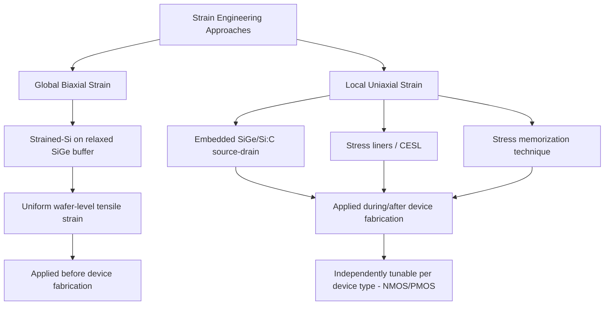

## Global versus Local Strain Techniques

### Overview

Global and local strain techniques represent the two fundamental architectural approaches to inducing mechanical strain in the MOSFET channel for mobility enhancement. Global (biaxial) strain applies uniform strain across the entire wafer substrate prior to device fabrication, while local (uniaxial) strain is introduced selectively at the individual transistor level through process steps applied after or during device formation. The industry's evolution from global to predominantly local strain techniques reflects the need for independent, device-type-specific strain optimization.

### Global Strain: Strained-Silicon-on-Insulator

**Mechanism**

- A thin epitaxial silicon layer is grown on a relaxed silicon-germanium ($SiGe$) virtual substrate (a thick, compositionally graded $SiGe$ buffer layer grown to relax to its natural, larger lattice constant).
- Because the silicon layer is thin relative to the underlying relaxed $SiGe$, it is constrained to adopt the larger $SiGe$ in-plane lattice constant, inducing **biaxial tensile strain** uniformly across the entire wafer surface.
- This strained silicon layer can then be transferred onto an insulating substrate (via wafer bonding and layer transfer) to form strained-silicon-on-insulator (sSOI), or used directly as a bulk strained epitaxial layer.

**Key Points**

- Strain is applied **before** transistor fabrication begins, uniformly across the wafer, independent of individual device layout or type.
- Biaxial tensile strain from this approach substantially benefits NMOS electron mobility via conduction band valley splitting.
- [Inference] Biaxial tensile strain's benefit to PMOS hole mobility is comparatively limited, and at higher strain magnitudes can be reported as neutral or even mildly detrimental to hole mobility in some strain regimes — a key limitation that motivated the industry's shift toward device-type-specific local strain techniques rather than continued reliance on global strain alone.

### Local Strain: Process-Induced Uniaxial Techniques

**Mechanism**

- Strain is introduced selectively during specific process steps applied to individual transistors after the basic device structure (or partial structure) is formed, using techniques such as embedded epitaxial source/drain regions, stress liners, and stress memorization.
- Because these techniques are applied at the device level during processing, they can be independently patterned and optimized for NMOS versus PMOS on the same wafer — tensile-strain-inducing processes (eSi:C, tensile CESL) applied to NMOS regions, compressive-strain-inducing processes (eSiGe, compressive CESL) applied to PMOS regions.
- Strain is predominantly **uniaxial**, oriented along the channel (source-to-drain) direction, as opposed to the biaxial (in-plane, both directions) strain state produced by global techniques.

**Key Points**

- Uniaxial strain has been widely reported to provide a more favorable and more device-type-flexible mobility enhancement compared to biaxial strain, particularly for PMOS hole mobility, which is a central reason local strain techniques became the dominant industry approach from roughly the 90 nm node onward.
- Local strain techniques (embedded source/drain, stress liners) are detailed individually elsewhere in this chapter; this topic focuses on the comparative architecture and trade-offs between the global and local strain paradigms.

### Comparative Analysis

| Characteristic | Global (Biaxial) Strain | Local (Uniaxial) Strain |
| --- | --- | --- |
| Strain direction | Biaxial (in-plane, both x/y) | Predominantly uniaxial (channel direction) |
| Application timing | Before device fabrication (substrate-level) | During/after device fabrication (process-level) |
| NMOS/PMOS independence | Single uniform strain state for entire wafer | Independently tunable per device type via selective processing |
| NMOS benefit | Significant electron mobility enhancement | Significant electron mobility enhancement (via eSi:C, tensile liner) |
| PMOS benefit | Limited or reduced hole mobility benefit | Significant hole mobility enhancement (via eSiGe, compressive liner) |
| Substrate cost/complexity | Requires specialized epitaxial substrate (relaxed SiGe buffer, possible layer transfer) | Uses standard substrates; added process steps at device level |
| Defect density concerns | Threading dislocations from SiGe buffer relaxation | Epitaxial defect/dislocation control within source/drain cavity |
| Layout dependence | Uniform across wafer, layout-independent | Layout-dependent (diffusion length, STI proximity, source/drain volume) |
| Scaling behavior | Strain magnitude largely fixed by substrate; less sensitive to individual device geometry | Strain magnitude sensitive to source/drain volume, which shrinks with gate pitch scaling |

### Why the Industry Shifted Toward Local Strain

**Key Points**

- The central limitation of global strain is that a single biaxial tensile strain state cannot simultaneously optimize both NMOS and PMOS, since the two device types require opposite strain polarities (tensile vs. compressive) for optimal mobility enhancement, as established under general mobility enhancement mechanisms.
- Local strain techniques solve this by allowing selective, masked application of opposite-polarity strain sources to NMOS and PMOS regions independently within the same manufacturing flow (e.g., dual stress liners, embedded SiGe for PMOS paired with embedded Si:C for NMOS).
- [Inference] This device-type independence is generally regarded as the primary reason local, uniaxial, process-induced strain techniques became the dominant industry approach for CMOS logic from roughly the 90 nm node onward, though global strain substrate approaches continued to see use and research interest in specific contexts (e.g., certain SOI-based technology platforms) where their substrate-level benefits were considered advantageous for other reasons.
- Local strain also avoids the added substrate cost and epitaxial defect-density challenges associated with growing and relaxing thick graded $SiGe$ buffer layers required for global strain substrates.

### Combined and Hybrid Approaches

**Key Points**

- Global and local strain techniques are not mutually exclusive; some process technologies have combined a strained substrate (providing baseline biaxial strain, often optimized primarily for NMOS benefit) with local uniaxial techniques layered on top (providing additional, device-type-specific strain, particularly for PMOS).
- [Unverified] The prevalence and specific combinations of global-plus-local hybrid strain integration vary considerably by manufacturer, technology node, and target device performance requirements, and general claims about which combination is "standard" should be verified against the specific process technology being studied rather than assumed universally.

### Scaling Trajectory and Limitations

**Key Points**

- As gate pitch and source/drain volume shrink with continued scaling, the effectiveness of local embedded-epitaxy strain techniques faces diminishing returns due to reduced available strain-inducing volume, a challenge discussed in more detail under embedded source/drain topics.
- Global strain substrate approaches are largely insensitive to this particular scaling pressure since strain is set at the substrate level rather than depending on device-level source/drain geometry, though global strain substrates introduce their own scaling and integration considerations (e.g., self-heating and thermal conductivity differences in SOI-based strained substrates, and the fixed nature of substrate-level strain meaning it cannot be selectively tuned per device type without additional local processing).
- [Unverified] The relative future viability and adoption trajectory of global versus local (or hybrid) strain approaches at the most advanced nodes and in emerging device architectures (FinFET, gate-all-around) continues to be an active area of process development, and specific current-generation adoption choices should be verified against up-to-date process literature for the technology platform in question.

### Extension to Non-Planar Architectures

**Key Points**

- In FinFET and gate-all-around device architectures, the practical implementation of global strain substrates becomes more complex, since fin/nanosheet formation involves etching through the strained layer, and strain relaxation at fin sidewalls is a recognized consideration.
- Local strain techniques (embedded source/drain, stress liners) have generally been more readily adapted to non-planar geometries, though with modified implementation details (e.g., merged-fin epitaxy) as discussed under embedded source/drain topics.

**Next Steps**

- Strained-silicon-on-insulator (sSOI) substrate fabrication process
- Relaxed SiGe virtual substrate growth and defect management
- Embedded SiGe/Si:C source-drain process details (local strain)
- Dual stress liner integration (local strain)
- Layout-dependent-effect modeling for local strain techniques
- Strain relaxation mechanisms in non-planar (FinFET/GAA) architectures