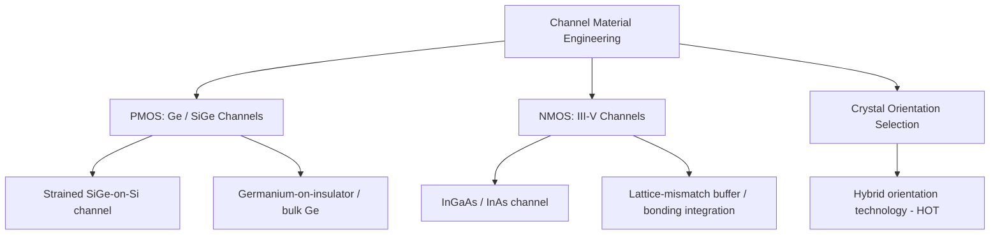

## Channel Material Engineering for Mobility

### Overview

Channel material engineering for mobility encompasses techniques that modify or replace the conventional bulk silicon channel material itself — rather than mechanically straining silicon — to achieve intrinsically higher carrier mobility. This includes germanium and silicon-germanium channels for enhanced hole transport, III-V compound semiconductor channels for enhanced electron transport, and crystal orientation selection, representing an alternative and complementary approach to the strain engineering techniques covered elsewhere in this chapter.

### Motivation: Limits of Strain-Only Approaches

**Key Points**

- Strain engineering (biaxial and uniaxial) enhances mobility by modifying the band structure of silicon, but the achievable enhancement is bounded by defect-generation limits (critical thickness, dislocation formation) and, for local strain techniques, by shrinking source/drain volume at scaled gate pitch.
- Replacing the channel material with one that has intrinsically higher carrier mobility in its unstrained state provides an additional mobility lever independent of (and potentially combinable with) strain engineering.
- [Inference] As strain-based techniques approach diminishing returns at advanced nodes, channel material engineering is generally regarded in the literature as a complementary or follow-on lever for continued mobility scaling, though the specific point at which a given fab transitions from strain-dominant to material-dominant mobility engineering is process- and roadmap-specific.

### Germanium and Silicon-Germanium Channels (PMOS)

**Physical Basis**

- Bulk germanium has substantially higher intrinsic hole mobility than silicon, owing to differences in valence band structure and effective hole mass.
- $SiGe$ channels (as opposed to embedded $SiGe$ source/drain, which is a strain-inducing structure rather than a channel material) can be used as the active transport layer itself, either as a strained $SiGe$ layer on a silicon substrate or, in more aggressive implementations, as high-germanium-content or pure germanium channels.

**Integration Approaches**

- **Strained SiGe channel on silicon**: a thin, compressively strained $SiGe$ epitaxial layer is grown on the silicon substrate as the active PMOS channel, combining both a material mobility benefit and a strain-induced mobility benefit (compressive strain from lattice mismatch with the underlying silicon) in a single layer.
- **Germanium-on-insulator (GeOI) or bulk germanium channels**: more aggressive integration where the channel is predominantly or entirely germanium, typically requiring specialized substrate preparation (e.g., germanium condensation techniques, epitaxial growth with defect management, or germanium wafer bonding) due to the lack of a native high-quality germanium oxide analogous to thermally grown $SiO_2$.

**Key Points**

- [Inference] A major integration challenge for germanium-channel PMOS is the gate dielectric interface: germanium lacks a stable, high-quality native oxide comparable to silicon's, generally requiring a passivation layer (such as a thin silicon cap or alternative interfacial treatment) before high-k dielectric deposition to achieve acceptable interface trap density — this is a widely cited integration challenge in the literature, though specific passivation schemes and their effectiveness vary by research group and process approach.

### III-V Compound Semiconductor Channels (NMOS)

**Physical Basis**

- Certain III-V compound semiconductors — notably indium gallium arsenide ($InGaAs$), indium arsenide ($InAs$), and gallium arsenide ($GaAs$) — have substantially higher intrinsic electron mobility than silicon, owing to smaller electron effective mass in their conduction band structure.
- This makes III-V materials attractive as an NMOS channel replacement, analogous to germanium's role for PMOS.

**Integration Challenges**

- **Lattice mismatch with silicon substrates**: III-V materials generally have significantly different lattice constants than silicon, requiring buffer layers or specialized growth techniques (e.g., aspect-ratio trapping, direct wafer bonding) to integrate III-V channels onto silicon substrates while managing defect density from lattice mismatch.
- **Gate dielectric interface quality**: III-V/high-k interfaces have historically exhibited higher interface trap density than silicon/high-k interfaces, which can offset some of the intrinsic mobility benefit through increased scattering, requiring dedicated interface passivation research.
- **Hole mobility limitation**: most high-electron-mobility III-V materials do not offer a correspondingly attractive hole mobility, meaning III-V channels are generally considered primarily or exclusively for NMOS, with PMOS requiring a separate material solution (e.g., germanium) in a hypothetical heterogeneous CMOS integration.

### Crystal Orientation Engineering

**Key Points**

- As introduced under general mobility enhancement mechanisms, carrier mobility in silicon is anisotropic with respect to crystallographic orientation.
- [Inference] Hole mobility is generally reported to be higher on (110)-oriented silicon surfaces compared to the conventional (100) orientation used for standard CMOS, while electron mobility tends to be more favorable on (100) surfaces — this orientation dependence motivated exploration of hybrid orientation technology (HOT), in which NMOS and PMOS regions are fabricated on different crystal orientations on the same wafer (e.g., via bonded/patterned substrates combining (100) and (110) silicon regions).
- HOT integration is process-intensive, requiring specialized substrate preparation (wafer bonding, selective epitaxial regrowth) to create co-located regions of differing orientation, and [Unverified] its adoption in broad volume manufacturing has been comparatively limited relative to strain engineering techniques, reflecting the added process complexity relative to the mobility benefit achieved — though specific adoption status should be verified for any given technology platform of interest.

### Comparative Summary

| Approach | Target Device | Mechanism | Key Integration Challenge |
| --- | --- | --- | --- |
| SiGe/Ge channel | PMOS | Intrinsic hole mobility + compressive strain | Gate dielectric interface passivation |
| III-V channel (InGaAs, InAs) | NMOS | Intrinsic electron mobility | Lattice mismatch integration, interface trap density |
| Hybrid orientation (HOT) | Both (orientation-specific) | Crystallographic mobility anisotropy | Substrate/process complexity for co-located orientations |
| Strain engineering (reference) | Both (polarity-specific) | Band structure modification via mechanical strain | Volume/thermal budget scaling limits |

### Trade-offs Relative to Strain Engineering

**Key Points**

- Channel material engineering generally requires more substantial changes to substrate preparation, epitaxial growth, and gate stack interface engineering compared to strain techniques, which can often be layered onto a conventional silicon process flow with comparatively incremental process module additions.
- [Inference] This higher integration complexity and cost is a widely cited reason why channel material engineering has generally seen more concentrated adoption in specialized high-performance or research-oriented device contexts relative to the broader, more universal adoption of strain engineering techniques across mainstream CMOS logic manufacturing, though the specific competitive balance between these approaches continues to evolve with each technology generation and should be verified against current industry roadmaps for precise adoption status.
- Combining channel material engineering with strain engineering (e.g., strained SiGe or strained III-V channels) is a recognized approach to obtain compounded mobility benefits from both mechanisms simultaneously, rather than treating the two as mutually exclusive strategies.

### Application in Advanced Device Architectures

**Key Points**

- In FinFET and gate-all-around (nanosheet) architectures, alternative channel materials must be compatible with the specific fin or nanosheet formation process, including selective epitaxial growth, etch selectivity for channel release (in GAA processes), and conformal gate dielectric deposition around the 3D channel geometry.
- [Unverified] The specific maturity, adoption status, and integration schemes for germanium or III-V channels in mainstream FinFET/GAA logic manufacturing (as opposed to research or specialized RF/analog applications) continue to evolve, and current status should be verified against up-to-date technology roadmap literature for the specific architecture and node of interest rather than assumed from general principles.

**Next Steps**

- Germanium passivation and interface engineering for high-k gate stacks
- III-V/silicon heterointegration techniques (buffer layers, aspect-ratio trapping, wafer bonding)
- Hybrid orientation technology (HOT) substrate fabrication
- Combined strain and channel material co-optimization
- Channel material integration in FinFET/GAA 3D architectures
- Interface trap density characterization methods for non-silicon channels