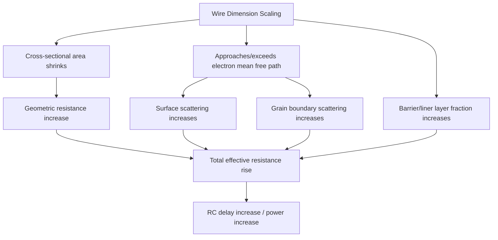

## Interconnect Scaling Challenges

### Overview

Interconnect scaling challenges encompass the physical, material, and electrical limitations encountered as back-end-of-line (BEOL) wire dimensions shrink alongside transistor scaling. Unlike transistor scaling, which has historically improved performance and power with reduced dimensions, interconnect scaling tends to work against performance: as wire cross-sections shrink, resistance rises sharply, while parasitic capacitance and electromigration reliability risk increase — making interconnect delay and power an increasingly dominant constraint at advanced nodes.

### The RC Delay Problem

**Key Points**

- Interconnect delay is fundamentally governed by the resistance-capacitance (RC) product of the wire, which for a given wire segment can be approximated as:

$$\tau \propto R \times C$$

- Wire resistance is inversely proportional to cross-sectional area: $R = \rho \dfrac{L}{W \times H}$, where $\rho$ is resistivity, $L$ is length, $W$ is width, and $H$ is height/thickness.
- As metal linewidth and thickness scale down with each technology node, cross-sectional area shrinks roughly quadratically (both $W$ and $H$ typically scale together), causing wire resistance to rise sharply — this rise is compounded by resistivity increases at nanoscale dimensions (see below), so measured resistance increase generally exceeds what geometric scaling alone would predict.
- Capacitance between adjacent wires does not scale as favorably, since parasitic (sidewall/coupling) capacitance between closely spaced parallel wires becomes an increasingly dominant fraction of total capacitance as wire pitch shrinks.
- The combined effect is that interconnect RC delay has become a significant, and in many cases dominant, contributor to overall circuit delay at advanced nodes, in some cases offsetting a substantial portion of the intrinsic transistor speed gains achieved through device scaling.

### Resistivity Scaling at Nanoscale Dimensions

**Key Points**

- Bulk copper resistivity is a well-characterized material constant, but the **effective** resistivity of copper interconnects increases significantly as wire dimensions shrink below approximately the electron mean free path in copper (tens of nanometers).
- This resistivity increase arises from several size-dependent scattering mechanisms:
  - **Surface scattering**: as wire cross-section shrinks toward and below the electron mean free path, a larger fraction of conduction electrons scatter off the wire's physical surfaces rather than traveling unimpeded, increasing effective resistivity.
  - **Grain boundary scattering**: polycrystalline copper wires contain grain boundaries that scatter electrons; as wire width shrinks toward or below typical copper grain size, grain boundary density (and thus scattering) per unit length increases.
  - **Barrier/liner layer volume fraction**: copper interconnects require a diffusion barrier layer (historically tantalum/tantalum nitride, $Ta$/$TaN$) to prevent copper diffusion into surrounding dielectric, plus typically a thin seed/liner layer; as total wire cross-section shrinks, the barrier layer occupies a proportionally larger fraction of the available cross-section, reducing the conductive copper volume and further increasing effective wire resistance beyond what pure copper resistivity scaling alone would predict.
- [Inference] The combination of these three effects is widely cited in the interconnect literature as causing effective resistivity of scaled copper wires to increase substantially relative to bulk copper resistivity at advanced-node dimensions, though the precise magnitude of increase for a given linewidth depends on grain structure, barrier thickness, and surface roughness specific to the deposition process used, and figures should be verified against current process-specific characterization data.

### Electromigration Reliability

**Key Points**

- Electromigration is the gradual displacement of metal atoms in a conductor caused by momentum transfer from conducting electrons ("electron wind") under high current density, potentially leading to void formation (open failures) or hillock/extrusion formation (short failures) over device operating lifetime.
- As wire cross-section shrinks, current density for a given absolute current increases (since $J = I/A$), directly increasing electromigration stress for the same functional current requirement.
- [Inference] This makes electromigration-limited current-carrying capacity an increasingly binding design constraint at scaled interconnect dimensions, generally requiring wider wires, current-density design rule margins, or via redundancy in high-current-density interconnect segments (such as power delivery and clock distribution networks) to maintain target reliability lifetime, though specific design rule limits are technology- and reliability-target-specific.
- Barrier layer and liner integrity are also electromigration-relevant, since barrier degradation or discontinuity can create localized current crowding or accelerated void nucleation sites.

### Dielectric Scaling and Capacitance Reduction

**Key Points**

- To manage the capacitance side of the RC product, interlayer dielectric (ILD) materials have progressively shifted from standard $SiO_2$ ($k \approx 3.9$–4.2) toward low-k and ultra-low-k dielectric materials (carbon-doped oxide, porous low-k films) with dielectric constants as low as approximately 2.0–2.5, reducing parasitic capacitance between adjacent wires for a given geometry.
- Porous low-k dielectrics introduce their own scaling challenges: reduced mechanical strength (making the material more susceptible to damage during chemical-mechanical polishing and packaging stress), increased susceptibility to moisture absorption, and increased vulnerability to plasma-induced damage during etch and clean process steps — creating a trade-off between capacitance reduction and mechanical/reliability robustness.
- [Unverified] The specific low-k material systems, porosity levels, and associated integration schemes in current production vary by manufacturer and technology node, and should be verified against up-to-date process literature rather than treated as a fixed, universally standard material choice.

### Via and Contact Scaling Challenges

**Key Points**

- Vias (vertical interconnects between metal layers) scale in diameter alongside metal linewidth, and via resistance is subject to the same surface/grain-boundary scattering and barrier-volume-fraction effects as line resistance, often to an even greater degree due to the via's smaller aspect ratio characteristics and the proportionally larger barrier layer contribution in a small-diameter via.
- Via resistance variability and reliability (electromigration at via/line interfaces, where current crowding is often most severe) are recognized as significant contributors to overall interconnect stack resistance and reliability risk at advanced nodes.
- [Unverified] Specific via resistance figures and their contribution to total path resistance are highly dependent on the specific metal stack, via aspect ratio, and barrier/liner process used, and general figures cited in literature should be verified against the specific technology generation being studied.

### Mitigation Strategies Overview

| Challenge | Representative Mitigation Approaches |
| --- | --- |
| Rising wire resistance | Alternative metals with favorable scaled resistivity (see related topic); barrier/liner thickness reduction; airgap or ultra-low-k dielectrics |
| Rising parasitic capacitance | Low-k/ultra-low-k ILD materials; wire spacing and layout optimization |
| Electromigration risk | Current density design rules; via redundancy; wire width margining in high-current paths |
| Via resistance contribution | Barrier/liner thickness scaling; alternative via metallization; via stack optimization |
| Mechanical/process robustness of low-k films | Hybrid dielectric schemes (low-k combined with mechanically robust cap layers); process-induced damage mitigation during etch/CMP |

[Inference] These mitigation strategies are generally pursued in combination rather than as isolated solutions, since resistance, capacitance, and reliability constraints are interrelated trade-offs in interconnect stack design — a change intended to reduce capacitance (e.g., more porous low-k dielectric) can introduce new mechanical or reliability risk that must be separately addressed, reflecting the broadly reported multi-dimensional nature of interconnect scaling as a systems-level optimization problem rather than a single-parameter scaling challenge.

### Architectural and Process Responses

**Key Points**

- Multi-level metal stacks with graduated pitch (finer pitch at lower/local interconnect levels near the transistor, progressively coarser pitch at higher/global interconnect levels for power delivery and long-range routing) are a standard architectural response that concentrates the most severe scaling challenges in local interconnect levels while preserving lower-resistance paths for higher-current global routing.
- [Unverified] Emerging directions such as alternative barrier-less or self-forming-barrier metallization schemes, and continued exploration of alternative conductor materials, are active areas of industry research aimed at addressing effective resistivity scaling; the maturity and production adoption status of specific emerging approaches should be verified against current literature rather than assumed to be broadly implemented.

**Next Steps**

- Copper interconnect metallization and barrier/liner process details
- Alternative interconnect metals (cobalt, ruthenium) for scaled resistivity
- Low-k and ultra-low-k dielectric material systems and integration
- Electromigration design rules and reliability qualification methods
- Via stack resistance optimization and redundancy schemes
- Airgap interconnect technology