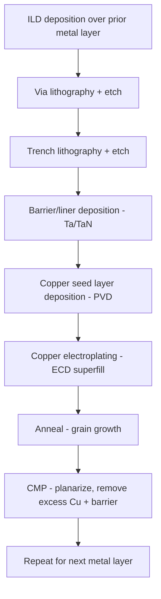

## Copper Dual Damascene Process

### Overview

The copper dual damascene process is the standard back-end-of-line (BEOL) metallization technique used to form copper interconnect wiring and vias simultaneously within a single dielectric fill and polish sequence. It replaced earlier aluminum subtractive-etch metallization because copper cannot be readily patterned using conventional plasma etch chemistry (lacking volatile copper etch byproducts), requiring an inverse process flow in which the dielectric is patterned first and copper is deposited into the resulting trenches and vias.

### Motivation: Why Damascene Instead of Subtractive Etch

**Key Points**

- Aluminum interconnects were historically formed by depositing a blanket aluminum film, patterning it with photoresist, and etching away unwanted aluminum using chlorine-based plasma chemistry that produces volatile aluminum chloride byproducts.
- Copper does not form volatile chloride or fluoride byproducts under practical plasma etch conditions at reasonable process temperatures, making direct plasma etching of patterned copper impractical for manufacturing.
- The damascene approach inverts the sequence: the dielectric layer is deposited and patterned with trenches (and vias) first, then copper is deposited to fill the patterned cavities, and excess copper is removed by chemical-mechanical polishing (CMP), leaving copper only within the intended wiring pattern.
- "Dual" damascene refers to patterning and filling both the via (vertical connection to the layer below) and the trench (horizontal wire) in a single copper fill and CMP step, as opposed to "single damascene," which forms vias and trenches as separate fill/polish sequences.

### Dual Damascene Process Flow

1. **Dielectric deposition**: interlayer dielectric (ILD, typically low-k or ultra-low-k material) is deposited over the previous metal layer, often with an intervening etch stop layer.
2. **Via-first (or trench-first) lithography and etch**: in the common via-first approach, via holes are patterned and etched down to the underlying metal layer first, stopping on an etch stop layer.
3. **Trench lithography and etch**: a second lithography step patterns the wider trench pattern over the via locations, and a trench etch removes dielectric to the trench depth (stopping on a separate etch stop layer positioned at the trench-bottom/via-top interface), leaving a combined via-and-trench cavity with a stepped profile.
4. **Barrier/liner deposition**: a thin diffusion barrier layer (historically tantalum/tantalum nitride, $Ta$/$TaN$) is deposited conformally over the patterned dielectric surface, lining the via and trench sidewalls and bottom, to prevent copper diffusion into the surrounding dielectric (copper is a fast diffuser in silicon and many dielectrics, and can degrade device electrical characteristics if allowed to migrate).
5. **Copper seed layer deposition**: a thin copper seed layer is deposited (typically via physical vapor deposition, PVD) over the barrier to provide a conductive nucleation surface for subsequent electroplating.
6. **Copper electroplating (electrochemical deposition, ECD)**: bulk copper fill is deposited via electroplating, which overfills the trench/via structure and the field (top) surface, using plating chemistry additives (accelerators, suppressors, levelers) engineered to achieve "superfill" — bottom-up filling of the via/trench without voids or seams.
7. **Anneal**: a low-temperature anneal promotes copper grain growth and stabilizes the electroplated film's microstructure, improving conductivity and mechanical stability prior to polishing.
8. **Chemical-mechanical polishing (CMP)**: excess copper above the field dielectric surface is removed by CMP, along with the excess barrier layer, planarizing the surface and leaving copper isolated within the trench/via pattern, ready for the next dielectric deposition and repeat of the sequence.

(svg_diagram)

<svg xmlns="http://www.w3.org/2000/svg" viewBox="0 0 640 300">

<title>Dual Damascene Via-Trench Cross-Section (svg_diagram)</title>
<rect width="640" height="300" fill="#ffffff" />

<rect x="40" y="250" width="560" height="30" fill="#c08030" stroke="#333" />
<text x="270" y="270" font-size="11" fill="#333">Metal Layer N-1</text>

<rect x="40" y="240" width="560" height="10" fill="#909090" stroke="#333" />

<rect x="40" y="80" width="560" height="160" fill="#d0e0f0" stroke="#333" />
<text x="450" y="100" font-size="11" fill="#2060c0">Low-k ILD</text>

<rect x="180" y="200" width="40" height="40" fill="#e08030" stroke="#333" />

<rect x="120" y="140" width="160" height="60" fill="#e08030" stroke="#333" />
<text x="125" y="135" font-size="10" fill="#333">Trench (wire) + Via (below)</text>

<rect x="115" y="135" width="170" height="110" fill="none" stroke="#c04040" stroke-width="2" stroke-dasharray="4,2" />
<text x="290" y="150" font-size="10" fill="#c04040">Ta/TaN barrier</text>
</svg>

### Barrier and Seed Layer Considerations

**Key Points**

- The $Ta$/$TaN$ barrier stack is typically deposited using physical vapor deposition (PVD) for planar or moderate-aspect-ratio structures, though [Inference] atomic layer deposition (ALD) or ALD-PVD hybrid approaches are generally reported as necessary for high-aspect-ratio structures at advanced nodes where PVD conformality on via sidewalls becomes insufficient, since PVD is a directional, line-of-sight process that struggles to coat high-aspect-ratio via sidewalls uniformly.
- Barrier layer thickness must be minimized to preserve as much conductive copper cross-section as possible (as discussed under interconnect scaling challenges), while remaining thick and continuous enough to reliably block copper diffusion — this creates a persistent thickness-scaling tension at advanced nodes.
- The copper seed layer must be continuous across the barrier surface, including via sidewalls and bottoms, since discontinuities in the seed layer can cause voids or incomplete fill during subsequent electroplating.

### Copper Electroplating and Superfill

**Key Points**

- Direct blanket electroplating without engineered plating chemistry tends to deposit copper conformally, which would create a seam or void at the center of the via/trench as the cavity closes from both sidewalls; achieving void-free "bottom-up" superfill instead requires plating bath additives that locally modulate deposition rate.
- Plating additive packages typically include an **accelerator** (increases local deposition rate, tends to concentrate at the bottom of the via/trench as it fills), a **suppressor** (inhibits deposition rate, generally more effective at the field/top surface), and a **leveler** (further modulates deposition to suppress overplating at corners/protrusions), whose combined interaction produces preferential bottom-up fill rather than conformal fill.
- [Unverified] Specific additive chemistries and their precise mechanism of action are proprietary to plating process suppliers and vary across manufacturing processes; the general accelerator/suppressor/leveler framework described here reflects commonly reported principles in the literature rather than a specific vendor's formulation.

### Chemical-Mechanical Polishing (CMP)

**Key Points**

- CMP for copper dual damascene typically proceeds in multiple stages: a bulk copper removal step (high removal rate, coarse planarization) followed by a barrier removal step (different slurry chemistry selective to the barrier material) and often a final buff step to minimize dishing and erosion.
- **Dishing** (excess copper removal within wide trench/wire features, causing a concave surface profile) and **erosion** (excess dielectric removal in densely patterned regions) are recognized CMP-related defects that can affect subsequent layer uniformity and electrical resistance if not well controlled through process and layout co-design (e.g., dummy fill patterns to improve pattern density uniformity).
- CMP process control (polish time, pad conditioning, slurry selectivity) must be co-optimized with layout pattern density across the die to maintain planarity and minimize these effects.

### Multi-Level Metal Stack Repetition

The dual damascene sequence (dielectric deposition, via/trench patterning, barrier/seed/fill, CMP) is repeated for each metal layer in the BEOL stack, typically progressing from finer-pitch local interconnect layers near the transistor level to progressively coarser-pitch layers for intermediate and global (power delivery, long-range routing) interconnect, as referenced under interconnect scaling challenges.

### Integration Challenges

- **Barrier/seed conformality in scaled vias**: as via aspect ratio increases at advanced nodes, achieving continuous, sufficiently thin barrier and seed coverage on via sidewalls becomes progressively more difficult, directly affecting achievable via resistance and fill reliability.
- **Low-k dielectric compatibility**: porous low-k ILD materials (discussed under interconnect scaling challenges) are more susceptible to plasma etch damage during via/trench patterning and to CMP-induced mechanical damage, requiring careful process integration (e.g., protective cap layers, damage-repair treatments) alongside the standard damascene flow.
- **Electromigration at via/metal interfaces**: the via-to-trench interface geometry and barrier continuity at this junction are recognized as locations of elevated electromigration risk, as referenced under interconnect scaling challenges.
- [Unverified] Specific via-first versus trench-first process sequencing choice, and specific barrier/seed material and thickness selections, vary by manufacturer and technology node; the flow described here reflects the commonly documented general dual damascene sequence rather than a single universally fixed process recipe.

**Next Steps**

- Barrier/seed deposition techniques for high-aspect-ratio vias (ALD, hybrid PVD-ALD)
- Copper electroplating additive chemistry and superfill mechanisms
- CMP process optimization and dishing/erosion mitigation
- Low-k dielectric damage mechanisms during damascene patterning
- Via-first versus trench-first process sequencing trade-offs
- Alternative interconnect metallization (cobalt, ruthenium) as copper alternatives