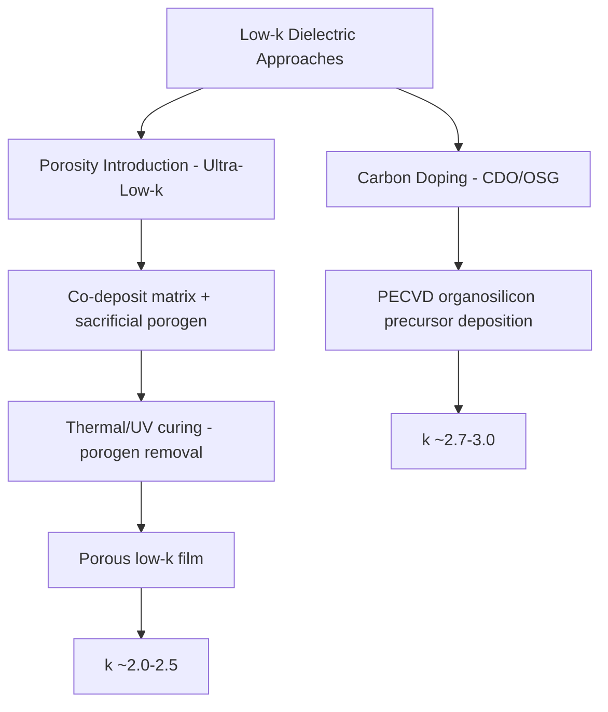

## Low-k and Ultra-Low-k Dielectrics

### Overview

Low-k and ultra-low-k (ULK) dielectrics are interlayer dielectric (ILD) materials engineered with a relative permittivity lower than standard silicon dioxide ($k \approx 3.9$–4.2), used in back-end-of-line (BEOL) interconnect stacks to reduce parasitic capacitance between adjacent copper wires. Lower interconnect capacitance directly reduces RC delay and dynamic power consumption, making low-k dielectric adoption a central strategy for managing the interconnect scaling challenges introduced elsewhere in this chapter.

### Motivation and Capacitance Relationship

**Key Points**

- Parasitic capacitance between adjacent parallel wires is approximately proportional to dielectric permittivity: $C \propto \dfrac{k \varepsilon_0 A}{d}$, where $A$ is the effective coupling area and $d$ is wire spacing.
- As wire pitch shrinks with each technology node, wire spacing $d$ decreases, which would increase capacitance if dielectric material were unchanged — lowering $k$ directly counteracts this trend, helping to control the capacitance component of the RC delay product.
- Because total interconnect capacitance includes both lateral (sidewall, wire-to-wire) and vertical (wire-to-wire on adjacent metal layers) contributions, and lateral coupling capacitance becomes an increasingly dominant fraction of total capacitance as pitch scales, low-k adoption is particularly impactful for the tightly spaced, fine-pitch lower metal levels.

### Dielectric Constant Classification

| Category | Typical $k$ Range | Representative Approach |
| --- | --- | --- |
| Standard silicon dioxide | 3.9–4.2 | Undoped or lightly doped $SiO_2$ (FSG, USG) |
| Low-k (non-porous) | 2.7–3.0 | Carbon-doped oxide (CDO), organosilicate glass (OSG) |
| Ultra-low-k (porous) | 2.0–2.5 | Porous carbon-doped oxide, porous organosilicate glass |
| Extreme low-k / airgap | Below ~2.0 | Highly porous films or engineered air-gap structures |

[Unverified] Exact $k$ value targets and specific material system names vary by manufacturer, technology node, and metal level within the BEOL stack (lower, finer-pitch levels often use more aggressive low-k materials than upper, coarser global routing levels); the ranges above reflect commonly reported general categories in the literature rather than a single fixed industry standard.

### Material Approaches to Lowering Dielectric Constant

**Carbon Doping of Silicon Oxide (Organosilicate Glass, OSG/CDO)**

- Incorporating carbon (typically as methyl or other organic functional groups) into a silicon oxide network reduces polarizability of the film compared to pure $SiO_2$, lowering $k$ into the roughly 2.7–3.0 range.
- These carbon-doped oxide films are typically deposited via plasma-enhanced chemical vapor deposition (PECVD) using organosilicon precursors, and represent the first generation of low-k materials to see broad manufacturing adoption, generally as a comparatively incremental modification of standard PECVD oxide deposition.

**Porosity Introduction (Ultra-Low-k)**

- Further $k$ reduction beyond what carbon doping alone can achieve is obtained by introducing controlled nanoscale porosity into the film, since air/vacuum within pores has a dielectric constant of approximately 1.0, and a porous composite film's effective $k$ decreases as pore volume fraction increases.
- Porous ULK films are commonly formed by co-depositing the base dielectric matrix material with a sacrificial "porogen" (pore-forming) organic component, then removing the porogen through a subsequent curing step (thermal or ultraviolet-assisted curing), leaving behind a porous matrix structure.
- [Inference] Pore size, pore interconnectivity, and porosity fraction are generally reported as being carefully controlled during porogen selection and curing process development, since excessive or poorly controlled porosity can compromise mechanical strength and increase susceptibility to moisture absorption and process-induced damage, representing a central trade-off in ULK material engineering.

### Mechanical and Process Integration Challenges

**Reduced Mechanical Strength**

- Porosity that lowers $k$ also reduces film density and mechanical stiffness/hardness, making ULK films more susceptible to cracking, delamination, and damage during subsequent process steps, particularly chemical-mechanical polishing (CMP) in the dual damascene process flow.
- [Inference] This mechanical weakness is widely cited as one of the central integration challenges of ULK adoption, generally requiring modified CMP process parameters (reduced down-force, modified slurry chemistry) and, in many reported process schemes, the use of a mechanically robust capping or hardmask layer above the porous ULK film to protect it during polish and subsequent processing.

**Plasma-Induced and Etch Damage**

- During via/trench patterning (etch) and photoresist/residue removal (ash/clean) steps in the dual damascene flow, porous ULK films are more susceptible to plasma-induced damage than dense dielectrics, since reactive plasma species and by-products can penetrate the porous network and modify the film chemistry (e.g., converting hydrophobic methyl-terminated pore surfaces to hydrophilic, moisture-absorbing surfaces), which can locally increase effective $k$ and degrade reliability near patterned features.
- Mitigation approaches reported in the literature include tailored, lower-damage etch and ash chemistries, and post-etch "k-recovery" or sealing treatments intended to restore hydrophobicity and repair damaged pore surfaces near patterned sidewalls. [Unverified] The specific effectiveness and adoption breadth of particular damage-mitigation or repair techniques vary by process and should be verified against current process-specific literature.

**Moisture Absorption**

- Porous films with interconnected pore networks can absorb ambient moisture, which has a high dielectric constant (water $k \approx 80$) and can significantly raise the effective $k$ of an affected film region if absorbed, undermining the intended capacitance benefit and potentially degrading reliability (e.g., via copper corrosion pathways).
- Capping layers and hydrophobic surface treatments (such as the methyl-terminated pore surfaces referenced above) are used to mitigate moisture uptake risk.

### Barrier and Adhesion Layer Interactions

**Key Points**

- The Ta/TaN barrier layer used in copper dual damascene interconnects (discussed under that topic) must adhere well to the low-k or ULK dielectric surface; porous or chemically modified (e.g., carbon-doped) dielectric surfaces can present different adhesion characteristics than dense $SiO_2$, sometimes requiring adjusted barrier deposition process conditions or additional adhesion-promoting surface treatments.
- [Unverified] Specific barrier adhesion challenges and mitigation approaches for particular low-k/ULK material systems are process- and material-specific, and general statements about adhesion behavior should be verified against the specific dielectric and barrier material combination being studied.

### Capping and Hardmask Layer Strategies

**Key Points**

- A thin, mechanically robust, and typically denser capping layer (which may itself have a somewhat higher $k$ than the underlying ULK film) is commonly used above porous ULK dielectric to provide CMP polish-stop functionality, etch/ash damage protection, and improved barrier adhesion, at the cost of a modest overall effective-$k$ penalty for the composite dielectric stack.
- [Inference] This represents a recurring engineering trade-off in ULK integration: achieving the lowest possible bulk-film $k$ must be balanced against the practical need for sufficient mechanical and chemical robustness to survive the remaining process flow, and the specific optimal balance point is generally established through process-specific reliability and yield characterization rather than a fixed universal target.

### Extreme Low-k and Airgap Approaches

**Key Points**

- Beyond porous solid dielectric films, some advanced integration schemes pursue "airgap" interconnect structures, in which dielectric material between selected adjacent wires is deliberately not filled (or is removed after an initial sacrificial fill), leaving an air or vacuum gap with $k \approx 1.0$ as the effective inter-wire dielectric in targeted regions.
- [Unverified] Airgap and extreme-low-k integration schemes are generally reported as more process-intensive and structurally demanding than solid porous ULK films (requiring careful mechanical support and process sequencing to avoid structural collapse during subsequent processing), and their adoption status in mainstream production varies by manufacturer and technology node; current adoption specifics should be verified against up-to-date process literature.

### Summary Trade-off Framework

| Factor | Trend with Lower k / Higher Porosity |
| --- | --- |
| Parasitic capacitance | Decreases (beneficial for RC delay/power) |
| Mechanical strength | Decreases (increased CMP/handling risk) |
| Plasma/etch damage susceptibility | Increases |
| Moisture absorption risk | Increases (without effective sealing/capping) |
| Barrier adhesion | Can be more challenging depending on surface chemistry |
| Process integration complexity | Increases (capping layers, damage mitigation, modified CMP) |

**Next Steps**

- PECVD carbon-doped oxide deposition process details
- Porogen selection and UV/thermal curing process development
- Plasma damage mechanisms and k-recovery treatment techniques
- CMP process adaptation for low mechanical strength ULK films
- Capping/hardmask layer material selection and stack design
- Airgap interconnect structural integration schemes