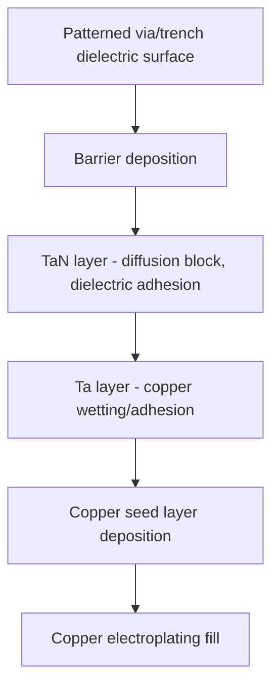

## Diffusion Barrier and Seed Layers

### Overview

Diffusion barrier and seed layers are thin films deposited prior to copper fill in the dual damascene process, serving complementary but distinct functions: the barrier layer prevents copper atoms from diffusing into the surrounding dielectric and silicon-based structures, while the seed layer provides a continuous, conductive nucleation surface enabling uniform copper electroplating. Together, they form the critical interface between the patterned dielectric and the bulk copper conductor.

### Why a Diffusion Barrier Is Required

**Key Points**

- Copper is a fast interstitial diffuser in silicon dioxide and silicon; without a barrier, copper atoms can migrate from the interconnect into adjacent dielectric and eventually into the silicon substrate under thermal and electric-field stress during device operation.
- Copper that diffuses into silicon forms deep-level trap states in the silicon bandgap, which can severely degrade transistor characteristics (increased junction leakage, threshold voltage shifts, reduced carrier lifetime) if allowed to reach active device regions.
- Copper diffusion into the surrounding ILD can also degrade the dielectric's insulating properties and increase leakage current between adjacent interconnect structures, and can promote a related reliability failure mode, time-dependent dielectric breakdown (TDDB), of the intervening dielectric.
- Unlike aluminum (which forms a stable, self-limiting native oxide that inherently limits its own diffusion), copper does not form a comparably effective natural diffusion-blocking oxide, making a deliberately engineered barrier layer a structural necessity for copper-based interconnects.

### Barrier Material Selection

**Tantalum and Tantalum Nitride ($Ta$/$TaN$)**

- The most widely reported and long-established barrier material system for copper interconnects is a bilayer of tantalum nitride ($TaN$) and tantalum ($Ta$), typically with $TaN$ deposited first (adjacent to the dielectric) followed by a thin $Ta$ layer (adjacent to the copper seed).
- $TaN$ provides strong diffusion-blocking performance and good adhesion to oxide-based dielectrics, while the overlying $Ta$ layer is reported to provide improved wetting and adhesion characteristics for the subsequent copper seed layer compared to $TaN$ alone.
- [Inference] This bilayer approach is generally described in the literature as balancing diffusion-blocking effectiveness (favoring $TaN$) against copper adhesion and seed layer quality (favoring metallic $Ta$), though specific layer thickness ratios and whether both sublayers are used in a given process are manufacturer- and node-specific.

**Alternative and Emerging Barrier Materials**

- Titanium nitride ($TiN$), tungsten nitride ($WN$), and various ternary or self-forming barrier schemes (e.g., manganese-based self-forming barriers, where a manganese-copper alloy seed layer reacts with the dielectric surface to form a thin manganese-oxide/silicate barrier in situ) have been explored as alternatives, particularly as a route to thinner effective barrier layers.
- [Unverified] The adoption status and production maturity of alternative or self-forming barrier schemes vary by manufacturer and technology generation; current production barrier material choices should be verified against up-to-date process literature for the specific technology platform of interest rather than assumed to have uniformly replaced conventional $Ta$/$TaN$.

### Barrier Deposition Techniques

**Physical Vapor Deposition (PVD)**

- Historically the dominant deposition method for $Ta$/$TaN$ barrier layers, using sputtering from a tantalum target (with nitrogen gas introduced for the $TaN$ sublayer).
- PVD is a directional, largely line-of-sight process, which provides good film density and adhesion on planar or moderate-aspect-ratio structures but has limited conformality on high-aspect-ratio via sidewalls, particularly the lower sidewall and bottom corner regions of deep, narrow vias.

**Atomic Layer Deposition (ALD) and Hybrid Approaches**

- ALD provides superior step coverage and conformality on high-aspect-ratio structures due to its self-limiting, sequential surface-reaction deposition mechanism (analogous to high-k gate dielectric ALD discussed elsewhere in this course).
- [Inference] As via aspect ratio has increased with continued interconnect scaling, ALD or hybrid ALD-PVD approaches (e.g., ALD for the sidewall/bottom-critical $TaN$ layer, PVD for a subsequent $Ta$ or seed-enhancement layer) are generally reported in the literature as increasingly necessary to achieve adequate barrier conformality at advanced nodes, though the specific point of transition from PVD-only to ALD-assisted barrier deposition is process- and node-specific.

### Copper Seed Layer

**Purpose and Function**

- Electroplating requires a continuous, conductive surface to serve as the cathode for electrochemical copper deposition; the thin copper seed layer provides this conductive nucleation surface across the barrier-coated via/trench structure.
- Seed layer continuity is critical: any discontinuity, particularly on via sidewalls or at via bottom corners, can result in incomplete plating coverage, voids, or high-resistance connections in the finished interconnect.

**Deposition Method**

- Copper seed layers are typically deposited via PVD sputtering, similar to the barrier layer, and face the same fundamental conformality limitations on high-aspect-ratio structures as PVD barrier deposition.
- [Inference] As with barrier deposition, achieving adequate seed layer conformality and continuity on scaled, high-aspect-ratio via structures is widely reported as an increasing integration challenge, sometimes addressed through modified PVD techniques (e.g., ionized PVD, which provides more directional, bottom-focused deposition to improve via bottom and lower-sidewall coverage) or supplementary techniques such as electroless copper seed repair in regions of thin or discontinuous PVD seed coverage.

### Interaction with Interconnect Scaling Challenges

**Key Points**

- As discussed under interconnect scaling challenges, the barrier and seed layers occupy a fraction of the total wire/via cross-sectional area that does not contribute conductive copper volume, meaning barrier/seed thickness directly subtracts from the achievable conductive cross-section.
- As total wire and via dimensions shrink, this non-conductive barrier/seed volume fraction increases proportionally (since barrier/seed thickness scales down more slowly than the overall feature dimension, due to the minimum thickness required for reliable diffusion blocking and seed continuity), contributing to the effective resistivity increase of scaled copper interconnects beyond what pure geometric or bulk-resistivity scaling would predict.
- This creates a persistent engineering tension: minimizing barrier/seed thickness to preserve conductive cross-section and reduce resistance, while maintaining sufficient thickness and continuity to reliably block copper diffusion and support void-free electroplating.

### Reliability Considerations

**Key Points**

- Barrier layer integrity (continuity, adhesion, absence of localized thin spots or defects) is directly linked to electromigration reliability, since barrier discontinuities or weak points can serve as preferential void nucleation sites under current stress, as referenced under interconnect scaling challenges.
- Barrier/copper and barrier/dielectric interface adhesion quality affects mechanical reliability during subsequent CMP and packaging stress, with poor adhesion representing a potential delamination or reliability failure risk.
- [Unverified] Specific reliability failure rates and their quantitative relationship to barrier thickness or deposition method are process- and qualification-specific, and are generally established through dedicated reliability testing (electromigration stress testing, TDDB testing) on the actual integrated stack rather than predicted from general barrier material properties alone.

### Barrier/Seed Removal During CMP

As referenced under the copper dual damascene process, the chemical-mechanical polishing sequence following copper electroplating must remove not only excess bulk copper but also the exposed barrier layer on the field (non-trench) surface, typically using a separate barrier-selective CMP slurry chemistry distinct from the bulk copper removal step, to achieve full electrical isolation between adjacent copper features and a planarized surface for the next interconnect level.

**Next Steps**

- Self-forming barrier schemes (manganese-based and related approaches)
- ALD barrier process development for high-aspect-ratio vias
- Ionized PVD and electroless seed repair techniques
- Barrier/seed thickness scaling limits and effective resistivity contribution
- CMP barrier-selective slurry chemistry and process integration
- Electromigration failure mechanisms at barrier/copper interfaces