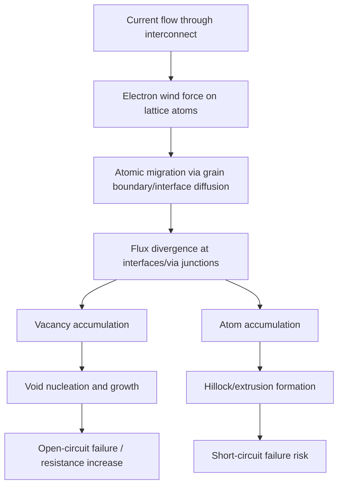

## Electromigration and Interconnect Reliability

### Overview

Electromigration is the gradual, current-induced mass transport of metal atoms within an interconnect conductor, driven by momentum transfer from conducting electrons to the metal lattice. Over device operating lifetime, this atomic migration can lead to void formation (causing open-circuit failures) or hillock/extrusion formation (causing short-circuit failures), making electromigration one of the central back-end-of-line reliability mechanisms that constrains allowable current density in scaled copper interconnects.

### Physical Mechanism

**Key Points**

- Under current flow, conducting electrons transfer momentum to metal lattice atoms through repeated scattering collisions — commonly described as "electron wind" force — which can cause net atomic displacement in the direction of electron flow when this force exceeds the restraining force holding atoms in the lattice (a balance also influenced by a counteracting effect from the direct electrostatic field force on the ions, though electron wind is generally reported as the dominant contributor in typical interconnect metals).
- Atomic migration occurs primarily via diffusion along grain boundaries, interfaces (e.g., copper/barrier or copper/capping-layer interfaces), and, to a lesser extent, through the bulk lattice — with grain boundary and interface diffusion generally reported as dominant pathways at typical interconnect operating temperatures because they have lower activation energy than bulk lattice diffusion.
- Net atomic flux divergence — locations where more atoms migrate away than migrate in — leads to local vacancy accumulation and eventual void nucleation and growth, while locations of net atomic accumulation can form hillocks or extrusions into adjacent dielectric or conductor structures.

### Void and Extrusion Failure Modes

**Void Formation (Open Failures)**

- Vacancy accumulation at flux-divergence sites (commonly at via/line interfaces, grain boundary triple points, or barrier discontinuities) nucleates a void that grows over time under continued current stress.
- As the void grows, it progressively reduces the effective conductive cross-section at that location, increasing local current density and local Joule heating, which can accelerate further void growth in a self-reinforcing manner until the interconnect segment fails open or exceeds a resistance-increase reliability limit.
- Via/line interfaces are frequently cited in the literature as particularly susceptible void nucleation sites, since the geometric transition and any barrier discontinuity at this junction can create localized flux divergence.

**Hillock and Extrusion Formation (Short Failures)**

- At locations of net atomic accumulation, compressive stress can build within the confined interconnect structure, potentially extruding metal into adjacent dielectric or, in severe cases, into an adjacent conductor, creating an unintended short-circuit path.
- [Inference] Extrusion-related short failures are generally reported as less common than void-related open failures in modern copper dual-damascene interconnects (which are geometrically confined by surrounding dielectric to a greater degree than earlier aluminum interconnect structures), though the balance between these failure modes is structure- and stress-condition-dependent.

### Black's Equation: Lifetime Modeling

Electromigration-induced median time to failure (MTTF) is commonly modeled using the empirical relationship known as Black's equation:

$$MTTF = A \cdot J^{-n} \cdot e^{\frac{E_a}{kT}}$$

Where $A$ is a process/geometry-dependent constant, $J$ is current density, $n$ is a current density exponent (commonly reported in the literature in the range of approximately 1–2 for many interconnect systems, though the specific value is material- and failure-mode-dependent), $E_a$ is the activation energy for the dominant diffusion mechanism, $k$ is Boltzmann's constant, and $T$ is absolute temperature.

**Key Points**

- Black's equation captures the strong, non-linear sensitivity of interconnect lifetime to both current density (higher $J$ sharply reduces lifetime) and temperature (higher $T$ sharply reduces lifetime via the Arrhenius-type exponential term), making both current density management and thermal design central to electromigration reliability control.
- [Unverified] Specific values for $A$, $n$, and $E_a$ are empirically determined for a given metallization system (material, barrier, geometry) through dedicated electromigration stress testing and are not universal constants; general figures cited in literature should not be assumed to directly apply to a specific process without verification against process-specific qualification data.

### Design and Process Mitigation Strategies

**Current Density Design Rules**

- Semiconductor design rules specify maximum allowable current density for each interconnect level and via type, derived from electromigration qualification testing and a target reliability lifetime (often expressed as a failure rate target over a specified operating lifetime and temperature condition).
- Wire width and via count/redundancy in high-current paths (such as power delivery networks and clock distribution) are commonly increased in layout to keep current density within qualified limits, at the cost of additional routing area.

**Via Redundancy**

- Using multiple parallel vias at a given interconnect junction, rather than a single via, both reduces current density per via and provides a degree of redundancy — if one via degrades or fails, the parallel via(s) can maintain electrical connectivity, extending effective circuit lifetime.

**Grain Structure Engineering**

- Because grain boundary diffusion is a dominant electromigration transport pathway, interconnect processes are often engineered (via anneal conditions, as referenced under the copper dual damascene process) to promote larger, more uniform copper grain structure, which reduces the total grain boundary density available for atomic transport and can improve electromigration lifetime.
- [Inference] This is a widely cited motivation for the post-electroplating anneal step in copper damascene processing, though the specific relationship between anneal conditions, resulting grain size distribution, and quantitative electromigration lifetime improvement is process-specific.

**Barrier and Cap Layer Engineering**

- Barrier layer continuity and quality (discussed under diffusion barrier and seed layers) directly affects electromigration behavior at the copper/barrier interface, since this interface is a recognized diffusion pathway; barrier discontinuities can create localized flux-divergence and preferential void nucleation sites.
- The copper capping layer at the top surface of the wire (where copper interfaces with the dielectric or a dedicated cap material after CMP) is also a significant diffusion pathway in many reported studies; [Unverified] alternative capping schemes (e.g., metal caps such as cobalt or alloy caps, as opposed to dielectric-only capping) have been explored in the literature as a means of improving electromigration lifetime by reducing surface/interface diffusion at this location, though the specific adoption status of such capping approaches varies by manufacturer and technology generation.

### Thermal Considerations

**Key Points**

- Because electromigration lifetime is exponentially sensitive to temperature (per Black's equation), localized Joule heating from current flow through resistive interconnect segments, as well as proximity to heat-generating active device regions, is a significant factor in electromigration reliability assessment.
- Self-heating effects — where current-induced Joule heating in a resistive wire segment locally raises temperature and further accelerates electromigration in a compounding manner — are a recognized concern, particularly as effective interconnect resistivity increases at scaled dimensions (as discussed under interconnect scaling challenges), since higher resistance for a given current increases local power dissipation and heating.

### Electromigration Testing and Qualification

**Key Points**

- Electromigration reliability is typically characterized through accelerated stress testing, in which test structures are stressed at elevated current density and/or temperature (beyond normal operating conditions) to accelerate failure within a practical testing timeframe, with results extrapolated to normal operating conditions using Black's equation or similar models.
- [Unverified] Specific accelerated test conditions, sample sizes, and statistical extrapolation methodologies used for qualification vary by manufacturer and are typically governed by internal reliability standards or industry consortium guidelines (such as those published by JEDEC); specific current qualification methodology details should be verified against up-to-date reliability engineering literature rather than assumed to follow a single universal protocol.

### Interaction with Alternative Interconnect Metals

**Key Points**

- Electromigration resistance is one of several material properties considered when evaluating alternative interconnect metals (such as cobalt or ruthenium) as potential supplements or alternatives to copper at scaled dimensions, alongside resistivity scaling behavior.
- [Unverified] The relative electromigration performance of alternative metals compared to copper is an active area of research and reported results vary; specific comparative electromigration lifetime data should be verified against current published research for the specific materials and structures of interest rather than generalized from copper-based literature.

**Next Steps**

- Black's equation parameter extraction and qualification methodology
- Via redundancy and current density design rule development
- Copper grain structure engineering via anneal process control
- Capping layer material alternatives for electromigration improvement
- Self-heating and thermal-electromigration coupling effects
- Electromigration behavior in alternative interconnect metals (Co, Ru)