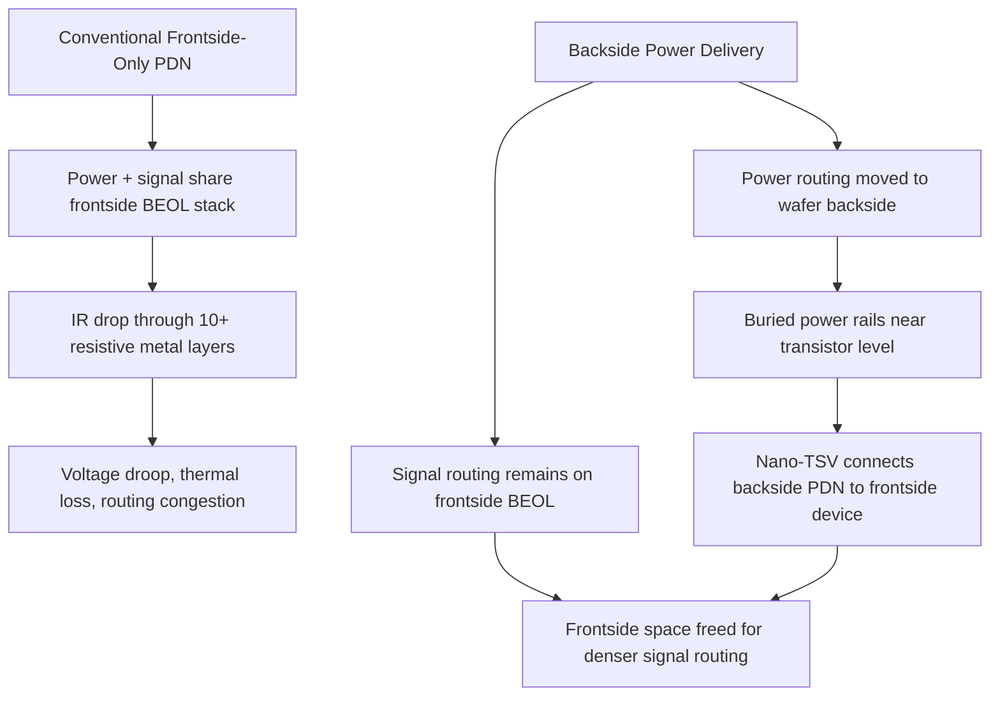
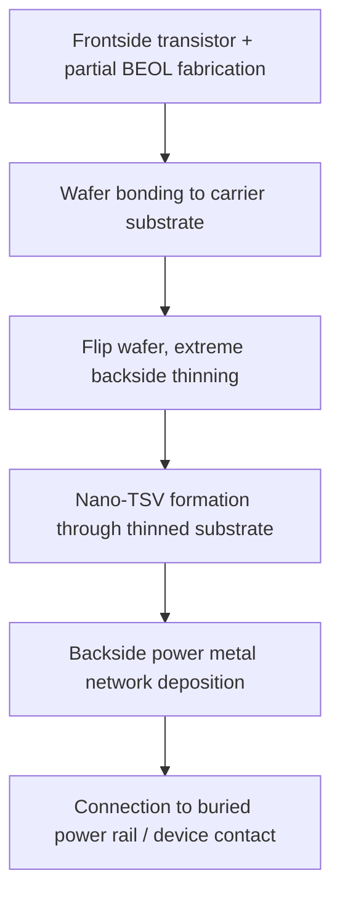

## Backside Power Delivery Networks

### Overview

Backside power delivery networks (BSPDN) relocate the power distribution wiring from the conventional front-side back-end-of-line (BEOL) metal stack to a separate metal network built on the wafer backside, directly beneath the transistor layer. This architectural change decouples power delivery routing from signal routing, addressing the escalating IR drop, routing congestion, and interconnect resistance challenges that arise when power and signal wires compete for the same limited front-side metal stack, as discussed under interconnect scaling challenges.

### Motivation: The Frontside Power Delivery Bottleneck

**Key Points**

- In conventional (frontside-only) power delivery, power must be routed from package-level connections down through the entire multi-level front-side metal stack — typically ten or more metal layers — to reach individual transistors, traversing progressively thinner and more resistive lower metal levels near the device layer.
- This routing path creates substantial IR drop, a voltage droop that wastes energy and generates excessive heat before power reaches its destination, described in industry commentary as having reached a physical and economic scaling limit at advanced nodes. [Avecas](https://avecas.in/backside-power-delivery-semiconductor-2nm-innovation/)
- Power and signal wiring compete for the same limited front-side routing resources at the tightest, most congested metal levels near the transistor, constraining both power delivery quality and achievable signal routing density and cell utilization.
- Backside power delivery increases logic density and improves power and performance by moving the power distribution network to the wafer's opposite side from signal routing. [Applied Materials](https://www.appliedmaterials.com/us/en/semiconductor/markets-and-inflections/advanced-logic/backside-power.html)

### Architectural Concept

**Key Points**

- Backside power delivery relocates thick, low-resistance power rails to the backside of the silicon wafer, delivering energy directly to transistors from below rather than through the crowded frontside stack. [Avecas](https://avecas.in/backside-power-delivery-semiconductor-2nm-innovation/)
- This architectural change decouples the power and signal networks, allowing each to be independently optimized rather than sharing the same constrained routing resource. [Avecas](https://avecas.in/backside-power-delivery-semiconductor-2nm-innovation/)
- Because backside power interconnects can be made larger and less resistive than their frontside counterparts, they reduce voltage droop and provide a more stable power supply, allowing transistors to operate at higher frequencies with less performance degradation risk from supply noise. [Wikipedia](https://en.wikipedia.org/wiki/Backside_power_delivery)
- Enabling this architecture has required significant progress on several critical process steps, including buried power rail implementation, extreme wafer thinning, and nano-through-silicon-via processing. [Imec](https://www.imec-int.com/en/articles/how-power-chips-backside)

### Key Enabling Process Technologies

**Buried Power Rails (BPR)**

- Buried power rail implementation is cited as one of the critical process building blocks for a functioning backside power delivery network. [Imec](https://www.imec-int.com/en/articles/how-power-chips-backside)
- Buried power rails are formed at or near the transistor level, positioned below the standard cell's active device layer, providing a short, low-resistance connection point between the backside power network and the individual transistor's source/drain or contact structure.
- [Inference] Positioning power rails at this buried level, rather than relying on conventional frontside contact-to-metal routing, is generally described in the literature as reducing the number of resistive via/contact transitions the power current must traverse to reach the transistor, directly supporting the IR drop reduction goal of the overall architecture.

**Wafer Thinning**

- Extreme wafer thinning is identified as a critical process step required to enable backside power delivery. [Imec](https://www.imec-int.com/en/articles/how-power-chips-backside)
- After frontside transistor and initial interconnect fabrication, the wafer must be bonded to a carrier and thinned from the backside to expose the transistor layer from below, to a degree far more aggressive than conventional wafer thinning used for packaging purposes, since the backside metal and via structures must connect directly to device-level structures.

**Nano-Through-Silicon-Vias (nano-TSV)**

- Nano-through-silicon-via processing is cited as one of the critical process building blocks enabling backside power delivery. [Imec](https://www.imec-int.com/en/articles/how-power-chips-backside)
- These vias provide the vertical electrical connection through the thinned silicon substrate, linking the backside power metal network to the buried power rail or transistor contact structure on the frontside device layer — analogous in electrical function to conventional interconnect vias but formed through a fundamentally different process sequence given the substrate thinning and backside processing context.

### Industry Implementations

**Key Points**

- Intel's PowerVia technology, integrated with RibbonFET gate-all-around transistors in the 20A and 18A process nodes, has demonstrated over 90% cell utilization, a 5% frequency improvement, and a 30% reduction in voltage droop in test chips. [Mckinsey Electronics](https://www.mckinsey-electronics.com/post/the-best-kept-secret-in-semiconductor-innovation-backside-power-delivery)
- TSMC's Super Power Rail (SPR) implementation for the A16 node is regarded in industry analysis as the most forward-leaning backside power delivery option, with potentially the strongest scaling upside but also higher process complexity and ramp challenges compared to other approaches. [fiisual](https://fiisual.com/blog/post/2026/bspdn-introduction)
- TSMC has stated that its A16 process, which incorporates backside power delivery, can achieve up to a 10% higher clock speed or a 15% to 20% decrease in power consumption compared to its N2P node, while also increasing chip density by up to 10%. [Wikipedia](https://en.wikipedia.org/wiki/Backside_power_delivery)
- Samsung is combining backside power delivery with its buried power rail concept under a gate-all-around transistor platform, aiming to balance density and performance. [fiisual](https://fiisual.com/blog/post/2026/bspdn-introduction)
- [Unverified] Specific production timelines, performance figures, and node names cited by individual manufacturers are subject to change and should be verified against each manufacturer's current official disclosures, since roadmap details in this rapidly evolving area are frequently updated.

| Manufacturer | Approach Name | Associated Node/Technology |
| --- | --- | --- |
| Intel | PowerVia | Integrated with RibbonFET (gate-all-around) at 20A/18A |
| TSMC | Super Power Rail (SPR) | A16 node |
| Samsung | Buried power rail + backside power | Combined with gate-all-around platform |

[Unverified] Given the rapid pace of development in this area, specific mass-production dates, performance percentages, and node associations should be verified against each manufacturer's most current published roadmap rather than treated as fixed, since public figures in this space have been updated multiple times across recent years.

### Design and Layout Implications

**Key Points**

- Freeing frontside space by relocating power interconnects allows for more efficient signal routing and increased transistor density, since standard cells no longer need to reserve frontside routing tracks for power rail access. [Mckinsey Electronics](https://www.mckinsey-electronics.com/post/the-best-kept-secret-in-semiconductor-innovation-backside-power-delivery)
- Higher achievable cell utilization (the fraction of standard-cell-library area actually usable for logic placement, as opposed to being reserved for power/routing overhead) is a frequently cited benefit, since power rail relocation reduces the frontside routing resource contention that otherwise limits dense cell placement.
- [Inference] Decoupling power and signal networks onto physically separate wafer sides is generally described as enabling more independent optimization of each network — for example, using wider, thicker, lower-resistance metal for backside power rails without the routing-pitch constraints that apply to signal-carrying frontside metal — though the specific electrical design trade-offs realized depend on the specific backside metal stack and buried rail implementation used by a given manufacturer.

### Process Integration Challenges

**Key Points**

- Extreme wafer thinning to expose device-level structures from the backside requires precise thickness control and handling of an extremely fragile, thinned wafer bonded to a carrier substrate, introducing mechanical handling and yield risk not present in conventional frontside-only processing.
- Nano-TSV formation, alignment, and connection to buried power rail or device contact structures require high-precision lithographic alignment between backside-formed structures and pre-existing frontside device features, given the sub-nanometer to few-nanometer alignment tolerances typical of advanced logic nodes.
- Industry commentary describes backside power delivery as having transitioned from a risky experiment to a mandatory foundation of advanced silicon by 2026, reflecting the scale of process maturation required to move this architecture into high-volume manufacturing. [Avecas](https://avecas.in/backside-power-delivery-semiconductor-2nm-innovation/)
- TSMC's Super Power Rail approach, while offering the strongest reported scaling upside among current implementations, is also associated with higher process complexity and greater ramp challenges relative to other manufacturers' approaches, illustrating the trade-off between architectural aggressiveness and manufacturing risk in this technology transition. [fiisual](https://fiisual.com/blog/post/2026/bspdn-introduction)

### Relationship to Other BEOL Topics

**Key Points**

- Backside power delivery networks use interconnect metallization and via-formation principles closely related to conventional copper dual damascene processing and diffusion barrier/seed layer engineering discussed elsewhere in this chapter, though applied to a fundamentally different wafer-side and process sequence.
- Backside power delivery is expected to draw on many of the technologies already established in transistor contact and interconnect engineering, applying and adapting existing BEOL process knowledge to this new architectural context rather than requiring an entirely distinct technology base. [Applied Materials](https://www.appliedmaterials.com/us/en/semiconductor/markets-and-inflections/advanced-logic/backside-power.html)
- The electromigration and reliability principles discussed under electromigration and interconnect reliability apply to backside power rails as well, though [Unverified] specific reliability characteristics and qualification data for backside power metal structures are still an emerging area of published research given the technology's early production status as of 2026.

**Next Steps**

- Buried power rail process integration and materials
- Wafer thinning and carrier-bonding process techniques
- Nano-through-silicon-via formation and alignment
- Manufacturer-specific implementation comparisons (PowerVia, Super Power Rail)
- IR drop and cell utilization modeling for backside-powered standard cells
- Reliability qualification of backside metal and via structures