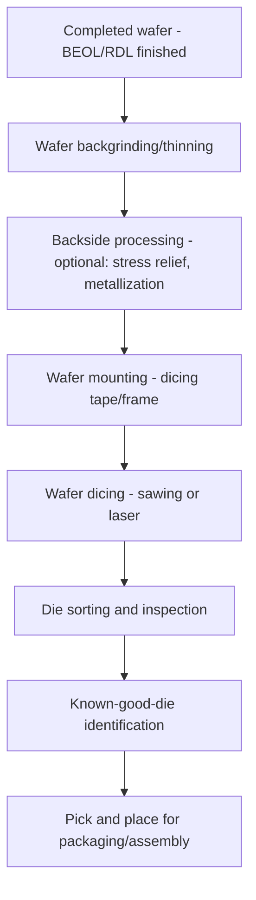

## Wafer Dicing and Die Preparation

### Overview

Wafer dicing and die preparation encompass the sequence of back-end processes that separate a fully fabricated wafer into individual dies and prepare those dies for downstream assembly and packaging. This stage forms the critical transition between front-end/BEOL wafer processing and advanced packaging or heterogeneous integration, and its process quality directly determines die edge integrity, mechanical strength, and downstream assembly yield.

### Process Sequence Overview

**Key Points**

- Following completion of wafer-level fabrication (including BEOL interconnects and any wafer-level passivation or redistribution layers), the wafer proceeds through a sequence of back-grinding, wafer mounting, dicing, and die sorting/inspection steps before individual dies are ready for pick-and-place assembly.
- The specific sequence and process selection depend heavily on the target die thickness, packaging approach (e.g., wire-bond, flip-chip, 3D stacking), and whether the design requires exposed through-silicon vias or backside processing (such as backside power delivery structures, discussed elsewhere in this course).

### Wafer Backgrinding

**Key Points**

- Wafers are typically fabricated and processed at a standard thickness (commonly several hundred micrometers) to provide sufficient mechanical rigidity during front-end processing, but many final packaging applications require substantially thinner dies to meet package height, thermal, or stacking requirements.
- Backgrinding mechanically removes material from the wafer backside (opposite the device/circuit side) using a rotating abrasive grinding wheel, progressively thinning the wafer to the target thickness, often performed in multiple stages (coarse grinding for bulk material removal, followed by fine grinding to improve surface finish and reduce subsurface damage).
- A protective film or tape is applied to the frontside (device side) of the wafer prior to backgrinding to protect circuit structures from mechanical damage and contamination during the grinding process.
- [Inference] Backgrinding-induced subsurface damage (microcracks, residual stress) at the newly exposed backside surface is a recognized concern, generally addressed through a subsequent stress-relief step (such as a chemical or plasma-based polish/etch) intended to remove damaged material and reduce the wafer's susceptibility to cracking during subsequent handling and dicing, since backgrinding process specifics vary by wafer thickness target and equipment used.

### Wafer Mounting

**Key Points**

- Prior to dicing, the thinned wafer is mounted onto a dicing tape affixed to a metal or plastic dicing frame, providing mechanical support and a stable, handleable format for the dicing process and subsequent die pick-up.
- Dicing tape adhesive properties are engineered to firmly hold dies in place during sawing or laser dicing (preventing die shift or loss) while also allowing individual dies to be cleanly released during the later pick-and-place step, often achieved through UV-curable or thermally releasable adhesive formulations that reduce adhesion strength on demand after dicing is complete.

### Dicing Methods

**Mechanical Sawing (Blade Dicing)**

- The traditional and most widely established dicing method uses a high-speed rotating diamond-impregnated blade to mechanically cut through the wafer along predefined scribe lines (streets) separating individual die.
- Blade dicing is generally reported as a mature, cost-effective, high-throughput process for conventional wafer thicknesses and die sizes, though it introduces mechanical stress and can generate chipping or microcracking along the cut edge, which becomes an increasing concern as die thickness decreases and die edge strength requirements tighten.
- Water-based cooling and debris removal (typically continuous water jet cooling during the saw cut) is standard to manage heat generation and remove cutting debris.

**Laser Dicing**

- Laser dicing uses a focused laser beam to either fully or partially cut through the wafer, or to create a subsurface modification layer (stealth dicing) that weakens the material along the intended dicing street, allowing subsequent mechanical separation (e.g., via tape expansion) with reduced mechanical stress compared to full-depth blade sawing.
- [Inference] Laser-based dicing approaches are generally reported in the industry as advantageous for thin wafers, narrow dicing street widths, and die requiring higher edge-strength or reduced chipping compared to blade dicing, since laser processing can reduce or eliminate direct mechanical contact stress on the wafer during the primary cutting/modification step — though specific method selection depends on wafer material, thickness, and device layer sensitivity to laser-induced thermal or optical effects.
- **Stealth dicing** in particular is often cited as producing minimal surface debris and reduced chipping since the laser modification occurs beneath the wafer surface, with final die separation performed by a subsequent mechanical expansion step rather than direct laser-through cutting.

**Plasma Dicing**

- Plasma dicing uses a masked plasma etch process to separate dies, offering the potential for very narrow dicing streets (maximizing usable die area per wafer) and minimal mechanical stress, since material removal occurs via a chemical/physical etch mechanism rather than mechanical or thermal cutting.
- [Unverified] Plasma dicing adoption is generally described in industry sources as more specialized or limited compared to blade and laser dicing, often associated with specific die geometries (e.g., very small or irregularly shaped die) or applications where dicing street width minimization is a priority; current adoption breadth and typical use cases should be verified against up-to-date process literature.

| Dicing Method | Mechanism | Key Reported Advantages | Key Reported Limitations |
| --- | --- | --- | --- |
| Blade sawing | Mechanical abrasive cutting | Mature, high-throughput, cost-effective | Mechanical stress, edge chipping risk |
| Laser (full-cut) | Direct laser ablation cutting | Reduced mechanical contact stress | Potential thermal effects near cut edge |
| Laser (stealth) | Subsurface modification + mechanical separation | Minimal surface debris, reduced chipping | Requires subsequent separation step |
| Plasma dicing | Masked chemical/physical etch | Narrow streets, low mechanical stress | More specialized/limited adoption |

### Die Edge Quality and Mechanical Strength

**Key Points**

- Die edge integrity — freedom from chipping, microcracking, and subsurface damage along the cut edge — is a significant factor in die mechanical strength and downstream reliability, since edge defects can act as crack-initiation sites under subsequent handling, assembly, or operational mechanical/thermal stress.
- [Inference] As die thickness decreases (driven by increasingly aggressive backgrinding for thin-package or stacked-die applications), die edge strength requirements generally become more stringent, since thinner die are inherently more susceptible to cracking from a given edge defect size — this relationship is widely cited as a key driver behind the industry's continued development of lower-stress dicing methods (laser stealth dicing, plasma dicing) as alternatives or supplements to conventional blade sawing for thin-die applications.

### Die Sorting and Inspection

**Key Points**

- Following dicing, individual die undergo optical and/or electrical inspection to identify defective die (from wafer-level test results, visual defect inspection, or in-line dicing-induced damage detection) before proceeding to packaging assembly.
- **Known-good-die (KGD)** identification — confirming that a die has passed both wafer-level electrical test and post-dicing physical inspection — is particularly critical for advanced packaging approaches involving multiple die in a single package (such as 2.5D/3D heterogeneous integration), since a single defective die in a multi-die package can compromise the entire assembly, making pre-assembly die quality verification disproportionately important compared to single-die packaging.
- Automated optical inspection systems are commonly used to detect visible dicing-induced defects (chipping, cracks) at the die edge, complementing electrical test data gathered during wafer-level probing.

### Die Pick-and-Place Preparation

**Key Points**

- After dicing and sorting, the dicing tape is typically expanded (stretched) to increase spacing between adjacent die, facilitating individual die pick-up by automated pick-and-place equipment while reducing the risk of adjacent die contact or damage during removal.
- Die pick-up methods (e.g., vacuum collet, needle ejection from beneath the tape) must be compatible with the specific die thickness and tape adhesive release characteristics established during wafer mounting, and are selected to minimize mechanical stress on thin, fragile die during the transfer to packaging assembly equipment.

### Relevance to Advanced Packaging and Heterogeneous Integration

**Key Points**

- The quality and precision of wafer dicing and die preparation directly influence the feasibility and yield of downstream advanced packaging techniques, since 2.5D/3D heterogeneous integration approaches often require tighter die dimensional tolerances, thinner die, and higher edge-strength die than conventional single-die packaging.
- [Unverified] Specific dicing method selection, target die thickness, and inspection criteria for a given advanced packaging flow are highly application- and manufacturer-specific, and should be verified against the specific packaging technology and product requirements under consideration rather than assumed to follow a single universal process flow.

**Next Steps**

- Backgrinding stress-relief and subsurface damage mitigation techniques
- Stealth dicing process parameters and separation methods
- Plasma dicing mask and etch chemistry details
- Known-good-die test methodologies for multi-die packages
- Die pick-and-place equipment and thin-die handling techniques
- Dicing street width minimization for advanced packaging density