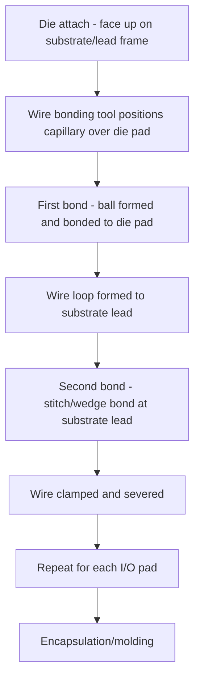
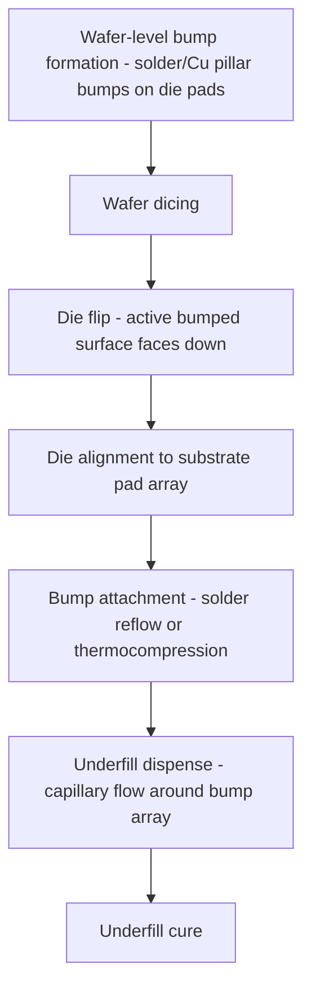

## Wire Bonding and Flip Chip Assembly

### Overview

Wire bonding and flip chip assembly are the two foundational die-to-package interconnection methods used to establish electrical connections between a semiconductor die and its package substrate or lead frame. They represent fundamentally different architectural approaches — wire bonding connects die pads to package leads using fine wire loops from the die's top (active) surface, while flip chip inverts the die and connects it face-down directly to the substrate through an array of solder or metallic bumps — with significant implications for electrical performance, package density, and thermal management.

### Wire Bonding

**Process Overview**

- The die is mounted (die-attached) face-up onto a package substrate or lead frame using an adhesive (epoxy or solder die-attach material), with the active circuit side facing away from the substrate.
- Fine wires (traditionally gold, though copper and silver alloys are also widely used) are bonded individually between bond pads on the die's periphery and corresponding leads or pads on the package substrate, forming an arched wire loop between each pair of connection points.
- Bonding is performed using thermosonic, thermocompression, or ultrasonic bonding techniques, in which a combination of heat, pressure, and (for thermosonic/ultrasonic methods) ultrasonic vibration forms a solid-state metallurgical bond between the wire and the pad metallization at each end.

**Key Bonding Techniques**

- **Ball bonding**: a wire is fed through a capillary tool, melted at the tip via electronic flame-off to form a small ball, then bonded to the die pad (first bond) under heat, pressure, and ultrasonic energy; the wire is then looped to the substrate lead and bonded there (second bond, typically a "stitch" or wedge-type bond) before the wire is clamped and severed to complete the connection.
- **Wedge bonding**: both the first and second bonds are formed as wedge-shaped bonds without an intermediate ball formation step, generally associated with aluminum wire bonding and applications where a lower bond-loop profile or different pad geometry is required.
- [Inference] Ball bonding using gold or copper wire is generally described as the dominant technique for high-volume, fine-pitch semiconductor packaging due to its compatibility with automated high-speed bonding equipment and fine bond-pad pitch, while wedge bonding retains use in specific applications (such as certain power device or aluminum-pad-compatible packages) where its particular bond geometry or wire material is advantageous.

**Wire Material Considerations**

- Gold wire has historically been the dominant bonding wire material due to favorable oxidation resistance, ball-formation characteristics, and bonding process maturity, though its cost has motivated substitution with lower-cost alternatives in high-volume applications.
- Copper wire bonding offers lower material cost and, [Inference] generally reported in the literature as providing improved electrical and thermal conductivity compared to gold, though copper's greater hardness and susceptibility to oxidation relative to gold have required process refinements (such as inert bonding atmospheres to prevent oxidation, and adjusted bonding parameters to manage the increased risk of pad or die damage from the harder wire material during bonding) for reliable high-volume adoption.

**Electrical and Performance Characteristics**

- Wire bonds introduce parasitic inductance and resistance associated with the wire loop length and geometry, which becomes an increasingly significant factor for high-frequency or high-speed signal applications as wire loop inductance can degrade signal integrity at sufficiently high switching speeds.
- [Inference] This parasitic inductance limitation is widely cited as a key motivation for flip chip adoption in performance-sensitive applications, since flip chip's substantially shorter interconnection path (discussed below) generally provides lower parasitic inductance and resistance compared to a wire bond loop of comparable die-to-substrate distance.

### Flip Chip Assembly

**Process Overview**

- Rather than wire bonding from the die's top surface, flip chip assembly forms an array of conductive bumps (solder, copper pillar, or other metallic bump structures) directly on the die's bond pads while the die is still in wafer form, as part of wafer-level bumping processing prior to dicing.
- After dicing, the die is flipped (inverted) so its active, bumped surface faces downward, then aligned and placed face-down onto matching pads on the package substrate, with electrical and mechanical connection formed by reflowing (melting and resolidifying) the solder bumps or by thermocompression bonding of the bump structures to the substrate pads.
- An underfill material (typically an epoxy-based encapsulant) is commonly dispensed into the gap between the die and substrate after bump attachment, flowing by capillary action to fill the space around the bump array, providing mechanical reinforcement and stress distribution to protect the bump interconnections from thermal and mechanical stress during subsequent operation.

(svg_diagram)

<svg xmlns="http://www.w3.org/2000/svg" viewBox="0 0 640 260">

<title>Wire Bond vs Flip Chip Cross-Section Comparison (svg_diagram)</title>
<rect width="640" height="260" fill="#ffffff" />

<text x="40" y="30" font-size="13" font-weight="bold" fill="`#1a1a1a`">Wire Bond</text>

<rect x="40" y="150" width="560" height="10" fill="`#909090`" />

<rect x="80" y="100" width="120" height="50" fill="`#c0c0c0`" stroke="#333" />

<text x="90" y="90" font-size="10" fill="#333">Die (active side up)</text>

<path d="M 90 100 Q 60 60 40 150" stroke="`#c08030`" stroke-width="2" fill="none" />

<path d="M 190 100 Q 220 60 250 150" stroke="`#c08030`" stroke-width="2" fill="none" />

<text x="30" y="175" font-size="9" fill="#333">Substrate</text>

<text x="380" y="30" font-size="13" font-weight="bold" fill="`#1a1a1a`">Flip Chip</text>

<rect x="380" y="150" width="240" height="10" fill="`#909090`" />

<rect x="400" y="170" width="200" height="50" fill="`#c0c0c0`" stroke="#333" />

<text x="405" y="235" font-size="10" fill="#333">Die (active side down)</text>

<circle cx="420" cy="165" r="5" fill="`#c08030`" />

<circle cx="460" cy="165" r="5" fill="`#c08030`" />

<circle cx="500" cy="165" r="5" fill="`#c08030`" />

<circle cx="540" cy="165" r="5" fill="`#c08030`" />

<circle cx="580" cy="165" r="5" fill="`#c08030`" />

<text x="380" y="140" font-size="9" fill="`#c08030`">Bump array (short vertical path)</text>

</svg>

### Comparative Analysis

| Characteristic | Wire Bonding | Flip Chip |
| --- | --- | --- |
| Die orientation | Face-up | Face-down |
| Interconnect geometry | Peripheral, wire loop from die edge | Area-array bumps across full die surface |
| I/O density potential | Limited by die perimeter and bond pad pitch | Higher — area-array not limited to perimeter |
| Parasitic inductance/resistance | Higher (wire loop length) | Lower (short vertical bump connection) |
| Package height | Generally taller (wire loop clearance required) | Generally lower profile |
| Thermal path | Heat typically extracted through die backside (upward-facing) | Heat path more complex — active side faces substrate, often addressed via substrate/interposer thermal design |
| Process maturity/cost | Highly mature, cost-effective for many applications | Requires wafer-level bumping and underfill process, generally higher process complexity |
| I/O count scalability | Constrained by achievable bond pad pitch around die perimeter | Well suited to high-I/O-count, fine-pitch applications |

### I/O Density and Area-Array Advantage

**Key Points**

- Because wire bonding connections must originate from bond pads along the die periphery, achievable I/O count is fundamentally constrained by die perimeter length and minimum achievable bond pad pitch, creating a practical upper limit on I/O density that becomes increasingly restrictive as die shrink or I/O requirements grow.
- Flip chip's area-array bump arrangement distributes connections across the entire die surface rather than only the perimeter, substantially increasing achievable I/O density for a given die size — [Inference] this area-array advantage is widely cited as a primary driver for flip chip adoption in high-pin-count applications such as high-performance processors and complex system-on-chip devices, where wire bonding's perimeter-limited I/O density would be insufficient.

### Thermal Management Considerations

**Key Points**

- In wire-bonded packages, the die's backside (opposite the active circuitry) faces away from the substrate and is often directly exposed or attached to a thermal spreader/heat sink, providing a relatively direct thermal path for heat removal from the bulk of the die.
- In flip chip packages, the active (and typically hottest) side of the die faces the substrate rather than the ambient/heat-sink side, meaning [Inference] thermal management in flip chip assemblies generally requires more deliberate design consideration — such as through-silicon-via or substrate-integrated thermal paths, or a secondary heat spreader attached to the die's now-exposed backside — to effectively extract heat from the active circuit layer, representing a widely cited trade-off against flip chip's electrical and density advantages.

### Underfill and Reliability

**Key Points**

- The underfill material dispensed around flip chip bump arrays serves a critical reliability function: it redistributes mechanical stress from coefficient-of-thermal-expansion (CTE) mismatch between the die and substrate across the entire bump array area, rather than concentrating stress on individual bumps, substantially improving resistance to thermal cycling fatigue failure.
- [Unverified] Without adequate underfill, flip chip bump interconnections are generally reported in the literature as more susceptible to fatigue cracking under thermal cycling due to CTE mismatch stress concentration at individual bumps; specific reliability improvement figures attributable to underfill are process- and material-specific and should be verified against dedicated reliability qualification data for a given package design.
- Wire bonds, by contrast, have inherent compliance in their arched loop geometry that provides a degree of mechanical stress accommodation without requiring an equivalent underfill step, though wire bond packages have their own distinct reliability considerations (e.g., wire sweep during molding, bond pad adhesion).

### Relevance to Heterogeneous Integration

**Key Points**

- Flip chip's area-array, low-profile interconnection approach is generally regarded as more readily adaptable to advanced packaging architectures involving multiple die (2.5D/3D integration, chiplet-based designs), since its short vertical connection path and high I/O density are well suited to the dense, high-bandwidth die-to-die or die-to-interposer connections such architectures require.
- Wire bonding remains in wide use for applications where its cost-effectiveness, process maturity, and adequate I/O density and electrical performance for the specific application are sufficient, and the choice between wire bonding and flip chip (or combinations within a single package) is generally an application-specific engineering and cost trade-off rather than a strict technological succession from one to the other.

**Next Steps**

- Wafer-level bumping process details (solder bump, copper pillar formation)
- Underfill material selection and dispense process optimization
- Copper wire bonding process refinements and oxidation control
- Thermal management strategies for flip chip packages
- Combined wire-bond and flip-chip integration in multi-die packages
- Bump pitch scaling and area-array interconnect density trends