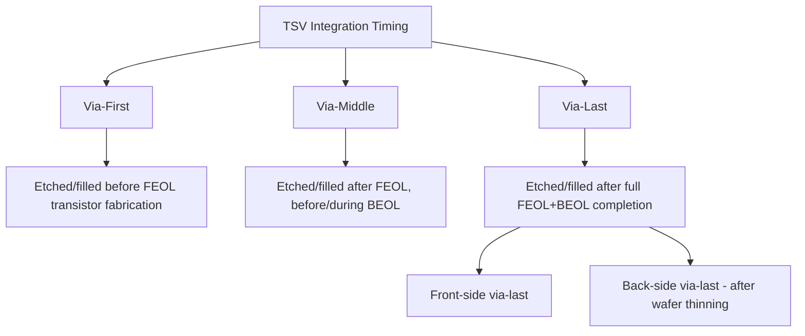
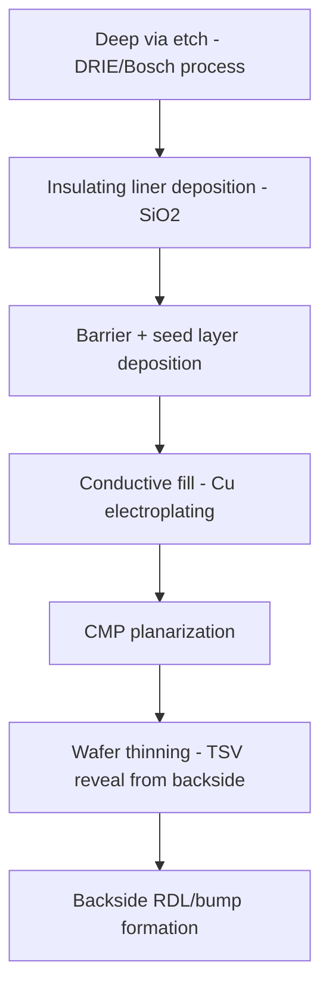

## Through Silicon Via Formation

### Overview

Through-silicon via (TSV) formation is the process of creating vertical electrical connections that pass completely or partially through a silicon die or wafer, enabling direct electrical interconnection between stacked die layers or between a die's front and back surfaces. TSVs are a foundational enabling technology for 3D die stacking, backside power delivery (discussed elsewhere in this course), and high-density heterogeneous integration, providing substantially shorter and lower-parasitic vertical interconnect paths compared to conventional wire-bond or lateral routing approaches.

### TSV Process Integration Approaches

TSVs are classified by the process stage at which they are formed relative to front-end transistor fabrication and back-end interconnect processing:

**Via-First**

- TSVs are etched and filled before front-end-of-line (FEOL) transistor fabrication begins, directly into the bare silicon substrate.
- [Inference] This approach is generally reported as requiring TSV fill materials and processes compatible with subsequent high-temperature FEOL thermal processing, which constrains material choice (favoring materials such as doped polysilicon that can withstand FEOL thermal budgets) compared to via-middle or via-last approaches where TSV formation occurs after high-temperature steps are complete.

**Via-Middle**

- TSVs are etched and filled after FEOL transistor fabrication is complete but before or during back-end-of-line (BEOL) interconnect processing.
- This timing allows use of copper as the TSV fill metal (since the highest-temperature FEOL steps are already complete, avoiding copper contamination or thermal budget concerns that would arise if copper TSVs were exposed to full FEOL thermal processing), while still integrating the TSV formation within the wafer-level process flow prior to dicing.
- [Inference] Via-middle is widely described in the literature as a commonly adopted approach for 3D IC integration, balancing TSV electrical performance (favoring low-resistance copper fill) against manufacturing process flow practicality.

**Via-Last**

- TSVs are formed after both FEOL and BEOL processing are complete, either from the wafer's front side (etching down through the completed interconnect stack and substrate) or from the backside (after wafer thinning, etching from the backside up to contact frontside structures — closely related to the backside via processing discussed under backside power delivery networks).
- Via-last approaches offer greater flexibility in process sequencing (since TSV formation is decoupled from FEOL/BEOL fabrication) but require precise alignment to pre-existing frontside structures and must accommodate the already-completed interconnect stack during via etching.

### TSV Formation Process Flow (Via-Middle, Representative)

1. **Via etch**: a deep, high-aspect-ratio via is etched into the silicon substrate, typically using deep reactive-ion etching (DRIE), often employing the Bosch process (alternating isotropic etch and passivation deposition cycles) to achieve the necessary combination of etch depth, sidewall verticality, and aspect ratio control required for TSV geometries.
2. **Liner/insulation deposition**: an insulating liner (typically $SiO_2$, deposited via PECVD or a similar conformal technique) is deposited on the via sidewall to electrically isolate the subsequent conductive fill from the surrounding silicon substrate, since silicon itself is a semiconductor and would otherwise create unwanted electrical leakage paths or parasitic coupling between the TSV and active device structures.
3. **Barrier/seed layer deposition**: a diffusion barrier (analogous in function to the barrier layers used in conventional copper interconnects, discussed under diffusion barrier and seed layers) and a conductive seed layer are deposited conformally on the insulated via sidewall and bottom, using techniques suited to the via's high aspect ratio (such as PVD, ALD, or a combination, similar to considerations discussed for scaled interconnect vias).
4. **Conductive fill**: the via is filled with a conductive material, most commonly copper via electroplating, though tungsten and doped polysilicon are also used in specific TSV applications (particularly via-first schemes requiring high-temperature compatibility).
5. **CMP/planarization**: excess fill material and barrier/seed layer on the wafer surface are removed by chemical-mechanical polishing, planarizing the surface for subsequent processing.
6. **Wafer thinning (for TSV reveal)**: if the TSV is not etched all the way through the final wafer thickness at formation time, the wafer is thinned from the backside until the bottom of the filled via is exposed ("revealed"), a step closely related to the extreme wafer thinning discussed under wafer dicing and die preparation and under backside power delivery networks.
7. **Backside connection formation**: backside redistribution layers, bumps, or additional metallization are formed to make electrical connection to the revealed TSV, enabling subsequent die stacking or backside interconnection.

### Via Etching: Deep Reactive-Ion Etching

**Key Points**

- TSV etching requires achieving high aspect ratio (via depth substantially greater than via diameter) with vertical, smooth sidewalls, which conventional isotropic or moderately anisotropic silicon etch processes cannot reliably achieve at the depths required for TSV structures.
- The Bosch process, a widely used DRIE technique, alternates between a brief isotropic silicon etch step (typically using $SF_6$ plasma chemistry) and a brief passivation deposition step (typically using a fluorocarbon such as $C_4F_8$) that coats the via sidewall with a protective polymer film, repeated over many cycles to achieve deep, highly anisotropic etching while the passivation layer protects sidewalls from lateral etching during each subsequent etch cycle.
- [Inference] This alternating etch/passivate cycling is generally reported in the literature as producing a characteristic "scalloped" sidewall profile (small periodic ridges corresponding to each etch cycle), the smoothness of which is influenced by cycle time and process parameter tuning, with sidewall roughness being a relevant consideration for subsequent liner and barrier/seed layer conformality and coverage quality.

### TSV Insulation Liner

**Key Points**

- The insulating liner is critical to prevent electrical leakage and parasitic capacitive coupling between the conductive TSV fill and the surrounding silicon substrate, which is a semiconductor and would otherwise provide an unwanted conductive or capacitively coupled path.
- Liner deposition must achieve adequate step coverage and thickness uniformity along the full depth of the high-aspect-ratio via sidewall, presenting similar conformality challenges to those discussed for barrier layer deposition in scaled interconnect vias, generally requiring PECVD or other conformal deposition techniques capable of coating deep via structures.
- [Unverified] Specific liner thickness and dielectric material choice (beyond the commonly cited $SiO_2$) can vary by TSV application (power delivery TSV vs. signal TSV vs. die-stacking TSV) and specific manufacturer process, and should be verified against process-specific literature for the application of interest.

### Copper Fill and Associated Challenges

**Key Points**

- Copper electroplating fill of high-aspect-ratio TSV structures faces similar superfill and void-avoidance challenges to those discussed under the copper dual damascene process, requiring engineered plating chemistry to achieve void-free bottom-up fill within the much deeper and higher-aspect-ratio TSV geometry.
- **Copper pumping/protrusion**: a widely reported TSV-specific reliability and process integration concern is that copper has a substantially higher coefficient of thermal expansion than silicon, so during subsequent thermal processing (or device operation), the copper fill inside the TSV can expand more than the surrounding silicon, causing the copper to protrude ("pump") from the via opening at the wafer surface — this protrusion can create mechanical stress on nearby structures or disrupt planarity for subsequent processing steps if not adequately managed.
- [Inference] Mitigation of copper pumping is generally described in the literature as involving a combination of TSV design rules (keep-out zones around TSVs to avoid placing sensitive structures too close), thermal budget management during subsequent processing, and sometimes dedicated thermal annealing steps intended to stabilize the copper microstructure before final CMP and subsequent processing, though specific mitigation approaches vary by manufacturer and TSV application.

### Aspect Ratio and Scaling Considerations

**Key Points**

- TSV diameter, depth, and resulting aspect ratio are chosen based on the target application: power delivery and die-stacking TSVs may use larger diameters (tens of micrometers) for lower resistance and higher current-carrying capacity, while high-density signal TSVs for fine-pitch 3D integration trend toward smaller diameters to maximize achievable TSV density per unit area.
- The nano-TSV structures referenced under backside power delivery networks represent a further scaling direction toward smaller via dimensions appropriate for direct connection to individual transistor-level structures, as opposed to larger, more traditional TSVs used for die-to-die stacking interconnects.
- [Unverified] Specific TSV diameter, pitch, and aspect ratio figures vary considerably by application (power TSV vs. signal TSV vs. nano-TSV) and by manufacturer process generation; general figures should be verified against application-specific literature rather than treated as universal.

### Reliability Considerations

**Key Points**

- Beyond copper pumping, TSV reliability considerations include liner integrity (a compromised or thin liner can create leakage paths or reduced breakdown voltage margin), thermomechanical stress from CTE mismatch between the copper fill, insulating liner, and surrounding silicon (which can propagate stress into nearby active device regions if TSV keep-out design rules are not properly followed), and electromigration within the TSV fill under high current density conditions (particularly relevant for power-delivery TSVs), following similar underlying physical principles to the electromigration mechanisms discussed under electromigration and interconnect reliability.
- [Unverified] Quantitative TSV reliability figures (stress-induced keep-out zone dimensions, electromigration current density limits for TSV structures) are process- and design-specific and are typically established through dedicated reliability qualification testing rather than derived from general principles; specific figures should be verified against process-specific qualification data.

### Relevance to Heterogeneous Integration

TSVs are a core enabling technology for 2.5D and 3D heterogeneous integration architectures, providing the vertical electrical pathways needed for die-to-die stacking, interposer-based multi-die packages, and backside power delivery structures, connecting to the broader packaging and integration topics addressed throughout this chapter.

**Next Steps**

- Deep reactive-ion etching (Bosch process) parameter optimization
- Copper pumping/protrusion mitigation and keep-out design rules
- TSV reveal and backside redistribution layer processing
- Via-first vs. via-middle vs. via-last process trade-off analysis
- Nano-TSV scaling for backside power delivery applications
- TSV electromigration and thermomechanical reliability qualification