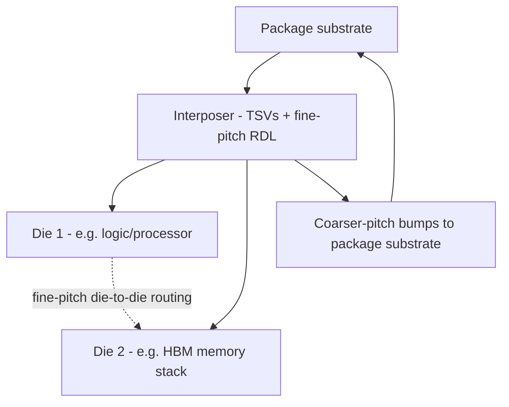
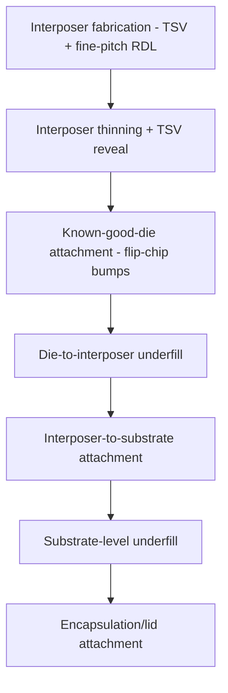

## 2.5D Interposer Packaging

### Overview

2.5D interposer packaging is an advanced packaging architecture in which multiple die are mounted side-by-side on a common intermediate substrate — the interposer — which provides high-density, fine-pitch electrical routing between the die and connects the assembly to the package substrate below. It occupies an intermediate position between conventional 2D side-by-side packaging (where die are placed directly on a package substrate with comparatively coarse routing) and true 3D die stacking (where die are vertically stacked and directly interconnected through TSVs), providing many of 3D integration's density and performance benefits while retaining a largely planar die arrangement.

### Architectural Concept

**Key Points**

- In a 2.5D architecture, two or more die are placed side-by-side (rather than vertically stacked) on top of a passive or active interposer layer, which sits between the die and the package substrate.
- The interposer provides a high-density redistribution layer with much finer wiring pitch than is achievable on a conventional organic package substrate, enabling the fine-pitch, high-bandwidth die-to-die connections required for applications such as high-bandwidth-memory-to-processor interconnection.
- Through-silicon vias (discussed elsewhere in this course) typically pass through the interposer to connect the fine-pitch top-side routing to coarser-pitch bump connections on the interposer's underside, which then connect to the package substrate and, ultimately, to the system board.

(svg_diagram)

<svg xmlns="http://www.w3.org/2000/svg" viewBox="0 0 640 280">

<title>2.5D Interposer Packaging Cross-Section (svg_diagram)</title>
<rect width="640" height="280" fill="#ffffff" />

<rect x="60" y="220" width="520" height="30" fill="#c08030" stroke="#333" />
<text x="260" y="240" font-size="11" fill="#fff">Package Substrate</text>

<circle cx="120" cy="215" r="4" fill="#909090" />
<circle cx="180" cy="215" r="4" fill="#909090" />
<circle cx="240" cy="215" r="4" fill="#909090" />
<circle cx="400" cy="215" r="4" fill="#909090" />
<circle cx="460" cy="215" r="4" fill="#909090" />
<circle cx="520" cy="215" r="4" fill="#909090" />

<rect x="80" y="150" width="480" height="60" fill="#d0e0f0" stroke="#2060c0" />
<text x="90" y="145" font-size="11" fill="#2060c0">Interposer (TSVs + fine-pitch RDL)</text>
<line x1="120" y1="150" x2="120" y2="210" stroke="#2060c0" stroke-width="2" />
<line x1="240" y1="150" x2="240" y2="210" stroke="#2060c0" stroke-width="2" />
<line x1="400" y1="150" x2="400" y2="210" stroke="#2060c0" stroke-width="2" />
<line x1="520" y1="150" x2="520" y2="210" stroke="#2060c0" stroke-width="2" />

<rect x="100" y="90" width="150" height="60" fill="#a0c0e0" stroke="#333" />
<text x="110" y="85" font-size="10" fill="#333">Logic Die</text>

<rect x="380" y="90" width="150" height="60" fill="#e0b080" stroke="#333" />
<text x="390" y="85" font-size="10" fill="#333">Memory Die (e.g. HBM)</text>

<circle cx="120" cy="155" r="3" fill="#c04040" />
<circle cx="150" cy="155" r="3" fill="#c04040" />
<circle cx="180" cy="155" r="3" fill="#c04040" />
<circle cx="210" cy="155" r="3" fill="#c04040" />
<circle cx="400" cy="155" r="3" fill="#c04040" />
<circle cx="430" cy="155" r="3" fill="#c04040" />
<circle cx="460" cy="155" r="3" fill="#c04040" />
<circle cx="490" cy="155" r="3" fill="#c04040" />
</svg>

### Interposer Types

**Silicon Interposer**

- Fabricated from a silicon substrate using processes closely related to conventional semiconductor BEOL fabrication (fine-pitch redistribution layer formation) and TSV processing (discussed elsewhere in this course), enabling very fine wiring pitch comparable to or approaching on-die interconnect dimensions.
- [Inference] Silicon interposers are generally described in the literature as offering the finest achievable routing pitch and best electrical performance (lowest parasitic resistance/capacitance for die-to-die signals) among interposer material choices, at the cost of higher manufacturing cost relative to organic interposer alternatives, since silicon interposer fabrication draws on semiconductor-grade process equipment and materials rather than lower-cost organic substrate manufacturing.

**Organic Interposer**

- Fabricated using organic substrate materials and processes more closely related to conventional printed circuit board or package substrate manufacturing, generally offering lower cost and larger achievable panel/substrate size compared to silicon interposers, at the cost of coarser achievable routing pitch.
- [Unverified] The specific routing pitch and performance gap between organic and silicon interposers continues to narrow with advances in organic substrate fine-line manufacturing, and current comparative capabilities should be verified against up-to-date packaging industry literature rather than assumed fixed.

**Active Interposer**

- Unlike passive interposers (which provide routing and TSV connections only, with no active transistor circuitry), an active interposer incorporates functional transistor circuitry within the interposer layer itself — such as power management, signal buffering, or other supporting logic — in addition to its routing and TSV functions.
- [Unverified] Active interposer adoption and specific functional integration approaches are an evolving area of packaging architecture, and current adoption breadth relative to passive interposers should be verified against current industry literature for the specific application and manufacturer context of interest.

| Interposer Type | Routing Pitch | Relative Cost | Notes |
| --- | --- | --- | --- |
| Silicon | Finest | Higher | Leverages semiconductor-grade fabrication |
| Organic | Coarser (narrowing gap) | Lower | PCB/substrate-industry-derived manufacturing |
| Active | Varies by design | Application-dependent | Incorporates functional circuitry, not just routing |

### Key Application: High-Bandwidth Memory Integration

**Key Points**

- One of the most widely cited applications of 2.5D interposer packaging is the integration of high-bandwidth memory (HBM) stacks alongside a processor or accelerator die, where the interposer's fine-pitch routing enables the very wide, high-bandwidth parallel data bus required between the memory stack and the compute die — a connection density that would be impractical to achieve using conventional package substrate routing alone.
- [Inference] This HBM-to-processor use case is generally described in industry literature as a primary driver for 2.5D interposer adoption in high-performance computing and AI accelerator applications, where memory bandwidth is a critical system performance bottleneck that 2.5D integration directly addresses by shortening and widening the memory interconnect path compared to conventional off-package memory connections.

### Process Flow Overview

1. **Interposer fabrication**: the interposer wafer is processed to form TSVs, fine-pitch redistribution layers, and bump pads, using semiconductor or advanced-substrate fabrication techniques appropriate to the interposer material type.
2. **Interposer wafer thinning and TSV reveal**: similar to the wafer thinning and TSV reveal processes discussed under through-silicon via formation and wafer dicing and die preparation.
3. **Die attachment to interposer**: individual known-good die (see wafer dicing and die preparation for KGD concepts) are aligned and bonded to the interposer's fine-pitch top-side bump pads, typically via flip-chip-style bump attachment (as discussed under wire bonding and flip chip assembly) given the fine pitch and high I/O density involved.
4. **Underfill**: an underfill material is dispensed around the die-to-interposer bump connections, analogous in function to flip chip underfill, to provide mechanical reinforcement against thermal cycling stress.
5. **Interposer-to-substrate attachment**: the assembled interposer (with die attached) is then mounted onto the package substrate via its coarser-pitch backside bump array, typically also with an underfill step at this interface.
6. **Final packaging**: encapsulation, lid attachment, and other standard package finishing steps complete the assembly.

### Thermal and Mechanical Considerations

**Key Points**

- Multiple die of potentially differing size, power density, and thermal characteristics are mounted on a shared interposer, creating thermal management complexity related to managing heat spreading across the assembly and mitigating thermal cross-talk or hotspot formation between adjacent die.
- Coefficient-of-thermal-expansion (CTE) mismatch between the die, interposer material, and package substrate is a recognized reliability consideration, following similar underlying principles to the flip chip underfill stress-mitigation discussion under wire bonding and flip chip assembly, but compounded by the presence of multiple bonded interfaces (die-to-interposer and interposer-to-substrate) in the 2.5D stack.
- [Unverified] Specific thermal and mechanical design mitigation techniques (interposer material selection, die placement optimization, thermal via density) are application- and manufacturer-specific, and general statements should be verified against current packaging design literature for the specific application of interest.

### Comparison to 3D Stacking

**Key Points**

- 2.5D interposer packaging places die side-by-side on a shared horizontal plane connected through the interposer, whereas true 3D stacking (briefly referenced here for contrast, and covered separately in this course where applicable) vertically stacks die directly on top of one another with direct die-to-die TSV connections, without an intervening interposer layer of the type described here.
- [Inference] 2.5D approaches are generally described in the literature as offering a comparatively mature, lower-risk path to achieving much of the interconnect density benefit associated with advanced heterogeneous integration, since die-to-die connections route through a separately fabricated and tested interposer layer rather than requiring direct die-to-die bonding and TSV alignment, though 3D stacking can offer further density and interconnect-length advantages where its additional process complexity is justified by application requirements.

### Relevance to Heterogeneous Integration

2.5D interposer packaging is a central architecture for heterogeneous integration, since it allows die fabricated using different process technologies, from different manufacturers, or optimized for entirely different functions (e.g., a logic die on an advanced logic node paired with a memory die on a specialized memory process) to be combined within a single package, leveraging the interposer's routing capability to bridge these otherwise incompatible die without requiring monolithic co-fabrication on a single wafer.

**Next Steps**

- Silicon interposer fabrication process details (TSV + fine-pitch RDL)
- Organic interposer fine-line manufacturing advances
- High-bandwidth memory (HBM) interconnect architecture
- Active interposer functional integration approaches
- Thermal management strategies for multi-die 2.5D assemblies
- Comparison of 2.5D versus true 3D die-stacking architectures