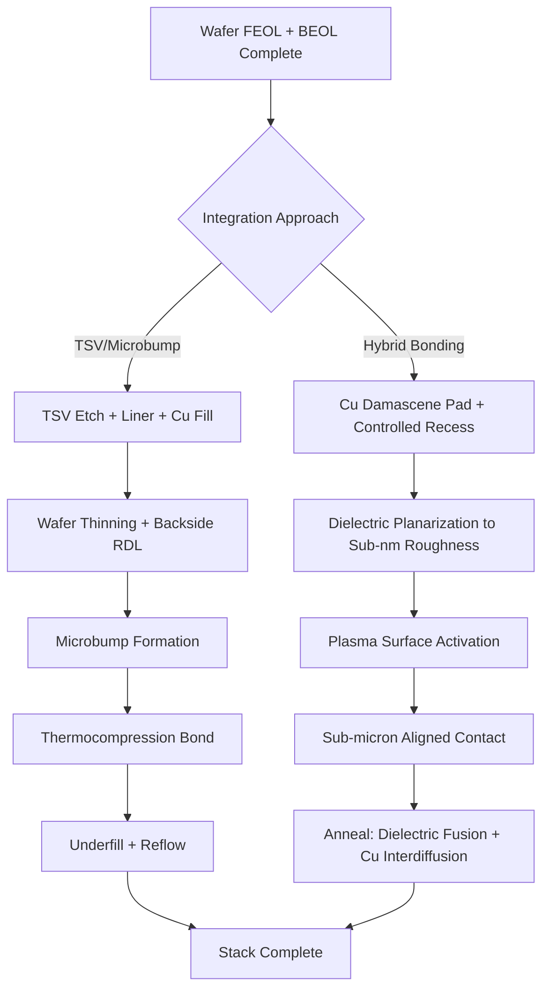

## 3D Die Stacking and Hybrid Bonding

### Overview

3D die stacking refers to the vertical integration of multiple semiconductor dies into a single package or monolithic stack, connected through short vertical interconnects rather than long lateral wires on a printed circuit board or interposer. Hybrid bonding is the dominant interconnect technology enabling the finest-pitch variant of this stacking, fusing dielectric surfaces and embedded copper pads simultaneously without solder or bumps. Together these techniques address the reticle-size limit, the memory bandwidth wall, and interconnect parasitics that limit performance in monolithic scaling (die-to-die shrink) and 2.5D approaches (interposer-based).

**Key Points**

- 3D stacking reduces interconnect length between dies from millimeters (PCB) or hundreds of microns (interposer) to single-digit microns
- Hybrid bonding achieves interconnect pitches below 10 $\mu m$, down to sub-1 $\mu m$ in research contexts, versus 30–40 $\mu m$ minimum pitch for microbump-based 3D integration
- Enables heterogeneous integration: logic-on-logic, logic-on-memory, and mixed process-node stacking within one package

---

### Motivation: Why Stack Dies Vertically

#### Reticle and Yield Limits

Monolithic die size is capped by the lithography reticle (~26mm × 33mm for ArF/EUV steppers) and by yield, since defect density scales the probability of a fatal defect with area. Splitting a large SoC into smaller "chiplets" and stacking or tiling them recovers yield economics: smaller dies have exponentially higher yield, and known-good-die (KGD) testing before assembly avoids compounding yield loss across the stack.

#### Interconnect Density and the Memory Wall

Off-package or interposer-level interconnects impose parasitic capacitance and resistance that limit bandwidth-per-watt. Hybrid-bonded 3D stacks — most visibly high-bandwidth memory (HBM) stacks and, increasingly, SRAM-on-logic cache stacking (e.g., AMD's V-Cache-class designs) — shorten the signal path from millimeters to microns, cutting interconnect energy per bit substantially and allowing far higher I/O density per unit area than any wirebond or flip-chip approach.

**Example**

A through-silicon-via (TSV) interconnect might have a pitch around 40–50 $\mu m$ and length of 50–100 $\mu m$ through bulk silicon, whereas a hybrid-bonded interconnect has pitch below 10 $\mu m$ and vertical length under 1 $\mu m$ (just the bonded pad thickness plus barrier layers), giving roughly two orders of magnitude improvement in interconnect density.

---

### Taxonomy of 3D Integration Approaches

#### Package-Level Stacking (Wirebond/PoP)

Package-on-package and wirebonded stacked die (common in NAND flash and mobile memory) connect dies through wirebonds or through-mold vias. Pitches are coarse (>100 $\mu m$), bandwidth is limited, but cost is low and process maturity is high. [Inference] This category is being displaced in high-performance applications but remains dominant for cost-sensitive memory stacking.

#### TSV-Based 3D Integration (Microbump)

Through-silicon vias etch vertical conductive paths through the silicon substrate, connecting front-side metal to back-side redistribution layers (RDL), which then join adjacent dies via microbumps (typically Cu-Sn or Cu pillar with solder cap).

**Process Flow (TSV Middle/Via-Middle)**

1. TSV etch (deep reactive ion etching, Bosch process) after front-end-of-line (FEOL) transistor formation, before back-end-of-line (BEOL) metallization
2. Liner deposition (SiO2 insulation) and barrier/seed deposition (Ta/TaN, Cu seed)
3. Cu electroplating fill of the via
4. Chemical-mechanical polishing (CMP) to remove overburden
5. BEOL metal stack completion
6. Wafer thinning (backgrinding) to expose TSV from the back side, typically to 50 $\mu m$ or less
7. Backside RDL and microbump formation
8. Die singulation and stacking with thermocompression bonding

TSVs introduce keep-out zones (KOZ) around each via due to thermomechanical stress from the copper-silicon coefficient of thermal expansion (CTE) mismatch, which restricts transistor placement nearby and consumes die area. [Unverified] Typical KOZ radii are reported in the range of several microns to tens of microns depending on TSV diameter and liner design; exact values are process-node and vendor dependent.

#### Hybrid Bonding (Direct Bond Interconnect)

Hybrid bonding fuses two dielectric surfaces (typically SiO2 or a low-k variant) at the wafer or die level while simultaneously joining embedded copper pads, forming a bond that is both mechanically monolithic (dielectric-to-dielectric) and electrically continuous (Cu-to-Cu) without any intervening solder or bump material.

---

### Hybrid Bonding Process Flow

#### Surface Preparation

1. **Cu Damascene Recess**: Copper pads are formed via damascene processing and then intentionally recessed 2–10 nm below the surrounding dielectric surface using controlled CMP, because copper will expand more than the dielectric during subsequent anneal
2. **Surface Planarization**: Dielectric surface must achieve sub-nanometer roughness (typically <0.5 nm RMS) since bond quality is extremely sensitive to topography
3. **Surface Activation**: Plasma activation (commonly N2 or O2 plasma) modifies the dielectric surface chemistry to promote covalent bond formation at lower temperatures
4. **Cleaning**: Wet clean or deionized water rinse removes particles; particle-induced voids are a primary yield detractor since a single sub-micron particle can create a bond void spanning many bond pads

#### Bonding Sequence

1. **Alignment**: Wafer-to-wafer (W2W) or die-to-wafer (D2W) alignment using infrared or optical fiducials, achieving sub-micron overlay accuracy (typically <500 nm, with leading-edge targets under 200 nm)
2. **Initial Contact / Pre-bond**: Room-temperature contact initiates spontaneous dielectric-dielectric bonding via van der Waals forces and hydrogen bonding, propagating as a bonding wave across the interface
3. **Anneal**: Thermal anneal (typically 200–400°C) drives two simultaneous mechanisms:
   - Dielectric surfaces form covalent Si-O-Si bonds as residual water byproducts diffuse out
   - Copper pads expand across the initial gap (closing the intentional recess) and interdiffuse, forming a continuous metallic grain structure across the former interface

**Key Points**

- Wafer-to-wafer hybrid bonding offers the highest throughput and finest pitch (sub-2 $\mu m$ demonstrated in HBM and image sensor applications) but requires matched die sizes and full-wafer yield alignment
- Die-to-wafer hybrid bonding allows known-good-die selection before bonding, improving stack yield at the cost of lower throughput and typically coarser pitch (still well below microbump pitch)
- Void-free bonding requires particle counts and topography control far more stringent than standard flip-chip processes

---

### Comparison: Microbump vs. Hybrid Bonding

| Parameter | TSV/Microbump | Hybrid Bonding |
| --- | --- | --- |
| Typical pitch | 30–50 $\mu m$ | <10 $\mu m$ (down to <1 $\mu m$ research) |
| Interconnect material | Cu pillar + solder cap | Cu-Cu direct diffusion |
| Bond mechanism | Thermocompression / reflow | Dielectric fusion + Cu diffusion |
| Underfill required | Yes (capillary or molded) | No |
| Vertical interconnect height | Tens of microns (bump + TSV) | Sub-micron (recess depth only) |
| Electromigration resistance | Limited by solder interface | [Inference] Generally favorable due to continuous grain Cu-Cu bond, though data is process- and vendor-specific |
| Thermal resistance | Higher (bump + underfill) | Lower (direct dielectric/metal contact) |

---

### Thermal and Mechanical Design Challenges

#### Thermal Dissipation

Stacking active dies vertically concentrates heat flux, since heat generated in an upper die must traverse the bonded stack to reach a heat sink, typically located below or beside the stack depending on orientation. Hotspot-to-hotspot thermal coupling between vertically adjacent dies (e.g., a logic die directly beneath a memory die) can cause localized temperature excursions that affect both performance (DRAM refresh rate, leakage current) and reliability.

**Example**

In logic-on-logic 3D stacks, designers commonly place the higher-power die (base logic) at the bottom, closest to the package substrate and heat sink, and thermally-sensitive or lower-power die (cache, I/O) above it, though [Speculation] optimal placement is workload- and package-dependent and varies by vendor implementation.

#### Thermomechanical Stress

CTE mismatch between silicon (~2.6 ppm/°C), copper (~17 ppm/°C), and dielectric layers generates stress during thermal cycling, which can cause:

- Delamination at the bond interface if adhesion is insufficient
- Cu pumping/protrusion if recess design is miscalibrated relative to anneal temperature
- Warpage of thinned wafers (down to tens of microns) during handling, requiring temporary bonding to carrier wafers throughout the thinning and RDL process

---

### Testing and Yield Considerations

#### Known-Good-Die (KGD) Testing

Because defects compound multiplicatively across a stack (a 4-high stack with 95% per-die yield yields approximately $0.95^4 \approx 81.5\%$ stack yield if uncorrelated), pre-bond testing at wafer or singulated-die level is essential, especially for die-to-wafer hybrid bonding where individual dies are selected before joining.

$$Y_{stack} = \prod_{i=1}^{n} Y_i$$

where $Y_i$ is the yield of die $i$ and $n$ is the number of dies in the stack, under the simplifying assumption of yield independence across dies.

#### Test Access and Built-In Self-Test

TSV-based and hybrid-bonded stacks require design-for-test (DFT) strategies adapted for 3D structures, since traditional boundary-scan assumes a single planar die. Techniques include:

- Pre-bond TSV probing (contacting exposed TSV tips before stacking)
- Post-bond structural test through the stack using dedicated test TSVs/pads
- Memory built-in self-test (MBIST) embedded per-tier for HBM-style stacks

---

### Applications

#### High-Bandwidth Memory (HBM)

HBM stacks multiple DRAM dies (currently up to 12–16 layers in recent generations) atop a base logic die using TSVs, with hybrid bonding increasingly adopted in leading-edge generations to push pitch below what microbumps allow, improving both bandwidth density and thermal resistance per layer.

#### 3D SRAM Cache Stacking

Logic-on-logic hybrid bonding is used to stack large SRAM cache dies directly atop a compute die, exemplified by industry implementations that bond an SRAM die fabricated on one process node directly onto a compute die from another node, exploiting hybrid bonding's ability to combine heterogeneous nodes without a shared substrate.

#### Image Sensors

Backside-illuminated CMOS image sensors were an early production application of wafer-to-wafer hybrid bonding, stacking a pixel array die atop a logic/readout die at fine pitch to maximize pixel fill factor while relocating readout circuitry off the optical path.

---

### Diagram: Hybrid Bonding Interconnect Cross-Section (svg_diagram)

<svg xmlns="http://www.w3.org/2000/svg" viewBox="0 0 700 420">
<rect x="0" y="0" width="700" height="420" fill="#ffffff" />
<text x="350" y="25" font-size="16" text-anchor="middle" font-family="sans-serif" font-weight="bold">Hybrid Bonding Cross-Section (svg_diagram)</text>
<rect x="100" y="60" width="500" height="120" fill="#d9d9d9" stroke="#333" stroke-width="1.5" />
<text x="350" y="55" font-size="13" text-anchor="middle" font-family="sans-serif">Top Die (thinned, TSV-connected upward)</text>
<rect x="150" y="160" width="60" height="30" fill="#c87137" stroke="#333" stroke-width="1" />
<rect x="300" y="160" width="60" height="30" fill="#c87137" stroke="#333" stroke-width="1" />
<rect x="450" y="160" width="60" height="30" fill="#c87137" stroke="#333" stroke-width="1" />
<text x="350" y="200" font-size="11" text-anchor="middle" font-family="sans-serif">Recessed Cu pads (pre-bond, 2-10 nm recess)</text>
<rect x="100" y="210" width="500" height="15" fill="#a8d5e2" stroke="#333" stroke-width="1" />
<text x="350" y="240" font-size="12" text-anchor="middle" font-family="sans-serif" font-style="italic">Dielectric-dielectric fusion interface (Si-O-Si covalent bond)</text>
<rect x="150" y="230" width="60" height="30" fill="#c87137" stroke="#333" stroke-width="1" />
<rect x="300" y="230" width="60" height="30" fill="#c87137" stroke="#333" stroke-width="1" />
<rect x="450" y="230" width="60" height="30" fill="#c87137" stroke="#333" stroke-width="1" />
<rect x="100" y="260" width="500" height="120" fill="#d9d9d9" stroke="#333" stroke-width="1.5" />
<text x="350" y="400" font-size="13" text-anchor="middle" font-family="sans-serif">Bottom Die (base logic / substrate-facing)</text>
<line x1="180" y1="160" x2="180" y2="260" stroke="#8b4513" stroke-width="2" stroke-dasharray="2,2" />
<text x="620" y="195" font-size="10" font-family="sans-serif">Cu-Cu diffusion</text>
<text x="620" y="210" font-size="10" font-family="sans-serif">after anneal</text>
<line x1="215" y1="245" x2="290" y2="245" stroke="#000" stroke-width="1" />
<text x="252" y="260" font-size="10" text-anchor="middle" font-family="sans-serif">pitch &lt;10 μm</text>
</svg>

---

### Diagram: Process Flow Comparison (Mermaid)

---

### Reliability Concerns

- **Void Formation**: Sub-micron particles trapped at the bond interface propagate as unbonded regions during anneal, detectable via scanning acoustic microscopy (SAM)
- **Cu Protrusion Mismatch**: If recess depth is not calibrated to anneal thermal budget, excessive Cu expansion causes pad-to-pad shorting or delamination at pad edges
- **Electromigration**: [Inference] Continuous-grain Cu-Cu joints formed by hybrid bonding are generally expected to exhibit improved electromigration resistance relative to solder-based interfaces, since there is no intermetallic compound boundary, though long-term qualification data across vendors is still maturing
- **Moisture and Contamination Sensitivity**: Dielectric surface activation chemistry is sensitive to ambient exposure time between activation and bonding, requiring tight fab queue-time control

---

### Next Steps

- Through-silicon via (TSV) fabrication: via-first, via-middle, via-last process comparison
- Wafer thinning and temporary bonding/debonding for ultra-thin die handling
- Chiplet interconnect standards (UCIe) and die-to-die PHY design
- 2.5D interposer integration (silicon interposer, RDL interposer, EMIB) as a contrast to true 3D stacking
- Thermal simulation and hotspot management in 3D-stacked systems
- Wafer-to-wafer vs. die-to-wafer hybrid bonding throughput and yield trade-off modeling
- Test methodologies for 3D-IC: pre-bond probing, post-bond structural test, and MBIST for stacked memory