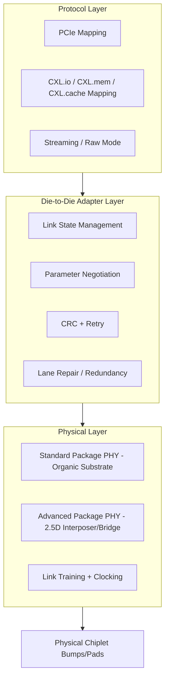

## Chiplet Architectures and Die-to-Die Interconnect Standards

### Overview

Chiplet architecture is a system design paradigm in which a single logical integrated circuit is disaggregated into multiple smaller dies ("chiplets"), each potentially fabricated on a different process node, and reassembled within one package using advanced packaging interconnects. Die-to-die (D2D) interconnect standards define the electrical PHY, protocol, and physical/mechanical conventions that allow chiplets — potentially from different vendors — to communicate as if part of a monolithic die. This decomposition addresses reticle-limited die size, yield economics, and heterogeneous process-node optimization simultaneously.

**Key Points**

- Chiplets decouple the economic and yield problems of large-die manufacturing from the architectural need for large systems
- Interoperability standards (most notably UCIe) aim to create a multi-vendor chiplet ecosystem analogous to how PCIe enabled multi-vendor board-level interoperability
- Interconnect choice trades off pitch, bandwidth density, power efficiency, and reach (die-to-die distance) against manufacturing cost and packaging complexity

---

### Motivation for Chiplet Disaggregation

#### Yield and Reticle Economics

Defect density scales with die area, so a monolithic die yield can be approximated using a Poisson or negative binomial yield model:

$$Y = \left(1 + \frac{D_0 \cdot A}{\alpha}\right)^{-\alpha}$$

where $D_0$ is defect density, $A$ is die area, and $\alpha$ is a clustering parameter. Splitting a large SoC into several smaller chiplets reduces $A$ per die, exponentially improving yield per chiplet even though more total dies must be assembled.

**Example**

A monolithic 800 $mm^2$ die versus four 200 $mm^2$ chiplets: assuming a fixed defect density, the smaller chiplets each achieve substantially higher individual yield; the aggregate system yield after accounting for known-good-die (KGD) selection and assembly yield is typically still favorable, since defective chiplets are discarded before costly integration.

#### Heterogeneous Process-Node Optimization

Not every function benefits from scaling to the most advanced node. I/O, analog, and SRAM often scale poorly or are cost-inefficient at leading nodes. Chiplet disaggregation allows:

- Compute logic on the most advanced node (e.g., N3/N2-class)
- I/O and SerDes on a mature, cost-effective node (e.g., N6/N7-class)
- Memory or cache dies stacked using hybrid bonding, potentially from an entirely separate process technology

This is sometimes termed "node optimization" or "heterogeneous integration," and it decouples the Moore's Law scaling of logic transistors from the (slower-scaling) economics of I/O and analog circuitry.

#### System Scaling Beyond Reticle Limit

Since a single die cannot exceed the lithographic reticle field (~858 $mm^2$ maximum, per ~26mm × 33mm), chiplet-based multi-die packages allow total system silicon area — and therefore transistor count — to exceed what any single die could contain, as seen in large AI accelerators combining a base die with multiple compute tiles.

---

### Interconnect Physical Layer Landscape

#### Classification by Packaging Substrate

| Interconnect Class | Substrate Type | Typical Bump/Bond Pitch | Reach |
| --- | --- | --- | --- |
| Organic substrate (flip-chip) | Laminate/organic | 100–150 $\mu m$ | Package-scale (cm) |
| Silicon interposer (2.5D) | Passive Si interposer with RDL | 40–55 $\mu m$ microbump | mm-scale |
| Fan-out RDL (InFO, RDL interposer) | Molded fan-out RDL | 20–40 $\mu m$ | mm-scale |
| Embedded bridge (EMIB-class) | Localized silicon bridge in organic substrate | ~36–55 $\mu m$ | Localized (bridge span) |
| Hybrid bonding (3D/2.5D) | Direct Cu-Cu + dielectric fusion | <10 $\mu m$ | Vertical, near-zero lateral |

#### Signaling Approaches

D2D PHYs generally fall into two categories:

- **Parallel single-ended, source-synchronous**: Very short, wide, low-latency links using simple single-ended signaling with a forwarded clock, optimized for extremely short reach (tens to a few hundred microns) achievable in 2.5D/interposer packaging
- **SerDes-based**: Higher-reach, lower pin-count links using differential signaling and equalization, used when D2D reach exceeds what simple parallel signaling supports or when compatibility with longer traces is required

[Inference] The trend across recent industry PHY generations favors ultra-short-reach parallel signaling for maximum bandwidth density and energy efficiency per bit, reserving SerDes-based D2D for longer-reach or lower-density links, though exact vendor choices vary by target application.

---

### Universal Chiplet Interconnect Express (UCIe)

#### Overview and Layered Architecture

UCIe is an open industry standard (backed by a multi-company consortium including major semiconductor, foundry, cloud, and IP vendors) defining a layered protocol stack for die-to-die interconnect, structured similarly to PCIe:

1. **Physical Layer (PHY)**: Defines the electrical signaling, bump/pad layout, clocking, and link training/initialization
2. **Die-to-Die Adapter Layer**: Handles link state management, parameter negotiation, and cyclic redundancy check (CRC)/retry mechanisms
3. **Protocol Layer**: Maps standard protocols (PCIe, CXL, or a raw streaming mode) onto the underlying PHY, allowing existing software/IP ecosystems to run over chiplet links transparently

**Key Points**

- UCIe defines two PHY variants: a **Standard Package** variant for organic substrate integration and an **Advanced Package** variant for 2.5D substrates (silicon interposer, fan-out RDL, embedded bridge)
- UCIe supports protocol mapping for PCIe and CXL, meaning existing device drivers and software stacks can, in principle, treat a chiplet link as a PCIe/CXL fabric without protocol-level changes
- The standard specifies both an electrical/physical compliance layer and a management/software discoverability layer intended to support multi-vendor chiplet marketplaces

#### UCIe Advanced Package PHY Characteristics

[Unverified] Publicly documented UCIe specification targets for the Advanced Package PHY include bump pitches around 25–55 $\mu m$ range and per-module bandwidth in the range of tens of GB/s per mm of shoreline, with successive specification revisions increasing per-pin data rate; exact figures should be verified against the current UCIe specification revision, since the standard has iterated across multiple releases.

#### Module and Lane Structure

A UCIe link is organized into "modules," each containing a cluster of data lanes plus dedicated clock, valid, and tracking lanes. Multiple modules can be aggregated to scale total link bandwidth, and the adapter layer manages per-module link training, width degradation (for fault tolerance if some lanes fail), and low-power link states.

---

### Other Notable D2D Interconnect Approaches

#### Bunch of Wires (BoW)

An Open Compute Project (OCP)-associated die-to-die PHY specification targeting simplicity and broad compatibility across substrate types (organic, interposer, bridge), using single-ended parallel signaling at moderate pitch, positioned as a lower-complexity alternative for cost-sensitive or moderate-bandwidth chiplet links. [Unverified] Specific bandwidth and pitch targets should be checked against the current OCP BoW specification revision.

#### Proprietary/Vendor-Specific D2D Links

Several large semiconductor vendors have historically developed proprietary D2D interconnects prior to or alongside UCIe standardization (used for first-party multi-chiplet products such as multi-die CPUs and GPUs). These proprietary links generally achieve competitive or superior bandwidth density and power efficiency to early-generation open standards, since they are co-designed with a single vendor's specific packaging and node roadmap, but they preclude multi-vendor chiplet mixing. [Inference] The industry trajectory suggests convergence toward open standards like UCIe for ecosystems requiring multi-vendor chiplet interoperability, while vendors retain proprietary links for internal, same-vendor multi-die products where tighter co-optimization is possible.

#### Advanced Interface Bus (AIB)

An earlier open D2D interface specification (originally developed under a DARPA-associated program and contributed to OCP) that predates UCIe and influenced its design; primarily used in interposer-based and organic-substrate chiplet demonstrations. [Unverified] Adoption in current commercial products should be verified, as UCIe has become the primary industry convergence point since its introduction.

---

### Protocol and System Architecture Considerations

#### Coherency Across Chiplets

When chiplets contain multiple compute dies that must maintain a coherent view of shared memory (e.g., multi-die CPUs), the D2D link must carry a coherency protocol, commonly by tunneling a standard coherency protocol (such as CXL.mem/CXL.cache) over the UCIe protocol layer, rather than inventing a new coherency scheme per product.

#### Test, Repair, and Redundancy

Because a chiplet-based package aggregates multiple independently-manufactured dies, D2D links must tolerate:

- **Lane redundancy**: spare lanes within a module to route around a single failed physical connection (bump/pad) without failing the entire module
- **Built-in self-test (BIST)**: per-PHY test patterns to validate link integrity at power-on and periodically during operation
- **Adaptive link training**: dynamic calibration of timing/voltage margins to compensate for process variation across dies from different fabs or lots

#### Known-Good-Die and Assembly Yield

Similar to 3D stacking, multi-chiplet packages depend on pre-assembly testing of each chiplet (KGD) since a single defective chiplet can compromise an expensive multi-die assembly. System yield can be approximated as the product of individual chiplet yields and the assembly/bonding yield:

$$Y_{package} = Y_{assembly} \times \prod_{i=1}^{n} Y_{chiplet,i}$$

---

### Design Trade-offs

**Key Points**

- **Bandwidth density vs. reach**: Ultra-short-reach parallel PHYs (UCIe Advanced Package) achieve the highest bandwidth-per-mm-of-shoreline but require tight mechanical co-location (silicon interposer, bridge, or fine-pitch RDL), while Standard Package variants trade some density for cheaper organic substrate compatibility
- **Power efficiency**: Shorter reach and simpler single-ended signaling generally yield lower energy-per-bit than longer-reach SerDes links, since drive strength and equalization complexity both scale with channel loss
- **Latency**: D2D links, especially ultra-short-reach parallel PHYs, are designed to add minimal latency overhead relative to on-die wiring, an important consideration for coherent multi-die CPU designs where cross-die memory access latency directly affects performance
- **Ecosystem interoperability vs. optimization**: A standardized PHY (UCIe) enables mixing chiplets from different vendors/foundries but constrains PHY parameters to the standard's envelope, whereas a proprietary link can be tuned precisely for one vendor's process and packaging stack at the cost of vendor lock-in

---

### Diagram: Chiplet Package Interconnect Stack (svg_diagram)

<svg xmlns="http://www.w3.org/2000/svg" viewBox="0 0 700 380">
<rect x="0" y="0" width="700" height="380" fill="#ffffff" />
<text x="350" y="25" font-size="16" text-anchor="middle" font-family="sans-serif" font-weight="bold">Chiplet Package Cross-Section (svg_diagram)</text>
<rect x="80" y="60" width="140" height="80" fill="#b3d9ff" stroke="#333" stroke-width="1.5" />
<text x="150" y="105" font-size="12" text-anchor="middle" font-family="sans-serif">Compute Chiplet A</text>
<rect x="280" y="60" width="140" height="80" fill="#b3d9ff" stroke="#333" stroke-width="1.5" />
<text x="350" y="105" font-size="12" text-anchor="middle" font-family="sans-serif">Compute Chiplet B</text>
<rect x="480" y="60" width="140" height="80" fill="#ffd9b3" stroke="#333" stroke-width="1.5" />
<text x="550" y="100" font-size="12" text-anchor="middle" font-family="sans-serif">I/O Chiplet</text>
<text x="550" y="115" font-size="10" text-anchor="middle" font-family="sans-serif">(mature node)</text>
<line x1="220" y1="100" x2="280" y2="100" stroke="#c0392b" stroke-width="3" />
<text x="250" y="90" font-size="9" text-anchor="middle" font-family="sans-serif">UCIe D2D</text>
<line x1="420" y1="100" x2="480" y2="100" stroke="#c0392b" stroke-width="3" />
<text x="450" y="90" font-size="9" text-anchor="middle" font-family="sans-serif">UCIe D2D</text>
<rect x="60" y="150" width="580" height="20" fill="#999999" stroke="#333" stroke-width="1" />
<text x="350" y="164" font-size="10" text-anchor="middle" font-family="sans-serif" fill="#fff">Silicon Interposer / RDL / Embedded Bridge (2.5D)</text>
<rect x="30" y="180" width="640" height="30" fill="#666666" stroke="#333" stroke-width="1" />
<text x="350" y="200" font-size="11" text-anchor="middle" font-family="sans-serif" fill="#fff">Organic Package Substrate</text>
<line x1="150" y1="140" x2="150" y2="150" stroke="#000" stroke-width="2" />
<line x1="350" y1="140" x2="350" y2="150" stroke="#000" stroke-width="2" />
<line x1="550" y1="140" x2="550" y2="150" stroke="#000" stroke-width="2" />
<text x="350" y="230" font-size="10" text-anchor="middle" font-family="sans-serif">Microbumps (2.5D) or hybrid-bonded pads (3D variant)</text>

<text x="350" y="260" font-size="11" text-anchor="middle" font-family="sans-serif" font-style="italic">D2D PHY: parallel short-reach (interposer) or SerDes (organic substrate)</text>

</svg>

---

### Diagram: UCIe Layered Protocol Stack (Mermaid)

---

### Comparison Summary: Chiplet Interconnect Options

| Approach | Standardization | Typical Reach | Relative Bandwidth Density | Multi-Vendor Support |
| --- | --- | --- | --- | --- |
| UCIe (Advanced Package) | Open industry standard | Sub-mm to few mm (interposer/bridge) | Very high | Yes (by design) |
| UCIe (Standard Package) | Open industry standard | mm-cm (organic substrate) | Moderate | Yes (by design) |
| BoW (OCP) | Open specification | mm-scale | Moderate | Yes |
| Proprietary vendor D2D | Closed/internal | Varies | [Inference] Often high, co-optimized | No |
| Hybrid bonding (3D) | Emerging standardization (partially covered by UCIe 3D extensions) | Vertical, near-zero lateral | Highest | Emerging |

---

### Next Steps

- UCIe protocol layer deep dive: PCIe/CXL tunneling mechanics over die-to-die links
- 2.5D silicon interposer design: passive interposer fabrication, RDL routing, and TSV-based interposer vias
- Embedded multi-die bridge packaging (localized silicon bridge in organic substrate)
- Known-good-die (KGD) test methodologies for pre-assembly chiplet screening
- Chiplet thermal co-design: multi-die floorplanning for hotspot mitigation
- Coherency protocols for multi-die CPU/accelerator systems (CXL.cache, directory-based coherence across chiplets)
- Hybrid bonding as an emerging 3D-capable D2D interconnect (cross-reference with 3D die stacking)