## Fan-Out Wafer-Level Packaging

### Overview

Fan-out wafer-level packaging (FOWLP) is an advanced packaging technology in which semiconductor dies are embedded in a reconstituted wafer (or panel) using a mold compound, then interconnected through redistribution layers (RDL) that extend fanning "out" beyond the original die footprint. This contrasts with fan-in wafer-level packaging (WLP), where all interconnects remain within the die's original area. Fan-out enables higher I/O counts than the die itself could physically accommodate, without requiring a substrate or interposer, and supports both single-die and multi-die (chiplet) integration.

**Key Points**

- FOWLP eliminates the traditional package substrate, laminate, and wirebonds, reducing package thickness, electrical parasitics, and cost at scale
- I/O density is expanded beyond the die edge by routing RDL traces into the surrounding mold compound area, allowing more/larger solder balls than fan-in WLP permits
- Two primary process families exist: die-first (chip-first) and die-last (RDL-first/chip-last), differing in process order and yield risk profile

---

### Motivation and Positioning in the Packaging Landscape

#### Why Fan-Out Exists

Traditional flip-chip ball grid array (FCBGA) packaging relies on an organic laminate substrate for fan-out routing and mechanical support, which adds thickness, cost, and electrical parasitics (longer interconnect paths, higher inductance). Fan-in WLP is substrate-free and thin but is I/O-limited by die size, since ball pitch must fit within the die's own footprint, which becomes infeasible as I/O count grows for a given die size.

FOWLP resolves this by combining substrate-free processing with substantially increased I/O routing area, since the "virtual wafer" formed by molding dies with a surrounding compound layer is larger than any individual die, allowing RDL and ball pitch to extend past the die edge.

**Example**

A die with edge length insufficient to place a required number of I/O balls at standard pitch can, in FOWLP, have its effective footprint expanded by 20–40% or more via mold compound area, providing the extra perimeter needed for the full ball count at a manufacturable pitch.

#### Position Relative to Other Advanced Packaging Approaches

| Approach | Substrate | Interconnect Type | Relative Cost | I/O Density |
| --- | --- | --- | --- | --- |
| Wirebond (traditional) | Organic laminate | Wirebond | Low | Low |
| Flip-chip BGA (FCBGA) | Organic laminate | Solder bump | Moderate | Moderate |
| Fan-in WLP | None | Direct redistribution, die-area-limited | Low | Limited by die size |
| Fan-out WLP (FOWLP) | None (mold compound "virtual wafer") | RDL fan-out + solder ball | Moderate | High |
| 2.5D silicon interposer | Passive Si interposer | TSV + microbump | High | Very high |
| 3D hybrid bonding | None (direct bond) | Cu-Cu direct bond | High | Highest |

[Inference] FOWLP is generally positioned as a cost-effective middle ground between traditional substrate-based packaging and silicon-interposer-based 2.5D integration, trading some of the ultimate bandwidth density of interposer/hybrid-bonding approaches for substantially lower cost and thinner form factor.

---

### Process Flow: Die-First (Chip-First) FOWLP

In die-first FOWLP, known-good dies are placed onto a temporary carrier before molding, and RDL is built afterward directly on top of the molded reconstituted wafer.

1. **Die Attach**: Known-good dies (KGD, tested pre-singulation) are picked and placed face-down (or face-up, depending on flow) onto a temporary carrier wafer/panel with an adhesive or release layer
2. **Molding/Encapsulation**: Epoxy mold compound is dispensed and cured around the dies, forming a "reconstituted wafer" that mechanically embeds all dies into one rigid panel
3. **Carrier Debonding**: The temporary carrier is removed (via laser release, thermal release, or mechanical peel), exposing the die active surface (die face)
4. **RDL Build-up**: One or more redistribution layers are patterned directly on the reconstituted wafer surface using photolithography, seed layer deposition (sputtered Ti/Cu), electroplating, and resist strip, connecting die pads to a fanned-out ball pattern
5. **Solder Ball Placement**: Solder balls are mounted onto RDL landing pads (under-bump metallization, UBM) to form the package's external interconnect
6. **Singulation**: The reconstituted panel/wafer is diced into individual packages

**Key Points**

- Die-first flows place RDL directly atop the die and mold compound, so RDL alignment accuracy depends on die placement accuracy during the pick-and-place step, meaning die-shift during molding (thermal expansion of mold compound during cure) is a primary yield risk
- Since RDL is built after (and depends on) die placement, a die placement or shift defect can compromise the RDL patterning for that specific package, but does not affect adjacent packages, unlike wafer-level fan-in processes

#### Die Shift Compensation

Because epoxy mold compound has a different coefficient of thermal expansion (CTE) than silicon, and cure-induced shrinkage is imperfect, dies can shift slightly from their nominal placement position during molding. Advanced die-first flows employ:

- **Post-molding die position inspection**: optical metrology maps actual die position after molding
- **Adaptive/compensated lithography**: RDL exposure masks or maskless lithography systems adjust exposure per-die-site based on measured shift, rather than relying on a fixed nominal grid

---

### Process Flow: Die-Last (RDL-First / Chip-Last) FOWLP

In die-last (also called RDL-first) FOWLP, the redistribution layer is built first on a temporary carrier, and known-good dies are placed afterward, aligned to the pre-built RDL.

1. **RDL Build-up on Carrier**: RDL layers are lithographically built on a temporary carrier substrate, independent of any die
2. **Die Attach**: Known-good dies are placed and bonded (thermocompression or mass reflow) onto the pre-built RDL, aligning die pads to RDL landing pads
3. **Molding/Encapsulation**: Mold compound is applied around (and typically over) the dies to mechanically secure them
4. **Carrier Removal**: Temporary carrier is debonded
5. **Solder Ball Placement and Singulation**: as in die-first flow

**Key Points**

- Die-last flows decouple RDL patterning yield from die placement, since RDL is completed and verified before any die (and its associated cost) is committed to the package — reducing the risk of scrapping a known-good die due to an RDL defect
- [Inference] Die-last is generally associated with improved yield for high-density, fine-pitch RDL applications, since RDL processing occurs on a flat, die-free carrier without the topography and CTE variation introduced by embedded dies, though the additional die-attach alignment step introduces its own precision requirements

---

### RDL Materials and Fabrication Details

#### Dielectric Layers

RDL dielectric layers are typically photodefinable polymers (polyimide or polybenzoxazole, PBO), chosen for their ability to be directly patterned via photolithography (avoiding a separate etch mask step) and for adequate electrical insulation and mechanical flexibility to absorb some CTE mismatch stress.

#### Metal Layers

- **Seed Layer**: Sputtered Ti (adhesion layer) followed by Cu (conductive seed), deposited via physical vapor deposition (PVD)
- **Pattern Plating**: Photoresist is patterned to define trace geometry, followed by Cu electroplating to build trace thickness, then resist strip and seed layer etch (flash etch) to remove exposed seed layer between traces
- **Multi-Layer RDL**: Advanced FOWLP variants stack multiple RDL layers (RDL1, RDL2, etc.) separated by via layers, analogous to BEOL interconnect stacks, to achieve higher routing density for multi-die (chiplet) fan-out packages

#### Line/Space and Via Dimensions

[Unverified] Fine-pitch FOWLP RDL processes have been reported achieving line/space geometries in the low single-digit micron range (e.g., 2/2 $\mu m$ class) in advanced implementations, though achievable geometry is highly dependent on the specific process node/vendor and equipment generation; current-generation capability should be verified against the relevant foundry/OSAT (outsourced semiconductor assembly and test) provider's published design rules.

---

### Integrated Fan-Out (InFO) and Multi-Die Variants

#### Single-Die InFO

The originally commercialized fan-out packaging approach for high-volume mobile applications processors, integrating a single die with fan-out RDL to eliminate a separate substrate layer, reducing package thickness and improving thermal performance relative to substrate-based flip-chip packaging.

#### Multi-Die / Chiplet Fan-Out (InFO_oS, InFO_L, and Similar)

Extended variants of fan-out packaging embed multiple dies (logic, memory, or heterogeneous chiplets) side-by-side within the same reconstituted panel, using multi-layer RDL to interconnect them, functioning as a 2.5D-class alternative to silicon interposers.

**Example**

A multi-die fan-out package might embed a large logic die alongside high-bandwidth memory (HBM) stacks, using RDL routing through the mold compound region between dies for die-to-die (D2D) signaling — functionally similar in purpose to a silicon interposer's microbump routing, but implemented with organic RDL instead of a silicon substrate.

#### Fan-Out Package-on-Package (FO-PoP)

A variant stacking a second package (typically memory) atop a fan-out base package using through-mold vias (TMV) or similar vertical interconnect, common in mobile application processor + memory stacking to save board area.

---

### Comparison: Fan-Out vs. Silicon Interposer (2.5D)

| Parameter | Fan-Out (RDL-based) | Silicon Interposer |
| --- | --- | --- |
| Substrate material | Organic RDL / mold compound | Passive silicon with TSV |
| Relative cost | Lower | Higher |
| Achievable RDL line/space | [Unverified] Low single-digit micron in advanced processes | Sub-micron (leverages semiconductor lithography) |
| CTE matching to die | Moderate mismatch (organic RDL vs. Si die) | Excellent (Si-to-Si) |
| Vertical interconnect | RDL vias, through-mold vias for PoP | TSV |
| Typical application | Mobile SoC, moderate-complexity multi-die | High-performance computing, HBM-heavy designs |

---

### Testing, Yield, and Reliability

#### Known-Good-Die Requirement

As with other multi-die advanced packaging approaches, FOWLP (particularly multi-die variants) depends on pre-molding known-good-die (KGD) testing, since a defective die embedded in mold compound cannot be economically reworked or replaced after encapsulation.

#### Warpage Control

CTE mismatch between silicon die, mold compound, and RDL dielectric layers causes panel/wafer warpage during thermal processing (especially cure and reflow steps), which can affect lithography overlay accuracy and downstream handling. Mitigation approaches include:

- Balanced mold compound formulation (filler content tuned to approximate silicon's CTE)
- Symmetric RDL layer stacking to balance stress
- Panel-level (rather than round-wafer) processing in some implementations, which introduces its own warpage and handling considerations at larger panel format sizes

#### Reliability Testing

Standard package-level reliability tests apply, including temperature cycling (CTE-mismatch-driven fatigue), moisture sensitivity level (MSL) qualification, and board-level drop/bend testing, with particular attention to RDL trace fatigue at high-stress corner regions near die edges where CTE mismatch stress concentrates.

---

### Diagram: Die-First vs. Die-Last Process Comparison (Mermaid)

```mermaid
flowchart TD
    subgraph DieFirst["Die-First (Chip-First) FOWLP"]
        A1[Place KGD on Temporary Carrier] --> A2[Mold/Encapsulate]
        A2 --> A3[Debond Carrier]
        A3 --> A4[Build RDL on Reconstituted Wafer]
        A4 --> A5[Solder Ball Attach]
        A5 --> A6[Singulate]
    end
    subgraph DieLast["Die-Last (RDL-First) FOWLP"]
        B1[Build RDL on Temporary Carrier] --> B2[Align + Attach KGD to RDL]
        B2 --> B3[Mold/Encapsulate]
        B3 --> B4[Debond Carrier]
        B4 --> B5[Solder Ball Attach]
        B5 --> B6[Singulate]
    end
```

---

### Diagram: Fan-Out Package Cross-Section (svg_diagram)

<svg xmlns="http://www.w3.org/2000/svg" viewBox="0 0 700 380">
<rect x="0" y="0" width="700" height="380" fill="#ffffff" />
<text x="350" y="25" font-size="16" text-anchor="middle" font-family="sans-serif" font-weight="bold">FOWLP Cross-Section (svg_diagram)</text>
<rect x="80" y="60" width="540" height="140" fill="#e0c9a6" stroke="#333" stroke-width="1.5" />
<text x="350" y="55" font-size="12" text-anchor="middle" font-family="sans-serif">Mold Compound (Reconstituted Wafer/Panel)</text>
<rect x="220" y="80" width="120" height="80" fill="#b3d9ff" stroke="#333" stroke-width="1.5" />
<text x="280" y="125" font-size="11" text-anchor="middle" font-family="sans-serif">Die</text>
<rect x="380" y="80" width="120" height="80" fill="#b3d9ff" stroke="#333" stroke-width="1.5" />
<text x="440" y="125" font-size="11" text-anchor="middle" font-family="sans-serif">Die 2</text>
<text x="440" y="140" font-size="9" text-anchor="middle" font-family="sans-serif">(multi-die variant)</text>
<rect x="80" y="200" width="540" height="40" fill="#999999" stroke="#333" stroke-width="1" />
<text x="350" y="225" font-size="11" text-anchor="middle" font-family="sans-serif" fill="#fff">RDL Layers (fan-out routing beyond die edge)</text>
<circle cx="120" cy="270" r="12" fill="#c0392b" />
<circle cx="180" cy="270" r="12" fill="#c0392b" />
<circle cx="240" cy="270" r="12" fill="#c0392b" />
<circle cx="300" cy="270" r="12" fill="#c0392b" />
<circle cx="360" cy="270" r="12" fill="#c0392b" />
<circle cx="420" cy="270" r="12" fill="#c0392b" />
<circle cx="480" cy="270" r="12" fill="#c0392b" />
<circle cx="540" cy="270" r="12" fill="#c0392b" />
<circle cx="600" cy="270" r="12" fill="#c0392b" />
<text x="350" y="300" font-size="11" text-anchor="middle" font-family="sans-serif">Solder Balls (fanned out past die footprint, no substrate beneath)</text>
<line x1="220" y1="60" x2="220" y2="240" stroke="#000" stroke-width="1" stroke-dasharray="3,3" />
<line x1="500" y1="60" x2="500" y2="240" stroke="#000" stroke-width="1" stroke-dasharray="3,3" />
<text x="150" y="340" font-size="10" text-anchor="middle" font-family="sans-serif">Fan-out region</text>
<text x="550" y="340" font-size="10" text-anchor="middle" font-family="sans-serif">Fan-out region</text>
</svg>

---

### Next Steps

- 2.5D silicon interposer packaging (contrast passive Si interposer TSV routing with organic RDL fan-out)
- Panel-level packaging (PLP) scaling from round wafer to rectangular panel formats
- Through-mold via (TMV) design for fan-out package-on-package (FO-PoP)
- Warpage modeling and mold compound material selection for CTE matching
- Known-good-die (KGD) test strategies for pre-molding die screening
- Multi-die fan-out (InFO_oS/InFO_L-class) RDL routing for chiplet-based system integration
- Hybrid bonding and 3D die stacking as higher-density alternatives to fan-out RDL