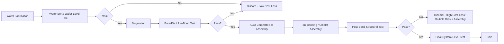

## Known-Good-Die Testing and Yield Economics

### Overview

Known-good-die (KGD) testing refers to the practice of fully verifying an individual die's functionality and quality before it is committed to a multi-die assembly — such as a 3D stack, chiplet package, or fan-out multi-die module — because the cost of discovering a defect after assembly is dramatically higher than discarding a defective die beforehand. Yield economics is the quantitative framework for reasoning about how per-die defect rates, testing coverage, and assembly yield combine to determine the overall cost and profitability of an advanced packaging strategy. As packaging shifts from single-die packages toward multi-die 2.5D/3D integration, KGD testing transitions from a beneficial practice to an economic necessity.

**Key Points**

- The economic cost of a defect grows multiplicatively at each stage of assembly (die → package → system), a principle often summarized as the "rule of ten" cost escalation
- KGD testing coverage is a direct lever on overall system yield in multi-die packages, since yield is the product of all individual chiplet/die yields times the assembly yield
- Test access for embedded dies (in 3D stacks, fan-out, or interposer-based modules) requires specialized design-for-test (DFT) strategies distinct from traditional single-die test flows

---

### The Economic Case for KGD Testing

#### Rule of Ten (Cost Escalation Principle)

A widely cited heuristic in electronics manufacturing holds that the cost to detect and correct a defect increases by roughly an order of magnitude at each subsequent stage of production and integration — wafer-level test, versus package-level test, versus board-level test, versus field failure. [Inference] While the exact multiplier varies significantly by industry segment, product complexity, and era, the qualitative principle — that later-stage defect detection is substantially more expensive — is well established and directly motivates investment in earlier, more thorough testing.

**Example**

A $5 defective die discovered at wafer probe costs approximately $5 to discard. The same defect discovered only after that die has been stacked with three other known-good dies (each costing $5) in a 3D package destroys the value of all four dies plus the assembly cost, potentially turning a $5 loss into a $30+ loss, illustrating why upstream detection is economically preferred as integration complexity increases.

#### Why Multi-Die Packaging Changes the Calculus

In a traditional single-die package, a defective die is caught by final test before shipment, and the loss is bounded to that one die plus packaging cost. In multi-die assemblies (3D stacks, chiplet modules, fan-out multi-die packages), a single defective die discovered post-assembly can render the entire multi-die module unusable, since the assembly typically cannot be economically disassembled and reworked. This asymmetry — one bad die destroying several good ones — is the core economic driver for rigorous KGD testing before commitment to assembly.

---

### Yield Modeling Fundamentals

#### Die (Wafer-Level) Yield Models

Die yield as a function of area and defect density is commonly modeled using either a simple Poisson model or a negative binomial (Murphy/Seeds-style) model that accounts for defect clustering:

**Poisson Model:**

$$Y = e^{-D_0 \cdot A}$$

**Negative Binomial (Clustered Defect) Model:**

$$Y = \left(1 + \frac{D_0 \cdot A}{\alpha}\right)^{-\alpha}$$

where $D_0$ is the defect density (defects per unit area), $A$ is die area, and $\alpha$ is a clustering parameter (lower $\alpha$ implies more defect clustering; as $\alpha \to \infty$, the negative binomial model converges to the Poisson model).

**Example**

For a die with $A = 100\ mm^2$, $D_0 = 0.1\ defects/mm^2$, and using the Poisson model: $Y = e^{-0.1 \times 100} = e^{-10} \approx 0.0045\%$. Real fabrication processes achieve far higher yields than this illustrative extreme case because actual mature-node defect densities are much lower than $0.1\ defects/mm^2$; this example is included purely to demonstrate the exponential sensitivity of yield to the product of defect density and area.

#### Test Coverage and Escape Rate

No test program achieves 100% fault coverage. The fraction of defective die that pass testing and are shipped (or, in this context, assembled) despite being defective is the **test escape rate** or equivalently $(1 - \text{fault coverage})$ applied to the defective population. Higher fault coverage (achieved through more comprehensive scan test, built-in self-test (BIST), and at-speed testing) reduces test escapes but generally increases test time and cost per die.

$$\text{Defective Parts Per Million (DPPM)} \approx (1 - Y) \times (1 - \text{Fault Coverage}) \times 10^6$$

This relationship illustrates that even a die with reasonably high native yield $Y$ can contribute meaningfully to shipped defect rates if fault coverage is insufficient, particularly relevant for die destined for multi-die assembly where the downstream cost of an escape is amplified.

---

### Multi-Die Package Yield Economics

#### Compounding Yield Across Dies in an Assembly

For a package containing $n$ dies (chiplets or stacked tiers), assuming independence of individual die yields, the composite package yield is:

$$Y_{package} = Y_{assembly} \times \prod_{i=1}^{n} Y_{die,i}$$

where $Y_{assembly}$ captures defects introduced by the packaging/bonding process itself (e.g., hybrid bond voids, microbump opens/shorts, RDL defects), and each $Y_{die,i}$ is the effective post-test yield of the $i$-th die (i.e., the probability that a die presented for assembly is actually functional, accounting for test escapes).

**Example**

A 4-die stack where each die has 95% effective post-test yield and the bonding/assembly process itself has 98% yield: $Y_{package} = 0.98 \times (0.95)^4 \approx 0.98 \times 0.8145 \approx 79.8\%$. This demonstrates how even high individual die yields compound to a materially lower overall package yield as die count increases, motivating both higher per-die test coverage and higher-yield bonding processes as stack complexity grows.

#### Cost Model: Comparing KGD Investment vs. Assembly Loss

A simplified decision framework compares the incremental cost of more thorough KGD testing against the expected loss from assembling defective die:

$$\text{Expected Loss (no KGD)} = P(\text{defect escapes to assembly}) \times C_{assembly\ loss}$$

$$\text{Cost (with enhanced KGD)} = C_{additional\ test} \times N_{die}$$

Enhanced KGD testing is economically justified when the expected assembly-stage loss avoided exceeds the incremental testing cost, which becomes increasingly true as: (a) the number of dies per assembly increases, (b) the cost/value of individual dies increases (e.g., leading-edge node chiplets), and (c) the assembly process itself is expensive or has long cycle time (e.g., hybrid bonding with long anneal cycles).

[Inference] As multi-die packages scale to more chiplets, more advanced (costlier) process nodes, and higher-value end products (e.g., AI accelerators), the economic threshold for justifying more expensive, more comprehensive KGD test flows tends to shift further in favor of additional testing investment, since the potential loss per assembly failure scales accordingly.

---

### KGD Test Access Challenges

#### Physical Test Access for Bare/Unpackaged Die

Unlike packaged parts with accessible pins, bare die intended for 3D stacking or chiplet assembly must be probed directly, which introduces challenges:

- **Fine-pitch probing**: Advanced node dies have pad pitches far finer than traditional package pins, requiring specialized probe cards (e.g., cantilever, vertical, or MEMS-based probes) capable of contacting fine-pitch pads without damage
- **TSV tip probing**: For TSV-based 3D-IC dies, pre-bond test may need to contact exposed TSV tips (before backside thinning/RDL) or backside RDL pads (after thinning), each with different mechanical and electrical access constraints
- **Hybrid-bonded pad access**: Dies destined for hybrid bonding have ultra-fine, recessed Cu pads not designed for mechanical probe contact, often necessitating dedicated test pads/structures separate from the functional bond pads

#### Design-for-Test (DFT) Strategies for KGD

- **Boundary Scan / JTAG-style access**: Standard scan chains and boundary-scan structures allow structural test of logic without requiring full at-speed functional test, though this alone may not achieve sufficient fault coverage for high-value assemblies
- **Built-In Self-Test (BIST)**: Embedded test logic (particularly memory BIST, MBIST, for SRAM/DRAM-containing die) allows self-contained testing without requiring external ATE (automated test equipment) to drive complex patterns, reducing dependency on expensive external probing for certain fault classes
- **At-Speed Structural Test**: Scan-based test run at (or near) functional clock speed to catch timing-related defects that slower structural test would miss, increasingly important as multi-die systems have tighter timing margins across D2D interconnects

#### Test Insertion Points in a Multi-Die Flow

1. **Wafer Sort / Wafer-Level Test**: Initial screening at the wafer level, before singulation, catching gross die-level defects cheaply
2. **Post-Singulation / Bare-Die Test**: Additional test after dies are separated, sometimes required because wafer-level probing cannot access all necessary test points (e.g., backside TSV pads only exposed after thinning/singulation)
3. **Pre-Bond Test (3D-specific)**: For stacked dies, a dedicated test step immediately before bonding verifies the specific die instance about to be committed to an irreversible bond
4. **Post-Bond / Structural Test**: After assembly, additional structural test (using dedicated test TSVs, test pads, or boundary-scan-like structures spanning the stack) verifies that the bonding/assembly process itself did not introduce defects (e.g., bond voids, opens)
5. **Final System-Level Test**: Full functional test of the completed multi-die package under realistic operating conditions

---

### Diagram: KGD Test Insertion Points Across the Assembly Flow (Mermaid)

---

### Diagram: Cost-of-Defect Escalation (svg_diagram)

<svg xmlns="http://www.w3.org/2000/svg" viewBox="0 0 700 380">
<rect x="0" y="0" width="700" height="380" fill="#ffffff" />
<text x="350" y="25" font-size="16" text-anchor="middle" font-family="sans-serif" font-weight="bold">Cost of Defect Detection by Stage (svg_diagram)</text>
<line x1="80" y1="330" x2="650" y2="330" stroke="#333" stroke-width="2" />
<line x1="80" y1="330" x2="80" y2="50" stroke="#333" stroke-width="2" />
<text x="40" y="190" font-size="11" text-anchor="middle" font-family="sans-serif" transform="rotate(-90 40 190)">Relative Cost (log scale)</text>
<rect x="110" y="310" width="80" height="20" fill="#7fbf7f" stroke="#333" />
<text x="150" y="345" font-size="10" text-anchor="middle" font-family="sans-serif">Wafer Test</text>
<rect x="230" y="280" width="80" height="50" fill="#a8d5e2" stroke="#333" />
<text x="270" y="345" font-size="10" text-anchor="middle" font-family="sans-serif">Pre-Bond Test</text>
<rect x="350" y="220" width="80" height="110" fill="#f4c542" stroke="#333" />
<text x="390" y="345" font-size="10" text-anchor="middle" font-family="sans-serif">Post-Assembly</text>
<rect x="470" y="140" width="80" height="190" fill="#e07a5f" stroke="#333" />
<text x="510" y="345" font-size="10" text-anchor="middle" font-family="sans-serif">System Test</text>
<rect x="590" y="60" width="80" height="270" fill="#b0453e" stroke="#333" />
<text x="630" y="345" font-size="10" text-anchor="middle" font-family="sans-serif">Field Failure</text>

<text x="350" y="360" font-size="10" text-anchor="middle" font-family="sans-serif" font-style="italic">Cost of defect discovery escalates approximately an order of magnitude per stage</text>

</svg>

---

### Assembly-Type-Specific Considerations

**Key Points**

- **3D hybrid-bonded stacks**: Highest economic stakes per bonding event, since hybrid bonding is generally irreversible; dedicated pre-bond test die-level access and post-bond structural test (using test TSVs/pads) are essentially mandatory for high-die-count stacks
- **Chiplet/UCIe-based multi-die packages**: KGD testing must additionally validate D2D PHY functionality (link training, lane integrity) since a functionally correct chiplet with a marginal or failed D2D link is still a defective unit in the context of the assembled system
- **Fan-out multi-die packages**: Since die-first FOWLP embeds dies in mold compound before RDL completion, KGD testing must occur before molding; die-last (RDL-first) flows allow KGD testing immediately before die attachment to the pre-built RDL, narrowing the window between test and irreversible commitment

---

### Practical Yield Economics Trade-offs

**Key Points**

- **Test time vs. coverage**: Increasing fault coverage (via more comprehensive test patterns, at-speed test, or additional BIST) increases per-die test time and ATE cost, which must be weighed against the reduction in downstream assembly-stage losses it enables
- **Burn-in and screening**: For high-reliability or high-value multi-die products, additional burn-in (accelerated stress testing to precipitate latent/early-life defects) may be applied to individual die before assembly, trading additional per-die cost and cycle time for reduced field-failure risk in the assembled system
- **Design margin vs. yield**: [Inference] Some system designs intentionally incorporate redundancy (spare lanes in D2D links, redundant memory rows/columns, spare compute cores) specifically to tolerate a bounded number of defects without requiring the entire die/chiplet to be discarded, effectively trading die area and design complexity for improved effective yield
- **Cost amortization across volume**: The fixed cost of developing comprehensive KGD test programs (test pattern generation, DFT design, probe card development) is amortized across production volume, meaning the economic threshold for investing in more sophisticated KGD infrastructure is more favorable for high-volume, high-value multi-die products than for low-volume or low-value applications

---

### Related Metrics Summary

| Metric | Definition | Relevance to KGD Economics |
| --- | --- | --- |
| Die yield ($Y$) | Fraction of die on a wafer that are functional | Base input to all downstream yield calculations |
| Fault coverage | Fraction of possible defects detectable by the test program | Determines test escape rate |
| Test escape rate | Fraction of defective die that pass test undetected | Directly drives downstream assembly-stage loss risk |
| Assembly yield ($Y_{assembly}$) | Fraction of assemblies free of process-induced defects (bonding, RDL) | Multiplies with die yields to determine package yield |
| DPPM | Defective parts per million shipped | Downstream quality metric reflecting combined test and process effectiveness |

---

### Next Steps

- Design-for-test (DFT) architecture for 3D-IC: test TSVs, boundary-scan extensions for stacked die
- Memory built-in self-test (MBIST) design for stacked DRAM/HBM tiers
- Redundancy and repair strategies (spare rows/columns, spare D2D lanes) as a complement to KGD testing
- Burn-in and reliability screening methodologies for high-value chiplets
- Probe card technology for fine-pitch and TSV-tip die-level testing
- Statistical yield modeling: Poisson vs. negative binomial defect models in practice
- Cost modeling frameworks for multi-die package economics (cross-reference with chiplet architectures and 3D die stacking)