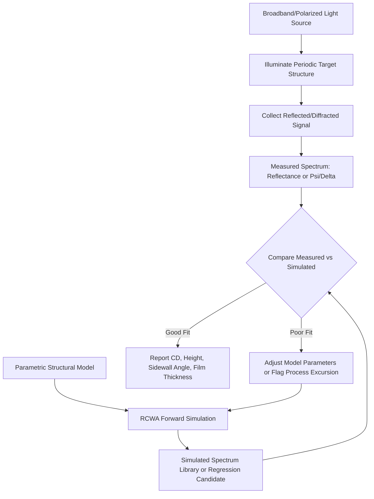

## Optical Microscopy and Scatterometry

### Overview

Optical microscopy and scatterometry are non-destructive, light-based metrology techniques used throughout semiconductor fabrication to inspect surfaces, measure critical dimensions (CD), and monitor film properties without physically damaging the wafer. Optical microscopy provides direct spatial imaging for defect inspection and gross feature visualization, while scatterometry (optical critical dimension metrology, OCD) infers sub-wavelength structural parameters — line width, sidewall angle, film thickness, pitch — by analyzing how light diffracts or reflects off periodic structures, using model-based fitting rather than direct imaging. Both are essential in-line metrology tools because they are fast, non-contact, and non-destructive relative to electron- or ion-beam-based alternatives.

**Key Points**

- Optical microscopy resolution is fundamentally limited by the diffraction limit of light, making it unsuitable for directly resolving modern sub-20 nm transistor features, but it remains essential for macro-defect inspection, alignment verification, and larger-scale structural checks
- Scatterometry circumvents the diffraction limit for periodic structures by measuring an optical signature (spectral reflectance or ellipsometric parameters) and fitting it against a rigorous electromagnetic model, rather than attempting to resolve the feature directly
- Both techniques are high-throughput and non-destructive, making them suitable for high-volume in-line process control, unlike destructive cross-sectional techniques (e.g., TEM)

---

### Optical Microscopy in Semiconductor Fabrication

#### Fundamental Resolution Limits

The resolving power of any optical microscope is bounded by the diffraction limit, commonly expressed via the Abbe diffraction limit or the Rayleigh criterion:

$$d = \frac{\lambda}{2 \cdot NA}$$

where $d$ is the minimum resolvable feature separation, $\lambda$ is the wavelength of illumination, and $NA$ is the numerical aperture of the objective lens. For visible light ($\lambda \approx 400$–700 nm) and practical numerical apertures ($NA \approx 0.9$–1.4 for immersion objectives), the practical resolution limit for standard optical microscopy is on the order of 200–400 nm, far coarser than modern transistor gate lengths.

**Example**

Using $\lambda = 405\ nm$ (common deep-UV/violet inspection wavelength) and $NA = 0.9$: $d = \frac{405}{2 \times 0.9} \approx 225\ nm$. This means two features separated by less than approximately 225 nm cannot be distinguished as separate objects under these conditions, regardless of magnification, since diffraction — not magnification — is the limiting factor.

#### Illumination and Imaging Modes

- **Brightfield Microscopy**: Standard reflected-light imaging where illumination and imaging share the same optical path; surface features that reflect specularly appear bright, while scattering or absorbing features (particles, scratches, voids) appear dark against the background
- **Darkfield Microscopy**: Illumination is angled so that only light scattered by surface irregularities (particles, defects, edges) reaches the detector, making even sub-resolution particles visible as bright points against a dark background — widely used for particle/defect detection since it can detect objects smaller than the diffraction limit would allow for direct imaging (detection, not resolution, of size)
- **Differential Interference Contrast (DIC/Nomarski)**: Exploits interference between two slightly offset polarized beams to enhance contrast for subtle surface topography (step heights, slight height variations) that would otherwise show negligible contrast in standard brightfield imaging
- **Confocal Microscopy**: Uses a pinhole aperture to reject out-of-focus light, improving both lateral resolution and enabling optical sectioning (depth-resolved imaging), useful for inspecting features with significant topography or for through-film inspection

#### Applications in the Fabrication Flow

| Application | Purpose |
| --- | --- |
| Reticle/mask inspection | Detecting particle contamination or pattern defects on photomasks before use |
| Post-litho inspection | Visual check of resist pattern for gross defects (bridging, missing features, particle contamination) before proceeding to etch |
| Wafer-level macro defect inspection | Detecting scratches, particles, or process non-uniformities visible at wafer or die scale |
| Bump/ball inspection | Post-bump or post-ball-attach visual inspection for missing, misshapen, or misaligned solder bumps/balls in packaging |
| Alignment mark verification | Confirming lithography alignment marks are intact and undamaged for subsequent layer registration |

[Inference] Optical microscopy is generally positioned in the fab as a fast, low-cost first-pass inspection tool, with escalation to higher-resolution techniques (SEM, TEM) reserved for defects or features that optical inspection flags but cannot resolve in detail, since optical inspection throughput substantially exceeds electron-beam-based alternatives.

---

### Scatterometry (Optical Critical Dimension Metrology)

#### Core Principle

Scatterometry measures the optical response (reflected intensity spectrum, polarization state change) of light incident on a periodic nanostructure (a grating, an array of lines/spaces, or a repeating via/contact array) and compares the measured signature against a library or regression model of expected responses computed via rigorous electromagnetic simulation (typically Rigorous Coupled-Wave Analysis, RCWA). The structural parameters (line width, height, sidewall angle, pitch, film thickness, material optical constants) that produce the best-fit simulated response to the measured data are reported as the metrology result.

**Key Points**

- Scatterometry does not directly image the structure; it infers geometry indirectly through electromagnetic modeling, meaning measurement accuracy depends heavily on the fidelity of the underlying optical model of the structure
- Because it relies on diffraction from a periodic array rather than direct imaging of a single feature, scatterometry can characterize features far smaller than the illumination wavelength, circumventing the diffraction limit that constrains direct optical imaging
- Requires a dedicated periodic test structure (scatterometry target) on the wafer, distinct from the functional device pattern, adding some overhead area but enabling fast, non-destructive measurement

#### Measurement Modalities

**Spectroscopic Reflectometry**: Measures reflected intensity as a function of wavelength at fixed (typically near-normal) incidence angle, fitting the resulting spectral signature to extract film thickness and/or CD parameters.

**Spectroscopic Ellipsometry (SE)**: Measures the change in polarization state (amplitude ratio $\Psi$ and phase difference $\Delta$) of light reflected from the sample as a function of wavelength, providing additional sensitivity to film thickness, optical constants ($n$, $k$), and structural asymmetry compared to reflectometry alone. The fundamental ellipsometric relationship is:

$$\rho = \tan(\Psi) \cdot e^{i\Delta} = \frac{r_p}{r_s}$$

where $r_p$ and $r_s$ are the complex Fresnel reflection coefficients for p- and s-polarized light respectively.

**Angle-Resolved Scatterometry**: Measures reflected/diffracted intensity as a function of incidence angle (at fixed or multiple wavelengths), providing additional independent data to constrain the fit, particularly useful for complex 3D structures (e.g., FinFET fins, multi-layer stacks) where spectral data alone may be insufficiently constraining.

#### Model-Based Fitting Workflow

1. **Structure Parameterization**: The target structure is described by a parametric geometric model (e.g., trapezoidal line cross-section with parameters for top CD, bottom CD, height, sidewall angle) plus material optical constants for each layer
2. **Forward Simulation (RCWA)**: For a given set of parameter values, rigorous coupled-wave analysis computes the predicted optical response (reflectance spectrum, ellipsometric $\Psi$/$\Delta$)
3. **Library Generation or Real-Time Regression**: Either a pre-computed library spanning the expected parameter range is generated and searched for best match (library method), or a regression/optimization algorithm iteratively adjusts parameters to minimize the difference between simulated and measured response (regression method)
4. **Goodness-of-Fit Evaluation**: The best-fit result is accepted if the residual between measured and simulated signal falls within an acceptable threshold; poor fit indicates either an unmodeled structural feature or process excursion outside the expected parameter range

**Example**

For a periodic line/space grating with nominal 40 nm line width, the scatterometry system does not resolve individual 40 nm lines optically (well below the diffraction limit); instead, it measures the diffracted spectral signature from the full grating array and determines that a 40 nm line width (within a fitted trapezoidal profile model) best reproduces that signature, given known film stack optical constants.

---

### Comparison: Optical Microscopy vs. Scatterometry vs. Other Metrology

| Technique | Resolution/Sensitivity | Destructive? | Throughput | Primary Use |
| --- | --- | --- | --- | --- |
| Optical microscopy (brightfield/darkfield) | Diffraction-limited (~200-400 nm) | No | Very high | Macro defect inspection, particle detection |
| Scatterometry (OCD) | Sub-nm CD sensitivity (model-dependent) | No | High | In-line CD, film thickness, profile metrology |
| CD-SEM | ~1-2 nm resolution | No (surface, but e-beam exposure) | Moderate | Direct CD measurement, defect review |
| Cross-sectional TEM | Sub-angstrom | Yes | Low | Reference/calibration metrology, failure analysis |
| Atomic Force Microscopy (AFM) | Sub-nm (topography) | No (contact/tapping mode) | Low-moderate | 3D topography, sidewall profile reference |

[Inference] Scatterometry is generally favored for high-volume in-line CD monitoring specifically because it combines non-destructive operation with throughput far exceeding CD-SEM, at the cost of being an indirect, model-dependent measurement whose accuracy depends on correct structural and optical modeling assumptions — meaning it is often calibrated against reference measurements from CD-SEM or cross-sectional TEM.

---

### Model Accuracy and Calibration Considerations

#### Sensitivity to Model Assumptions

Because scatterometry results depend entirely on the assumed parametric model and material optical constants, unmodeled structural features (unexpected sidewall roughness, an unaccounted-for thin native oxide layer, incorrect assumed material dispersion) can produce systematic measurement errors even when the goodness-of-fit metric appears acceptable, particularly if the model has enough free parameters to compensate for the missing physics in a way that still fits the data ("parameter correlation" or "cross-talk" between fitted parameters).

#### Reference/Calibration Techniques

To validate and calibrate scatterometry models, fabs typically cross-reference results against:

- **CD-SEM**: Provides direct (though still indirect relative to a true physical cross-section) top-down CD measurement for correlation
- **Cross-sectional TEM**: Provides ground-truth physical dimensions but is destructive and low-throughput, used sparingly for model validation and periodic calibration rather than routine monitoring

[Unverified] Specific correlation/calibration cadences (how frequently TEM cross-section validation is performed relative to routine scatterometry monitoring) vary substantially by fab, process maturity, and criticality of the measured layer, and are not standardized industry-wide.

---

### Diagram: Scatterometry Measurement and Fitting Workflow (Mermaid)

---

### Diagram: Optical Microscopy Illumination Modes (svg_diagram)

<svg xmlns="http://www.w3.org/2000/svg" viewBox="0 0 700 400">
<rect x="0" y="0" width="700" height="400" fill="#ffffff" />
<text x="350" y="25" font-size="16" text-anchor="middle" font-family="sans-serif" font-weight="bold">Brightfield vs. Darkfield Illumination (svg_diagram)</text>

<text x="175" y="55" font-size="13" text-anchor="middle" font-family="sans-serif" font-weight="bold">Brightfield</text>

<line x1="175" y1="70" x2="175" y2="150" stroke="`#f4c542`" stroke-width="4" />

<polygon points="165,70 185,70 175,90" fill="`#f4c542`" />

<rect x="100" y="200" width="150" height="20" fill="`#999999`" stroke="#333" />

<circle cx="175" cy="190" r="6" fill="#333" />

<line x1="175" y1="150" x2="175" y2="200" stroke="`#f4c542`" stroke-width="4" />

<line x1="175" y1="200" x2="175" y2="150" stroke="`#f4c542`" stroke-width="2" stroke-dasharray="4,2" />

<text x="175" y="250" font-size="10" text-anchor="middle" font-family="sans-serif">Specular reflection</text>

<text x="175" y="265" font-size="10" text-anchor="middle" font-family="sans-serif">detected as bright field</text>

<text x="525" y="55" font-size="13" text-anchor="middle" font-family="sans-serif" font-weight="bold">Darkfield</text>

<line x1="450" y1="70" x2="490" y2="190" stroke="`#f4c542`" stroke-width="4" />

<line x1="600" y1="70" x2="560" y2="190" stroke="`#f4c542`" stroke-width="4" />

<rect x="450" y="200" width="150" height="20" fill="`#999999`" stroke="#333" />

<circle cx="525" cy="190" r="6" fill="#333" />

<line x1="525" y1="190" x2="525" y2="130" stroke="`#f4c542`" stroke-width="2" stroke-dasharray="2,2" />

<text x="525" y="250" font-size="10" text-anchor="middle" font-family="sans-serif">Only scattered light</text>

<text x="525" y="265" font-size="10" text-anchor="middle" font-family="sans-serif">from particle reaches detector</text>

<text x="350" y="330" font-size="11" text-anchor="middle" font-family="sans-serif" font-style="italic">Darkfield detects sub-resolution particles as bright points against dark background</text>

</svg>

---

### Practical Limitations and Failure Modes

**Key Points**

- **Diffraction limit (microscopy)**: Fundamentally prevents direct optical resolution of modern transistor-scale features, restricting optical microscopy to macro-defect and larger-structure applications
- **Model dependency (scatterometry)**: Measurement accuracy is only as good as the assumed structural/optical model; an incorrect or incomplete model can produce confidently wrong results that pass goodness-of-fit thresholds
- **Target design constraints**: Scatterometry requires dedicated periodic targets, consuming wafer area and potentially not perfectly representative of isolated (non-periodic) functional device features, introducing a target-to-device correlation consideration
- **Thin film and stack complexity**: As film stacks become more complex (more layers, more material types), the parameter space for scatterometry model fitting grows, increasing risk of parameter correlation and requiring more sophisticated fitting algorithms or additional measurement dimensions (multi-angle, multi-azimuth) to maintain accuracy

---

### Next Steps

- Rigorous Coupled-Wave Analysis (RCWA) and electromagnetic simulation fundamentals for OCD modeling
- CD-SEM metrology: electron-beam imaging principles and correlation with scatterometry
- Cross-sectional TEM sample preparation and reference metrology workflows
- Atomic force microscopy (AFM) for 3D topography and sidewall profile reference measurement
- Mueller matrix ellipsometry for advanced anisotropic/3D structure characterization
- Defect inspection systems: bright-field/dark-field wafer inspection tool architecture
- Statistical process control (SPC) integration of in-line optical metrology data