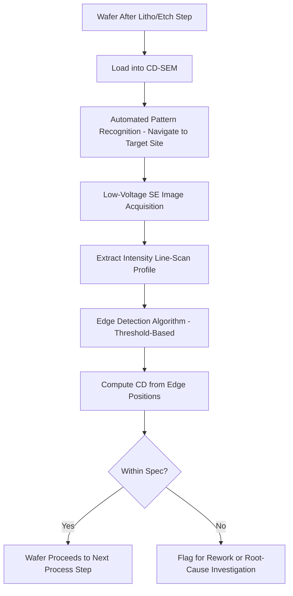

## Scanning Electron Microscopy

### Overview

Scanning electron microscopy (SEM) is an imaging technique that uses a focused beam of electrons, rather than light, to generate high-resolution images of a sample's surface topography and composition. Because electron wavelengths at typical operating energies are orders of magnitude shorter than visible light wavelengths, SEM achieves resolution far beyond the diffraction limit of optical microscopy, making it a primary workhorse for direct imaging of nanometer-scale semiconductor features, including critical dimension measurement (CD-SEM), defect review, and cross-sectional structural analysis.

**Key Points**

- SEM resolution can reach single-digit nanometers or better under optimal conditions, enabling direct visualization of features far below what optical microscopy can resolve
- Image formation relies on detecting signals generated by electron-beam interaction with the sample — primarily secondary electrons (SE) and backscattered electrons (BSE) — each carrying different information about topography and composition
- CD-SEM is a specialized variant optimized for fast, precise, low-damage critical dimension measurement in a high-volume fab environment, distinct from general-purpose SEM used for defect review and failure analysis

---

### Fundamental Operating Principles

#### Electron Source and Beam Formation

An electron gun generates a beam of electrons via one of several emission mechanisms:

- **Thermionic Emission (Tungsten or LaB6 filament)**: Electrons are emitted by heating a filament to high temperature, providing a cost-effective but lower-brightness source
- **Field Emission (Cold or Schottky FEG)**: Electrons are extracted via a strong electric field from a sharp tip, providing substantially higher brightness and smaller effective source size, enabling higher resolution and better performance at low accelerating voltages — the dominant source type for modern semiconductor metrology SEMs

The beam is then demagnified and focused onto the sample surface using a series of electromagnetic condenser and objective lenses, with beam-defining apertures controlling beam current and convergence angle.

#### Beam-Sample Interaction Volume

When the electron beam strikes the sample, electrons penetrate and scatter within a roughly teardrop- or pear-shaped interaction volume, with the exact shape and depth depending on beam energy (accelerating voltage) and sample material (atomic number, density). Various signals are generated at different depths within this interaction volume, meaning the electron energy chosen directly affects both resolution and what information is captured.

$$R \approx \frac{0.1 \cdot E^{1.5}}{\rho}$$

This is a simplified approximate relationship (Kanaya-Okayama-style scaling) illustrating that interaction volume range $R$ increases with beam energy $E$ and decreases with material density $\rho$; [Unverified] exact coefficients and exponents vary across different empirical range formulas in the literature, and this should be treated as illustrating the qualitative trend rather than a precise universal formula.

#### Primary Signal Types

- **Secondary Electrons (SE)**: Low-energy electrons (typically <50 eV) ejected from near-surface atoms by inelastic scattering of the primary beam; because they originate from a shallow depth near the surface, SE signal is highly sensitive to surface topography, making it the primary signal for standard high-resolution topographic imaging
- **Backscattered Electrons (BSE)**: Higher-energy primary beam electrons that undergo elastic scattering and exit the sample; BSE yield increases with atomic number, so BSE imaging provides compositional (Z) contrast — useful for distinguishing materials of different atomic number even when topography is similar
- **Characteristic X-rays**: Generated when inner-shell electrons are ejected and outer-shell electrons fall to fill the vacancy, emitting X-rays at energies characteristic of the element; detected via energy-dispersive X-ray spectroscopy (EDS/EDX) for elemental composition analysis, though this is a materials-analysis application layered onto the SEM platform rather than pure imaging

---

### Resolution and Operating Parameter Trade-offs

#### Accelerating Voltage Trade-offs

- **High Voltage (e.g., 15-30 kV)**: Produces a smaller probe size and can improve raw resolution for bulk, robust samples, but the deeper interaction volume can cause beam penetration into subsurface layers, sometimes revealing subsurface structure as unwanted signal ("charging-related" or "penetration" artifacts) and can be damaging to beam-sensitive materials (some photoresists, low-k dielectrics)
- **Low Voltage (e.g., 0.5-5 kV)**: Confines the interaction volume closer to the true surface, improving surface sensitivity and reducing beam damage/charging on insulating or beam-sensitive materials, which is why low-voltage operation is standard for CD-SEM measurement of photoresist and other sensitive semiconductor structures, at some cost to raw achievable resolution compared to optimal high-voltage conditions on robust conductive samples

[Inference] The choice of accelerating voltage in a fab metrology context generally reflects a deliberate trade-off favoring surface fidelity and minimal sample damage over the theoretical maximum resolution achievable at higher voltage, since damaging or charging the measured structure would compromise measurement accuracy and potentially the sample itself.

#### Charging Effects on Insulating Samples

Non-conductive samples (photoresist, dielectric films) can accumulate charge under electron bombardment since the incident electrons have no conductive path to ground, causing image distortion, brightness instability, or beam deflection artifacts. Mitigation approaches include:

- Low-voltage operation, exploiting the fact that at certain "crossover" beam energies, secondary electron emission roughly balances incident electron flux, minimizing net charge accumulation
- Conductive coating (thin metal or carbon coating) for samples destined for destructive cross-section analysis, though this is generally unsuitable for in-line non-destructive metrology since it alters/damages the sample
- Charge-neutralization techniques (e.g., low-vacuum/environmental SEM modes that introduce a small amount of gas to provide ion-based charge neutralization)

---

### CD-SEM (Critical Dimension SEM)

#### Role in the Fabrication Flow

CD-SEM is a specialized, high-throughput SEM variant purpose-built for in-line critical dimension metrology, typically deployed after key lithography and etch steps to verify that printed/etched feature dimensions meet target specifications before the wafer proceeds further in the process flow.

**Key Points**

- Optimized for speed and reproducibility on a narrow set of measurement tasks (line width, space width, contact/via diameter) rather than general-purpose imaging flexibility
- Typically operates at low accelerating voltage to minimize resist shrinkage/damage during measurement, since photoresist can measurably shrink under electron beam exposure if dose is excessive
- Employs automated pattern recognition and edge-detection algorithms to extract CD values from the acquired image without requiring manual operator measurement for every site

#### Edge Detection and Measurement Algorithms

CD-SEM software processes the acquired secondary electron image's intensity profile across a feature edge, applying an edge-detection algorithm (commonly threshold-based methods relative to peak/valley intensity in the SE line-scan profile) to determine the precise edge location, since the true physical edge does not correspond to an obviously discrete pixel boundary in the raw image but rather to a characteristic feature in the SE intensity profile (often related to the enhanced SE emission at edges/sidewalls, sometimes termed the "edge effect").

**Example**

A line-width measurement on a photoresist line involves acquiring a top-down SE image, then analyzing the intensity profile perpendicular to the line's long axis; the two edge positions (left and right sidewall) are identified via the algorithm's threshold criteria, and their separation is reported as the measured CD, with measurement repeated across multiple sites to establish within-wafer and wafer-to-wafer CD uniformity statistics.

#### Measurement Precision Considerations

- **Repeatability**: The variation in CD measurement when repeatedly measuring the identical site, reflecting tool noise, beam stability, and algorithm consistency
- **Reproducibility**: Variation when measuring nominally identical structures at different sites or on different tools, incorporating additional sources of variation beyond pure tool repeatability
- **Resist Shrinkage**: [Unverified] Electron beam exposure during CD-SEM measurement can induce measurable shrinkage in some photoresist formulations, with the exact magnitude dependent on resist chemistry, beam dose, and accelerating voltage; fabs typically characterize and control this effect through dose management and measurement protocol standardization rather than eliminating it entirely

---

### SEM for Defect Review and Failure Analysis

#### Defect Review SEM (Automated Defect Review, ADR)

Following wafer-level defect detection (often via optical inspection tools that flag defect coordinates but cannot resolve fine detail), defect review SEM revisits the flagged coordinates to capture high-resolution images, enabling defect classification (particle, scratch, pattern defect, etc.) that informs root-cause process troubleshooting.

#### Cross-Sectional SEM

Destructive sample preparation (typically via focused ion beam milling, FIB) exposes a cross-section of the device structure, which is then imaged via SEM to directly visualize layer thicknesses, sidewall profiles, via/contact fill quality, and structural defects not visible from a top-down view. This provides ground-truth structural information often used to calibrate non-destructive techniques like scatterometry.

---

### Comparison: SEM vs. Other Imaging/Metrology Techniques

| Technique | Resolution | Destructive? | Throughput | Information Type |
| --- | --- | --- | --- | --- |
| Optical microscopy | ~200-400 nm (diffraction-limited) | No | Very high | Topographic image, macro defects |
| Scatterometry (OCD) | Sub-nm (model-dependent, indirect) | No | High | Inferred CD/film properties, not direct image |
| CD-SEM | ~1-2 nm | No (minor beam interaction) | Moderate | Direct top-down CD image/measurement |
| Cross-sectional TEM | Sub-angstrom | Yes | Low | Direct atomic/near-atomic structural image |
| Atomic Force Microscopy (AFM) | Sub-nm (topography) | No (contact) | Low-moderate | 3D surface topography |

[Inference] CD-SEM is generally positioned as the direct-imaging complement to scatterometry: scatterometry provides fast, non-destructive, indirect measurement suitable for the highest-volume monitoring, while CD-SEM provides direct visual confirmation and measurement at somewhat lower throughput, with cross-sectional TEM reserved as the lowest-throughput, highest-fidelity reference/calibration technique for both.

---

### Diagram: Electron-Sample Interaction Volume and Signal Generation (svg_diagram)

<svg xmlns="http://www.w3.org/2000/svg" viewBox="0 0 700 420">
<rect x="0" y="0" width="700" height="420" fill="#ffffff" />
<text x="350" y="25" font-size="16" text-anchor="middle" font-family="sans-serif" font-weight="bold">Electron Beam Interaction Volume (svg_diagram)</text>
<line x1="350" y1="40" x2="350" y2="100" stroke="#333" stroke-width="4" />
<polygon points="340,40 360,40 350,60" fill="#333" />
<text x="400" y="70" font-size="11" font-family="sans-serif">Primary electron beam</text>
<rect x="150" y="100" width="400" height="280" fill="#d9d9d9" stroke="#333" stroke-width="1.5" />
<text x="350" y="95" font-size="11" text-anchor="middle" font-family="sans-serif">Sample surface</text>
<path d="M 350 100 C 300 130, 290 180, 320 220 C 340 250, 360 250, 380 220 C 410 180, 400 130, 350 100 Z" fill="#a8d5e2" fill-opacity="0.6" stroke="#333" stroke-width="1" />
<text x="350" y="140" font-size="9" text-anchor="middle" font-family="sans-serif">SE (surface)</text>
<path d="M 350 100 C 260 150, 240 250, 300 320 C 330 355, 370 355, 400 320 C 460 250, 440 150, 350 100 Z" fill="#f4c542" fill-opacity="0.3" stroke="#333" stroke-width="1" stroke-dasharray="4,2" />
<text x="350" y="300" font-size="9" text-anchor="middle" font-family="sans-serif">BSE (deeper, wider)</text>

<text x="580" y="140" font-size="10" font-family="sans-serif">SE: shallow depth,</text>

<text x="580" y="155" font-size="10" font-family="sans-serif">topographic contrast</text>

<text x="580" y="280" font-size="10" font-family="sans-serif">BSE: deeper, wider,</text>

<text x="580" y="295" font-size="10" font-family="sans-serif">atomic-number (Z) contrast</text>

</svg>

---

### Diagram: CD-SEM Measurement Workflow (Mermaid)

---

### Practical Limitations and Failure Modes

**Key Points**

- **Beam damage/shrinkage**: Electron exposure can alter beam-sensitive materials (notably some photoresists), requiring careful dose and voltage control to avoid measurement-induced artifacts
- **Charging on insulators**: Non-conductive samples can charge unpredictably, requiring low-voltage operation or other neutralization strategies to obtain stable, accurate images
- **Vacuum requirement**: Standard SEM operates under high vacuum, which is generally compatible with fab wafer handling but excludes certain sample types (e.g., some organic/biological or liquid-containing samples) without specialized environmental SEM accommodations
- **Sampling limitation**: SEM (including CD-SEM) measures at discrete sites, meaning its within-wafer and wafer-to-wafer coverage is inherently a sampling exercise, in contrast to full-wafer techniques; measurement site selection and sampling plan design materially affect how representative the reported statistics are of the full wafer

---

### Next Steps

- Focused ion beam (FIB) sample preparation for cross-sectional SEM/TEM analysis
- Transmission electron microscopy (TEM) fundamentals and atomic-resolution imaging
- Energy-dispersive X-ray spectroscopy (EDS/EDX) for elemental composition analysis
- Scatterometry (optical CD metrology) as the non-destructive complement to CD-SEM (cross-reference with prior topic)
- Atomic force microscopy (AFM) for direct 3D topography and sidewall profiling
- Automated defect classification (ADC) algorithms for defect review SEM
- Electron beam lithography as a related but distinct electron-beam application in fabrication