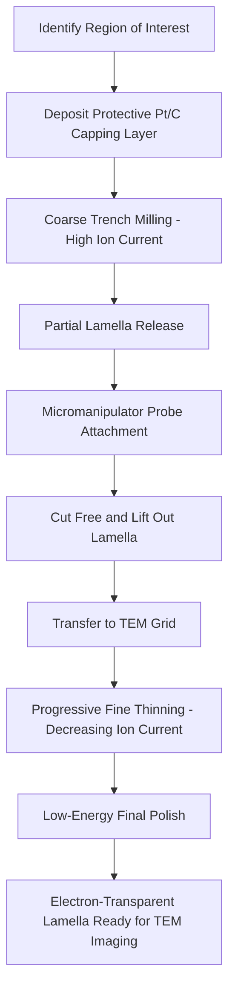

## Transmission Electron Microscopy

### Overview

Transmission electron microscopy (TEM) is an imaging technique in which a high-energy electron beam is transmitted through an ultra-thin sample, and the transmitted electrons are used to form an image with resolution capable of resolving individual atomic columns in crystalline materials. Because electrons must pass through the sample rather than merely interact with its surface (as in SEM), TEM requires extensive sample thinning and delivers the highest structural resolution among mainstream semiconductor metrology techniques, at the cost of being destructive, low-throughput, and comparatively expensive. TEM is the reference-grade technique against which faster, non-destructive methods (scatterometry, CD-SEM) are calibrated.

**Key Points**

- TEM achieves sub-angstrom to atomic-column resolution, exceeding SEM and vastly exceeding optical microscopy, because image formation relies on transmission and diffraction of high-energy electrons through an extremely thin specimen rather than surface interaction
- Sample preparation is inherently destructive and technically demanding, requiring thinning the region of interest to electron transparency (typically well under 100 nm, often tens of nanometers), almost universally via focused ion beam (FIB) milling in a semiconductor fab context
- TEM serves as the ground-truth reference technique for calibrating and validating faster in-line metrology (scatterometry, CD-SEM), and as the primary tool for atomic-scale failure analysis and defect characterization

---

### Fundamental Operating Principles

#### Electron Optics and Image Formation

A TEM accelerates electrons to high energy (commonly 80-300 kV in semiconductor applications) and focuses them through a series of electromagnetic condenser lenses onto an ultra-thin sample. Unlike SEM, which detects signals generated at or near the sample surface, TEM detects electrons that have passed through the entire sample thickness, with the resulting transmitted beam then magnified by objective, intermediate, and projector lenses to form the final image on a detector (historically photographic film, now direct electron detectors or CCD/CMOS cameras).

The theoretical resolution limit of an electron microscope is governed by a de Broglie wavelength-based diffraction limit analogous to (but far smaller than) the optical diffraction limit:

$$\lambda = \frac{h}{\sqrt{2 m_0 e V \left(1 + \frac{eV}{2m_0c^2}\right)}}$$

where $\lambda$ is the relativistically-corrected electron wavelength, $h$ is Planck's constant, $m_0$ is electron rest mass, $e$ is electron charge, $V$ is the accelerating voltage, and $c$ is the speed of light. At typical TEM operating voltages (e.g., 200 kV), the resulting electron wavelength is on the order of a few picometers — orders of magnitude smaller than visible light wavelengths — meaning that in practice, achievable TEM resolution is limited primarily by lens aberrations rather than by the fundamental diffraction limit itself.

#### Imaging Modes

- **Bright-Field (BF) TEM**: The direct, unscattered transmitted beam forms the image; regions of the sample that scatter electrons strongly (thicker regions, higher atomic number, certain diffraction conditions) appear dark, while regions with less scattering appear bright
- **Dark-Field (DF) TEM**: The image is formed using electrons scattered to a specific angle (typically a selected diffracted beam), which enhances contrast for specific crystallographic features or defects that produce strong scattering at that particular angle
- **High-Resolution TEM (HRTEM)**: Phase-contrast imaging exploiting interference between the transmitted and diffracted beams to directly resolve periodic atomic-scale structure (lattice fringes, atomic columns) in crystalline materials
- **Scanning TEM (STEM)**: A focused electron probe is rastered across the sample (similar in concept to SEM's scanning approach) while a transmitted/scattered signal is collected point-by-point, commonly using a high-angle annular dark-field (HAADF) detector that provides strong atomic-number (Z) contrast, making STEM-HAADF particularly popular for compositional-sensitive atomic-resolution imaging in semiconductor applications

#### Selected Area Electron Diffraction (SAED)

By inserting an aperture to select a specific region of the sample and adjusting the imaging lenses to project the diffraction pattern rather than the real-space image, TEM can capture the electron diffraction pattern of a crystalline region, revealing crystal structure, orientation, and phase identification information complementary to direct imaging.

---

### Sample Preparation

#### Focused Ion Beam (FIB) Cross-Sectioning

The dominant sample preparation method for semiconductor TEM analysis uses a focused ion beam (typically gallium ions) to mill away material and extract an ultra-thin lamella (a thin slice) containing the specific region of interest, since semiconductor devices require site-specific preparation (targeting a particular transistor, via, or defect location) rather than bulk sample thinning.

1. **Protective Layer Deposition**: A protective capping layer (commonly platinum or carbon, deposited via ion- or electron-beam-assisted deposition) is deposited over the region of interest to prevent ion-beam damage/curtaining during subsequent milling
2. **Coarse Trenching**: Wide, deep trenches are milled on either side of the region of interest using higher ion beam current, roughly isolating the future lamella
3. **Lamella Extraction (Lift-Out)**: A micromanipulator probe attaches to the partially-freed lamella (often via local Pt deposition welding the probe tip to the sample), and the lamella is cut free and transferred to a TEM sample grid
4. **Fine Thinning**: Progressively lower ion beam currents thin the lamella to electron transparency, typically to a final thickness on the order of tens of nanometers, with the lowest-current, lowest-energy final polishing steps intended to minimize ion-beam-induced amorphization damage to the crystal structure near the sample surfaces
5. **Final Cleaning**: Very low-energy ion polishing (or alternative techniques) removes residual amorphized surface layers introduced by higher-energy milling steps, since this damage layer can otherwise obscure or distort the true underlying structure in high-resolution imaging

**Key Points**

- FIB-based lift-out enables precise, site-specific TEM sample preparation targeting a specific transistor, contact, or defect location identified by prior inspection (e.g., a defect coordinate flagged by wafer-level inspection), which is essential in a semiconductor failure-analysis context where the feature of interest may occupy a very small area of the wafer
- Ion-beam-induced damage (amorphization, gallium implantation) at the lamella surfaces is an inherent artifact of FIB preparation; low-energy final polishing steps mitigate but do not entirely eliminate this damage layer

#### Alternative Thinning Approaches

[Unverified] Non-FIB thinning approaches (mechanical polishing followed by ion milling, or wedge polishing) are also used in some contexts, particularly for less site-specific or higher-throughput sample preparation needs, though FIB lift-out has become the dominant approach for site-specific semiconductor device analysis given its precision and compatibility with modern device geometries; the relative prevalence of each approach varies by application and lab.

---

### Applications in Semiconductor Characterization

#### Structural and Dimensional Reference Metrology

Cross-sectional TEM provides direct, ground-truth measurement of layer thicknesses, sidewall profiles, gate stack composition, and via/contact fill quality, serving as the calibration reference for non-destructive in-line techniques such as scatterometry, whose model-based results depend on assumptions that must be periodically validated against true physical cross-sections.

#### Failure Analysis and Defect Characterization

When a defect location is identified (via optical inspection, electrical test failure localization, or other means), TEM cross-sectioning at the precise defect coordinate can reveal the physical root cause — a void, an interface defect, an unexpected phase, contamination, or a structural anomaly — at resolution sufficient to distinguish atomic-scale structural features.

#### Compositional and Crystallographic Analysis

Combined with energy-dispersive X-ray spectroscopy (EDS) or electron energy-loss spectroscopy (EELS) attachments, TEM can provide spatially-resolved elemental composition and, in the case of EELS, information on chemical bonding state and electronic structure at near-atomic spatial resolution, layered on top of the structural imaging capability.

**Example**

Characterizing a gate stack in an advanced transistor might involve STEM-HAADF imaging to visualize the layer structure (with Z-contrast distinguishing high-k dielectric from metal gate and silicon channel), combined with EELS line-scans across the stack to map elemental composition and detect any unwanted interfacial layer formation (e.g., interfacial oxide growth) not apparent from imaging contrast alone.

---

### Comparison: TEM vs. Other Structural/Metrology Techniques

| Technique | Resolution | Destructive? | Throughput | Primary Role |
| --- | --- | --- | --- | --- |
| Optical microscopy | ~200-400 nm | No | Very high | Macro defect inspection |
| Scatterometry (OCD) | Sub-nm (indirect, model-based) | No | High | In-line CD/film monitoring |
| CD-SEM | ~1-2 nm | No (minor beam interaction) | Moderate | Direct in-line CD measurement |
| Cross-sectional TEM | Sub-angstrom / atomic column | Yes | Low | Reference metrology, failure analysis, atomic-scale structure |
| Atomic Force Microscopy | Sub-nm (topography) | No | Low-moderate | 3D surface topography |

[Inference] TEM's position at the "high-fidelity, low-throughput" extreme of the metrology spectrum generally means it is used sparingly and strategically — for model calibration, process qualification milestones, and failure analysis — rather than for routine high-volume in-line monitoring, a role filled instead by faster non-destructive techniques whose models and calibration ultimately trace back to TEM reference measurements.

---

### Diagram: FIB Lift-Out Sample Preparation Workflow (Mermaid)

---

### Diagram: TEM vs. STEM Imaging Configuration (svg_diagram)

<svg xmlns="http://www.w3.org/2000/svg" viewBox="0 0 700 420">
<rect x="0" y="0" width="700" height="420" fill="#ffffff" />
<text x="350" y="25" font-size="16" text-anchor="middle" font-family="sans-serif" font-weight="bold">Conventional TEM vs. STEM (svg_diagram)</text>

<text x="175" y="55" font-size="13" text-anchor="middle" font-family="sans-serif" font-weight="bold">Conventional TEM</text>

<line x1="175" y1="70" x2="175" y2="150" stroke="#333" stroke-width="6" />

<text x="220" y="110" font-size="9" font-family="sans-serif">Broad parallel beam</text>

<rect x="130" y="150" width="90" height="15" fill="`#a8d5e2`" stroke="#333" />

<text x="175" y="145" font-size="9" text-anchor="middle" font-family="sans-serif">Thin lamella</text>

<line x1="175" y1="165" x2="175" y2="280" stroke="#333" stroke-width="2" stroke-dasharray="3,2" />

<ellipse cx="175" cy="300" rx="60" ry="15" fill="`#e0e0e0`" stroke="#333" />

<text x="175" y="330" font-size="10" text-anchor="middle" font-family="sans-serif">Full-field image</text>

<text x="175" y="345" font-size="10" text-anchor="middle" font-family="sans-serif">formed simultaneously</text>

<text x="525" y="55" font-size="13" text-anchor="middle" font-family="sans-serif" font-weight="bold">STEM</text>

<line x1="525" y1="70" x2="525" y2="150" stroke="#333" stroke-width="1" />

<polygon points="518,140 532,140 525,150" fill="#333" />

<text x="600" y="110" font-size="9" font-family="sans-serif">Focused probe, rastered</text>

<rect x="480" y="150" width="90" height="15" fill="`#a8d5e2`" stroke="#333" />

<line x1="525" y1="165" x2="525" y2="280" stroke="#333" stroke-width="1" stroke-dasharray="2,2" />

<path d="M 500 290 L 550 290 L 570 310 L 480 310 Z" fill="`#e0e0e0`" stroke="#333" />

<text x="525" y="335" font-size="10" text-anchor="middle" font-family="sans-serif">HAADF detector</text>

<text x="525" y="350" font-size="10" text-anchor="middle" font-family="sans-serif">point-by-point, Z-contrast</text>

</svg>

---

### Practical Limitations and Failure Modes

**Key Points**

- **Destructive sample preparation**: The specimen is physically consumed/altered during lamella preparation, meaning TEM cannot be used for routine in-line monitoring of production wafers in the way non-destructive techniques can
- **FIB-induced artifacts**: Gallium ion implantation and surface amorphization introduced during milling can obscure or distort the true structure near lamella surfaces if not adequately mitigated by low-energy final polishing
- **Limited field of view / sampling**: A single TEM lamella represents an extremely small, site-specific sample of the wafer, meaning TEM findings characterize that specific location rather than providing wafer-scale statistical information — necessitating multiple lift-outs if broader statistical characterization is required
- **Cost and cycle time**: Combined FIB preparation and TEM imaging time is substantially longer, and the required capital equipment and operator expertise substantially more specialized, than optical or even SEM-based metrology, reinforcing TEM's role as a reference/diagnostic tool rather than a production monitoring tool

---

### Next Steps

- Focused ion beam (FIB) milling physics and gallium ion column operation
- Electron energy-loss spectroscopy (EELS) for chemical bonding and electronic structure analysis
- Energy-dispersive X-ray spectroscopy (EDS) elemental mapping in STEM
- Aberration-corrected STEM for sub-angstrom imaging in advanced logic/memory nodes
- Cross-sectional SEM as a faster, lower-resolution complement to TEM (cross-reference with prior topic)
- Scatterometry model calibration workflows using TEM reference measurements
- In-situ TEM techniques for dynamic/operando semiconductor device characterization