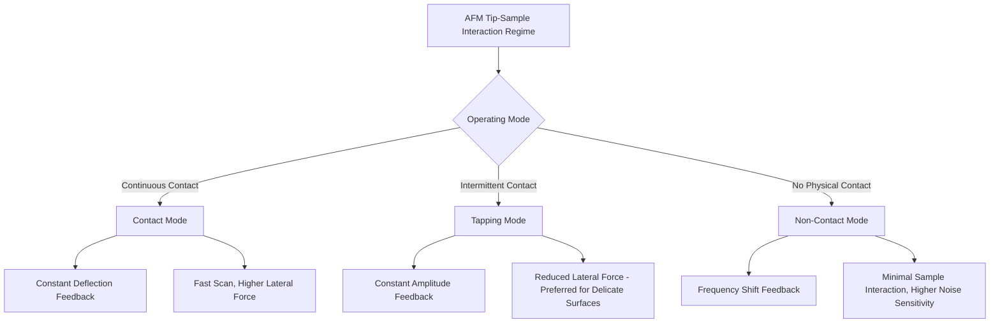

## Atomic Force Microscopy

### Overview

Atomic force microscopy (AFM) is a scanning probe technique that generates three-dimensional topographic images of a sample surface by mechanically raster-scanning a sharp probe tip across it and measuring the tip-sample interaction force at each point, rather than relying on light or electron optics. Because AFM directly measures physical surface height with sub-nanometer vertical resolution and does not depend on wavelength-limited imaging, it is uniquely suited to quantitative 3D topography, sidewall profiling, and surface roughness measurement in semiconductor metrology — complementing optical, scatterometry, and electron-beam techniques that primarily provide lateral/compositional information rather than direct height data.

**Key Points**

- AFM measures true physical surface topography via mechanical force sensing, providing quantitative height/depth data (Z-axis) that other techniques (optical, SEM) cannot directly and independently provide from a top-down view
- Vertical (Z-axis) resolution can reach sub-angstrom levels, while lateral resolution is typically limited by tip geometry (tip radius and aspect ratio) rather than a wavelength-based diffraction limit
- Operates in ambient or vacuum conditions without requiring sample conductivity or extensive sample preparation, unlike SEM (which favors conductive samples) or TEM (which requires destructive thinning)

---

### Fundamental Operating Principles

#### Cantilever and Tip Assembly

AFM uses a microfabricated cantilever with a sharp tip (commonly silicon or silicon nitride, with tip radii ranging from a few nanometers to tens of nanometers depending on application) mounted at its free end. As the tip approaches and interacts with the sample surface, interatomic forces (van der Waals forces, electrostatic forces, and at very close range, repulsive contact forces) cause the cantilever to deflect, and this deflection is precisely measured — most commonly via an optical lever system in which a laser beam reflects off the back of the cantilever onto a position-sensitive photodetector.

$$F = -k \cdot \Delta z$$

where $F$ is the tip-sample interaction force, $k$ is the cantilever's spring constant, and $\Delta z$ is the measured cantilever deflection, following Hooke's law for the cantilever acting as a simple spring.

#### Force-Distance Relationship

The interaction force between tip and sample varies characteristically with tip-sample separation, generally described by models such as the Lennard-Jones potential, which captures both a long-range attractive regime (van der Waals forces) and a short-range repulsive regime (Pauli exclusion/electron cloud overlap as atoms are brought into direct contact):

$$U(r) = 4\epsilon \left[\left(\frac{\sigma}{r}\right)^{12} - \left(\frac{\sigma}{r}\right)^{6}\right]$$

where $U(r)$ is interaction potential energy as a function of tip-sample distance $r$, and $\epsilon$, $\sigma$ are material-dependent parameters. Different AFM operating modes exploit different regions of this force curve.

#### Feedback Loop and Height Reconstruction

A piezoelectric scanner moves either the sample or the tip in a raster pattern across the imaging area. A feedback control loop continuously adjusts the vertical (Z) position of the scanner to maintain a setpoint condition (constant deflection, constant amplitude, or constant frequency shift, depending on mode), and the Z-position adjustment required at each lateral (X,Y) point is recorded to reconstruct the 3D topographic map of the surface.

---

### Primary Operating Modes

#### Contact Mode

The tip remains in continuous physical contact with the sample surface (operating in the repulsive force regime), with the feedback loop maintaining constant cantilever deflection (constant force) as the tip scans. This mode offers fast scanning and straightforward operation but applies continuous lateral (shear) forces that can damage soft samples or drag/displace loosely-adhered surface features, making it less suitable for delicate semiconductor surfaces such as unhardened photoresist.

#### Tapping Mode (Intermittent Contact / AC Mode)

The cantilever is oscillated near its resonant frequency, and the tip only intermittently contacts the surface at the bottom of each oscillation cycle. The feedback loop maintains constant oscillation amplitude, adjusting Z-height as amplitude changes due to varying tip-sample separation. This substantially reduces lateral shear forces compared to contact mode, making it the dominant mode for imaging delicate or easily damaged semiconductor surfaces, including patterned photoresist and other soft materials.

#### Non-Contact Mode

The tip oscillates at a small amplitude entirely within the attractive force regime, without making physical contact with the surface, and the feedback loop responds to frequency shift or amplitude changes induced by the attractive force gradient. This mode minimizes any risk of tip-induced sample modification but is generally more sensitive to environmental noise and less commonly used for routine semiconductor metrology than tapping mode.

**Key Points**

- Tapping mode is generally the preferred mode for semiconductor surface metrology given its balance of reduced sample damage/lateral force and reasonably robust, repeatable imaging performance across a range of surface types
- Contact mode remains relevant for specific applications requiring higher scan speed or particular contrast mechanisms (e.g., lateral force microscopy for friction/material contrast), where its greater invasiveness is an acceptable trade-off

---

### Advanced/Specialized AFM Modes for Semiconductor Applications

#### Critical Dimension AFM (CD-AFM)

A specialized AFM configuration using tips with re-entrant (flared, often "boot" or "T-shaped") geometry capable of contacting undercut sidewalls, enabling direct measurement of sidewall angle, undercut, and full 3D line profile — information standard top-down techniques (optical, CD-SEM) cannot directly capture, since a conventional AFM tip's geometry cannot reach into overhanging or re-entrant sidewall features.

**Example**

Measuring a trench or line with a slightly negative (undercut) sidewall profile requires a CD-AFM tip whose flared tip geometry can physically reach beneath the overhang to trace the true sidewall contour, whereas both a standard AFM tip and a top-down optical/SEM measurement would fail to capture this undercut geometry directly.

#### Conductive/Electrical AFM Modes

Variants such as conductive AFM (C-AFM) or scanning capacitance microscopy (SCM) combine topographic imaging with simultaneous electrical measurement (current or capacitance) at each point, enabling correlated topographic and electrical characterization — for example, mapping dopant concentration variations or identifying localized electrical defects at specific surface locations.

#### Kelvin Probe Force Microscopy (KPFM)

Measures the local surface potential (contact potential difference) between tip and sample simultaneously with topography, useful for characterizing work function variations, charge distribution, or dopant-related surface potential differences at the nanoscale.

[Unverified] The specific prevalence and adoption of these specialized electrical AFM modes in high-volume manufacturing metrology (versus primarily research/characterization contexts) varies by application and fab, and should be considered alongside the specific measurement need rather than assumed as standard in-line practice.

---

### Applications in Semiconductor Fabrication

| Application | AFM's Role |
| --- | --- |
| Line/sidewall profile (CD-AFM) | Direct 3D measurement of sidewall angle, undercut, re-entrant profiles |
| Surface roughness characterization | Quantitative RMS roughness measurement for films, polished surfaces (e.g., post-CMP) |
| Scatterometry model calibration | Provides independent height/profile reference data to validate OCD structural models |
| Step height measurement | Precise measurement of film thickness or etch depth via step-edge height |
| Defect topography review | Detailed 3D characterization of a specific defect's physical shape/height, complementing 2D imaging from optical/SEM review |

---

### Comparison: AFM vs. Other Semiconductor Metrology Techniques

| Technique | Resolution (lateral/vertical) | Destructive? | Throughput | Direct Height Data? |
| --- | --- | --- | --- | --- |
| Optical microscopy | ~200-400 nm / N/A | No | Very high | No |
| Scatterometry (OCD) | Sub-nm (model-based) / model-based | No | High | No (inferred, not directly measured) |
| CD-SEM | ~1-2 nm / limited | No (minor beam interaction) | Moderate | Limited (top-down projection) |
| AFM / CD-AFM | ~1-10 nm (tip-limited) / sub-angstrom | No | Low | Yes (direct 3D topography) |
| Cross-sectional TEM | Sub-angstrom / sub-angstrom | Yes | Low | Yes (2D cross-section, not full 3D surface) |

[Inference] AFM's unique value in the semiconductor metrology toolkit generally stems from being the only mainstream non-destructive technique that provides direct, quantitative 3D surface height data across an extended scan area, which is why it is frequently used to calibrate and validate the structural assumptions underlying model-based scatterometry, despite its comparatively low throughput relative to optical and electron-beam alternatives.

---

### Diagram: AFM Cantilever and Optical Lever Detection (svg_diagram)

<svg xmlns="http://www.w3.org/2000/svg" viewBox="0 0 700 400">
<rect x="0" y="0" width="700" height="400" fill="#ffffff" />
<text x="350" y="25" font-size="16" text-anchor="middle" font-family="sans-serif" font-weight="bold">AFM Optical Lever Detection (svg_diagram)</text>
<rect x="60" y="120" width="30" height="10" fill="#666" stroke="#333" />
<line x1="90" y1="125" x2="280" y2="150" stroke="#333" stroke-width="3" />
<text x="150" y="110" font-size="10" font-family="sans-serif">Cantilever</text>
<polygon points="280,150 300,175 275,180" fill="#333" />
<text x="300" y="200" font-size="9" font-family="sans-serif">Tip</text>
<path d="M 200 250 Q 350 200 500 250 Q 550 265 500 280 Q 350 240 200 280 Q 150 265 200 250 Z" fill="#d9d9d9" stroke="#333" stroke-width="1" />
<text x="350" y="300" font-size="11" text-anchor="middle" font-family="sans-serif">Sample surface (topography)</text>
<line x1="450" y1="60" x2="270" y2="145" stroke="#e74c3c" stroke-width="2" />
<line x1="270" y1="145" x2="450" y2="230" stroke="#e74c3c" stroke-width="2" stroke-dasharray="4,2" />
<text x="480" y="60" font-size="9" font-family="sans-serif">Laser</text>
<rect x="440" y="220" width="60" height="40" fill="#a8d5e2" stroke="#333" />
<text x="470" y="280" font-size="9" text-anchor="middle" font-family="sans-serif">Position-sensitive</text>
<text x="470" y="292" font-size="9" text-anchor="middle" font-family="sans-serif">photodetector</text>

<text x="350" y="340" font-size="10" text-anchor="middle" font-family="sans-serif" font-style="italic">Cantilever deflection changes reflected laser angle, detected as position shift</text>

</svg>

---

### Diagram: AFM Operating Mode Comparison (Mermaid)

---

### Practical Limitations and Failure Modes

**Key Points**

- **Tip geometry limitations**: Lateral resolution and the ability to accurately trace steep sidewalls or re-entrant features are fundamentally limited by tip radius and shape; a standard tip cannot resolve features narrower than or geometrically inaccessible to its own geometry, a phenomenon sometimes described as tip convolution/dilation of the true surface profile
- **Tip wear**: Repeated scanning gradually wears/blunts the tip, degrading resolution over time and requiring tip replacement or recalibration, particularly relevant for high-throughput or long scan-duration applications
- **Scan speed / throughput**: Mechanical raster scanning is inherently slower than optical or electron-beam-based imaging, limiting AFM's role in high-volume in-line monitoring compared to scatterometry or CD-SEM, and generally confining it to targeted, lower-frequency measurement or calibration applications
- **Sensitivity to vibration/environment**: Because AFM measures forces at the sub-nanonewton scale over sub-nanometer displacements, it is inherently sensitive to mechanical vibration, acoustic noise, and thermal drift, typically necessitating vibration isolation and environmental control for high-precision measurement

---

### Next Steps

- CD-AFM tip technology and re-entrant/flared tip fabrication for sidewall metrology
- Scatterometry model calibration workflows using AFM-derived reference profiles (cross-reference with prior topic)
- Conductive AFM and scanning capacitance microscopy for dopant/electrical characterization
- Post-CMP surface roughness metrology and its relationship to downstream process defects
- Kelvin probe force microscopy (KPFM) for work function and surface potential mapping
- Tip-sample force models (Lennard-Jones, DMT, JKR) for quantitative force spectroscopy
- Cross-sectional TEM as the ground-truth complement to AFM's non-destructive 3D topography (cross-reference with prior topic)