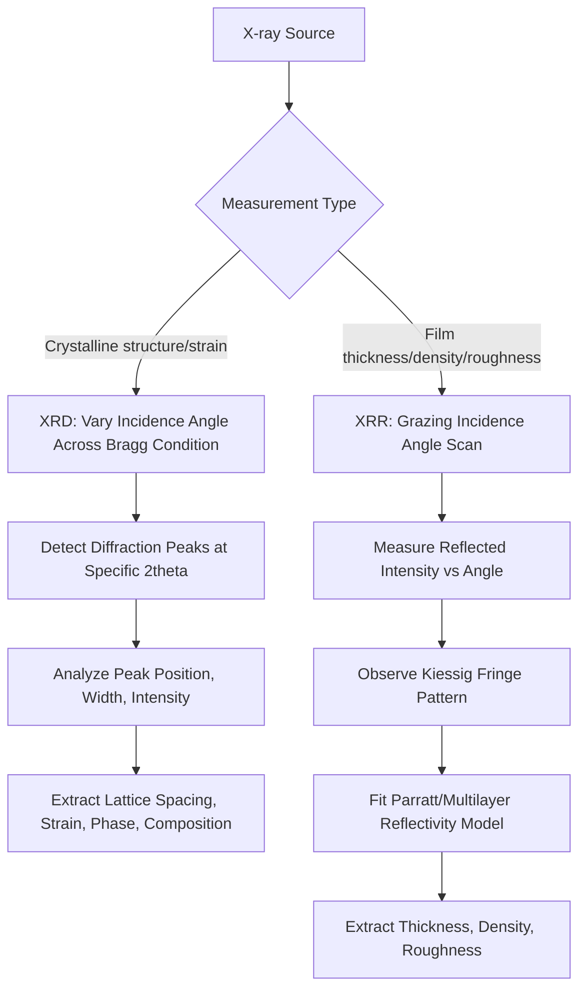

## X-Ray Diffraction and Reflectometry

### Overview

X-ray diffraction (XRD) and X-ray reflectometry (XRR) are non-destructive metrology techniques that use X-ray radiation to characterize crystalline structure and thin-film properties respectively. XRD exploits constructive interference of X-rays scattered by periodic atomic lattice planes to determine crystal structure, orientation, strain, and phase composition, while XRR measures the interference pattern of X-rays reflected from thin-film interfaces to determine film thickness, density, and interface/surface roughness — independent of whether the film is crystalline or amorphous. Both techniques penetrate beneath the immediate surface (unlike purely surface-sensitive techniques), providing bulk or buried-layer structural information that complements optical, electron-beam, and scanning-probe metrology.

**Key Points**

- XRD is primarily sensitive to crystalline order (lattice spacing, orientation, strain, phase), making it essential for characterizing epitaxial layers, strained silicon, and crystalline phase identification, but largely insensitive to amorphous materials
- XRR is sensitive to electron density contrast at interfaces regardless of crystallinity, making it broadly applicable to both crystalline and amorphous thin films for thickness, density, and roughness determination
- Both techniques are non-destructive and can probe buried layers/interfaces without requiring cross-sectioning, unlike TEM or SEM cross-sectional analysis

---

### X-Ray Diffraction (XRD)

#### Fundamental Principle: Bragg's Law

XRD is governed by Bragg's Law, which describes the condition for constructive interference of X-rays scattered from parallel atomic lattice planes:

$$n\lambda = 2d\sin\theta$$

where $n$ is an integer (diffraction order), $\lambda$ is the X-ray wavelength, $d$ is the interplanar spacing of the crystal lattice, and $\theta$ is the angle of incidence (and reflection) relative to the lattice planes. When this condition is satisfied, X-rays scattered from successive lattice planes interfere constructively, producing a measurable diffraction peak at the corresponding angle $2\theta$ in the detector.

**Example**

For a silicon (004) reflection using Cu K-alpha radiation ($\lambda \approx 1.5406\ \text{Å}$) with a known interplanar spacing $d$ for that reflection, the Bragg condition predicts a specific $2\theta$ diffraction peak position; a shift in the measured peak position relative to the unstrained silicon reference value indicates lattice strain (e.g., from a strained silicon-germanium layer or process-induced stress), since strain directly changes the effective interplanar spacing.

#### High-Resolution XRD (HRXRD) for Semiconductor Applications

High-resolution XRD, using highly monochromatic and collimated X-ray optics (commonly a multi-bounce monochromator), achieves the angular resolution necessary to resolve subtle lattice spacing differences relevant to semiconductor materials:

- **Epitaxial Layer Characterization**: Determining the crystalline quality, composition (e.g., germanium content in SiGe layers, aluminum content in AlGaN), and thickness of epitaxially grown layers by analyzing the diffraction pattern's peak positions and interference fringes (Pendellösung fringes) arising from the finite layer thickness
- **Strain Measurement**: Detecting and quantifying lattice strain in strained-silicon or other strain-engineered device structures, since deliberate strain engineering is used in some transistor designs to enhance carrier mobility, making direct strain measurement a relevant process control parameter
- **Reciprocal Space Mapping (RSM)**: Measuring diffracted intensity across a 2D region of reciprocal space (rather than a single 1D scan) to distinguish strain-related and composition-related contributions to peak position, and to assess relaxation state of epitaxial layers relative to the substrate

#### Phase Identification

Since different crystalline phases (and different materials) produce characteristic diffraction patterns (a unique set of peak positions and relative intensities determined by their specific crystal structure), XRD can identify which crystalline phase(s) are present in a sample — relevant for confirming, for example, that a silicide formation anneal produced the intended low-resistance phase rather than an undesired higher-resistance phase, or that a deposited film crystallized into the intended polymorph.

---

### X-Ray Reflectometry (XRR)

#### Fundamental Principle

XRR measures the reflected X-ray intensity as a function of grazing incidence angle (typically very small angles, below the critical angle for total external reflection and just above it), rather than relying on Bragg diffraction from crystal lattice planes. At these grazing angles, X-rays reflect from interfaces between layers of differing electron density, and interference between reflections from the top surface and each buried interface produces characteristic oscillations ("Kiessig fringes") in the reflected intensity versus angle curve.

**Key Points**

- Because XRR relies on electron density contrast at interfaces rather than crystalline periodicity, it works equally well on amorphous, polycrystalline, or single-crystal films, unlike XRD which requires crystalline order to produce diffraction peaks
- The period of the Kiessig fringe oscillations is inversely related to film thickness, meaning finer fringe spacing corresponds to thicker films, providing a direct route to thickness determination via model-based fitting of the fringe pattern
- The rate of decay of fringe amplitude with increasing angle is sensitive to interface/surface roughness, since roughness reduces the coherence of reflected interference, providing simultaneous roughness information alongside thickness

#### Model-Based Fitting

Similar in spirit to optical scatterometry, XRR analysis typically involves fitting a parametric model (layer thicknesses, densities, and interface roughnesses for each layer in the film stack) against the measured reflectivity curve using an appropriate reflectivity calculation (e.g., the Parratt formalism for multilayer reflectivity), adjusting model parameters until the simulated curve matches the measured data.

**Example**

For a thin oxide film on silicon, the XRR curve will show a critical angle related to the film's average electron density, followed by Kiessig fringes whose spacing indicates film thickness and whose decay rate indicates surface/interface roughness; fitting this curve against a single-layer (or multi-layer, if applicable) reflectivity model extracts these parameters without requiring any destructive sample preparation.

#### Applications

- **Ultra-thin film thickness**: XRR is particularly valuable for very thin films (sub-10 nm) where optical techniques may lack sufficient sensitivity or where the film is optically similar to the substrate, since XRR's sensitivity derives from electron density contrast rather than optical constants
- **Density Determination**: Because the critical angle for total external reflection is directly related to electron density, XRR can determine absolute film density — useful for detecting porosity or composition variations in dielectric films (e.g., low-k dielectric porosity affecting density and therefore dielectric constant)
- **Multilayer Stack Characterization**: For stacks with multiple thin layers (e.g., gate dielectric stacks, multilayer optical/barrier coatings), XRR can in principle resolve individual layer thicknesses and interface roughnesses, though [Inference] fitting complexity and parameter correlation generally increase with the number of layers, similar to the model-fitting challenges seen in optical scatterometry

---

### Comparison: XRD vs. XRR

| Parameter | XRD | XRR |
| --- | --- | --- |
| Sensitivity basis | Crystalline lattice diffraction (Bragg's Law) | Electron density contrast at interfaces |
| Requires crystallinity? | Yes | No (works on amorphous films) |
| Primary measurands | Lattice spacing, strain, phase, orientation, epitaxial composition | Film thickness, density, interface/surface roughness |
| Typical incidence angles | Wide range, tuned to specific Bragg reflections | Very low grazing angles (near/below critical angle) |
| Model dependency | Peak position/intensity analysis; can be relatively direct for known phases | Requires parametric model fitting (Parratt formalism or similar) |

---

### Comparison: XRD/XRR vs. Other Structural Metrology

| Technique | Information Type | Destructive? | Depth Sensitivity |
| --- | --- | --- | --- |
| XRD | Crystal structure, strain, phase, orientation | No | Penetrates into bulk/buried crystalline layers |
| XRR | Film thickness, density, roughness | No | Penetrates through buried interfaces (grazing incidence) |
| Scatterometry (OCD) | CD, film thickness (via optical model) | No | Surface/near-surface, optical penetration depth-dependent |
| Cross-sectional TEM | Direct atomic-scale structural image | Yes | Direct cross-section, arbitrary depth |
| AFM | Surface topography only | No | Surface only, no buried-layer sensitivity |

[Inference] XRD and XRR are generally positioned as complementary to optical scatterometry and electron/scanning-probe techniques specifically because they provide bulk crystalline and buried-interface information (strain, phase, buried-layer thickness/density) that surface-sensitive or purely optical techniques cannot directly access, at the cost of typically lower throughput and, for XRD in particular, the requirement for crystalline order in the sample.

---

### Diagram: Bragg Diffraction Geometry (svg_diagram)

<svg xmlns="http://www.w3.org/2000/svg" viewBox="0 0 700 380">
<rect x="0" y="0" width="700" height="380" fill="#ffffff" />
<text x="350" y="25" font-size="16" text-anchor="middle" font-family="sans-serif" font-weight="bold">Bragg Diffraction Geometry (svg_diagram)</text>
<line x1="100" y1="150" x2="600" y2="150" stroke="#333" stroke-width="1.5" />
<line x1="100" y1="220" x2="600" y2="220" stroke="#333" stroke-width="1.5" />
<text x="620" y="155" font-size="10" font-family="sans-serif">Plane 1</text>
<text x="620" y="225" font-size="10" font-family="sans-serif">Plane 2</text>
<line x1="350" y1="150" x2="350" y2="220" stroke="#666" stroke-width="1" stroke-dasharray="2,2" />
<text x="360" y="188" font-size="11" font-family="sans-serif" font-style="italic">d</text>
<line x1="250" y1="80" x2="350" y2="150" stroke="#e74c3c" stroke-width="2" />
<polygon points="340,140 355,148 345,155" fill="#e74c3c" />
<text x="230" y="70" font-size="10" font-family="sans-serif">Incident X-ray</text>
<line x1="350" y1="150" x2="450" y2="80" stroke="#e74c3c" stroke-width="2" />
<text x="460" y="70" font-size="10" font-family="sans-serif">Reflected (theta)</text>
<line x1="300" y1="115" x2="350" y2="220" stroke="#3498db" stroke-width="2" />
<line x1="350" y1="220" x2="400" y2="115" stroke="#3498db" stroke-width="2" />
<text x="240" y="105" font-size="9" font-family="sans-serif" fill="#3498db">Path to Plane 2</text>

<text x="330" y="145" font-size="10" font-family="sans-serif">theta</text>

<path d="M 330 150 A 20 20 0 0 1 350 130" fill="none" stroke="#333" stroke-width="1" />

<text x="350" y="320" font-size="12" text-anchor="middle" font-family="sans-serif">n·lambda = 2·d·sin(theta) — constructive interference when path</text>

<text x="350" y="338" font-size="12" text-anchor="middle" font-family="sans-serif">difference between planes equals an integer number of wavelengths</text>

</svg>

---

### Diagram: XRD vs. XRR Measurement Workflow (Mermaid)

---

### Practical Limitations and Considerations

**Key Points**

- **Crystallinity requirement (XRD)**: XRD provides no diffraction signal from amorphous materials, meaning it is inapplicable to purely amorphous film characterization and must be paired with other techniques (XRR, ellipsometry) for such films
- **Model dependency (XRR)**: Like optical scatterometry, XRR thickness/density/roughness extraction depends on fitting an assumed layer model, meaning an incorrect or oversimplified model (e.g., missing an unexpected interfacial layer) can introduce systematic errors
- **Penetration depth vs. surface sensitivity trade-off**: XRD and XRR penetrate more deeply than purely optical or electron-beam surface techniques, which is advantageous for buried-layer characterization but means these techniques provide less inherently surface-specific information than AFM or SEM for pure surface topography
- **Throughput**: [Inference] Both XRD and XRR, particularly high-resolution configurations requiring precise angular scanning and often longer count times for adequate signal-to-noise, generally exhibit lower throughput than routine optical scatterometry, positioning them as targeted or periodic characterization tools rather than the highest-frequency in-line monitors, though exact throughput depends heavily on the specific instrument configuration and required measurement precision

---

### Next Steps

- Reciprocal space mapping (RSM) for strain-relaxation analysis in epitaxial heterostructures
- Grazing-incidence small-angle X-ray scattering (GISAXS) for nanostructure characterization
- Parratt formalism and multilayer X-ray reflectivity modeling in depth
- Strain engineering in transistor channels (strained silicon, SiGe) and its metrology implications
- Silicide phase identification via XRD in contact formation process control
- Scatterometry and XRR cross-correlation for thin dielectric film characterization (cross-reference with prior scatterometry topic)
- Synchrotron-based X-ray characterization techniques for advanced research applications