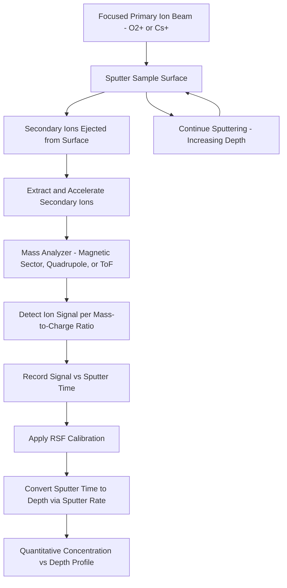

## Secondary Ion Mass Spectrometry

### Overview

Secondary ion mass spectrometry (SIMS) is a destructive, highly sensitive analytical technique that determines the elemental and isotopic composition of a sample's surface and near-surface region by sputtering the sample with a focused primary ion beam and mass-analyzing the secondary ions ejected from the surface. SIMS is distinguished among semiconductor characterization techniques by its exceptional sensitivity — capable of detecting dopant and impurity concentrations down to parts-per-billion levels — and its ability to generate quantitative depth profiles of elemental concentration, making it the primary technique for dopant profiling and trace contamination analysis in semiconductor process development and failure analysis.

**Key Points**

- SIMS achieves detection limits far exceeding most other compositional analysis techniques (commonly parts-per-million to parts-per-billion depending on element and matrix), making it uniquely suited to characterizing low-concentration dopants and trace contaminants
- The technique is inherently destructive, since material is continuously sputtered away to generate a depth profile, precluding repeated measurement of the same volume
- Depth profiling capability — measuring concentration as a function of depth by sputtering progressively into the sample — is a defining strength, directly supporting dopant profile verification against process simulation targets

---

### Fundamental Operating Principles

#### Sputtering and Secondary Ion Generation

A focused primary ion beam (commonly oxygen ions, O2+, or cesium ions, Cs+, chosen based on the elements of interest and desired ionization enhancement) bombards the sample surface with sufficient energy to sputter away surface atoms. A small fraction of the sputtered atoms are ejected as charged ions (secondary ions) rather than neutral atoms, and it is specifically these secondary ions that are collected, mass-separated, and detected — since only charged species can be manipulated and analyzed by the mass spectrometer.

**Key Points**

- Oxygen primary beams enhance positive secondary ion yield for many electropositive elements, making O2+ bombardment common for detecting elements that readily form positive ions
- Cesium primary beams enhance negative secondary ion yield, making Cs+ bombardment preferred for elements that more readily form negative ions
- The ionization probability (fraction of sputtered atoms that leave as ions rather than neutrals) varies dramatically by element and by the local chemical matrix, meaning SIMS signal intensity is not simply proportional to concentration without careful calibration — a phenomenon termed the "matrix effect"

#### Mass Analysis

Once generated, secondary ions are extracted, accelerated, and separated by mass-to-charge ratio using one of several mass analyzer architectures:

- **Magnetic Sector**: Uses a magnetic field to separate ions by mass-to-charge ratio based on differing radii of curvature in the field, offering high mass resolution capable of resolving isobaric interferences (different species with very similar mass-to-charge ratios)
- **Quadrupole**: Uses oscillating electric fields between four parallel rods to selectively transmit ions of a chosen mass-to-charge ratio, offering fast mass switching (useful for depth profiling multiple elements quasi-simultaneously) at generally lower mass resolution than magnetic sector instruments
- **Time-of-Flight (ToF-SIMS)**: Measures the time for ions to traverse a field-free flight tube after a pulsed extraction, with lighter ions arriving sooner than heavier ions; this architecture enables simultaneous detection of the full mass spectrum for each primary ion pulse, providing high sensitivity and full mass-range parallel detection, at some trade-off in absolute mass resolution and quantification complexity relative to magnetic sector instruments for pure depth profiling

[Inference] Magnetic sector instruments are generally favored for quantitative dopant depth profiling in semiconductor applications where high mass resolution and well-established quantification protocols are prioritized, while ToF-SIMS is generally favored for surface-sensitive molecular/organic contamination analysis and imaging applications where full-spectrum parallel detection and higher lateral resolution are more valuable, though the specific instrument choice depends on the exact analytical goal.

---

### Depth Profiling

#### Sputtering-Based Depth Resolution

As the primary ion beam continuously sputters the sample surface, the depth into the sample increases with sputtering time (and total ion dose), while the secondary ion signal for elements of interest is continuously monitored, producing a plot of elemental concentration (converted from raw ion count via calibration) versus depth.

$$\text{Depth} = \text{Sputter Rate} \times \text{Sputter Time}$$

The sputter rate must be independently calibrated (commonly via profilometry of the resulting sputter crater after the measurement) to convert the measured time axis into an accurate depth axis.

#### Depth Resolution Limiting Factors

- **Ion Beam Mixing**: The primary ion beam itself causes some atomic mixing/displacement near the sputtered surface (a form of ion-beam-induced damage), which fundamentally limits how sharply a true concentration discontinuity (e.g., an abrupt doping junction) can be resolved in the measured depth profile
- **Surface Roughening**: Progressive sputtering can induce or amplify surface roughness, which degrades depth resolution deeper into the profile since the sputtered surface is no longer perfectly planar
- **Crater Edge Effects**: To avoid contributions from the sputter crater's sloped sidewalls (which would represent a range of depths simultaneously, corrupting the profile), only secondary ions from the flat central region of the crater floor are gated/collected for analysis, typically via electronic or optical gating

**Example**

A shallow, abrupt dopant implant profile intended to have a sharp junction at a specific depth will, in the measured SIMS profile, show some finite transition width rather than a perfectly sharp step, reflecting the convolution of the true concentration profile with the depth-resolution-limiting effects of ion beam mixing — meaning the measured profile's steepness near the junction reflects both true dopant distribution and instrumental depth resolution limits.

---

### Quantification and Calibration

#### Relative Sensitivity Factors (RSF)

Because ionization probability varies by element and matrix (the matrix effect), raw secondary ion counts cannot be directly converted to absolute concentration without calibration. The standard approach uses ion-implanted reference standards — samples implanted with a precisely known dose of the element of interest — to establish a relative sensitivity factor (RSF) that converts measured ion signal to absolute concentration for that specific element in that specific matrix.

$$C(x) = RSF \times \frac{I_{element}(x)}{I_{matrix}}$$

where $C(x)$ is concentration at depth $x$, $I_{element}(x)$ is the measured secondary ion intensity for the element of interest at that depth, and $I_{matrix}$ is a reference matrix ion signal used for normalization (helping correct for sputter rate or instrumental drift over the course of the measurement).

**Key Points**

- RSF calibration is matrix-specific, meaning an RSF established for a dopant in silicon is not directly applicable to the same dopant in a different material (e.g., silicon-germanium or silicon dioxide) without separate calibration in that matrix
- Ion-implanted reference standards, with precisely known total implanted dose (verifiable independently), provide the calibration foundation for quantitative SIMS analysis, since the total dose can be compared against the integrated area under the measured SIMS depth profile
- [Unverified] The exact achievable quantification accuracy varies by element, matrix, and concentration range, and is generally best characterized and documented for well-established dopant/matrix combinations (e.g., common dopants in silicon) with a longer history of calibration standard development

---

### Applications in Semiconductor Characterization

#### Dopant Profiling

The primary and most established application of SIMS in semiconductor fabrication: verifying that ion implantation and subsequent thermal processing (anneal, diffusion) produce the intended dopant concentration profile as a function of depth, critical for confirming device electrical characteristics will meet design targets before full electrical characterization is possible or practical.

#### Trace Contamination Analysis

SIMS's exceptional sensitivity makes it valuable for detecting trace metallic or other contamination at levels that could affect device reliability or yield but would be undetectable by less sensitive compositional techniques (e.g., EDS in SEM/TEM), supporting root-cause investigation of yield excursions traced to contamination sources.

#### Thin Film Interface and Diffusion Studies

Depth profiling across engineered multilayer stacks can reveal unwanted interdiffusion between layers (e.g., metal diffusion into a dielectric, or dopant diffusion beyond its intended profile during subsequent thermal processing), supporting process integration and thermal budget optimization.

---

### Comparison: SIMS vs. Other Compositional Analysis Techniques

| Technique | Detection Limit | Depth Profiling? | Destructive? | Lateral Resolution |
| --- | --- | --- | --- | --- |
| SIMS | ppm to ppb (element-dependent) | Yes (native capability) | Yes | Moderate (beam spot dependent) |
| EDS (in SEM/TEM) | ~0.1-1 wt% (element-dependent) | Limited (requires cross-section) | No (SEM) / Yes (TEM sample prep) | High (TEM), moderate (SEM) |
| EELS (in TEM) | Better than EDS for light elements | Limited (requires cross-section) | Yes (TEM sample prep) | Very high |
| XRR | N/A (structural, not elemental) | Yes (via layer model) | No | N/A (averaged over beam footprint) |

[Inference] SIMS is generally positioned as the technique of choice specifically when trace-level elemental sensitivity and native depth-profiling capability are simultaneously required — most notably dopant profiling — a combination that EDS/EELS (better suited to higher-concentration compositional mapping at high spatial resolution) and purely structural techniques like XRR do not provide.

---

### Diagram: SIMS Depth Profiling Workflow (Mermaid)

---

### Diagram: SIMS Crater Gating Concept (svg_diagram)

<svg xmlns="http://www.w3.org/2000/svg" viewBox="0 0 700 380">
<rect x="0" y="0" width="700" height="380" fill="#ffffff" />
<text x="350" y="25" font-size="16" text-anchor="middle" font-family="sans-serif" font-weight="bold">SIMS Sputter Crater and Gating (svg_diagram)</text>
<path d="M 100 100 L 250 100 L 300 220 L 400 220 L 450 100 L 600 100 L 600 130 L 460 130 L 410 250 L 290 250 L 240 130 L 100 130 Z" fill="#d9d9d9" stroke="#333" stroke-width="1.5" />
<text x="350" y="80" font-size="11" text-anchor="middle" font-family="sans-serif">Sample surface</text>
<rect x="300" y="220" width="100" height="30" fill="#a8d5e2" stroke="#333" stroke-width="1" />
<text x="350" y="270" font-size="10" text-anchor="middle" font-family="sans-serif">Crater floor (flat, gated region)</text>
<line x1="240" y1="180" x2="290" y2="235" stroke="#e74c3c" stroke-width="2" stroke-dasharray="3,2" />
<line x1="460" y1="180" x2="410" y2="235" stroke="#e74c3c" stroke-width="2" stroke-dasharray="3,2" />
<text x="150" y="180" font-size="10" font-family="sans-serif" fill="#e74c3c">Sloped crater walls</text>
<text x="150" y="195" font-size="10" font-family="sans-serif" fill="#e74c3c">(excluded from analysis)</text>

<text x="350" y="320" font-size="10" text-anchor="middle" font-family="sans-serif" font-style="italic">Only ions from the flat central crater floor are collected,</text>

<text x="350" y="335" font-size="10" text-anchor="middle" font-family="sans-serif" font-style="italic">avoiding depth-ambiguous signal from sloped crater edges</text>

</svg>

---

### Practical Limitations and Failure Modes

**Key Points**

- **Destructive analysis**: Sample material is permanently consumed during sputtering, precluding repeated measurement of the identical volume and requiring a dedicated sample (or dedicated sample region) for each SIMS measurement
- **Matrix effect**: Ionization probability's strong dependence on local chemical environment means quantification requires matrix-matched calibration standards, and analysis of complex or unusual matrices without established RSF calibration introduces additional quantification uncertainty
- **Depth resolution degradation**: Ion beam mixing and progressive surface roughening fundamentally limit how sharply concentration transitions can be resolved, particularly for profiles extending to greater depths where accumulated roughening effects are more pronounced
- **Lateral resolution trade-off**: While modern SIMS instruments (particularly ToF-SIMS configurations) can achieve reasonably fine lateral resolution for imaging applications, achieving both high lateral resolution and high depth-profiling sensitivity simultaneously involves inherent trade-offs in primary beam spot size, current, and dwell time

---

### Next Steps

- Ion implantation process fundamentals and dopant profile engineering (upstream process this technique verifies)
- Relative sensitivity factor (RSF) calibration standard development and ion-implanted reference wafers
- ToF-SIMS imaging for lateral elemental distribution mapping
- EDS and EELS as complementary compositional techniques with different sensitivity/resolution trade-offs (cross-reference with prior TEM topic)
- Contamination root-cause analysis workflows in yield excursion investigation
- Atom probe tomography as a complementary 3D atomic-scale compositional technique
- Rutherford backscattering spectrometry (RBS) as an alternative depth-profiling technique for specific applications