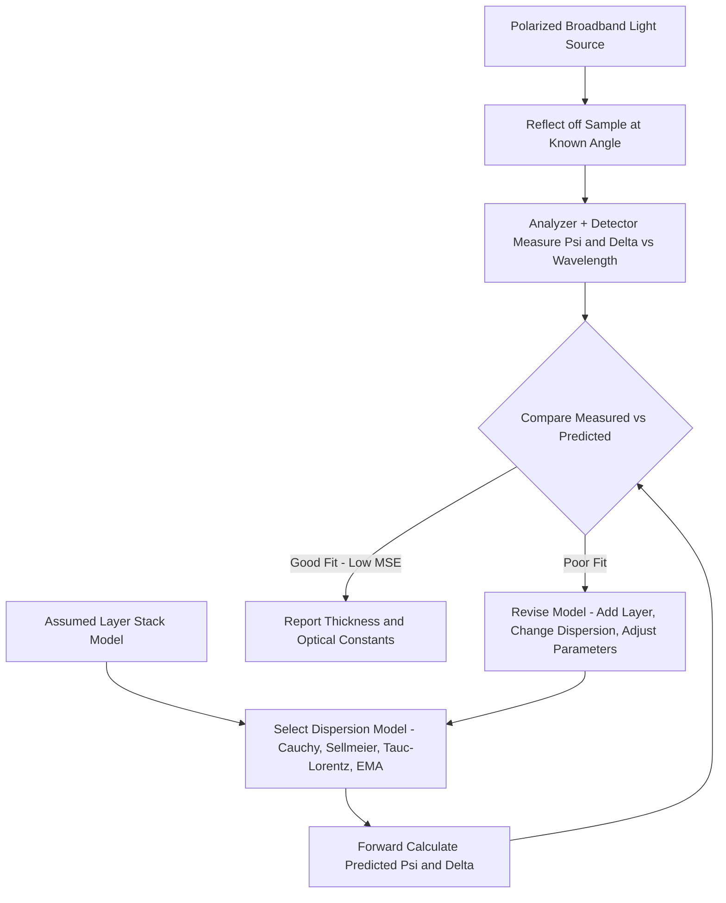

## Ellipsometry for Film Measurement

### Overview

Ellipsometry is a non-destructive optical measurement technique that determines thin-film thickness and optical constants by measuring the change in polarization state of light reflected from a sample surface. Because polarization change is exquisitely sensitive to interface reflections and film thickness — often to sub-nanometer precision — ellipsometry is one of the most widely deployed in-line metrology techniques for dielectric, semiconductor, and metal thin-film thickness measurement throughout the fabrication flow, particularly for films too thin for reliable measurement by simpler reflectance-only methods.

**Key Points**

- Ellipsometry measures two parameters ($\Psi$ and $\Delta$) at each wavelength rather than a single reflectance intensity value, providing more information content per measurement than simple reflectometry and enabling simultaneous determination of thickness and optical constants
- Spectroscopic ellipsometry (measuring across a range of wavelengths) is the dominant modern implementation, since a single-wavelength measurement generally cannot uniquely determine both thickness and optical constants for an unknown film without additional assumptions
- As with scatterometry, ellipsometry is a model-based, indirect measurement technique: the physical parameters of interest are extracted by fitting a parametric optical model to the measured polarization response, rather than being directly imaged or observed

---

### Fundamental Principle

#### Polarization Change Upon Reflection

When linearly polarized light (containing both p-polarized and s-polarized components, referring to polarization parallel and perpendicular to the plane of incidence respectively) reflects from a sample surface, the p- and s-polarized components generally experience different amplitude attenuation and different phase shifts, converting the initially linear polarization into elliptical polarization — hence the technique's name. Ellipsometry measures this transformation, characterized by the complex reflectance ratio:

$$\rho = \tan(\Psi) \cdot e^{i\Delta} = \frac{r_p}{r_s}$$

where $r_p$ and $r_s$ are the complex Fresnel reflection coefficients for p- and s-polarized light respectively, $\Psi$ (psi) represents the amplitude ratio component (related to the relative reflectance magnitude of p- versus s-polarization), and $\Delta$ (delta) represents the phase difference introduced between the two polarization components upon reflection.

#### Sensitivity to Film Properties

Both $\Psi$ and $\Delta$ depend on the film's thickness, its complex refractive index (optical constants $n$ and $k$, where $n$ is the real refractive index and $k$ is the extinction coefficient describing absorption), the substrate's optical properties, the angle of incidence, and the wavelength of light. Because $\Delta$ (the phase term) is particularly sensitive to very thin films — even sub-nanometer changes in thickness can produce measurable phase shifts — ellipsometry achieves thickness sensitivity substantially finer than techniques relying solely on reflected intensity magnitude, which is comparatively less sensitive to sub-wavelength thickness changes.

**Example**

A native oxide layer only 1-2 nm thick on a silicon surface, which would be extremely difficult to detect via simple reflectance intensity measurement (since such a thin film produces only a minute intensity change), produces a measurable and quantifiable phase shift in $\Delta$, allowing ellipsometry to reliably detect and measure such ultra-thin films.

---

### Instrumentation

#### Basic Configuration

A typical ellipsometer consists of a light source, a polarizer (to generate known input polarization state), the sample under test, an analyzer (a second polarizing element, positioned after reflection, to analyze the resulting polarization state), and a detector. Additional optical elements (compensators/retarders) are incorporated in more advanced configurations to enable full characterization of the polarization ellipse, including its handedness (rotation direction).

#### Rotating-Element Configurations

- **Rotating Analyzer Ellipsometry (RAE)**: The analyzer is continuously rotated while a fixed polarizer sets the input polarization state; the resulting time-varying detector signal is analyzed (via Fourier analysis) to extract $\Psi$ and $\Delta$
- **Rotating Compensator Ellipsometry (RCE)**: A rotating compensator (retarder) is used in addition to fixed polarizer/analyzer elements, offering improved measurement of the full polarization state (including sign/handedness of $\Delta$) compared to simpler rotating-analyzer configurations without a compensator
- **Phase-Modulated Ellipsometry**: Uses an electro-optic modulator to rapidly and periodically modulate polarization state, enabling very fast data acquisition suitable for time-resolved or high-throughput measurement applications

[Inference] The choice among these configurations generally reflects a trade-off between measurement speed, precision, and the ability to unambiguously resolve certain polarization states (such as circular or near-circular polarization, which some simpler configurations struggle to characterize completely), with more sophisticated multi-element configurations generally offering more complete and robust polarization state determination at correspondingly greater instrument complexity.

#### Spectroscopic Operation

Modern semiconductor-fab ellipsometers almost universally operate spectroscopically, measuring $\Psi$ and $\Delta$ across a broad wavelength range (commonly spanning ultraviolet through near-infrared) rather than at a single wavelength, since the additional spectral data points provide the constraint needed to simultaneously solve for both film thickness and wavelength-dependent optical constants without requiring these to be independently known in advance.

---

### Model-Based Data Analysis

#### Optical Models

Extracting physical parameters from measured $\Psi(\lambda)$ and $\Delta(\lambda)$ spectra requires an assumed optical model describing the film stack: the number of layers, each layer's thickness, and each layer's dispersion relation (how $n$ and $k$ vary with wavelength). Common dispersion models include:

- **Cauchy Model**: A simple empirical dispersion relation suitable for transparent dielectric materials in the visible/near-infrared range, expressing refractive index as a polynomial function of wavelength
- **Sellmeier Model**: Another empirical dispersion relation commonly used for transparent optical materials, often providing better accuracy than Cauchy over broader spectral ranges
- **Tauc-Lorentz and Cody-Lorentz Models**: Physically-motivated dispersion models incorporating absorption behavior near a material's bandgap, commonly used for semiconductor and amorphous dielectric materials that exhibit measurable absorption in part of the measured spectral range
- **Effective Medium Approximation (EMA)**: Used to model mixed or composite materials (e.g., a film with some porosity, or an interfacial layer that is a physical mixture of two known materials) by treating the mixed layer's effective optical constants as a weighted combination of the constituent materials' known optical constants

#### Regression Fitting Workflow

1. Construct a layered optical model matching the expected physical structure of the sample (substrate plus one or more films, each with an assumed dispersion model and unknown thickness/composition parameters)
2. Perform forward calculation of the model's predicted $\Psi(\lambda)$ and $\Delta(\lambda)$ spectra using standard thin-film optical formulas (based on Fresnel equations extended to multilayer stacks)
3. Compare predicted spectra against measured data and iteratively adjust free model parameters (typically via a least-squares regression algorithm) to minimize the difference, commonly quantified via a mean-squared-error (MSE) goodness-of-fit metric
4. Accept the best-fit parameter values as the reported measurement result, provided the goodness-of-fit metric falls within an acceptable threshold

**Example**

Measuring a gate dielectric film on silicon might use a model consisting of a silicon substrate (with well-established, tabulated optical constants), an interfacial native oxide layer of assumed fixed or lightly-constrained thickness, and the dielectric film of interest (with thickness as the primary free-fit parameter, and either fixed literature optical constants or a Cauchy/Tauc-Lorentz model with a small number of additional free parameters if the film's exact optical properties are not precisely known in advance).

---

### Comparison: Ellipsometry vs. Spectroscopic Reflectometry vs. Scatterometry

| Parameter | Spectroscopic Reflectometry | Spectroscopic Ellipsometry | Scatterometry (OCD, general) |
| --- | --- | --- | --- |
| Measured quantity | Reflected intensity vs. wavelength | Psi and Delta (polarization change) vs. wavelength | Reflectance or Psi/Delta from periodic structure |
| Sensitivity to ultra-thin films | Lower (intensity-only) | Higher (phase-sensitive) | Comparable to underlying measurement mode used |
| Target structure | Typically blanket/unpatterned film | Typically blanket/unpatterned film | Periodic grating/array structure |
| Primary use case | Simple film thickness on non-critical layers | Precise thickness/optical constants for critical thin films | Line/space CD and profile measurement |

[Inference] Ellipsometry is generally understood as a specific measurement modality that can itself be applied within a scatterometry (OCD) context when measuring periodic structures, meaning the distinction is not strictly categorical: ellipsometric scatterometry (measuring Psi/Delta from a periodic grating target) combines the polarization sensitivity of ellipsometry with the sub-wavelength CD sensitivity that periodic-structure-based OCD provides, and both blanket-film ellipsometry and grating-based ellipsometric scatterometry are used depending on whether the metrology target is an unpatterned film or a periodic device-relevant structure.

---

### Applications in Semiconductor Fabrication

| Application | Role of Ellipsometry |
| --- | --- |
| Gate dielectric thickness | Precise sub-nanometer thickness monitoring of thin gate oxide/high-k films |
| Native oxide characterization | Detecting and quantifying thin native oxide layers on silicon or other surfaces |
| Photoresist thickness | Monitoring resist film thickness uniformity after coating, prior to exposure |
| Interlayer dielectric (ILD) thickness | Thickness and, via appropriate models, porosity/density-related optical constant monitoring for low-k dielectrics |
| Thin metal film characterization | Optical constant and thickness determination for thin metal or barrier layers, where applicable |
| Scatterometry model foundation | Ellipsometric measurement of blanket reference films provides tabulated optical constants used as inputs to scatterometry models for patterned structures |

---

### Diagram: Ellipsometry Measurement Principle (svg_diagram)

<svg xmlns="http://www.w3.org/2000/svg" viewBox="0 0 700 400">
<rect x="0" y="0" width="700" height="400" fill="#ffffff" />
<text x="350" y="25" font-size="16" text-anchor="middle" font-family="sans-serif" font-weight="bold">Ellipsometry Measurement Principle (svg_diagram)</text>
<line x1="150" y1="80" x2="320" y2="200" stroke="#333" stroke-width="2" />
<polygon points="310,190 325,198 315,205" fill="#333" />
<text x="120" y="70" font-size="10" font-family="sans-serif">Polarizer</text>
<ellipse cx="200" cy="120" rx="8" ry="20" fill="none" stroke="#3498db" stroke-width="2" transform="rotate(60 200 120)" />
<text x="130" y="140" font-size="9" font-family="sans-serif" fill="#3498db">Linear polarization</text>
<rect x="280" y="200" width="140" height="15" fill="#a8d5e2" stroke="#333" />
<text x="350" y="195" font-size="10" text-anchor="middle" font-family="sans-serif">Thin film</text>
<rect x="280" y="215" width="140" height="40" fill="#999999" stroke="#333" />
<text x="350" y="240" font-size="10" text-anchor="middle" font-family="sans-serif" fill="#fff">Substrate</text>
<line x1="320" y1="200" x2="490" y2="80" stroke="#333" stroke-width="2" />
<polygon points="480,88 495,78 490,95" fill="#333" />
<text x="500" y="70" font-size="10" font-family="sans-serif">Analyzer + Detector</text>
<ellipse cx="420" cy="120" rx="18" ry="8" fill="none" stroke="#e74c3c" stroke-width="2" transform="rotate(-60 420 120)" />
<text x="440" y="150" font-size="9" font-family="sans-serif" fill="#e74c3c">Elliptical polarization</text>

<text x="350" y="300" font-size="11" text-anchor="middle" font-family="sans-serif">Reflection converts linear polarization to elliptical</text>

<text x="350" y="320" font-size="11" text-anchor="middle" font-family="sans-serif">Measured as Psi (amplitude ratio) and Delta (phase difference)</text>

</svg>

---

### Diagram: Spectroscopic Ellipsometry Model-Fitting Workflow (Mermaid)

---

### Practical Limitations and Considerations

**Key Points**

- **Model dependency**: As with scatterometry, ellipsometry results are only as accurate as the assumed optical model; an unmodeled interfacial layer, incorrect dispersion relation choice, or unaccounted-for surface roughness can introduce systematic measurement errors even when goodness-of-fit appears acceptable
- **Parameter correlation**: For very thin films or films with optical constants similar to the substrate, thickness and optical constant parameters can become correlated in the fitting process (multiple combinations produce similarly good fits), requiring additional constraints (fixed optical constants from reference measurements, multi-angle data, or complementary techniques) to resolve ambiguity
- **Substrate/backside reflections**: For transparent substrates, unwanted reflections from the sample backside can corrupt the measured signal if not properly managed (e.g., via backside roughening or appropriate optical modeling to account for the additional reflection path)
- **Spot size and averaging**: The measurement represents an average over the illuminated spot area, meaning ellipsometry (like most optical techniques) reports a spatially-averaged result rather than point-by-point atomic-scale information, distinguishing it from techniques like AFM or TEM that can resolve finer spatial detail at the cost of throughput

---

### Next Steps

- Scatterometry (optical critical dimension metrology) as the periodic-structure extension of ellipsometric/reflectometric principles (cross-reference with prior topic)
- Dispersion model selection and effective medium approximation (EMA) for composite/porous film characterization
- X-ray reflectometry (XRR) as a complementary technique for ultra-thin film thickness independent of optical constants (cross-reference with prior topic)
- Mueller matrix ellipsometry for anisotropic and depolarizing sample characterization
- In-situ ellipsometry for real-time deposition/etch process monitoring
- Reference optical constant libraries and their role in fab-wide metrology model consistency
- Low-k dielectric porosity characterization via ellipsometric porosimetry