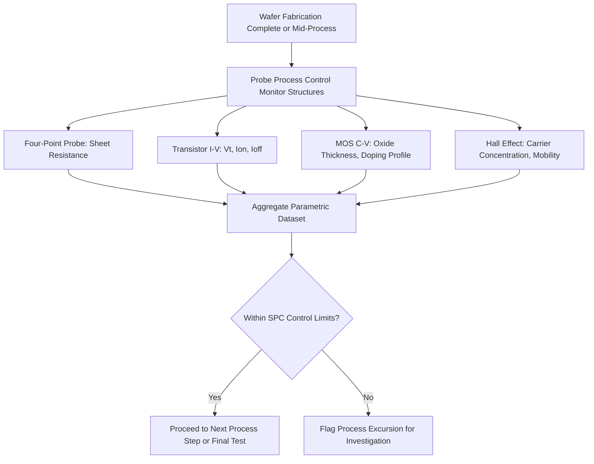

## Electrical Characterization Methods

### Overview

Electrical characterization methods encompass the family of techniques that measure a semiconductor device's or material's electrical response — current, voltage, capacitance, resistance — to directly assess functional performance, extract material and device parameters, and detect defects. Unlike the structural and compositional metrology techniques covered elsewhere (optical microscopy, scatterometry, SEM, TEM, AFM, XRD/XRR, SIMS, ellipsometry), electrical characterization directly measures the parameter that ultimately determines device functionality, making it the final and most functionally definitive verification step in the fabrication and qualification flow, typically performed after structural fabrication is complete or at dedicated test structures throughout the process.

**Key Points**

- Electrical characterization is generally the most directly functionally relevant metrology category, since it measures the electrical behavior that determines whether a device actually works as intended, rather than inferring functional adequacy from structural or compositional proxies
- Techniques range from simple resistance/current-voltage measurements to sophisticated capacitance-based profiling and non-contact optical/electron-beam-based electrical probing
- Electrical test structures (dedicated, simplified structures separate from functional product die) are commonly used throughout the wafer to enable rapid, standardized electrical monitoring without requiring full device/circuit-level test

---

### Current-Voltage (I-V) Characterization

#### Basic Principle

I-V characterization applies a controlled voltage (or current) across a device or test structure and measures the resulting current (or voltage) response, generating a current-voltage curve that reveals fundamental electrical behavior — resistance, diode rectification characteristics, transistor switching behavior, or breakdown characteristics, depending on the structure under test.

#### Applications

- **Sheet Resistance Measurement**: Using specialized test structures (commonly four-point probe or van der Pauw configurations, discussed further below) to determine the sheet resistance of a conducting layer (implanted/diffused region, metal line, silicide), which directly relates to dopant concentration/activation or metal line quality
- **Diode Characteristics**: Measuring p-n junction I-V behavior to extract parameters such as ideality factor, saturation current, and breakdown voltage, informing junction quality and defect density assessment
- **Transistor I-V Curves**: Measuring drain current versus gate voltage (transfer characteristics) and drain current versus drain voltage (output characteristics) to extract key transistor parameters including threshold voltage, subthreshold slope, on-current, off-current, and channel mobility-related parameters
- **Contact Resistance**: Measuring resistance across metal-semiconductor contacts, often via specialized test structures (e.g., Kelvin structures or transfer length method, TLM, structures) designed to separate contact resistance from series/sheet resistance contributions

#### Four-Point Probe and Van der Pauw Methods

Standard two-point resistance measurement suffers from probe contact resistance corrupting the measurement of the material's true resistance. Four-point probe methods eliminate this issue by using separate current-carrying and voltage-sensing probe pairs:

$$R_s = \frac{\pi}{\ln 2} \cdot \frac{V}{I} \approx 4.532 \cdot \frac{V}{I}$$

for a standard collinear four-point probe configuration on a semi-infinite thin sheet, where $R_s$ is sheet resistance, $V$ is measured voltage, and $I$ is applied current, with the probe geometry factor ($\pi / \ln 2$) derived from the specific electrode arrangement and sample geometry assumptions.

**Key Points**

- Because voltage is measured through a separate high-impedance probe pair carrying negligible current, contact resistance at the voltage-sensing probes does not corrupt the measurement, isolating the true sheet resistance of the material
- Van der Pauw structures (a specific four-terminal test structure geometry) allow sheet resistance measurement on arbitrarily shaped samples without requiring the specific collinear probe geometry, provided certain sample geometry and contact placement conditions are met
- Sheet resistance measurement via these methods is a standard, high-throughput in-line monitor for verifying implant/anneal activation and metal line resistance across the wafer

---

### Capacitance-Voltage (C-V) Characterization

#### Basic Principle

C-V characterization measures the capacitance of a metal-oxide-semiconductor (MOS) or similar capacitor structure as a function of applied bias voltage, revealing information about oxide thickness, doping concentration/profile in the semiconductor, and interface/oxide charge/trap characteristics that current-based measurements alone cannot directly provide.

#### MOS Capacitor C-V Behavior

A MOS capacitor's C-V curve exhibits characteristic regions (accumulation, depletion, inversion) as bias voltage is swept, with the specific shape and transition voltages of the curve encoding information about oxide capacitance (related to oxide thickness), semiconductor doping concentration, and flat-band voltage (which itself reflects oxide charge and work function differences).

$$C_{ox} = \frac{\epsilon_{ox} \cdot A}{t_{ox}}$$

where $C_{ox}$ is the oxide (accumulation-region) capacitance, $\epsilon_{ox}$ is the oxide's permittivity, $A$ is capacitor area, and $t_{ox}$ is oxide thickness — providing a direct electrical route to oxide thickness determination, complementary to optical (ellipsometry) or structural (TEM) thickness measurement.

#### Doping Profile Extraction

By analyzing how capacitance in the depletion region varies with applied bias, C-V measurement can extract the semiconductor's doping concentration as a function of depth beneath the oxide-semiconductor interface, providing an electrical complement to SIMS-based dopant profiling — with C-V sensitive specifically to electrically active (ionized) dopants, in contrast to SIMS which measures total elemental concentration regardless of electrical activation state.

**Key Points**

- C-V-derived doping profiles reflect electrically active dopant concentration, which can differ from the total chemical dopant concentration measured by SIMS if a fraction of implanted dopant atoms are not fully electrically activated (e.g., due to incomplete anneal or dopant clustering/deactivation)
- Interface trap density and oxide charge can be extracted from characteristic distortions or shifts in the C-V curve shape relative to an ideal theoretical curve, providing insight into oxide/interface quality relevant to device reliability
- High-frequency versus low-frequency (quasi-static) C-V measurements probe different physical response mechanisms (interface traps respond differently at different measurement frequencies), and comparing the two provides additional diagnostic information about interface trap density

---

### Hall Effect Measurement

#### Principle

When a current-carrying sample is placed in a magnetic field perpendicular to the current flow, the Lorentz force on moving charge carriers produces a transverse voltage (the Hall voltage), whose magnitude and sign depend on carrier density, carrier type (electron versus hole), and carrier mobility.

$$R_H = \frac{V_H \cdot t}{I \cdot B}$$

where $R_H$ is the Hall coefficient, $V_H$ is measured Hall voltage, $t$ is sample thickness, $I$ is applied current, and $B$ is applied magnetic field strength. The sign of $R_H$ indicates majority carrier type, and its magnitude relates inversely to carrier concentration.

**Key Points**

- Combined with a separate sheet resistance measurement (e.g., via van der Pauw configuration on the same structure), Hall measurement enables extraction of carrier mobility, since mobility relates sheet resistance and carrier concentration
- Hall measurement is particularly valuable for characterizing carrier concentration and mobility in materials or layers where these parameters are not otherwise straightforward to determine — relevant for novel channel materials, compound semiconductors, or verifying dopant activation efficiency
- [Unverified] The specific measurement configuration and required sample geometry constraints (van der Pauw versus other geometries) should be selected based on the specific material system and available sample structure, as different geometries carry different assumptions and correction factor requirements

---

### Non-Contact and Specialized Electrical Characterization

#### Corona-Oxide-Semiconductor (COS) Non-Contact C-V

A non-contact variant of C-V measurement in which a controlled electrostatic charge is deposited on the sample surface via a corona discharge (rather than a physical metal contact/gate electrode), and the resulting surface potential is measured via a non-contact electrostatic probe (e.g., Kelvin probe), enabling C-V-like characterization without requiring a fabricated gate electrode — useful for early-stage or blanket-film electrical characterization before device patterning is complete.

#### Electron Beam Induced Current (EBIC)

An SEM-based technique in which the electron beam itself generates electron-hole pairs within a semiconductor sample, and the resulting induced current (or corresponding voltage) is measured and spatially mapped as the beam is scanned, revealing the location and characteristics of p-n junctions, defects, or other regions with locally varying carrier collection efficiency — providing spatially-resolved electrical information overlaid on the SEM platform's imaging capability.

#### Scanning Capacitance Microscopy (SCM) / Scanning Spreading Resistance Microscopy (SSRM)

AFM-based techniques (introduced briefly in the AFM topic) that combine topographic imaging with simultaneous local capacitance (SCM) or spreading resistance (SSRM) measurement at each scan point, enabling two-dimensional dopant concentration mapping with nanoscale spatial resolution — relevant for characterizing lateral and vertical dopant distribution in cross-sectioned device structures at a spatial resolution finer than what conventional electrical test structures can provide.

---

### Comparison: Electrical Characterization Techniques

| Technique | Primary Parameter Extracted | Contact Type | Spatial Resolution |
| --- | --- | --- | --- |
| Four-point probe / Van der Pauw | Sheet resistance | Physical contact | Macroscopic (probe spacing-dependent) |
| Transistor I-V | Threshold voltage, on/off current, mobility-related parameters | Physical contact (device terminals) | Device-level |
| MOS C-V | Oxide thickness, doping profile, interface trap density | Physical contact (gate electrode) | Device/capacitor-level |
| Hall effect | Carrier concentration, carrier type, mobility | Physical contact | Macroscopic (structure-level) |
| Corona-oxide-semiconductor (COS) | Doping, oxide charge (non-contact) | Non-contact (corona charge + electrostatic probe) | Blanket film / large-area |
| EBIC | Junction location, defect-related carrier collection | Non-contact (electron beam) | Sub-micron (beam-limited) |
| SCM / SSRM | 2D dopant concentration mapping | Physical (AFM tip contact) | Nanoscale |

[Inference] The choice among these techniques generally reflects the specific parameter of interest and the fabrication stage: macroscopic contact-based methods (four-point probe, Hall, standard I-V/C-V) dominate routine in-line and test-structure-based monitoring due to their standardization and throughput, while spatially-resolved techniques (EBIC, SCM/SSRM) are generally reserved for targeted failure analysis or research characterization requiring sub-device-level spatial information.

---

### Test Structures and In-Line Electrical Monitoring

#### Process Control Monitors (PCM)

Dedicated test structures — distinct from functional product circuitry — are commonly placed in scribe lines or designated die locations across the wafer specifically to enable standardized electrical measurement of key process parameters (sheet resistance, contact resistance, transistor parametric characteristics, capacitor characteristics) without requiring full product-level functional test, supporting rapid process control feedback and wafer-level uniformity assessment.

#### Parametric Test Flow

1. **Wafer-Level Parametric Test**: Automated probing of PCM structures across the wafer, extracting key electrical parameters (sheet resistance, threshold voltage, leakage current, etc.) at multiple sites to assess both absolute values and within-wafer uniformity
2. **Statistical Process Control (SPC) Comparison**: Extracted parameters are compared against established control limits to detect process excursions before proceeding to more time-consuming full functional/reliability test
3. **Correlation to Final Test Yield**: Parametric test data is often correlated with downstream functional test yield to identify which specific electrical parameters are most predictive of final device performance and yield, informing which parameters warrant the tightest process control

---

### Diagram: Four-Point Probe Sheet Resistance Measurement (svg_diagram)

<svg xmlns="http://www.w3.org/2000/svg" viewBox="0 0 700 350">
<rect x="0" y="0" width="700" height="350" fill="#ffffff" />
<text x="350" y="25" font-size="16" text-anchor="middle" font-family="sans-serif" font-weight="bold">Four-Point Probe Configuration (svg_diagram)</text>
<rect x="100" y="180" width="500" height="30" fill="#a8d5e2" stroke="#333" stroke-width="1.5" />
<text x="350" y="230" font-size="11" text-anchor="middle" font-family="sans-serif">Conducting film / implanted layer under test</text>
<line x1="200" y1="150" x2="200" y2="180" stroke="#333" stroke-width="2" />
<line x1="300" y1="150" x2="300" y2="180" stroke="#333" stroke-width="2" />
<line x1="400" y1="150" x2="400" y2="180" stroke="#333" stroke-width="2" />
<line x1="500" y1="150" x2="500" y2="180" stroke="#333" stroke-width="2" />

<text x="200" y="140" font-size="10" text-anchor="middle" font-family="sans-serif">Probe 1 (I+)</text>

<text x="300" y="140" font-size="10" text-anchor="middle" font-family="sans-serif">Probe 2 (V+)</text>

<text x="400" y="140" font-size="10" text-anchor="middle" font-family="sans-serif">Probe 3 (V-)</text>

<text x="500" y="140" font-size="10" text-anchor="middle" font-family="sans-serif">Probe 4 (I-)</text>

<path d="M 200 130 Q 350 90 500 130" fill="none" stroke="#e74c3c" stroke-width="2" />
<text x="350" y="80" font-size="10" text-anchor="middle" font-family="sans-serif" fill="#e74c3c">Applied current I</text>
<path d="M 300 100 Q 350 85 400 100" fill="none" stroke="#3498db" stroke-width="2" />
<text x="350" y="70" font-size="10" text-anchor="middle" font-family="sans-serif" fill="#3498db">Measured voltage V (high-impedance)</text>

<text x="350" y="280" font-size="11" text-anchor="middle" font-family="sans-serif">Rs = (pi / ln2) x (V/I) — contact resistance at voltage probes does not corrupt measurement</text>

</svg>

---

### Diagram: Parametric Test Flow (Mermaid)

---

### Practical Limitations and Failure Modes

**Key Points**

- **Contact resistance artifacts**: Simple two-point measurements are corrupted by probe/contact resistance, motivating four-point and Kelvin structure designs specifically to isolate true material or contact resistance
- **Electrically active vs. total dopant concentration**: Electrical techniques (C-V, Hall) measure electrically active carrier concentration, which can differ from total chemical dopant concentration (measured by SIMS) if activation is incomplete — meaning electrical and SIMS-based profiles can legitimately disagree without either measurement being in error
- **Test structure representativeness**: Process control monitor structures, being simplified and standardized, may not perfectly represent the electrical behavior of complex product-level circuitry, meaning parametric test data must be correlated with, rather than assumed identical to, actual product performance
- **Measurement frequency dependence (C-V)**: Interface trap response depends on measurement frequency, meaning C-V curve shape and derived interface trap density can vary with the frequency at which measurement is performed, requiring consistent and appropriate frequency selection for meaningful comparison across measurements

---

### Next Steps

- MOS capacitor physics and interface trap characterization in depth
- Transistor parametric extraction methodology (threshold voltage extraction techniques, mobility extraction)
- SIMS dopant profiling as the compositional complement to electrical doping characterization (cross-reference with prior topic)
- Scanning capacitance/spreading resistance microscopy (SCM/SSRM) for nanoscale 2D dopant mapping
- Reliability characterization: time-dependent dielectric breakdown (TDDB), hot-carrier injection, negative-bias temperature instability (NBTI)
- Statistical process control (SPC) methodology for parametric test data
- Wafer-level and die-level electrical test equipment and automated test equipment (ATE) architecture