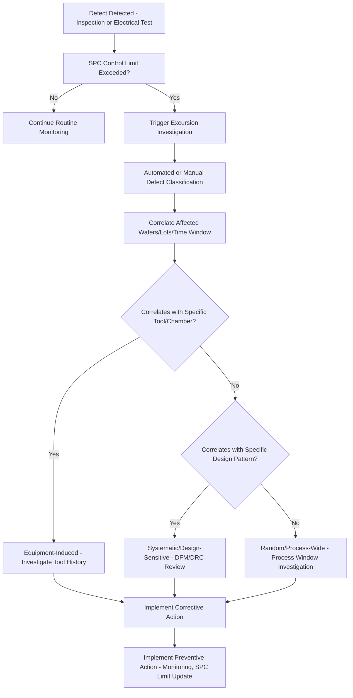

## Defect Classification and Root Cause Sources

### Overview

Defect classification and root cause analysis is the systematic practice of categorizing physical and electrical defects observed during semiconductor fabrication and tracing each defect type back to its originating process step, equipment, or material source. This discipline sits downstream of defect detection (via optical inspection, electron-beam inspection, or electrical test) and is the critical link between "a defect was found" and "the process was fixed," since detection alone does not improve yield unless the underlying cause is correctly identified and eliminated.

**Key Points**

- Defects are broadly categorized by their physical nature (particle, pattern, crystal-originated, electrical) and by their origin (process-induced, equipment-induced, material-induced, design-sensitive)
- Automated Defect Classification (ADC) systems increasingly perform initial defect binning based on image characteristics, but human/engineering review remains essential for root cause determination, particularly for novel or ambiguous defect signatures
- Effective root cause analysis depends on combining defect detection data with process/tool history (a practice often termed "yield learning" or "excursion analysis") to correlate defect occurrence with specific process conditions, tools, or time windows

---

### Defect Classification Taxonomy

#### Classification by Physical Type

- **Particle Defects**: Foreign material (dust, process byproduct residue, tool wear debris) deposited on the wafer surface, which can cause open or short circuits, pattern distortion during lithography, or nucleate subsequent defects in later layers
- **Pattern Defects**: Deviations from the intended lithographic or etched pattern geometry — bridging (unwanted connection between adjacent features), necking/pinching (unwanted narrowing), missing features, or line-edge roughness beyond specification
- **Crystal-Originated Particles (COPs) and Crystalline Defects**: Defects originating in the silicon crystal growth process itself (dislocations, stacking faults, vacancy/interstitial agglomerates), typically present in the starting substrate material rather than introduced during device fabrication
- **Film Defects**: Voids, delamination, or non-uniformity within deposited or grown thin films, which may originate from deposition process instability, contamination, or subsequent thermal/mechanical stress
- **Electrical Defects**: Defects that manifest primarily as electrical failures (opens, shorts, leakage, parametric shifts) at electrical test, which may or may not correspond to a physically visible defect depending on its nature and location

#### Classification by Detection Stage

| Detection Stage | Typical Defect Types Found |
| --- | --- |
| Incoming wafer inspection | Crystal-originated defects, substrate particles/scratches |
| Post-litho inspection | Resist pattern defects (bridging, missing features, particles) |
| Post-etch inspection | Etch-related pattern defects, residue, etch-induced particles |
| Post-CMP inspection | Scratches, dishing/erosion-related defects, slurry residue particles |
| Post-deposition inspection | Film voids, particles, non-uniformity |
| Final electrical test | Electrical opens/shorts, parametric failures, leakage |

#### Automated Defect Classification (ADC)

Modern defect inspection tools increasingly incorporate automated classification algorithms — historically rule-based image analysis, increasingly machine-learning/deep-learning-based classifiers — that automatically bin detected defects into predefined categories based on features such as size, shape, location pattern, and optical/electron-beam signature, substantially reducing the manual review burden compared to purely manual defect classification.

**Key Points**

- ADC systems improve throughput and consistency of initial defect binning but generally still require periodic human validation and retraining, particularly when new defect types or process changes introduce signatures not represented in the classifier's original training data
- [Inference] Deep-learning-based ADC approaches have increasingly supplemented or replaced purely rule-based classification in modern fabs, generally offering improved classification accuracy for complex or subtle defect signatures, though the specific implementation and maturity varies by fab and inspection tool vendor
- Even with high-accuracy ADC, root cause determination (as opposed to simple categorical binning) typically still requires engineering analysis correlating the classified defect with process/tool context

---

### Root Cause Source Categories

#### Process-Induced Defects

Defects arising from the inherent characteristics or marginal control of a specific process step, even when equipment is operating within normal parameters — for example, etch bias variation causing pattern dimension deviation, or incomplete CMP planarization causing localized film thickness non-uniformity.

**Example**

A lithography process operating near the edge of its process window for a particular feature might produce intermittent bridging defects specifically at high-density pattern regions, reflecting a process margin issue rather than a discrete equipment malfunction — requiring process window optimization (dose, focus, or resist formulation adjustment) rather than equipment repair.

#### Equipment-Induced Defects

Defects traceable to a specific tool's malfunction, contamination, or drift from its calibrated state — for example, a particle source within a specific deposition chamber, a probe card with a damaged pin causing repeatable electrical test artifacts, or a specific lithography scanner exhibiting focus drift.

**Key Points**

- Equipment-induced defects often exhibit characteristic spatial or temporal signatures — for example, a defect pattern that consistently appears at a specific wafer location correlating with a specific chamber's wafer-handling mechanism, or a defect rate that correlates with time since a specific tool's last preventive maintenance
- Chamber-matching analysis (comparing defect rates across nominally identical process chambers running the same recipe) is a standard diagnostic approach for isolating equipment-specific root causes from process-wide issues

#### Material-Induced Defects

Defects originating from incoming material quality — contaminated process chemicals, substrate material defects, or particle contamination introduced by a specific consumable (e.g., a specific lot of photoresist, a specific CMP slurry batch, or a specific gas cylinder).

[Unverified] The relative frequency of material-induced versus equipment-induced versus process-induced defects varies substantially by fab, process maturity, and specific defect type, and general industry-wide proportions should not be assumed without fab-specific data, since defect source distribution is highly context-dependent.

#### Design-Sensitive Defects (Systematic Yield Loss)

Defects that occur preferentially at specific layout patterns or design configurations — for example, a specific via arrangement that is particularly susceptible to a specific etch-related failure mode, or a specific metal routing density that induces localized CMP dishing beyond acceptable limits. These are termed "systematic" defects (as opposed to "random" defects, discussed below) because they are deterministically linked to specific design patterns rather than occurring randomly across the wafer.

---

### Systematic vs. Random Defect Distinction

#### Random Defects

Defects whose occurrence is statistically uniform (or approximately so) across the wafer and independent of the specific local design pattern — typically associated with particle contamination or other spatially random process variation sources. Random defect density is the basis for standard die-yield models (Poisson, negative binomial) discussed in the context of yield economics.

#### Systematic Defects

Defects that occur deterministically or with strongly elevated probability at specific design configurations, meaning the defect's occurrence is predictable given knowledge of the local layout pattern, independent of random particle contamination. Systematic defects require design-process co-optimization (adjusting either the design rule/layout or the process) rather than pure process control improvement, since the defect mechanism is inherently tied to the specific pattern geometry.

**Example**

A specific dense line/space pattern might be found to correlate with elevated bridging defect rates across many wafers and lots, distinguishing it as systematic (tied to that specific pattern's interaction with the lithography/etch process window) rather than random (which would show no particular correlation with local pattern geometry) — motivating either a design rule restriction on that specific pattern configuration or a targeted process window improvement for that pattern type.

**Key Points**

- Distinguishing systematic from random defects requires correlating defect location and occurrence with the underlying design database (layout pattern at each defect coordinate), a practice sometimes termed "design-based binning" or pattern-based defect analysis
- Systematic defect identification often drives design rule checking (DRC) refinements or design-for-manufacturability (DFM) guideline updates intended to avoid problematic pattern configurations in future designs
- [Inference] As process nodes shrink and process windows narrow, systematic (pattern-dependent) yield loss mechanisms generally become relatively more significant compared to purely random particle-driven yield loss, since tighter process margins make specific pattern configurations more likely to fall outside acceptable process windows even without any discrete contamination event, though the exact balance depends on process maturity and specific node/technology.

---

### Root Cause Analysis Workflow

#### Excursion Detection and Triage

1. **Statistical Process Control (SPC) Trigger**: Defect density or specific defect type count exceeds established control limits, triggering an excursion investigation
2. **Defect Review and Classification**: Automated or manual defect review (via SEM-based defect review) characterizes the specific defect signature, size, and location pattern
3. **Wafer/Lot Correlation**: Identifying which wafers, lots, or time windows are affected helps narrow the search for the responsible process step or tool
4. **Tool/Chamber Correlation**: Cross-referencing affected wafers against specific tool, chamber, or recipe usage history to identify potential equipment-specific sources
5. **Design Pattern Correlation**: Cross-referencing defect coordinates against the design database to determine whether the defect is systematic (pattern-correlated) or random

#### Corrective and Preventive Action

Once root cause is identified, corrective action (fixing the immediate cause — e.g., cleaning a contaminated chamber, adjusting a process recipe) is typically complemented by preventive action (addressing the underlying reason the issue occurred and wasn't caught earlier — e.g., adding a monitoring step, tightening a specification, or updating a preventive maintenance schedule) to reduce recurrence risk.

---

### Diagram: Root Cause Analysis Workflow (Mermaid)

---

### Diagram: Defect Classification Taxonomy (svg_diagram)

<svg xmlns="http://www.w3.org/2000/svg" viewBox="0 0 700 420">
<rect x="0" y="0" width="700" height="420" fill="#ffffff" />
<text x="350" y="25" font-size="16" text-anchor="middle" font-family="sans-serif" font-weight="bold">Defect Classification Taxonomy (svg_diagram)</text>
<rect x="270" y="50" width="160" height="40" fill="#666666" stroke="#333" stroke-width="1.5" />
<text x="350" y="75" font-size="12" text-anchor="middle" font-family="sans-serif" fill="#fff">Defect</text>
<line x1="350" y1="90" x2="130" y2="140" stroke="#333" stroke-width="1.5" />
<line x1="350" y1="90" x2="290" y2="140" stroke="#333" stroke-width="1.5" />
<line x1="350" y1="90" x2="450" y2="140" stroke="#333" stroke-width="1.5" />
<line x1="350" y1="90" x2="610" y2="140" stroke="#333" stroke-width="1.5" />
<rect x="60" y="140" width="140" height="40" fill="#a8d5e2" stroke="#333" />
<text x="130" y="165" font-size="11" text-anchor="middle" font-family="sans-serif">Particle</text>
<rect x="220" y="140" width="140" height="40" fill="#a8d5e2" stroke="#333" />
<text x="290" y="165" font-size="11" text-anchor="middle" font-family="sans-serif">Pattern</text>
<rect x="380" y="140" width="140" height="40" fill="#a8d5e2" stroke="#333" />
<text x="450" y="165" font-size="11" text-anchor="middle" font-family="sans-serif">Crystal-Originated</text>
<rect x="540" y="140" width="140" height="40" fill="#a8d5e2" stroke="#333" />
<text x="610" y="165" font-size="11" text-anchor="middle" font-family="sans-serif">Electrical</text>

<text x="350" y="230" font-size="13" text-anchor="middle" font-family="sans-serif" font-weight="bold">Root Cause Sources</text>

<rect x="60" y="250" width="140" height="40" fill="`#f4c542`" stroke="#333" />

<text x="130" y="275" font-size="11" text-anchor="middle" font-family="sans-serif">Process-Induced</text>

<rect x="220" y="250" width="140" height="40" fill="#f4c542" stroke="#333" />
<text x="290" y="275" font-size="11" text-anchor="middle" font-family="sans-serif">Equipment-Induced</text>
<rect x="380" y="250" width="140" height="40" fill="#f4c542" stroke="#333" />
<text x="450" y="275" font-size="11" text-anchor="middle" font-family="sans-serif">Material-Induced</text>
<rect x="540" y="250" width="140" height="40" fill="#f4c542" stroke="#333" />
<text x="610" y="275" font-size="11" text-anchor="middle" font-family="sans-serif">Design-Sensitive</text>

<text x="350" y="340" font-size="11" text-anchor="middle" font-family="sans-serif" font-style="italic">Any physical defect type can, in principle, trace back to any root cause category —</text>

<text x="350" y="358" font-size="11" text-anchor="middle" font-family="sans-serif" font-style="italic">root cause analysis determines the specific mapping for each observed instance</text>

</svg>

---

### Comparison: Systematic vs. Random Defect Characteristics

| Characteristic | Random Defects | Systematic Defects |
| --- | --- | --- |
| Spatial distribution | Approximately uniform/statistical across wafer | Correlated with specific design pattern locations |
| Primary sources | Particle contamination, spatially random process variation | Process window interaction with specific layout geometry |
| Yield modeling approach | Poisson/negative binomial defect density models | Pattern-specific yield/failure probability, design-process co-optimization |
| Mitigation approach | Contamination control, equipment cleanliness | Design rule refinement, targeted process window improvement, DFM guidelines |
| Detection strategy | Standard wafer-level inspection sampling | Design-based binning correlating defects with layout database |

---

### Practical Considerations in Defect Analysis Programs

**Key Points**

- **Sampling strategy**: Since 100% wafer inspection at every process step is generally impractical from a throughput/cost perspective, fabs employ sampling plans (inspecting a subset of wafers/lots) balanced against the risk of missing excursions between sampled inspections
- **False positive/nuisance defect management**: Inspection systems can flag features that are not actually yield-relevant defects (e.g., benign process variation misidentified as a defect), requiring classification systems and engineering judgment to filter genuine yield-impacting defects from nuisance signals
- **Cross-functional collaboration**: Effective root cause analysis typically requires collaboration between process engineering, equipment engineering, yield engineering, and design teams, since the root cause category (process, equipment, material, or design) determines which team's expertise and corrective action authority is relevant
- **Data infrastructure**: Correlating defect data with tool history, process parameters, and design databases at the volume and speed required for timely excursion response generally depends on integrated manufacturing execution system (MES) and yield management system (YMS) infrastructure connecting these otherwise disparate data sources

---

### Next Steps

- Automated Defect Classification (ADC) algorithm design, including deep-learning-based classification approaches
- Design-based binning and pattern-matching methodologies for systematic defect identification
- Statistical process control (SPC) chart design and control limit determination for defect monitoring
- Yield management systems (YMS) and manufacturing execution system (MES) data integration
- Design for manufacturability (DFM) guideline development informed by systematic defect analysis
- Chamber matching and tool-to-tool variation analysis methodologies
- Optical and electron-beam wafer inspection system architecture (cross-reference with prior optical microscopy and SEM topics)