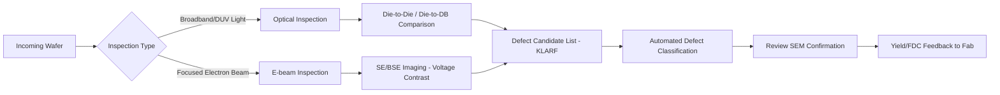

## In-line Optical and E-beam Inspection

### Overview

In-line inspection refers to defect detection performed directly within the semiconductor fabrication flow, between process steps, as opposed to off-line sampling in a separate metrology lab. The two dominant modalities are optical inspection (using deep ultraviolet or broadband light) and electron-beam (e-beam) inspection. Both aim to detect, localize, and classify defects on patterned or unpatterned wafers so that excursions can be caught before they propagate through hundreds of subsequent process steps.

### Role in Process Control

- **Excursion Detection**: Identifies sudden increases in defect density (a "spike") indicating a tool or process drift.
- **Yield Learning**: Correlates defect types and locations with electrical test failures (yield loss mechanisms).
- **Baseline Monitoring**: Tracks defect density (D0) over time to confirm process stability.
- **Feedback/Feedforward Control**: Data feeds into fault detection and classification (FDC) systems, potentially triggering tool requalification or lot disposition (hold/scrap/rework).

### Optical Inspection

#### Principle

Optical inspection systems illuminate the wafer with a light source (broadband white light or laser-based deep UV, typically 193–266 nm) and capture the scattered or reflected light using high-speed sensors (TDI — Time Delay Integration — CCD/CMOS arrays). Defects are detected by comparing the captured image or signal against a reference (die-to-die or die-to-database comparison).

#### Key Modes

- **Bright-Field (BF) Inspection**: Collects specularly reflected light. Good for pattern defects, particles, and residues on patterned wafers. Sensitive to film thickness variation.
- **Dark-Field (DF) Inspection**: Collects only scattered light (specular beam is blocked). Highly sensitive to particles and small topographic anomalies on unpatterned or lightly patterned wafers, since scattering signal scales strongly with particle size ($\text{Rayleigh scattering} \propto d^6$ for particles much smaller than wavelength).

#### Detection Algorithms

- **Die-to-Die (D2D)**: Compares two nominally identical adjacent dies; a mismatch beyond a noise threshold flags a defect. Requires a repeating pattern (works well for memory arrays).
- **Die-to-Database (D2DB)**: Compares the captured image against the design intent (GDSII-derived reference). Useful for logic devices with limited die repetition, and for detecting systematic/design-related defects.
- **Cell-to-Cell**: A finer-grained variant of D2D used within highly repetitive memory cell arrays.

#### Advantages

- High throughput (wafers per hour), since the inspection is largely limited by optical scan speed, not by beam-forming physics.
- Non-destructive and does not typically charge the wafer surface.
- Mature infrastructure for full-wafer, high-volume in-line screening.

#### Limitations

- Resolution is fundamentally diffraction-limited: $R \approx \dfrac{0.61\lambda}{NA}$, where $\lambda$ is the illumination wavelength and $NA$ is the numerical aperture.
- As critical dimensions have shrunk well below the illumination wavelength, optical tools increasingly detect defects only as a diffraction-limited "signature" rather than resolving true defect shape, requiring downstream SEM review for confirmation.

### E-beam Inspection

#### Principle

E-beam inspection scans a focused electron beam across the wafer surface, similar in concept to a scanning electron microscope (SEM), and detects secondary electrons (SE) and/or backscattered electrons (BSE) to form an image. Because electron wavelengths are far shorter than optical wavelengths, e-beam inspection achieves much higher spatial resolution—into the single-digit nanometer range—at the cost of much lower throughput.

#### Key Configurations

- **Single-Beam E-beam Inspection**: One finely focused beam raster-scans the wafer. High resolution, low throughput; historically used for critical-layer sampling and defect review (Review SEM, or "R-SEM").
- **Multi-Beam E-beam Inspection**: Uses an array of parallel electron beams (e.g., dozens to over a hundred beamlets) to inspect multiple die regions simultaneously, substantially improving throughput while retaining nanometer-scale resolution.

#### Detection Sensitivity

- **Voltage Contrast (VC) Defects**: E-beam inspection is uniquely sensitive to electrical defects invisible to optical tools, such as buried opens, shorts, or voids in contacts/vias, because charging behavior under the electron beam differs for electrically open versus properly connected structures.
- **Physical Defects**: Sub-optical-resolution particles, pattern bridging, and line-edge roughness anomalies that fall below the optical diffraction limit.

#### Advantages

- Superior resolution enables detection of defects smaller than the wavelength of light, critical at advanced nodes (sub-20 nm features).
- Sensitivity to electrical/voltage-contrast defects gives insight orthogonal to physical/optical defectivity.

#### Limitations

- Significantly lower throughput than optical tools, even with multi-beam architectures, since electron optics and scan speed are constrained by beam current, resolution trade-offs, and charging effects.
- Electron beam exposure can induce wafer charging or contamination (e.g., carbon deposition) if not carefully controlled.
- Typically deployed for critical layers or sampled regions rather than full-wafer, every-lot inspection due to cost and cycle time.

### Comparison Table

| Attribute | Optical Inspection | E-beam Inspection |
| --- | --- | --- |
| Resolution | Diffraction-limited (~tens of nm) | Single-digit nm scale |
| Throughput | High (wafers/hour) | Lower (even with multi-beam) |
| Electrical Defect Sensitivity | Limited | High (voltage contrast) |
| Typical Use | Full-wafer, high-volume monitoring | Critical-layer, targeted/sampled inspection |
| Wavelength/Probe | DUV light (193–266 nm) | Electron beam (sub-nm wavelength) |
| Cost of Ownership | Lower per wafer | Higher per wafer |

### Defect Review and Classification

After inspection flags candidate defect coordinates, a review step is typically performed:

- **Automated Defect Classification (ADC)**: Software (often machine-learning-based) categorizes defects by type (particle, scratch, pattern collapse, residue, void) using image features from optical or SEM review images.
- **Review SEM**: High-resolution SEM imaging of flagged coordinates to confirm true defects versus "nuisance" or false-positive events, and to extract precise size/shape data.
- **SEMI Standards**: Defect data is often exchanged using standardized formats such as KLARF (KLA Result File), enabling interoperability between inspection tools, review tools, and fab yield management systems.

### Sampling Strategy in Production

Because 100% e-beam inspection of every layer/lot is generally cost-prohibitive, fabs implement a **sampling plan**:

- Optical inspection is applied broadly (higher frequency, more layers) for baseline monitoring and gross excursion detection.
- E-beam inspection is reserved for the most critical layers (e.g., contact/via layers prone to voltage-contrast defects) and is sampled at a lower lot/wafer frequency, or triggered adaptively when optical or electrical test signals indicate a potential issue.

### Illustrative Signal Flow (svg_diagram)

### Key Points

- Optical inspection provides high-throughput, full-wafer coverage suited to routine excursion monitoring, but is diffraction-limited in resolution.
- E-beam inspection provides superior resolution and unique sensitivity to electrical (voltage contrast) defects, but at substantially lower throughput, making it suitable for targeted, critical-layer sampling.
- The two modalities are complementary rather than substitutive: production defect control strategies typically combine broad optical screening with sampled e-beam inspection on high-risk layers. [Inference: exact sampling ratios and layer selection are fab- and node-specific, and not governed by a universal standard.]
- Defect data flows through standardized formats (e.g., KLARF) into classification and review systems, ultimately informing fab-wide fault detection and yield management.

### Related Topics

- Automated Defect Classification (ADC) and Machine Learning in Inspection
- Voltage Contrast Defect Mechanisms in Contacts/Vias
- Multi-Beam SEM Architecture and Throughput Scaling
- Wafer Fault Detection and Classification (FDC) Systems
- Design-Based Binning and Systematic Defect Analysis
- Unpatterned Wafer Particle Monitoring
- SEMI KLARF Standard and Fab Data Interoperability