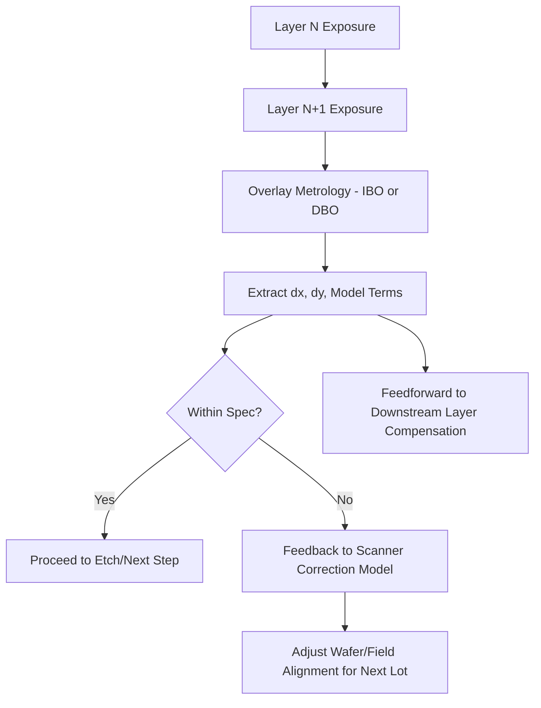

## Overlay Metrology

### Overview

Overlay metrology measures the placement accuracy of one patterned layer relative to another (or to a previous layer) on a semiconductor wafer. As devices require multiple lithography exposures to build up interconnected structures (transistors, contacts, vias, metal lines), any misalignment between layers—overlay error—can cause electrical opens, shorts, or degraded device performance. Overlay control is one of the most critical metrology disciplines in advanced patterning, especially as design rules shrink and multi-patterning schemes proliferate.

### Fundamental Concept

Overlay error is decomposed into translational, rotational, and higher-order (magnification, skew, higher-order distortion) components across the wafer and within each field/die. The total overlay budget must fit within a fraction of the minimum feature pitch, often expressed via the overlay error tolerance:

$$\sigma_{overlay} \leq \frac{CD}{k}$$

where $CD$ is the critical dimension and $k$ is a process-dependent design margin factor. As pitch shrinks, the allowable overlay error shrinks proportionally, pushing tolerances into the single-digit nanometer regime at advanced nodes.

### Sources of Overlay Error

- **Stage and Scanner Errors**: Wafer stage positioning inaccuracy, reticle stage errors, and lens aberrations in the exposure tool.
- **Wafer Process-Induced Distortion**: Thermal processing (anneals), film stress, and chemical-mechanical polishing (CMP) can warp or shift the wafer non-uniformly.
- **Grid and Field Errors**:
  - **Inter-field (grid) errors**: Systematic distortion across the wafer (translation, rotation, scaling, trapezoid, or higher-order polynomial terms).
  - **Intra-field errors**: Distortion within a single exposure field, often from lens aberrations (e.g., magnification, rotation, skew within the field).
- **Mark Asymmetry**: Overlay targets themselves can become asymmetric due to CMP dishing, etch residue, or film deposition non-uniformity, biasing the measurement itself independent of true pattern placement.

### Measurement Techniques

#### Imaging-Based Overlay (IBO)

Uses a microscope to capture an image of a specially designed overlay target—commonly a "box-in-box" or "frame-in-frame" structure—printed on two different layers. Software algorithms locate the centroid of each structure and calculate the (dx, dy) offset between them.

- **Advantages**: Direct visual verification, mature and well-understood, targets are relatively large (compatible with legacy inspection infrastructure).
- **Limitations**: Vulnerable to target asymmetry (e.g., from CMP), and generally requires larger targets that consume scribe-line area.

#### Diffraction-Based Overlay (DBO) / Scatterometry Overlay (SCOL)

Uses specially designed grating targets on each layer. Instead of imaging, the tool measures the intensity of diffracted light at specific angles/wavelengths. Overlay is calculated by comparing diffraction signals from complementary target pairs with intentional, known offsets (bias).

- **Principle**: For a pair of gratings with programmed biases $+d$ and $-d$, the difference in diffraction efficiency between $+1$ and $-1$ diffraction orders is proportional to the actual overlay error, allowing extraction of overlay through a differential signal model.
- **Advantages**: Smaller targets than imaging-based methods, generally less sensitive to certain types of target asymmetry (though not immune), higher precision at advanced nodes.
- **Limitations**: Requires careful target design and calibration; can still be affected by grating asymmetry (process-induced bias).

#### Comparison Table

| Attribute | Imaging-Based Overlay (IBO) | Diffraction-Based Overlay (DBO/SCOL) |
| --- | --- | --- |
| Target Type | Box-in-box, frame-in-frame | Periodic gratings with programmed bias |
| Signal | Image centroid position | Diffraction intensity asymmetry |
| Target Size | Larger | Smaller |
| Sensitivity to Asymmetry | Higher | Present but generally reduced |
| Precision at Advanced Nodes | Moderate | High |

### On-Product Overlay vs. On-Target Overlay

- **On-Target Overlay**: Overlay measured directly at dedicated metrology targets (typically in scribe lines).
- **On-Product Overlay (Device-like or in-die metrology)**: Increasingly, overlay is measured on actual device-like structures within the die (rather than only scribe-line targets), since scribe-line targets may not fully represent overlay behavior at the actual transistor/interconnect features due to local pattern density and processing effects. [Inference: the magnitude of divergence between scribe-line and in-die overlay is process- and layer-dependent, not a fixed universal value.]

### Advanced Process Control (APC) Integration

Overlay metrology data feeds directly into **Advanced Process Control** loops:

- **Feedback Control**: Overlay measured after exposure/development informs corrections to the next lot's scanner recipe (e.g., adjusting wafer alignment models, correctables).
- **Feedforward Control**: Data from a previous layer's metrology (e.g., film stress or CMP-induced distortion) can be used to pre-compensate the scanner exposure grid for the current layer.
- **Run-to-Run (R2R) Control**: Statistical process control algorithms (e.g., Exponentially Weighted Moving Average, EWMA) adjust scanner correction models lot-to-lot to compensate for drift.

### Overlay Modeling

Scanner correction systems fit measured overlay data (sampled across the wafer at multiple fields) to polynomial models capturing:

- **Wafer-level (inter-field) terms**: translation ($T_x, T_y$), rotation, wafer scaling/magnification, and higher-order terms.
- **Field-level (intra-field) terms**: field rotation, field magnification, trapezoid/skew, and orthogonality errors.

A simplified linear overlay model for a wafer-level correction might be expressed as:

$$\begin{pmatrix} dx \\ dy \end{pmatrix} = \begin{pmatrix} T_x \\ T_y \end{pmatrix} + \begin{pmatrix} M & -\theta \\ \theta & M \end{pmatrix} \begin{pmatrix} x \\ y \end{pmatrix}$$

where $T_x, T_y$ are translation terms, $M$ is magnification, and $\theta$ is rotation, applied at position $(x, y)$ on the wafer.

### Multi-Patterning Overlay Challenges

With **Self-Aligned Double/Quadruple Patterning (SADP/SAQP)** and multi-exposure schemes, overlay must be controlled not just between two layers but among multiple sequential exposures/etch steps used to define a single final layer. This significantly tightens the overlay budget, since errors accumulate across additional patterning steps, and has driven adoption of higher-precision DBO methods and denser in-die sampling.

### Illustrative Overlay Target Structure (svg_diagram)

<svg xmlns="http://www.w3.org/2000/svg" viewBox="0 0 400 220">
<text x="200" y="20" text-anchor="middle" font-size="14" font-family="sans-serif" font-weight="bold">Box-in-Box Overlay Target (svg_diagram)</text>
<rect x="120" y="50" width="160" height="140" fill="none" stroke="#2266cc" stroke-width="4" />
<rect x="160" y="90" width="80" height="60" fill="none" stroke="#cc4422" stroke-width="4" />
<line x1="200" y1="50" x2="200" y2="190" stroke="#999" stroke-width="1" stroke-dasharray="4,3" />
<line x1="120" y1="120" x2="280" y2="120" stroke="#999" stroke-width="1" stroke-dasharray="4,3" />
<text x="120" y="205" font-size="12" font-family="sans-serif" fill="#2266cc">Outer box: Layer 1</text>
<text x="120" y="220" font-size="12" font-family="sans-serif" fill="#cc4422">Inner box: Layer 2</text>
<line x1="200" y1="90" x2="200" y2="150" stroke="#000" stroke-width="1" />
<line x1="160" y1="120" x2="240" y2="120" stroke="#000" stroke-width="1" />
</svg>

### Overlay Control Flow (svg_diagram)

### Key Points

- Overlay metrology quantifies layer-to-layer placement error and is essential to prevent electrical defects from misaligned patterning.
- Imaging-based overlay (IBO) and diffraction-based overlay (DBO/SCOL) are the two primary measurement techniques, with DBO generally offering higher precision and smaller targets suited to advanced nodes.
- Target asymmetry from process steps (e.g., CMP) is a key error source that can bias overlay measurements independent of the true pattern placement.
- Overlay data is tightly integrated into Advanced Process Control (APC) loops, driving both feedback correction to scanners and feedforward compensation for downstream layers.
- Multi-patterning schemes (SADP/SAQP) impose tighter cumulative overlay budgets across multiple exposure/etch cycles.

### Related Topics

- Advanced Process Control (APC) and Run-to-Run Control
- Self-Aligned Multiple Patterning (SADP/SAQP) Overlay Budgets
- Critical Dimension (CD) Metrology and Scatterometry
- Scanner Alignment Systems and Wafer Grid Modeling
- CMP-Induced Target Asymmetry and Mark Design
- Design-for-Metrology Target Placement Strategies