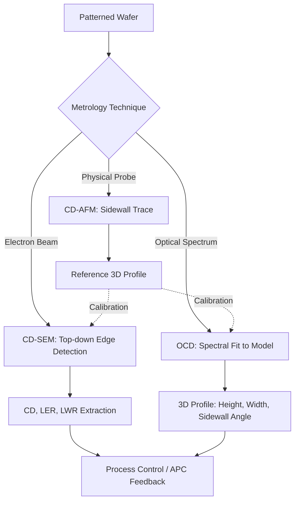

## Critical Dimension Metrology

### Overview

Critical dimension (CD) metrology is the measurement of the smallest and most process-sensitive feature dimensions on a semiconductor wafer—line widths, spacings, contact/via diameters, and sidewall profiles. These dimensions directly determine transistor performance (drive current, threshold voltage) and interconnect resistance/capacitance, making precise, high-throughput CD measurement essential for process control at every patterning-critical layer.

### Why CD Control Matters

- **Electrical Performance**: Transistor gate length variation directly shifts threshold voltage ($V_t$) and drive current.
- **Process Window**: Lithography and etch processes have finite margins; CD metrology confirms the process stays within the defined process window (focus-exposure matrix limits).
- **Yield**: Systematic or random CD variation beyond specification causes parametric or catastrophic yield loss.
- **Scaling Pressure**: As feature sizes shrink, the acceptable CD variation (3σ) shrinks proportionally, often to fractions of a nanometer at leading-edge nodes.

### CD Uniformity Metrics

- **Within-Wafer (WIW) CD Uniformity**: Variation of CD across a single wafer.
- **Wafer-to-Wafer (WTW) CD Uniformity**: Variation between wafers in a lot.
- **Within-Field CD Uniformity**: Variation across a single exposure field, often driven by lens aberrations or mask errors.
- **Local CD Uniformity (LCDU)**: Variation among nominally identical features in close proximity, increasingly important as stochastic effects (photon shot noise, resist blur) dominate at advanced nodes.

CD uniformity is typically summarized statistically as:

$$3\sigma_{CD} = 3\sqrt{\frac{1}{N-1}\sum_{i=1}^{N}(CD_i - \overline{CD})^2}$$

### Measurement Techniques

#### Critical Dimension Scanning Electron Microscopy (CD-SEM)

The workhorse technique for direct, top-down CD measurement. A focused electron beam rasters across the feature, and secondary electron yield variations at feature edges are used to determine edge location.

- **Principle**: Secondary electron emission increases sharply near edges/sidewalls (the "edge effect"), producing a signature waveform whose threshold crossing points define the measured linewidth.
- **Advantages**: Direct, high-resolution imaging; visually interpretable; can detect line-edge roughness (LER) and line-width roughness (LWR).
- **Limitations**:
  - Measurement is inherently top-down; cannot directly capture full 3D sidewall profile (though model-based extensions exist).
  - Electron beam exposure can cause resist shrinkage (photoresist shrinkage under e-beam dosing), altering the very dimension being measured.
  - Throughput is lower than optical/scatterometry techniques, limiting full-wafer coverage.

#### Optical Critical Dimension (OCD) Metrology / Scatterometry

Uses spectroscopic ellipsometry or reflectometry on a periodic grating structure, then fits the measured optical spectrum to a geometric model of the feature (line height, width, sidewall angle, etc.) using rigorous coupled-wave analysis (RCWA) or machine-learning-based regression.

- **Principle**: Light incident on a diffraction grating produces a reflectance/polarization spectrum uniquely dependent on the grating's cross-sectional geometry. An iterative fitting algorithm (or pre-trained library/neural network) solves the inverse problem: extracting geometric parameters from the measured spectrum.
- **Advantages**:
  - Non-destructive, fast (high throughput), and provides full 3D profile information (height, width, sidewall angle, footing/undercut) rather than just top-down linewidth.
  - Well suited to in-line, high-frequency sampling.
- **Limitations**:
  - Requires a dedicated periodic target (cannot measure arbitrary isolated device features directly).
  - Model-dependent: accuracy relies on an accurate geometric and optical (n, k) model of the film stack; model misspecification introduces systematic error.
  - Correlation and reference calibration to a "true" reference technique (e.g., CD-SEM or CD-AFM) is required to validate the model.

#### Critical Dimension Atomic Force Microscopy (CD-AFM)

Uses a specialized AFM probe (often with a flared/critical-dimension tip) to physically trace the sidewall profile of a feature.

- **Advantages**: True 3D profile measurement, including sidewall angle and re-entrant profiles, without electron-beam-induced resist shrinkage.
- **Limitations**: Very low throughput (mechanical scanning is slow); tip wear and tip-shape deconvolution introduce measurement uncertainty; generally used as a reference/calibration technique rather than routine in-line monitoring.

#### Comparison Table

| Attribute | CD-SEM | OCD (Scatterometry) | CD-AFM |
| --- | --- | --- | --- |
| Measurement Type | Direct top-down image | Model-based spectral fit | Direct physical probe |
| 3D Profile Info | Limited (top-down) | Full (height, sidewall, etc.) | Full (true 3D) |
| Throughput | Moderate | High | Very low |
| Destructive/Alters Sample | Possible (resist shrinkage) | No | No (minimal tip wear) |
| Typical Role | Routine in-line monitoring, LER/LWR | High-frequency in-line monitoring | Reference/calibration standard |

### Reference Metrology and TMU

Because OCD is model-based, its results must be validated against a "reference" measurement, typically CD-SEM or CD-AFM, in a process called **calibration/correlation**. The overall measurement quality is often assessed via **Total Measurement Uncertainty (TMU)**, which incorporates precision (repeatability, reproducibility) and accuracy (correlation to reference) components:

$$TMU = \sqrt{(\text{Precision})^2 + (\text{Correlation Error})^2}$$

A commonly cited rule of thumb is that TMU should be no more than roughly 10% of the process tolerance (though the acceptable fraction is process- and node-dependent). [Inference: exact TMU budget fractions vary by fab, layer criticality, and node, and are not fixed by a universal standard.]

### Stochastic Effects at Advanced Nodes

At sub-20 nm feature sizes, CD variation is increasingly dominated by **stochastic effects**—random, discrete phenomena such as photon shot noise in EUV exposure, random distribution of photoacid generators in chemically amplified resists, and random line-edge placement. This manifests as:

- **Line-Edge Roughness (LER)**: Random deviation of a single edge from its ideal straight-line position.
- **Line-Width Roughness (LWR)**: Random variation in the width of a line along its length, combining both edges' roughness.
- **Local CD Uniformity (LCDU)**: The statistical spread of CD values among a large population of nominally identical, closely spaced features—critical for contact/via yield since even a small population of undersized or oversized features can fail electrically.

These effects require measurement across large feature populations (hundreds to thousands of instances) rather than single-feature measurement, driving high-throughput CD-SEM and OCD sampling strategies specifically for stochastic characterization.

### Process Control Integration

CD metrology data feeds into:

- **Lithography Feedback**: Adjusting exposure dose and focus (via Automated Process Control, APC) to correct CD drift.
- **Etch Bias Control**: CD-after-etch is compared against CD-after-develop to monitor and control etch bias (the CD change induced by the etch step).
- **Focus-Exposure Matrix (FEM) Characterization**: CD-SEM/OCD data across a matrix of focus/dose conditions establishes the process window during process development.

### CD Measurement Signal Flow (svg_diagram)

### Key Points

- CD metrology quantifies the smallest, most performance-critical feature dimensions and is essential for maintaining transistor and interconnect specifications.
- CD-SEM provides direct, visually interpretable top-down measurement but is limited to near-2D information and can alter resist dimensions via electron dosing.
- OCD (scatterometry) offers high-throughput, non-destructive, full 3D profile measurement but depends on accurate geometric/optical modeling and requires correlation to a reference technique.
- CD-AFM provides true physical 3D profiling and serves primarily as a reference/calibration method due to low throughput.
- At advanced nodes, stochastic effects (LER, LWR, LCDU) increasingly dominate CD variation, requiring statistical measurement across large feature populations rather than single-point measurement.

### Related Topics

- Optical Critical Dimension (OCD) Modeling and RCWA
- Stochastic Effects in EUV Lithography (LER/LWR/LCDU)
- Focus-Exposure Matrix (FEM) and Process Window Characterization
- Etch Bias Control and CD-After-Etch Monitoring
- Total Measurement Uncertainty (TMU) and Metrology Qualification
- Overlay Metrology
- In-line Optical and E-beam Inspection