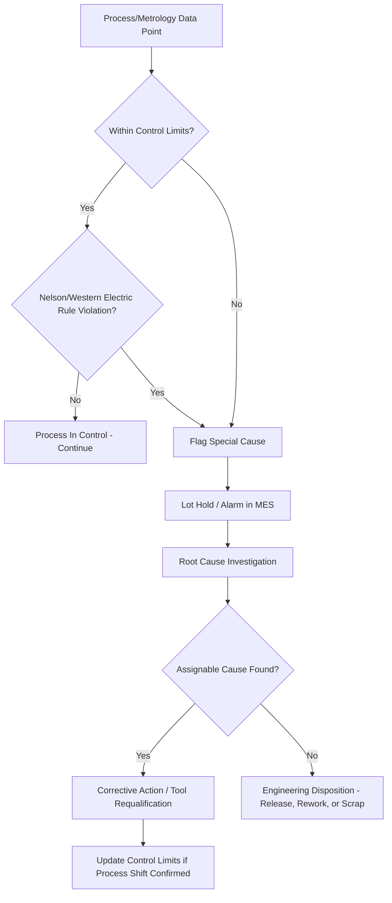

## Statistical Process Control in Fabs

### Overview

Statistical Process Control (SPC) is the application of statistical methods to monitor, control, and improve semiconductor manufacturing processes. In a fab, hundreds of process steps—each with multiple measured parameters—must remain within specification across thousands of wafers per day. SPC provides the mathematical and procedural framework to distinguish normal process variation ("common cause") from abnormal excursions ("special cause"), enabling timely intervention before yield or reliability is affected.

### Core Statistical Concepts

#### Common Cause vs. Special Cause Variation

- **Common Cause Variation**: Inherent, random variation present in a stable process (e.g., minor tool-to-tool differences, sensor noise). Expected and generally not actionable on an individual-event basis.
- **Special Cause Variation**: Variation arising from an identifiable, assignable source (e.g., a contaminated chamber, a miscalibrated sensor, a degraded consumable part). Requires investigation and corrective action.

#### Process Capability

Process capability indices quantify how well a process's natural variation fits within specification limits:

$$C_p = \frac{USL - LSL}{6\sigma}$$

$$C_{pk} = \min\left(\frac{USL - \mu}{3\sigma}, \frac{\mu - LSL}{3\sigma}\right)$$

where $USL$ and $LSL$ are the upper and lower specification limits, $\mu$ is the process mean, and $\sigma$ is the process standard deviation. $C_p$ measures potential capability assuming perfect centering; $C_{pk}$ accounts for actual centering relative to specification limits. A commonly referenced target in high-volume manufacturing is $C_{pk} \geq 1.33$, though required values vary by process criticality. [Inference: specific $C_{pk}$ thresholds are fab- and process-specific quality requirements, not a universal physical law.]

### Control Charts

Control charts are the primary visualization and decision tool in SPC, plotting a process parameter over time (or over lot/wafer sequence) against statistically derived control limits.

#### Shewhart Control Charts

- **X-bar and R Charts**: Track the subgroup mean ($\bar{X}$) and range ($R$) over time; classic for variable data (e.g., film thickness, CD).
- **Individual and Moving Range (I-MR) Charts**: Used when subgroup sizes are effectively 1 (common in semiconductor lot-based sampling).
- **Control Limits**: Typically set at $\mu \pm 3\sigma$ (three-sigma limits), derived from historical process data rather than specification limits.

$$UCL = \bar{X} + 3\sigma, \quad LCL = \bar{X} - 3\sigma$$

#### Western Electric / Nelson Rules

A set of pattern-recognition rules applied to control charts to detect non-random behavior even when no single point exceeds the control limit, such as:

- One point beyond $3\sigma$.
- Seven or more consecutive points on one side of the centerline (indicating a mean shift).
- Two out of three consecutive points beyond $2\sigma$ on the same side.
- A consistent upward or downward trend over several consecutive points.

These rules increase sensitivity to subtle drifts and shifts that a simple limit-crossing test would miss.

#### Exponentially Weighted Moving Average (EWMA) and CUSUM Charts

- **EWMA**: Weights recent observations more heavily than older ones via a smoothing constant $\lambda$, making it more sensitive to small, sustained shifts than a standard Shewhart chart:

$$Z_t = \lambda X_t + (1-\lambda)Z_{t-1}$$

- **CUSUM (Cumulative Sum)**: Accumulates deviations from a target value over time, detecting small persistent shifts more quickly than Shewhart charts by summing signed deviations rather than looking at raw values.

Both are widely used in fab **Run-to-Run (R2R) control** systems, where they inform real-time recipe adjustments (e.g., correcting etch time or deposition rate) between successive lots.

### SPC in the Fab Context

#### Parameters Monitored

- **Equipment Parameters**: Chamber pressure, RF power, gas flow, temperature (via Fault Detection and Classification, FDC, sensors).
- **In-line Metrology Parameters**: Film thickness, CD, overlay, defect density (see related topics).
- **Electrical Test Parameters**: Parametric test results from test structures (Vt, Idsat, resistance) measured at wafer sort.

#### Sampling Plans

Fabs balance measurement cost/cycle-time against statistical confidence by defining **sampling plans**—which lots, wafers, and sites within a wafer are measured, and at what frequency. Sampling plans are often risk-based, increasing sampling frequency for new processes, critical layers, or after a known excursion, and relaxing it once the process demonstrates sustained stability. [Inference: exact sampling frequencies are proprietary and process-specific, varying widely between fabs and technology nodes.]

#### Fault Detection and Classification (FDC)

FDC systems apply SPC-like principles directly to real-time equipment sensor traces (rather than post-process metrology), using techniques such as:

- **Univariate Limits**: Simple per-sensor threshold checks on summary statistics (mean, max, slope) of a process trace.
- **Multivariate Analysis**: Techniques such as Principal Component Analysis (PCA) or Partial Least Squares (PLS) combine many correlated sensor signals into a smaller set of latent variables, enabling detection of subtle multi-parameter drifts invisible to single-sensor limits.

### Response and Escalation Procedures

When an SPC rule is violated, fabs typically follow a structured Out-of-Control Action Plan (OCAP):

1. **Alarm/Flag**: The violating data point or lot is flagged in the SPC/MES (Manufacturing Execution System).
2. **Lot Disposition**: The affected lot may be held pending engineering review, rather than automatically proceeding to the next process step.
3. **Root Cause Investigation**: Engineers review associated FDC traces, metrology data, and maintenance logs to identify the assignable cause.
4. **Corrective Action**: Tool requalification, preventive maintenance, or recipe adjustment.
5. **Lot Release Decision**: Based on investigation outcome, the lot is released, reworked (if possible), or scrapped.

### Multivariate and Advanced SPC

As fabs generate increasingly large volumes of correlated sensor and metrology data, advanced techniques extend classical SPC:

- **Multivariate SPC (Hotelling's $T^2$, PCA-based charts)**: Monitors combinations of correlated variables simultaneously, detecting shifts in the relationship between variables even when each individual variable remains within its own limits.
- **Virtual Metrology**: Predicts metrology outcomes (e.g., CD, film thickness) from real-time sensor data using statistical or machine-learning models, enabling near-real-time process feedback without waiting for physical measurement, supplementing rather than replacing SPC on measured data.

### SPC Decision Flow (svg_diagram)

### Key Points

- SPC distinguishes common cause (inherent) variation from special cause (assignable) variation, enabling targeted intervention only when statistically justified.
- Control charts (Shewhart, EWMA, CUSUM) provide the core visualization and detection framework, with EWMA/CUSUM offering greater sensitivity to small sustained shifts.
- Process capability indices ($C_p$, $C_{pk}$) quantify how well a stable process fits within specification limits.
- Fault Detection and Classification (FDC) extends SPC principles to real-time equipment sensor data, using univariate and multivariate (PCA/PLS) methods.
- Out-of-Control Action Plans (OCAPs) formalize the fab's response workflow when an SPC violation occurs, from lot hold through root cause investigation to disposition.

### Related Topics

- Fault Detection and Classification (FDC) Systems
- Run-to-Run (R2R) Advanced Process Control
- Virtual Metrology and Machine Learning in Fabs
- Overlay Metrology
- Critical Dimension Metrology
- Yield Management and Excursion Analysis