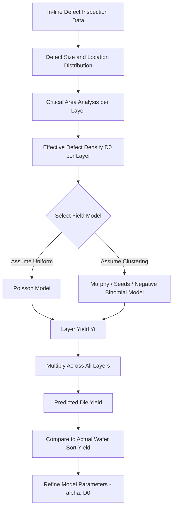

## Yield Models and Defect Density Statistics

### Overview

Yield modeling relates the density and distribution of physical defects on a wafer to the probability that a manufactured die will function correctly. Since a modern chip contains billions of transistors and kilometers of interconnect, even a very low defect density per unit area can cause significant yield loss when integrated over a large die area. Yield models provide the mathematical framework fabs use to predict, diagnose, and improve die yield based on defect density (D0) statistics gathered from in-line inspection.

### Basic Definitions

- **Defect Density ($D_0$)**: The average number of yield-limiting (killer) defects per unit area, typically expressed in defects/cm².
- **Critical Area ($A_c$)**: The area of a die layout in which a defect of a given size is likely to cause a functional failure (e.g., a short between adjacent metal lines or an open in a critical via). Critical area depends on both defect size distribution and layout geometry, and generally differs by layer and defect type.
- **Die Yield ($Y$)**: The fraction of manufactured die on a wafer that pass functional/parametric test.

### Poisson Yield Model

The simplest and historically foundational yield model assumes defects are randomly and independently distributed across the wafer (a Poisson process):

$$Y = e^{-D_0 A}$$

where $D_0$ is the average defect density and $A$ is the die area. This model implies that yield decreases exponentially with increasing die area, which is a key driver behind the economic pressure to shrink die size and improve process cleanliness.

#### Limitations of the Poisson Model

The pure Poisson model tends to significantly underestimate yield for large die sizes because real-world defects are not perfectly randomly distributed—they often cluster due to localized contamination sources (e.g., a particle-generating tool event affecting a region of the wafer). This has led to the development of **clustering-corrected yield models**.

### Murphy's Yield Model

Murphy's model accounts for defect density variation across the wafer by integrating the Poisson yield expression over an assumed probability distribution of $D_0$ values (rather than treating $D_0$ as a single fixed value):

$$Y = \left(\frac{1 - e^{-D_0 A}}{D_0 A}\right)^2$$

This model assumes a triangular distribution of defect densities across the wafer/lot population and generally predicts higher yield than the pure Poisson model at large die areas, better matching empirical observations.

### Seeds' Yield Model

Seeds proposed an exponential distribution of defect densities, leading to:

$$Y = \frac{1}{1 + D_0 A}$$

This model similarly softens the exponential yield decline of the pure Poisson model, reflecting defect clustering, though it makes different distributional assumptions than Murphy's model.

### Negative Binomial (Bose-Einstein) Yield Model

The most widely used generalized model in modern yield analysis is the **negative binomial yield model**, which introduces a clustering parameter $\alpha$ (sometimes called the cluster factor):

$$Y = \left(1 + \frac{D_0 A}{\alpha}\right)^{-\alpha}$$

- As $\alpha \to \infty$, this model reduces to the pure Poisson model (no clustering).
- As $\alpha \to 1$, it reduces to the Seeds model.
- Smaller $\alpha$ values indicate greater defect clustering (more non-uniform distribution across the wafer).

The clustering parameter $\alpha$ is typically extracted empirically by fitting yield data across multiple die sizes or test structures of varying area on the same wafer/process, since a single die size alone cannot separate $D_0$ from $\alpha$.

### Comparison of Yield Models

| Model | Formula | Defect Distribution Assumption |
| --- | --- | --- |
| Poisson | $Y = e^{-D_0 A}$ | Perfectly uniform/random |
| Murphy | $Y = \left(\dfrac{1-e^{-D_0 A}}{D_0 A}\right)^2$ | Triangular distribution of $D_0$ |
| Seeds | $Y = \dfrac{1}{1+D_0 A}$ | Exponential distribution of $D_0$ |
| Negative Binomial | $Y = \left(1+\dfrac{D_0 A}{\alpha}\right)^{-\alpha}$ | Gamma-distributed clustering, parameterized by $\alpha$ |

### Composite Yield: Combining Yield Loss Mechanisms

Overall die yield is generally the product of yield contributions from multiple independent loss mechanisms:

$$Y_{total} = Y_{defect} \times Y_{parametric} \times Y_{systematic}$$

- **$Y_{defect}$**: Random, particle/defect-driven yield loss, described by the models above.
- **$Y_{parametric}$**: Yield loss from parametric (electrical) out-of-spec conditions (e.g., leakage current, threshold voltage drift) not caused by discrete physical defects.
- **$Y_{systematic}$**: Yield loss from design-process interaction issues (e.g., a specific layout pattern that is consistently weak under a given lithography/etch process), which is deterministic rather than random and often addressed through Design for Manufacturability (DFM) rule checking.

### Critical Area Analysis

Since not every physical defect causes a functional failure, **critical area analysis (CAA)** software tools compute, for each layer and defect size, the layout area in which a defect would cause a fault (short or open), based on:

- Spacing between adjacent conductors (short critical area).
- Width/continuity of a single conductor (open critical area, particularly relevant for thin lines).
- The assumed defect size distribution, often modeled as a power-law distribution:

$$f(x) \propto x^{-p}$$

where $x$ is defect size and $p$ is an empirically fitted exponent (commonly cited in the range of 2–3 for particle size distributions, though the exact value is process- and fab-specific). [Inference: the specific power-law exponent varies by defect source and measurement technique, and should be treated as an empirically calibrated parameter rather than a fixed constant.]

Effective defect density for yield modeling is then computed by integrating the critical area over the defect size distribution, rather than using a single flat defect density value across all defect sizes.

### Application to Process/Yield Ramp

- **New Process Ramp**: Early in a process node's life, $D_0$ is typically higher and yield models (often negative binomial, given early-stage clustering) are used to project the yield-learning curve over time as tool and process issues are resolved.
- **Yield Learning Curve**: Tracks $D_0$ reduction (and corresponding yield improvement) over calendar time or cumulative wafer starts, often following an empirical learning-curve shape as engineering teams identify and eliminate systematic defect sources.
- **Baseline Monitoring**: Once mature, $D_0$ is tracked via SPC methods (see Statistical Process Control) to detect excursions from the established baseline.

### Layer-by-Layer and Systematic Defect Limited Yield

In practice, fabs compute yield contributions layer-by-layer (since different process layers have different $D_0$ and critical area characteristics), then combine them multiplicatively:

$$Y_{die} = \prod_{i=1}^{n} Y_i$$

where $Y_i$ is the yield contribution of layer $i$. This allows engineering teams to identify which specific process layer is the dominant yield-limiting contributor and prioritize improvement efforts accordingly.

### Yield Modeling Flow (svg_diagram)

### Key Points

- Yield models translate measured defect density and layout critical area into predicted die yield, with die area being a dominant driver of yield loss.
- The simple Poisson model assumes uniformly random defects and tends to underestimate yield at large die sizes; Murphy, Seeds, and negative binomial models correct for real-world defect clustering.
- The negative binomial model's clustering parameter $\alpha$ generalizes across the Poisson ($\alpha \to \infty$) and Seeds ($\alpha = 1$) limiting cases, and must be empirically fit rather than assumed.
- Critical area analysis accounts for the fact that not all physical defects are electrically significant, weighting defect density by the layout's sensitivity to defects of a given size.
- Overall die yield combines random defect-limited yield, parametric yield, and systematic (design-process interaction) yield, and is typically computed multiplicatively across process layers.

### Related Topics

- Critical Area Analysis and Design for Manufacturability (DFM)
- Statistical Process Control in Fabs
- In-line Optical and E-beam Inspection
- Yield Learning Curves and Process Ramp Strategy
- Parametric Yield Loss and Electrical Test Correlation
- Wafer Sort and Final Test Yield Analysis