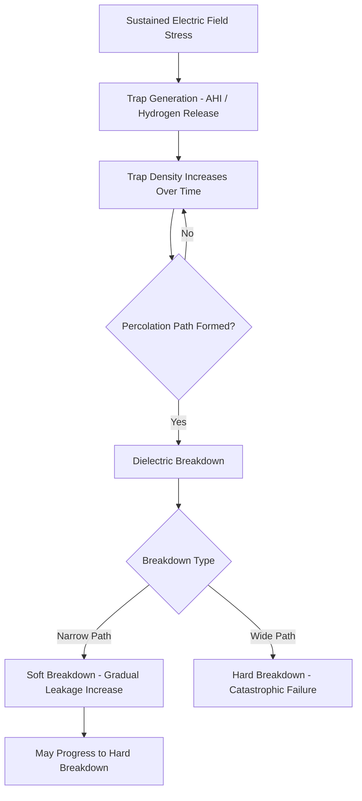

## Time Dependent Dielectric Breakdown

### Overview

Time Dependent Dielectric Breakdown (TDDB) is a reliability failure mechanism in which a dielectric (insulating) layer—most commonly the gate oxide in a MOSFET or an interlayer/intermetal dielectric—degrades under sustained electric field stress and eventually fails catastrophically (forms a conductive path), even though the applied field is below the material's intrinsic instantaneous breakdown strength. TDDB is a wear-out mechanism: failure occurs after a statistically distributed time-to-failure rather than immediately upon stress application, making it a central concern in long-term device reliability qualification.

### Physical Mechanism

#### Defect Generation and Percolation

Under sustained electric field and temperature stress, trap states (defects) are gradually generated within the dielectric bulk, primarily through mechanisms such as:

- **Anode Hole Injection (AHI)**: Electrons tunneling through the dielectric gain energy and generate holes at the anode interface, which can inject back into the oxide and create traps.
- **Hydrogen Release Model**: Hot carriers or tunneling electrons break Si-H bonds at the interface, releasing hydrogen species that diffuse and create additional defects/traps within the dielectric.

As stress time accumulates, the areal density of traps increases. Failure occurs when a contiguous chain of traps spans the dielectric thickness, forming a **percolation path** that allows a sudden, localized conductive breakdown—this is the basis of the widely used **Percolation Model** of TDDB.

#### Percolation Model

The percolation model treats trap generation as effectively a random spatial process; breakdown occurs once trap density crosses a critical threshold sufficient to statistically connect a conduction path from one electrode to the other. This model naturally explains why:

- Thinner dielectrics fail faster (fewer traps needed to bridge a shorter path).
- Time-to-failure has a statistical distribution (percolation path formation is inherently probabilistic) rather than a single deterministic value.

### Failure Time Statistics

#### Weibull Distribution

TDDB time-to-failure data is characteristically modeled using the **Weibull distribution**, which captures both the median failure time and the spread (shape) of the failure population:

$$F(t) = 1 - \exp\left[-\left(\frac{t}{\eta}\right)^{\beta}\right]$$

where $F(t)$ is the cumulative failure probability by time $t$, $\eta$ is the characteristic life (scale parameter, time at which ~63.2% of the population has failed), and $\beta$ is the shape parameter, which characterizes the failure distribution's spread and can offer insight into the underlying degradation mechanism (values are process- and stack-dependent). [Inference: $\beta$ interpretation as diagnostic of intrinsic vs. extrinsic failure populations is a widely used heuristic, but the specific numeric ranges are technology- and fab-specific rather than universal constants.]

Weibull plots (log-log transform of the CDF) are commonly used to visually separate:

- **Intrinsic Failures**: The main, larger population representing the dielectric's fundamental wear-out behavior.
- **Extrinsic Failures**: A smaller, earlier-failing "tail" population typically attributed to process-induced defects (particles, weak spots) rather than intrinsic material wear-out.

### Acceleration Models

Because TDDB failure times at normal operating voltages can be extremely long (years to decades), reliability qualification relies on **accelerated stress testing** at elevated voltage and/or temperature, then extrapolating back to use conditions via an acceleration model.

#### Voltage Acceleration Models

- **E-Model (Exponential Field Model)**:

$$t_{BD} \propto \exp(-\gamma E)$$

where $E$ is the electric field across the dielectric and $\gamma$ is a field acceleration factor. Historically used for thicker oxides.

- **1/E Model**:

$$t_{BD} \propto \exp\left(\frac{G}{E}\right)$$

Motivated by Fowler-Nordheim tunneling-based degradation physics; historically preferred for describing behavior at lower fields.

- **V-Model (Power Law)**:

$$t_{BD} \propto V^{-n}$$

Increasingly favored for ultra-thin gate oxides in advanced CMOS technologies, where direct tunneling (rather than Fowler-Nordheim tunneling) dominates conduction.

[Unverified: the specific model most appropriate for a given technology/oxide thickness combination is a subject of ongoing device-physics debate in the reliability literature; the choice significantly affects extrapolated lifetime projections at use-condition voltages, and fabs typically validate model choice empirically for their specific process.]

#### Temperature Acceleration

Temperature dependence is typically modeled using an Arrhenius relationship:

$$t_{BD} \propto \exp\left(\frac{E_a}{kT}\right)$$

where $E_a$ is the activation energy, $k$ is Boltzmann's constant, and $T$ is absolute temperature. Combined voltage and temperature acceleration models allow extrapolation from accelerated test conditions (high voltage, elevated temperature) to normal product operating conditions (nominal voltage, ambient/operating temperature).

### Reliability Qualification Methodology

1. **Stress Test Design**: Devices/test structures are stressed at multiple elevated voltage and/or temperature conditions.
2. **Time-to-Failure Measurement**: Time until dielectric breakdown (detected via a sudden current increase or gate leakage jump) is recorded for a population of devices at each condition.
3. **Weibull Fitting**: Failure time distributions at each stress condition are fit to extract $\eta$ and $\beta$.
4. **Extrapolation**: Using the acceleration model (voltage and temperature), the characteristic lifetime is extrapolated to normal operating conditions.
5. **Lifetime Projection**: A target failure rate (e.g., a specified cumulative failure percentage) at a specified operating lifetime (e.g., 10 years) is projected and compared against the product reliability specification.

### Area Scaling

Since breakdown is a localized, percolation-driven event, larger dielectric area contains more opportunities for a percolation path to form, so failure probability scales with area. This is typically incorporated via:

$$F_{A}(t) = 1 - \left[1 - F_{A_0}(t)\right]^{A/A_0}$$

where $F_{A_0}(t)$ is the failure probability measured on a reference test structure of area $A_0$, and $F_A(t)$ is the projected failure probability for the actual product area $A$. This reflects the "weakest link" statistical nature of dielectric breakdown, consistent with the same percolation/statistical reasoning underlying Weibull-based reliability models.

### Failure Detection Modes

- **Hard Breakdown (HBD)**: A sudden, large, catastrophic increase in gate leakage current, effectively destroying transistor function.
- **Soft Breakdown (SBD)**: A smaller, more gradual increase in leakage current, particularly observed in ultra-thin gate oxides, where the initial percolation path is narrow/high-resistance. Soft breakdown may progress to hard breakdown with continued stress, or may cause a more subtle parametric degradation rather than immediate catastrophic failure.

### Mitigation and Design Considerations

- **Gate Oxide Thickness/Material Selection**: High-k dielectrics (replacing SiO2 at advanced nodes) alter TDDB behavior and require re-characterization of acceleration models and Weibull parameters specific to the new material stack.
- **Operating Voltage Margining**: Product specifications define maximum operating voltage partly based on TDDB lifetime projections, trading off performance (higher voltage improves speed) against long-term reliability.
- **Process Cleanliness**: Reducing extrinsic (defect-driven) failures through improved process control directly reduces the early-failing tail population in the Weibull distribution.

### TDDB Failure Progression (svg_diagram)

### Key Points

- TDDB is a wear-out reliability mechanism in which gradual trap generation under sustained field stress eventually forms a percolation path through the dielectric, causing breakdown after a statistically distributed time.
- Time-to-failure data is characteristically modeled with the Weibull distribution, whose shape parameter ($\beta$) and scale parameter ($\eta$) describe the failure population's spread and central tendency.
- Voltage acceleration models (E-model, 1/E model, power-law V-model) and Arrhenius temperature acceleration together enable extrapolation from accelerated stress test conditions to normal product operating lifetime projections.
- Failure probability scales with dielectric area, reflecting the percolation mechanism's "weakest link" statistical nature.
- Breakdown can manifest as either hard breakdown (catastrophic) or soft breakdown (gradual), particularly relevant for ultra-thin gate oxides in advanced nodes.

### Related Topics

- Hot Carrier Injection (HCI) Reliability Mechanism
- Negative Bias Temperature Instability (NBTI)
- Electromigration in Interconnects
- High-k Metal Gate Reliability Characterization
- Weibull Statistics and Accelerated Life Testing
- Yield Models and Defect Density Statistics