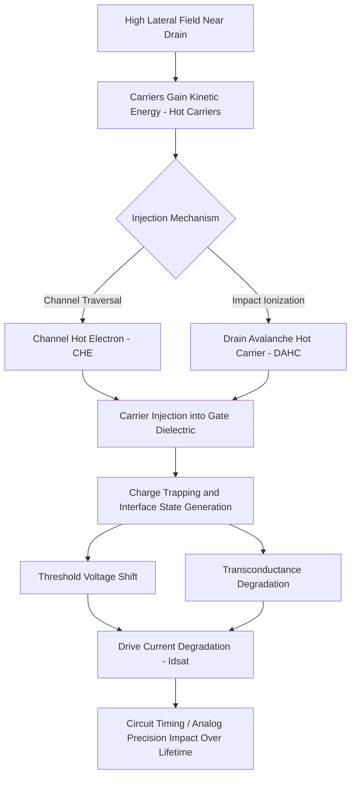

## Hot Carrier Injection Degradation

### Overview

Hot Carrier Injection (HCI) is a transistor reliability degradation mechanism in which charge carriers (electrons or holes) gain sufficiently high kinetic energy under strong lateral electric fields near the drain to be injected into the gate dielectric, where they become trapped or generate interface states. Over device operating lifetime, this accumulated damage shifts key transistor parameters—threshold voltage, transconductance, and drive current—degrading circuit performance and, in severe cases, causing functional failure. HCI is one of the primary front-end-of-line (transistor-level) wear-out mechanisms considered in reliability qualification, alongside TDDB and NBTI.

### Physical Mechanism

#### Origin of Hot Carriers

In a MOSFET operating with high drain-to-source voltage, the lateral electric field near the drain end of the channel accelerates carriers to energies well above the thermal equilibrium value ("hot" carriers). As channel length scales down while supply voltage historically scaled more slowly, the lateral field strength (and thus hot carrier energy) has been a persistent scaling concern.

#### Injection and Trapping

Carriers with sufficient energy to overcome the Si-SiO2 (or Si-high-k) interface energy barrier can be injected into the gate dielectric. Once injected, they may:

- Become trapped within the dielectric bulk, contributing to a shift in effective gate charge and thus threshold voltage.
- Generate interface states (dangling bonds, broken Si-H bonds at the Si/dielectric interface) that act as additional scattering centers and charge traps, degrading channel mobility and transconductance.

#### Classification of Hot Carrier Mechanisms

- **Channel Hot Electron (CHE) Injection**: Electrons gain energy traversing the channel and are injected into the oxide near the drain; most significant in n-channel MOSFETs (NMOS) due to electrons' higher mobility and lower effective mass compared to holes.
- **Drain Avalanche Hot Carrier (DAHC) Injection**: Impact ionization near the drain (carriers colliding with the lattice, generating electron-hole pairs) creates a secondary population of hot carriers, typically the dominant HCI mechanism at moderate gate voltages.
- **Substrate Hot Electron (SHE) Injection**: Carriers originating from the substrate (rather than the channel) gain energy from the substrate field and are injected into the oxide; generally a secondary mechanism relative to CHE/DAHC in standard CMOS operation.

Because impact ionization and hot carrier generation depend on both gate and drain voltage in different ways, the HCI degradation rate exhibits a characteristic peak at intermediate gate voltage (often near $V_{GS} \approx V_{DS}/2$ for DAHC-dominated conditions), rather than monotonically increasing with gate voltage.

### Degradation Signatures

HCI-induced damage manifests as measurable shifts in DC transistor parameters over stress time:

- **Threshold Voltage Shift ($\Delta V_t$)**: Trapped charge near the drain alters the local threshold voltage, most pronounced for NMOS.
- **Transconductance Degradation ($\Delta g_m$)**: Interface state generation increases channel scattering, reducing carrier mobility and thus transconductance.
- **Drive Current Degradation ($\Delta I_{dsat}$)**: The combined effect of $V_t$ shift and mobility degradation reduces saturation drive current, directly impacting circuit speed.

### Degradation Kinetics and Lifetime Modeling

#### Power-Law Time Dependence

HCI-induced parameter shifts typically follow an empirical power-law relationship with stress time:

$$\Delta P(t) = A \cdot t^n$$

where $\Delta P(t)$ is the degraded parameter (e.g., $\Delta I_{dsat}/I_{dsat}$), $A$ is a technology- and bias-dependent prefactor, $t$ is stress time, and $n$ is an empirically extracted time exponent (commonly cited in the range of approximately 0.3–0.6 for many CMOS processes, though the specific value is technology- and mechanism-dependent). [Inference: the exact numeric range for $n$ varies across published literature and process generations, and should be treated as process-specific rather than a fixed universal constant.]

#### Substrate Current Correlation

Because impact ionization generates substrate current ($I_{sub}$) as a byproduct of hot carrier generation, $I_{sub}$ has historically served as a convenient monitor/proxy for HCI stress severity, since it can be measured directly during device operation without requiring separate high-energy carrier detection.

#### Lifetime Extrapolation

Reliability qualification stresses devices at accelerated (elevated) drain voltage conditions and extrapolates to normal operating voltage using an empirical acceleration model, commonly of the form:

$$\tau \propto I_{sub}^{-m} \exp\left(\frac{E_a}{kT}\right)$$

or, alternatively, expressed directly in terms of drain voltage:

$$\tau \propto \exp\left(\frac{B}{V_{DS}}\right)$$

where $\tau$ is the time-to-failure (time to reach a defined degradation criterion, e.g., a specified percentage $I_{dsat}$ shift), $m$ and $B$ are empirically fitted constants, $E_a$ is an activation energy (often found to be near zero or even slightly negative for HCI, distinguishing it from thermally activated mechanisms like TDDB and NBTI), and $T$ is temperature. [Unverified: the sign and magnitude of the effective activation energy for HCI can vary by technology generation and stress condition, reflecting the complex interplay between phonon scattering (favoring lower temperature) and other secondary effects; specific values should be empirically characterized per process.]

### Technology Scaling Trends

- **Lightly Doped Drain (LDD) Structures**: Introduced specifically to reduce peak lateral electric field at the drain junction by grading the doping profile, mitigating HCI at the cost of some series resistance increase.
- **Voltage Scaling**: Reduced supply voltages in modern nodes lower the lateral field and hot carrier energy, generally reducing HCI severity, though this has been partially offset by continued channel length scaling.
- **High-k/Metal Gate and FinFET Structures**: Changes in gate stack material and 3D transistor geometry alter interface trap generation dynamics, requiring re-characterization of HCI behavior for each new technology generation. [Inference: whether HCI becomes more or less limiting relative to other wear-out mechanisms at a given advanced node depends on the specific process architecture and operating voltage, and is not a fixed trend across all technologies.]

### Circuit-Level Impact

- **Digital Circuits**: Cumulative $I_{dsat}$ degradation across many transistors in a critical timing path can erode timing margin over product lifetime, potentially causing timing failures near end-of-life if not adequately margined during design.
- **Analog/RF Circuits**: HCI-induced $g_m$ and $V_t$ shifts can degrade analog circuit precision (e.g., current mirror matching, amplifier gain) over lifetime, requiring careful reliability-aware analog design margining.

### Characterization and Qualification Methodology

1. **DC Stress Testing**: Transistors are stressed at combinations of elevated $V_{DS}$ and $V_{GS}$ (often swept to identify the worst-case gate bias for peak degradation).
2. **Periodic Parameter Measurement**: $I_{dsat}$, $V_t$, and $g_m$ are measured at intervals during stress (stress-measure-stress cycles) to characterize the degradation time dependence.
3. **Degradation Criterion**: A failure/end-of-life criterion is defined (e.g., a specified percentage drop in $I_{dsat}$).
4. **Extrapolation**: Power-law time exponent and voltage/temperature acceleration parameters are used to project time-to-failure at normal operating conditions.
5. **Design Guideline Derivation**: Results inform maximum allowed operating voltage and/or design margining guidelines provided to circuit designers.

### HCI Mechanism and Degradation Flow (svg_diagram)

### Key Points

- HCI arises when carriers accelerated by high lateral fields near the drain gain enough energy to inject into the gate dielectric, causing charge trapping and interface state generation.
- Channel Hot Electron (CHE) and Drain Avalanche Hot Carrier (DAHC) injection are the dominant mechanisms, with DAHC typically dominant at moderate gate bias and CHE more significant at higher gate bias; NMOS is generally more susceptible than PMOS due to electron transport properties.
- Degradation manifests as threshold voltage shift, transconductance reduction, and drive current degradation, typically following a power-law time dependence.
- Substrate current ($I_{sub}$) has historically served as a practical proxy for HCI stress severity due to its correlation with impact ionization.
- Lightly Doped Drain (LDD) structures and supply voltage scaling are primary mitigation strategies, though each new technology generation (high-k/metal gate, FinFET) requires independent HCI characterization.

### Related Topics

- Negative Bias Temperature Instability (NBTI)
- Time Dependent Dielectric Breakdown (TDDB)
- Lightly Doped Drain (LDD) Transistor Engineering
- Electromigration in Interconnects
- Reliability-Aware Circuit Design Margining
- Yield Models and Defect Density Statistics