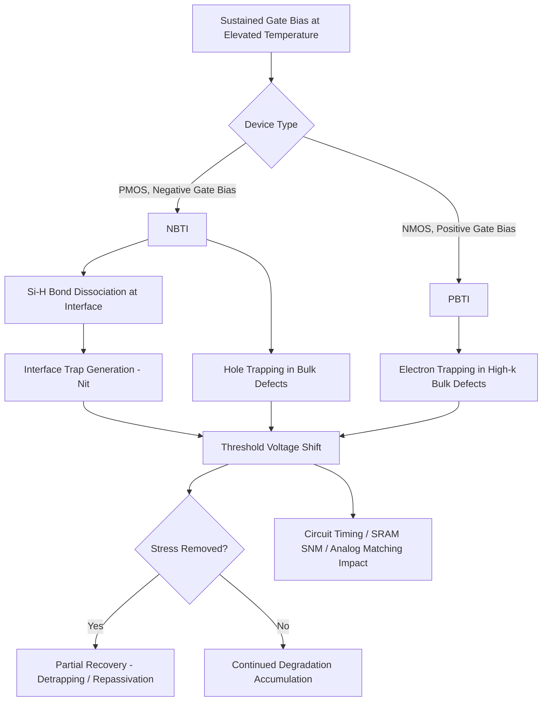

## Bias Temperature Instability

### Overview

Bias Temperature Instability (BTI) is a transistor reliability degradation mechanism in which sustained gate bias at elevated temperature causes a shift in threshold voltage and associated parameter drift, driven by charge trapping and interface state generation at or near the gate dielectric interface. Unlike Hot Carrier Injection, BTI does not require high lateral drain fields or channel current—it occurs under simple static gate bias stress, making it relevant even to transistors that spend long periods in a held (non-switching) state. BTI is typically categorized by carrier type and gate polarity as **Negative Bias Temperature Instability (NBTI)**, affecting PMOS devices, and **Positive Bias Temperature Instability (PBTI)**, affecting NMOS devices—the latter becoming particularly significant with the introduction of high-k gate dielectrics.

### Negative Bias Temperature Instability (NBTI)

#### Physical Mechanism

NBTI occurs in PMOS transistors under negative gate-to-source bias (with the channel in inversion) at elevated temperature. The dominant physical model is based on interface trap generation via bond dissociation:

- **Reaction-Diffusion (R-D) Model**: Holes in the inverted channel interact with Si-H bonds at the Si/SiO2 (or Si/high-k interfacial layer) interface, breaking the bond and releasing hydrogen species. The released hydrogen diffuses away from the interface, while the resulting dangling bond (interface trap, $N_{it}$) remains as a stable defect, shifting threshold voltage.
- **Hole Trapping**: In addition to interface state generation, holes can become trapped in pre-existing bulk oxide defect states near the interface, contributing an additional, generally faster-recovering component to the observed degradation.

#### Recovery Behavior

A defining and somewhat unusual characteristic of NBTI is **partial recovery**: when stress bias is removed, a portion of the threshold voltage shift recovers over time (from microseconds to much longer timescales), attributed primarily to hydrogen species diffusing back to re-passivate interface traps and to detrapping of trapped holes. This recovery behavior:

- Complicates measurement, since conventional stress-then-measure techniques (which inherently involve a brief bias removal to take the measurement) can underestimate the true "on-the-fly" degradation due to recovery occurring during the measurement delay.
- Has led to specialized fast/on-the-fly measurement techniques designed to minimize measurement-induced recovery artifacts.

### Positive Bias Temperature Instability (PBTI)

#### Physical Mechanism

PBTI occurs in NMOS transistors under positive gate bias at elevated temperature. While historically considered a secondary concern relative to NBTI in conventional SiO2/poly-Si gate stacks, PBTI became a first-order reliability concern with the introduction of high-k gate dielectrics (e.g., hafnium-based oxides) in high-k/metal-gate CMOS technology, where:

- Electron trapping in pre-existing bulk defect states within the high-k layer becomes a significant, often dominant, degradation mechanism.
- The high-k material's defect density and trap energy distribution differ substantially from SiO2, requiring dedicated characterization distinct from legacy PBTI understanding in oxide-only gate stacks.

PBTI in high-k stacks generally shows less pronounced fast recovery compared to NBTI, though some recoverable component is still typically observed. [Inference: the relative balance of recoverable versus permanent PBTI degradation is stack- and process-specific, and generalizations from one high-k formulation may not directly transfer to another.]

### Degradation Kinetics

Both NBTI and PBTI threshold voltage shifts are commonly modeled with a power-law time dependence, similar in form to HCI:

$$\Delta V_t(t) = A \cdot t^n$$

where $n$ is an empirically extracted time exponent. Under the Reaction-Diffusion framework, the classic diffusion-limited regime predicts $n \approx 0.25$ (often referenced as the "universal" R-D exponent), though measured values across the literature vary depending on measurement methodology, technology, and the relative contribution of trapping versus interface state generation. [Inference: the specific exponent value and its interpretation remain subjects of ongoing device physics discussion, and fab-specific characterization is required rather than relying on a single universal number.]

### Acceleration Models

#### Voltage Acceleration

BTI degradation rate increases with the magnitude of gate voltage stress, commonly modeled as a power-law or exponential dependence on the electric field/voltage:

$$\tau \propto V_{stress}^{-\gamma} \quad \text{or} \quad \tau \propto \exp(-\gamma E)$$

where $\tau$ is time-to-failure (time to reach a defined $\Delta V_t$ criterion) and $\gamma$ is a fitted voltage acceleration factor.

#### Temperature Acceleration

BTI is thermally activated, following an Arrhenius relationship:

$$\tau \propto \exp\left(\frac{E_a}{kT}\right)$$

where $E_a$ is the activation energy (generally positive, reflecting that both NBTI and PBTI degrade faster at higher temperature, consistent with the diffusion- and trap-generation-based physical mechanisms), $k$ is Boltzmann's constant, and $T$ is absolute temperature.

### Statistical Variability

At advanced nodes with small transistor dimensions, BTI degradation exhibits significant device-to-device variability, driven by the discrete, random nature of individual trap generation/capture events relative to the small number of active defects in a scaled device:

- **Random Telegraph Noise (RTN) Interaction**: Individual trap capture/emission events can be resolved as discrete threshold voltage steps in small-area devices, and BTI-generated traps contribute additional RTN-active defects.
- **Time-Dependent Variability (TDV)**: The combination of BTI-induced mean $\Delta V_t$ shift and its statistical spread across a population of nominally identical small devices is a growing reliability design concern, since worst-case (tail) devices can degrade substantially more than the population mean, requiring statistical rather than purely mean-value reliability design guardbanding.

### Circuit-Level Impact

- **Digital Logic**: Cumulative $V_t$ shift across transistors in a critical path increases gate delay over product lifetime, eroding timing margin; NBTI is particularly relevant for PMOS pull-up paths held in stress states for extended periods (e.g., in SRAM cells or static logic states).
- **SRAM Stability**: Since SRAM cells can be held in a fixed logic state for long durations, asymmetric NBTI/PBTI degradation between the cell's transistors can degrade static noise margin (SNM) over lifetime, a specific and well-studied circuit reliability concern.
- **Analog Circuits**: BTI-induced $V_t$ mismatch between nominally matched transistor pairs (e.g., differential pairs, current mirrors) can degrade analog circuit precision over lifetime.

### Characterization and Qualification Methodology

1. **Stress Application**: Devices are held under constant (or, for more realistic characterization, AC/duty-cycled) gate bias stress at elevated temperature.
2. **Fast Measurement**: $\Delta V_t$ is measured using fast or on-the-fly techniques to minimize recovery-induced underestimation of true degradation.
3. **Recovery Characterization**: Devices are monitored after stress removal to characterize the recoverable versus permanent degradation components.
4. **Model Fitting**: Power-law time exponent, voltage acceleration factor, and activation energy are extracted from the combined stress/recovery dataset.
5. **Lifetime Projection**: Combined with circuit-level duty cycle and voltage/temperature use conditions, projected $\Delta V_t$ at end-of-life informs design guardbands for timing and analog matching margins.

### NBTI/PBTI Mechanism Flow (svg_diagram)

### Key Points

- BTI causes threshold voltage shift under sustained gate bias at elevated temperature, split into NBTI (PMOS, negative gate bias) and PBTI (NMOS, positive gate bias).
- NBTI is primarily explained by the Reaction-Diffusion model, involving Si-H bond dissociation at the gate dielectric interface, combined with a hole-trapping component; a defining feature is partial recovery after stress removal.
- PBTI became a first-order concern with high-k gate dielectrics, dominated by electron trapping in bulk high-k defect states, generally with less pronounced recovery than NBTI.
- Degradation follows a power-law time dependence and is accelerated by both voltage and temperature (Arrhenius behavior), requiring careful stress/recovery characterization for accurate lifetime extrapolation.
- At advanced nodes, BTI exhibits significant statistical device-to-device variability due to discrete trap dynamics, impacting SRAM stability and analog matching, and requiring statistical (not just mean-value) reliability design guardbanding.

### Related Topics

- Hot Carrier Injection Degradation
- Time Dependent Dielectric Breakdown (TDDB)
- High-k Metal Gate Reliability Characterization
- SRAM Static Noise Margin and Reliability Design
- Random Telegraph Noise (RTN) in Scaled Transistors
- Reliability-Aware Circuit Design Margining