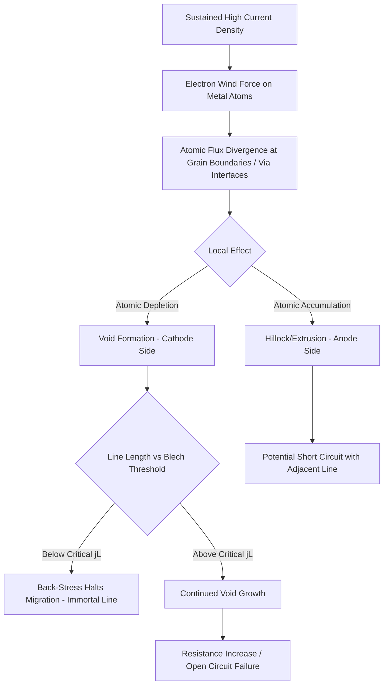

## Electromigration Reliability Testing

### Overview

Electromigration (EM) is a reliability failure mechanism in metal interconnects in which sustained high current density causes the gradual, directional transport of metal atoms, driven by momentum transfer from conducting electrons. Over time, this atomic migration creates localized voids (leading to open-circuit failure) and hillocks/extrusions (leading to short-circuit failure with adjacent conductors). As interconnect dimensions shrink while current demands per unit area increase, EM has become one of the dominant back-end-of-line (interconnect-level) wear-out mechanisms requiring rigorous qualification testing.

### Physical Mechanism

#### Electron Wind Force

Conducting electrons transfer momentum to metal ions through scattering collisions. At sufficiently high current density, this "electron wind" force can exceed the force holding metal atoms in the lattice (particularly at grain boundaries and interfaces, where atomic bonding is weaker), causing net atomic drift in the direction of electron flow.

#### Void and Hillock Formation

- **Voiding**: Atomic depletion at the cathode end (or at flux divergence points, such as grain boundary triple points or via/line interfaces) creates vacancies that coalesce into voids, eventually growing large enough to significantly increase local resistance or create a complete open circuit.
- **Hillock/Extrusion Formation**: Atomic accumulation at the anode end (or other flux convergence points) can create hillocks or extrusions that protrude into surrounding dielectric, potentially causing a short circuit with an adjacent conductor.

#### Flux Divergence

EM failure specifically occurs at points of **atomic flux divergence**—locations where the rate of atoms arriving differs from the rate leaving, such as:

- Grain boundary triple points and grain size discontinuities (particularly relevant in aluminum interconnects with polycrystalline grain structure).
- Via-to-line interfaces, especially in dual-damascene copper interconnects, where the via acts as a "blocking boundary" and voids often nucleate directly beneath or at the via bottom.
- Interfaces with different diffusivity materials (e.g., barrier/liner layers in copper interconnects).

### Blech Effect (Immortality Threshold)

For sufficiently short interconnect lines, mechanical back-stress (stress gradient) generated by atomic accumulation at one end can build up and counteract the electron wind force, effectively halting further net atomic migration before failure occurs. This gives rise to a critical product of current density and line length, known as the **Blech product**:

$$(jL)_{crit}$$

where $j$ is current density and $L$ is interconnect line length. If the actual $j \times L$ product for a given interconnect segment is below this critical threshold, the line is theoretically "immortal" with respect to EM (failure does not occur regardless of stress time), which has practical design implications for short interconnect segments and via structures. [Inference: the exact critical Blech product value is material-, geometry-, and process-specific, requiring empirical characterization rather than a single universal constant.]

### Failure Time Statistics

#### Lognormal Distribution

EM time-to-failure data is characteristically modeled using the **lognormal distribution** (in contrast to TDDB's typical Weibull characterization):

$$F(t) = \Phi\left(\frac{\ln(t) - \ln(t_{50})}{\sigma}\right)$$

where $\Phi$ is the standard normal cumulative distribution function, $t_{50}$ is the median time-to-failure, and $\sigma$ is the lognormal shape parameter (standard deviation of $\ln(t)$), reflecting the statistical spread of the failure population. A smaller $\sigma$ indicates a tighter failure distribution, generally desirable for reliability margin.

### Black's Equation

The dominant empirical model for EM lifetime as a function of stress conditions is **Black's Equation**, relating median time-to-failure to current density and temperature:

$$t_{50} = A \cdot j^{-n} \cdot \exp\left(\frac{E_a}{kT}\right)$$

where:

- $A$ is a process/geometry-dependent prefactor.
- $j$ is current density.
- $n$ is the current density exponent (commonly cited near 2 for void-nucleation-dominated failure in many interconnect systems, though the value observed in practice can range depending on the dominant failure mechanism and material system). [Inference: the specific exponent value is technology- and failure-mode-dependent and should be empirically extracted rather than assumed as a fixed constant.]
- $E_a$ is the activation energy for the dominant diffusion mechanism (e.g., grain boundary diffusion in aluminum, or interface/surface diffusion along the copper-barrier or copper-cap interface in copper interconnects), $k$ is Boltzmann's constant, and $T$ is absolute temperature.

Black's Equation is used to extrapolate from accelerated stress test conditions (elevated current density and temperature) to normal product operating conditions, similar in spirit to the acceleration modeling approaches used for TDDB and BTI.

### Material System Considerations

#### Aluminum Interconnects (Legacy)

- Historically dominant diffusion path: grain boundaries.
- **Alloying with Copper**: Addition of a small percentage of copper to aluminum interconnects significantly improves EM resistance by segregating to grain boundaries and impeding aluminum atom migration—a widely adopted mitigation historically used in aluminum-based back-end-of-line processes.

#### Copper Interconnects (Modern, Dual-Damascene)

- Dominant diffusion path shifts primarily to the copper surface/cap-layer interface (rather than bulk grain boundaries, since copper typically has larger grain sizes relative to fine interconnect dimensions), making the choice of capping/barrier layer material a first-order EM reliability factor.
- **Via-Below vs. Via-Above Test Structures**: EM behavior differs depending on current flow direction relative to via placement (electron flow from via into line, or line into via), since flux divergence characteristics differ; both configurations are typically characterized separately during qualification.

### Test Structures and Methodology

#### Standard Test Structures

- **Single-Line/Via Test Structures (e.g., NIST/SWEAT-style structures)**: Simple line-via-line structures stressed at controlled current density and temperature, widely used for extracting Black's Equation parameters.
- **Kelvin/Four-Terminal Structures**: Enable precise resistance monitoring during stress by separating current-forcing and voltage-sensing terminals, improving measurement accuracy for detecting the onset of void-induced resistance increase.

#### Test Methodology

1. **Stress Application**: Test structures are stressed at combinations of elevated current density and temperature (accelerated conditions relative to normal product operation).
2. **Resistance Monitoring**: Interconnect resistance is monitored continuously or periodically during stress; a defined percentage resistance increase (e.g., a specified threshold shift) is used as the failure criterion.
3. **Failure Time Recording**: Time-to-failure for each stressed structure is recorded, building a population dataset.
4. **Lognormal Fitting**: Failure time data across the population is fit to the lognormal distribution to extract $t_{50}$ and $\sigma$.
5. **Multi-Condition Testing**: Testing is repeated across multiple current density and temperature combinations to extract Black's Equation parameters ($n$, $E_a$).
6. **Lifetime Extrapolation**: Using Black's Equation, projected lifetime at normal operating current density and temperature is calculated and compared against product reliability specifications (often expressed as a target cumulative failure percentage over a specified operating lifetime).

### Design Mitigation Strategies

- **Current Density Design Rules**: Maximum allowed current density per interconnect layer/width is specified in the process design kit (PDK), derived directly from EM qualification results.
- **Via Redundancy**: Using multiple parallel vias at critical connections reduces the effective current density per via and provides redundancy if one via-associated void forms.
- **Wire Sizing/Widening**: Increasing interconnect width for high-current nets reduces current density, directly improving EM lifetime per Black's Equation.
- **Reservoir Structures**: Extending a small length of metal beyond a via (a "reservoir") can provide additional atomic supply, mitigating void formation in leveraging Blech-effect-related physics at the local via structure.

### EM Failure Development Flow (svg_diagram)

### Key Points

- Electromigration is driven by electron wind force transferring momentum to metal atoms, causing directional atomic migration that forms voids (open failures) at flux-divergence points and hillocks (short failures) elsewhere.
- The Blech effect establishes a critical current-density-length product below which back-stress halts migration, making sufficiently short interconnect segments effectively immortal with respect to EM.
- EM time-to-failure is characteristically modeled with a lognormal distribution, and Black's Equation relates median lifetime to current density and temperature via an empirically fitted exponent and activation energy.
- Copper interconnects shift the dominant diffusion path to surface/interface diffusion (making capping layer choice critical), in contrast to legacy aluminum interconnects where grain boundary diffusion dominated (and copper alloying was a key mitigation).
- Qualification testing combines multi-condition accelerated stress, resistance monitoring, and lognormal/Black's Equation fitting to derive current density design rules enforced in the process design kit.

### Related Topics

- Time Dependent Dielectric Breakdown (TDDB)
- Hot Carrier Injection Degradation
- Bias Temperature Instability
- Copper Dual-Damascene Interconnect Process Integration
- Process Design Kit (PDK) Design Rules and Reliability Limits
- Yield Models and Defect Density Statistics