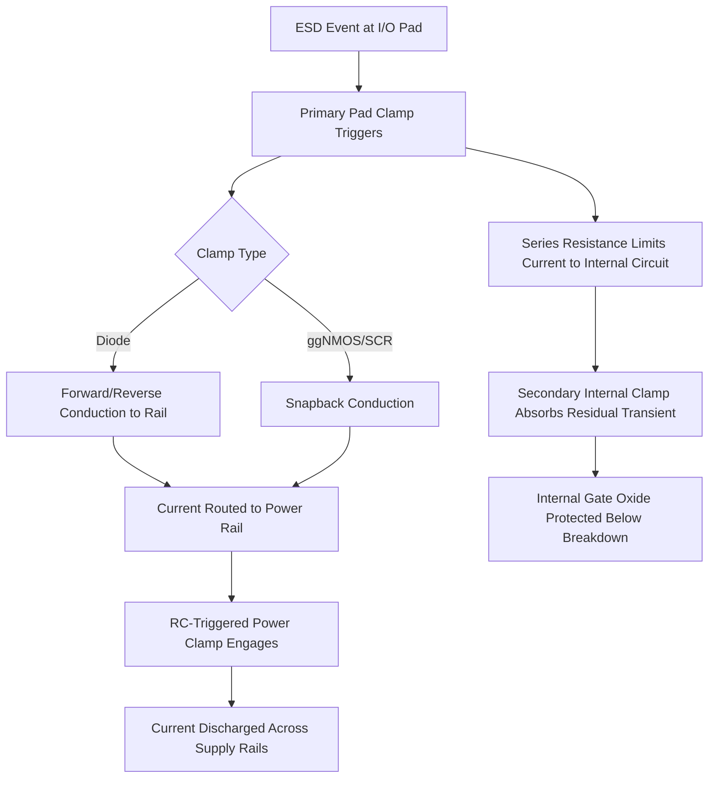

## Electrostatic Discharge Protection Design

### Overview

Electrostatic Discharge (ESD) protection design encompasses the on-chip circuit techniques used to safely dissipate transient high-voltage, high-current events caused by sudden static charge transfer, preventing damage to sensitive internal transistor structures (gate oxides, junctions). Because ESD events can occur at multiple points in a device's lifecycle—during manufacturing handling, packaging, board assembly, and end-user operation—robust ESD protection is a mandatory reliability discipline integrated into essentially every integrated circuit's pad and I/O design.

### ESD Event Models

Reliability qualification for ESD is standardized around several stress models, each representing a different real-world discharge scenario.

#### Human Body Model (HBM)

Models a charged human body discharging through a device pin upon contact, characterized by a relatively slow discharge (on the order of hundreds of nanoseconds) through a defined RC network (typically modeled as a 100 pF capacitor discharging through a 1.5 kΩ resistor per relevant industry standard test methods). HBM has historically been the most widely referenced qualification standard for IC-level ESD robustness.

#### Machine Model (MM)

Models discharge from a charged conductive object (e.g., metallic handling equipment) directly contacting a device pin, characterized by a lower effective resistance path than HBM, resulting in a faster, more oscillatory discharge waveform. MM is generally considered a more stringent test than HBM for a given nominal voltage rating, though its use in modern qualification has declined relative to HBM and CDM as manufacturing handling controls have improved industry-wide. [Unverified: the specific current status and relative emphasis of MM in contemporary industry qualification standards should be confirmed against current standards body publications, as testing practice has evolved over time.]

#### Charged Device Model (CDM)

Models the scenario in which the device itself becomes charged (e.g., through triboelectric charging during handling or automated assembly) and then rapidly discharges through a single pin upon contact with a grounded surface. CDM events are characterized by very fast discharge times (sub-nanosecond to a few nanoseconds) and very high peak currents, making CDM protection design fundamentally different from HBM/MM protection in terms of required response speed. CDM has become an increasingly emphasized qualification standard as automated manufacturing handling has reduced HBM/MM-type exposure while CDM-type exposure (device-to-surface discharge during automated handling) has become relatively more significant.

### ESD Protection Circuit Architecture

#### Primary and Secondary Clamp Structure

A typical pad ESD protection scheme uses a multi-stage approach:

- **Primary (Pad) Clamp**: A large, fast-turn-on device placed directly at the I/O pad, designed to absorb the bulk of ESD current and clamp pad voltage to a safe level.
- **Secondary (Internal) Clamp**: A smaller, more sensitive clamp placed closer to internal core circuitry, providing additional protection margin for internal gate oxides which may have thinner, more ESD-sensitive dielectrics than I/O-level devices.
- **Series Resistance/Isolation**: A resistor or resistive interconnect segment between the pad and internal circuitry helps decouple the two clamp stages, ensuring the primary clamp triggers and absorbs current before voltage reaching internal circuitry exceeds the secondary clamp's protection level.

#### Common ESD Protection Devices

- **Diodes (Forward and Reverse-Biased Clamps)**: Simple, fast-response diode clamps to VDD and VSS rails provide a low-impedance path for ESD current of either polarity relative to the supply rails.
- **Grounded-Gate NMOS (ggNMOS)**: An NMOS transistor with its gate tied to ground, relying on parasitic bipolar (snapback) action of the intrinsic NPN structure to provide a low-impedance discharge path once triggered.
- **Silicon-Controlled Rectifier (SCR)**: A four-layer PNPN structure providing very high current-handling capability per unit area once triggered, due to its latch-up-like regenerative conduction mechanism; often favored for high-robustness applications due to superior area efficiency, though careful design is needed to ensure adequate (but not excessive) holding voltage to avoid unwanted latch-up during normal circuit operation.
- **RC-Triggered Power Clamps**: An RC timing network distinguishes a fast ESD transient from normal power-up sequencing, triggering a large clamp transistor across the supply rails specifically during a detected ESD event.

#### Snapback and Trigger Voltage Design

Many ESD protection devices (ggNMOS, SCR) exhibit **snapback behavior**—a negative differential resistance region in their current-voltage characteristic, where the device transitions from a high-impedance off-state to a low-impedance conducting state once a trigger voltage is exceeded. Key design parameters include:

- **Trigger Voltage ($V_{t1}$)**: The voltage at which the device begins snapback conduction; must be reliably below the breakdown voltage of the internal circuitry being protected.
- **Holding Voltage ($V_h$)**: The voltage the device settles to once in the conducting state; must generally remain above the maximum normal operating supply voltage to prevent inadvertent latch-up during normal circuit operation.
- **Second Breakdown ($I_{t2}$)**: The current level at which the device suffers permanent thermal damage (localized filamentary current concentration leading to junction destruction); the ESD device must be sized to handle the required ESD current level with margin below $I_{t2}$.

### Design Window Concept

ESD protection design is often visualized via a "design window" that must satisfy multiple simultaneous voltage constraints:

- The ESD clamp's trigger voltage must be below the internal circuit's breakdown voltage (to ensure protection engages before internal damage).
- The ESD clamp's holding voltage must be above the maximum normal operating voltage (to prevent false triggering/latch-up during normal operation).
- The clamped voltage during full ESD current conduction must remain below the internal circuit's breakdown voltage throughout the discharge event, requiring adequate clamp current capability ($I_{t2}$ margin).

### Full-Chip ESD Considerations

- **Power Clamp Placement and Distribution**: Power rail ESD clamps must be distributed appropriately across the chip to ensure low-impedance discharge paths are available regardless of which pad initiates the ESD event, since on-chip rail resistance/inductance can otherwise create localized voltage spikes far from the clamp location.
- **Cross-Domain and Mixed-Voltage Protection**: Chips with multiple power domains or mixed I/O voltage levels require careful ESD network design to ensure a discharge path exists between any two pins, including across domains that may not share a direct low-impedance path during normal operation.
- **Latch-up Interaction**: Because several ESD devices (particularly SCR-based designs) share physical structure and triggering characteristics with parasitic latch-up paths, ESD design and latch-up immunity design are closely related disciplines requiring coordinated analysis rather than independent treatment.

### Qualification and Testing Methodology

1. **Device-Level Characterization**: Individual ESD protection devices (diodes, ggNMOS, SCR) are characterized via Transmission Line Pulsing (TLP), which applies controlled current pulses and measures the resulting voltage response, extracting the device's $V_{t1}$, $V_h$, and $I_{t2}$ parameters under conditions more representative of actual ESD pulse timescales than simple DC curve tracing.
2. **Very Fast TLP (VF-TLP)**: A shorter-pulse-width variant of TLP specifically used to characterize device response under CDM-relevant (sub-nanosecond to few-nanosecond) timescales, since standard TLP pulse widths are more representative of HBM-timescale events.
3. **System-Level ESD Testing**: Packaged devices undergo standardized HBM, CDM, (historically MM), and increasingly system-level tests (e.g., IEC 61000-4-2-style testing relevant to end-equipment-level ESD immunity) to verify the complete protection network meets target robustness specifications.
4. **Failure Analysis**: Devices failing ESD qualification undergo failure analysis (e.g., emission microscopy, cross-sectioning) to localize the failure site and identify whether the ESD network design, layout, or an unrelated latent defect caused the failure.

### ESD Protection Network Flow (svg_diagram)

### Key Points

- ESD protection design addresses transient high-voltage, high-current events modeled primarily via HBM, MM (historically), and CDM standards, each representing distinct real-world discharge scenarios with different timescales and current profiles.
- A multi-stage primary/secondary clamp architecture, decoupled by series resistance, ensures fast-response pad-level clamping absorbs the bulk of ESD current before more sensitive internal circuitry is exposed.
- Snapback-based devices (ggNMOS, SCR) are characterized by trigger voltage, holding voltage, and second breakdown current, which together define the ESD design window relative to internal circuit breakdown voltage and normal operating voltage.
- CDM has become an increasingly emphasized qualification model due to modern automated handling exposure patterns, requiring specialized fast-pulse (VF-TLP) characterization distinct from HBM-oriented standard TLP.
- ESD design is closely coupled with latch-up immunity design, particularly for SCR-based protection structures, and requires full-chip-level analysis of clamp placement and cross-domain discharge paths, not just isolated device-level design.

### Related Topics

- Latch-up Immunity Design and Parasitic Bipolar Structures
- Transmission Line Pulsing (TLP) and VF-TLP Characterization
- I/O Circuit Design and Mixed-Voltage Interfaces
- Time Dependent Dielectric Breakdown (TDDB)
- Package-Level and System-Level ESD Qualification Standards
- Hot Carrier Injection Degradation