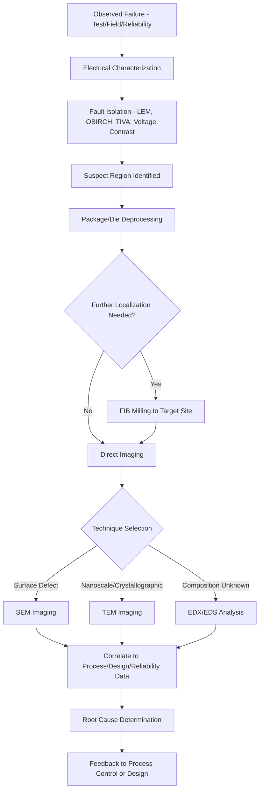

## Failure Analysis Techniques

### Overview

Failure analysis (FA) is the systematic process of identifying the root cause of a semiconductor device malfunction, whether discovered during wafer test, package test, burn-in/reliability qualification, or field return. FA combines electrical characterization, physical fault localization, and microscopic/chemical analysis techniques to trace a failure from its observed symptom (e.g., a functional test failure, a parametric shift, an open/short) down to the specific physical defect and, ultimately, its process or design origin—closing the loop back to yield improvement and reliability corrective action.

### General FA Flow

Failure analysis is generally conducted as a sequential, non-destructive-to-destructive funnel: broad electrical characterization narrows the suspect region, progressively more localized (and often more destructive) physical techniques then isolate and image the defect.

1. **Electrical Characterization**: Confirm and characterize the failure mode (open, short, leakage, functional logic failure, parametric drift).
2. **Fault Isolation (Global Localization)**: Narrow the failure to a physical region of the die using non-destructive or minimally destructive techniques.
3. **Physical Deprocessing**: Selectively remove layers (or open the package) to expose the suspect region for direct physical/imaging analysis.
4. **Defect Imaging and Identification**: Use microscopy techniques to directly image and identify the physical nature of the defect.
5. **Root Cause Determination**: Correlate the physical finding with process history, design data, or test structure data to establish the underlying cause.

### Electrical Characterization and Fault Isolation

#### Curve Tracing and Parametric Analysis

Basic I-V (current-voltage) curve tracing on suspect pins or internal test structures characterizes the failure signature (e.g., resistive short, high-impedance open, diode-like leakage), guiding subsequent localization technique selection.

#### Optical Beam-Induced Techniques

- **Light Emission Microscopy (LEM/EMMI)**: Detects faint photon emission from a biased, operating device, since certain fault conditions (e.g., forward-biased junctions in latch-up, gate oxide leakage sites, saturated transistors) emit weak infrared/visible light detectable with a sensitive cooled camera in a dark environment. Useful for localizing junction-related defects and certain types of leakage.
- **Optical Beam Induced Current/Resistance Change (OBIC/OBIRCH)**: A focused laser beam scans the device while monitoring current or resistance changes; localized heating from the laser interacting with a resistive defect (e.g., a partially formed via, a resistive short) produces a detectable signal at the defect location, even without light emission from the defect itself.
- **Thermally-Induced Voltage Alteration (TIVA)**: A related technique using laser-induced local heating to detect voltage changes associated with resistive anomalies, particularly effective for localizing high-resistance shorts or latent defects along interconnects.

#### Electron Beam Techniques

- **Voltage Contrast (Electron Beam Probing)**: Using a scanning electron microscope in voltage-contrast mode (similar in principle to e-beam inspection's voltage contrast defect detection), charged/floating versus grounded nodes appear with different secondary electron contrast, useful for localizing electrical opens or shorts at the interconnect level without needing to physically probe extremely fine-pitch structures.
- **Electron Beam Absorbed Current (EBAC/EBIC)**: The electron beam induces a measurable current change when it interacts with a conductive path connected to a monitored node; used to trace conductive nets and localize open-circuit defects along interconnect paths, particularly useful for backside failure analysis through flip-chip packages.

#### Lock-in Thermography

Detects highly localized, extremely subtle heat signatures generated by leakage current or resistive defects, using a lock-in (synchronized modulation and phase-sensitive detection) approach to substantially improve sensitivity over static thermal imaging, useful for finding very small leakage sites that would otherwise be masked by overall device power dissipation.

### Physical Deprocessing Techniques

#### Package-Level Deprocessing

- **Decapsulation**: Chemical (acid) or mechanical removal of the package mold compound to expose the die surface for top-side analysis, or backside thinning/polishing to enable backside analysis (increasingly necessary for flip-chip packages where the active die surface faces the substrate rather than upward).

#### Die-Level Deprocessing

- **Wet Chemical Etching**: Selective etchants remove specific dielectric or metal layers sequentially, exposing progressively deeper structures for inspection; requires careful selectivity control to avoid damaging the layer of interest.
- **Plasma/Reactive Ion Etching**: Provides more controllable, often more uniform layer removal than wet etch for certain material systems, particularly useful for exposing specific interconnect layers in modern multi-level-metal stacks.
- **Focused Ion Beam (FIB) Milling**: A finely focused gallium (or other) ion beam mills away material with high spatial precision, enabling targeted cross-sectioning or via exposure at a specific, precisely located defect site identified during earlier fault isolation steps, without needing to blanket-etch the entire die.

### Defect Imaging Techniques

#### Scanning Electron Microscopy (SEM)

Provides high-resolution surface imaging of exposed structures after deprocessing, used to directly visualize physical defects such as voids, particles, pattern defects, or via/contact failures once the relevant layer has been exposed.

#### Transmission Electron Microscopy (TEM)

Provides much higher resolution (down to atomic-scale imaging in favorable cases) by transmitting an electron beam through an extremely thin sample cross-section (typically prepared via FIB milling), enabling detailed crystallographic, interface, and nanoscale defect analysis—for example, characterizing gate oxide thickness/interface quality or examining EM-induced void microstructure. TEM sample preparation is itself a specialized, often FIB-based process given the sample must be thinned to electron-transparency (typically on the order of tens of nanometers).

#### Energy Dispersive X-ray Spectroscopy (EDX/EDS)

Often paired with SEM or TEM, EDX analyzes characteristic X-rays emitted when the electron beam interacts with the sample to determine elemental composition at the defect site, useful for identifying contamination sources (e.g., an unexpected metal particle) or confirming material identity at a suspect interface.

#### Cross-Sectioning

Physical or FIB-based sectioning through a specific location (often guided by prior fault isolation results) reveals the vertical structure at that point, essential for examining via/contact integrity, gate stack composition, or interconnect layer structure that cannot be assessed from a top-down view alone.

### Comparison of Key FA Techniques

| Technique | Primary Use | Resolution/Sensitivity | Destructive? |
| --- | --- | --- | --- |
| LEM/EMMI | Junction leakage, latch-up localization | Die-region level | No |
| OBIRCH/TIVA | Resistive short/open localization | Sub-micron localization | Minimally (laser exposure) |
| Voltage Contrast (SEM) | Open/short net localization | Nanometer-scale imaging | Requires deprocessing to expose nodes |
| EBAC/EBIC | Backside open-circuit tracing | Sub-micron | Minimally, often through package |
| Lock-in Thermography | Subtle leakage site detection | High thermal sensitivity | No |
| FIB Milling | Targeted cross-section/via exposure | Nanometer-scale precision | Yes |
| SEM Imaging | Surface defect visualization | Nanometer-scale | Requires prior deprocessing |
| TEM Imaging | Atomic/nanoscale structural analysis | Sub-nanometer (best case) | Yes (thin sample required) |
| EDX/EDS | Elemental composition identification | Micron to sub-micron spot | Paired with SEM/TEM (non-added destruction) |

### Correlation to Root Cause

Once the physical defect is imaged and characterized, FA engineers correlate findings with:

- **Process History/Lot Traveler Data**: Identifying which specific process tool, chamber, or process step the affected wafer passed through, cross-referenced against in-line inspection and SPC data for that lot.
- **Design Data**: Comparing the defect location against the design layout (GDSII) to determine if the failure is design-pattern-specific (suggesting a systematic/design-process interaction issue) or appears random (suggesting a particle/contamination event).
- **Reliability Test Conditions**: For failures found during reliability stress (e.g., HCI, TDDB, EM qualification), correlating the physical failure signature against the expected wear-out mechanism signature to confirm or refute the suspected failure mode.

### Application Across the Product Lifecycle

- **Yield Ramp FA**: Used extensively during new process/product ramp to identify and eliminate systematic yield-limiting defects, directly feeding back into process and design improvements (see Yield Models and Defect Density Statistics).
- **Reliability Qualification FA**: Applied to units failing accelerated stress testing (TDDB, HCI, BTI, EM) to confirm the failure matches the intended/expected wear-out mechanism and to rule out extrinsic (defect-driven) failure contamination in the qualification population.
- **Field Return FA**: Applied to units returned from customers/end-use failures, often requiring the most extensive fault isolation effort since the failure signature may not be immediately obvious and package-level constraints (e.g., avoiding damage to a functioning but intermittently failing unit) add complexity.

### Failure Analysis Flow (svg_diagram)

### Key Points

- Failure analysis follows a progressive funnel from broad electrical characterization through fault isolation to targeted physical deprocessing and high-resolution imaging.
- Optical and electron beam-based fault isolation techniques (LEM, OBIRCH/TIVA, voltage contrast, EBAC) localize defects non-destructively or minimally destructively before committing to destructive physical analysis.
- FIB milling enables precise, targeted cross-sectioning and TEM sample preparation, allowing nanoscale/atomic-resolution imaging of the specific defect site identified during fault isolation.
- EDX/EDS analysis paired with SEM/TEM provides elemental composition data critical for identifying contamination sources or confirming material identity at defect sites.
- FA findings are correlated against process history, design layout, and reliability test conditions to establish root cause, directly feeding back into yield improvement and reliability corrective action loops.

### Related Topics

- In-line Optical and E-beam Inspection
- Yield Models and Defect Density Statistics
- Time Dependent Dielectric Breakdown (TDDB)
- Electromigration Reliability Testing
- Focused Ion Beam (FIB) Sample Preparation Methods
- Root Cause Corrective Action (RCCA) Methodology in Fabs