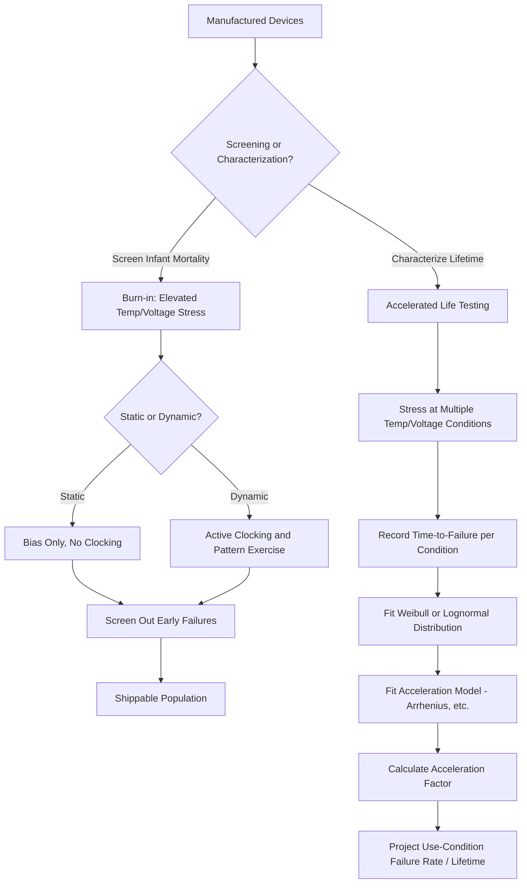

## Burn-in and Accelerated Life Testing

### Overview

Burn-in and accelerated life testing (ALT) are reliability screening and qualification methodologies that stress semiconductor devices under elevated conditions—temperature, voltage, and sometimes humidity or mechanical stress—to either eliminate early-life failures before shipment (burn-in) or project long-term field reliability from compressed-timescale laboratory testing (accelerated life testing). Both methods rely on the same underlying physical principle: many failure mechanisms are thermally and/or electrically activated, so stress conditions harsher than normal use accelerate the same degradation processes that would otherwise take years to manifest.

### The Bathtub Curve

Semiconductor device failure rate over lifetime is classically described by the **bathtub curve**, comprising three distinct phases:

- **Infant Mortality (Early Life)**: A declining failure rate, dominated by latent manufacturing defects (weak dielectrics, marginal interconnects, contamination) that fail quickly under any stress.
- **Useful Life (Constant Failure Rate)**: A roughly constant, low failure rate dominated by random, non-systematic causes.
- **Wear-out (End of Life)**: A rising failure rate as intrinsic wear-out mechanisms (TDDB, HCI, BTI, electromigration—see related topics) accumulate sufficient damage to cause failure across the population.

Burn-in specifically targets screening out the infant mortality population before product shipment, while accelerated life testing is primarily used to characterize and project the useful-life failure rate and the onset of the wear-out phase.

### Burn-in

#### Purpose and Mechanism

Burn-in subjects devices to elevated temperature and voltage (and electrical operation/exercising, in the case of dynamic burn-in) for a defined duration, intentionally accelerating the same latent defect mechanisms responsible for infant mortality failures so that weak units fail during the controlled burn-in process rather than in the field.

#### Static vs. Dynamic Burn-in

- **Static Burn-in**: Devices are held under elevated voltage/temperature bias without active clocking or functional exercising; simpler and lower-cost, but does not stress switching-dependent failure mechanisms.
- **Dynamic Burn-in**: Devices are actively clocked and exercised with test patterns during stress, more effectively activating failure mechanisms dependent on switching activity (e.g., certain interconnect or transistor-level defects only manifest under actual circuit operation) and providing higher screening effectiveness at increased test complexity and cost.

#### Burn-in Economics and the Shift Toward Built-in Screening

Historically, burn-in was applied broadly across many product lines as blanket infant-mortality screening. As process maturity and in-line defect control (see Statistical Process Control and Yield Models) have improved, many mature, high-volume processes have reduced or eliminated blanket burn-in in favor of:

- Enhanced wafer-level and package-level test coverage designed to catch latent defects without a separate thermal/voltage stress step.
- Statistical/outlier-based screening methods (e.g., Part Average Testing, Statistical Bin Limits) that identify parametrically anomalous die without requiring a dedicated time-based burn-in stress.

[Inference: the specific decision to retain, reduce, or eliminate burn-in for a given product is a cost-reliability tradeoff that varies significantly by application segment (e.g., automotive and aerospace/defense products generally retain more extensive burn-in/screening than high-volume consumer products), rather than a fixed industry-wide practice.]

### Highly Accelerated Life Testing (HALT) and Highly Accelerated Stress Screening (HASS)

- **HALT**: Applied primarily during product development, HALT pushes stress conditions (temperature extremes, rapid thermal cycling, vibration) beyond normal specification limits—often well beyond intended product operating range—to rapidly discover design and process margins and identify failure modes, without necessarily correlating stress levels to a specific field-equivalent acceleration factor. The goal is margin discovery rather than precise lifetime quantification.
- **HASS**: A derivative production screening methodology using stress levels informed by HALT findings, applied to a sample or full population of production units to screen for latent defects, generally positioned as a more aggressive alternative or supplement to traditional burn-in for certain high-reliability applications.

### Accelerated Life Testing (ALT) Methodology

#### Purpose

Unlike burn-in (which screens out weak units), ALT is a characterization methodology used to project the failure rate distribution and expected lifetime of a device population under normal use conditions, by testing at multiple elevated stress levels and extrapolating via an appropriate acceleration model.

#### General Test Approach

1. **Stress Condition Selection**: Multiple stress levels (typically temperature, sometimes combined with voltage or humidity) are selected, spanning a range from close to normal operating conditions up to aggressive but physically meaningful accelerated conditions.
2. **Sample Stressing**: A statistically meaningful sample size is stressed at each condition for extended durations, with periodic or continuous monitoring for functional/parametric failure.
3. **Failure Time Recording**: Time-to-failure for each unit (or right-censored data for units surviving to test end) is recorded at each stress condition.
4. **Distribution Fitting**: Failure time data at each stress condition is fit to an appropriate statistical distribution—commonly Weibull (e.g., for TDDB-type wear-out) or lognormal (e.g., for electromigration-type mechanisms)—depending on the dominant failure mechanism under test.
5. **Acceleration Model Fitting**: An appropriate physics-based acceleration model (Arrhenius for temperature, and mechanism-specific voltage/current models as detailed under TDDB, HCI, BTI, and EM) relates the fitted distribution parameters across stress conditions, enabling extrapolation to use-condition lifetime.

#### Combined Stress Testing

Many ALT protocols apply combined stresses (e.g., **HTOL—High Temperature Operating Life**, which combines elevated temperature with active electrical bias/operation) since real product failure modes are often driven by the combination of thermal and electrical stress rather than either alone, and single-stress testing risks missing interaction effects between mechanisms.

### Common Standardized Test Types

- **High Temperature Operating Life (HTOL)**: Devices biased and operated at elevated temperature for an extended duration (often on the order of 1,000 hours as a common industry reference point), used to screen for and characterize multiple wear-out mechanisms simultaneously under realistic operating bias conditions.
- **High Temperature Storage Life (HTSL)**: Unbiased elevated-temperature storage, used to assess purely thermally-activated degradation and packaging-related mechanisms without electrical stress interaction.
- **Temperature Cycling (TC) / Thermal Shock**: Repeated cycling between temperature extremes stresses package-level reliability (solder joint fatigue, die-attach integrity, wire bond reliability) driven by coefficient-of-thermal-expansion (CTE) mismatch between materials.
- **Highly Accelerated Temperature and Humidity Stress Test (HAST) / Temperature-Humidity-Bias (THB)**: Combined temperature, humidity, and bias stress, used to assess moisture-related failure mechanisms such as corrosion or dendritic growth, particularly relevant for package and interconnect reliability rather than purely transistor-level mechanisms.

### Acceleration Factor Calculation

The overall relationship between accelerated test conditions and use conditions is captured by an **acceleration factor (AF)**, the ratio of time-to-failure at use conditions versus accelerated stress conditions:

$$AF = \frac{t_{use}}{t_{stress}} = \exp\left[\frac{E_a}{k}\left(\frac{1}{T_{use}} - \frac{1}{T_{stress}}\right)\right]$$

for purely thermally-activated (Arrhenius) mechanisms, with additional multiplicative voltage/current acceleration terms incorporated for mechanisms with a voltage or current dependence (as detailed in the TDDB, HCI, BTI, and EM topics). The projected field failure rate at use conditions is then derived by dividing the observed accelerated test failure time/rate by the acceleration factor.

### Sample Size and Confidence Considerations

Because reliability qualification typically aims to demonstrate a very low failure rate (e.g., a specified low percentage of failures over the intended product lifetime) with statistical confidence, required sample sizes and test durations are determined using statistical sampling plans (often based on a chi-squared or binomial confidence calculation relating observed failures, sample size, test duration, and target confidence level). Zero-failure qualification plans (demonstrating no failures in a defined sample/duration) are common in practice but require correspondingly larger sample sizes or longer durations to achieve a given confidence level compared to plans that tolerate a small number of failures. [Inference: the specific statistical sampling plan and confidence/reliability targets used are application- and industry-segment-specific requirements rather than a single universal formula outcome.]

### Burn-in and ALT Process Flow (svg_diagram)

### Key Points

- The bathtub curve frames the two complementary goals of burn-in (screening infant mortality) and accelerated life testing (characterizing useful-life and wear-out failure rates).
- Static burn-in applies bias without active operation, while dynamic burn-in adds clocking/exercising for more effective screening of switching-dependent defects, at higher cost and complexity.
- HALT is a development-phase margin discovery methodology using aggressive, often beyond-specification stress, distinct from HASS, which applies HALT-informed stress levels as a production screening methodology.
- Standardized combined-stress tests (HTOL, HTSL, temperature cycling, HAST/THB) each target specific failure mechanism categories, from transistor-level wear-out to package-level moisture and thermal-mechanical fatigue.
- Acceleration factors, derived from mechanism-specific physical models (Arrhenius temperature dependence plus voltage/current terms), enable extrapolation from compressed-timescale accelerated testing to projected field lifetime, with required sample sizes governed by statistical confidence requirements.

### Related Topics

- Time Dependent Dielectric Breakdown (TDDB)
- Electromigration Reliability Testing
- Bias Temperature Instability
- Hot Carrier Injection Degradation
- Package-Level Reliability and Thermal-Mechanical Fatigue
- Statistical Process Control in Fabs