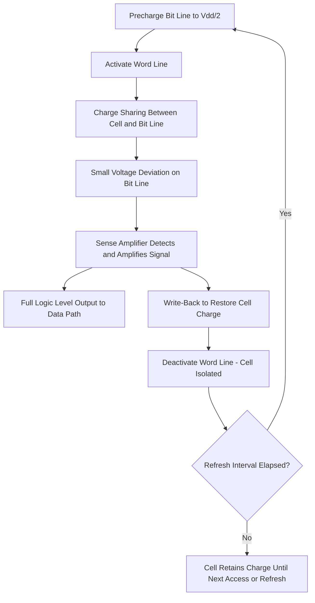

## DRAM Cell Structure and Operation

### Overview

Dynamic Random Access Memory (DRAM) is a volatile memory technology that stores each bit of information as electric charge on a capacitor, accessed through a single transistor. This one-transistor, one-capacitor (1T1C) cell architecture provides the highest storage density among mainstream memory technologies, making DRAM the dominant choice for main system memory. Because the storage capacitor inevitably leaks charge over time, DRAM requires periodic refresh operations to maintain data integrity—the defining characteristic that gives the technology its "dynamic" designation.

### Basic Cell Structure (1T1C)

#### Components

- **Access Transistor**: A single MOSFET (typically NMOS) that connects the storage capacitor to the bit line when activated by the word line, acting as a switch for both write and read operations.
- **Storage Capacitor**: Stores charge representing the binary state of the bit—conventionally, a charged capacitor represents logic '1' and a discharged (or oppositely charged, depending on convention) capacitor represents logic '0'.
- **Word Line (WL)**: Connects to the gate of the access transistor; activating the word line for a given row turns on all access transistors in that row, connecting their capacitors to their respective bit lines.
- **Bit Line (BL)**: Carries charge to/from the storage capacitor during write/read operations and connects to the sense amplifier for read operations.

#### Cell Schematic Concept (svg_diagram)

<svg xmlns="http://www.w3.org/2000/svg" viewBox="0 0 380 260">
<text x="190" y="20" text-anchor="middle" font-size="14" font-family="sans-serif" font-weight="bold">1T1C DRAM Cell (svg_diagram)</text>
<line x1="40" y1="60" x2="340" y2="60" stroke="#333" stroke-width="2" />
<text x="345" y="64" font-size="12" font-family="sans-serif">Bit Line</text>
<line x1="100" y1="60" x2="100" y2="100" stroke="#333" stroke-width="2" />
<rect x="80" y="100" width="40" height="20" fill="none" stroke="#2266cc" stroke-width="2" />
<text x="130" y="115" font-size="11" font-family="sans-serif" fill="#2266cc">Access Transistor</text>
<line x1="60" y1="110" x2="80" y2="110" stroke="#2266cc" stroke-width="2" />
<text x="20" y="114" font-size="12" font-family="sans-serif">Word Line</text>
<line x1="100" y1="120" x2="100" y2="160" stroke="#333" stroke-width="2" />
<line x1="70" y1="170" x2="130" y2="170" stroke="#cc4422" stroke-width="3" />
<line x1="70" y1="185" x2="130" y2="185" stroke="#cc4422" stroke-width="3" />
<text x="140" y="182" font-size="11" font-family="sans-serif" fill="#cc4422">Storage Capacitor</text>
<line x1="100" y1="185" x2="100" y2="220" stroke="#333" stroke-width="2" />
<text x="80" y="240" font-size="11" font-family="sans-serif">Plate Electrode (Vplate)</text>
</svg>

### Cell Operations

#### Write Operation

1. The word line for the target row is activated, turning on the access transistor.
2. The bit line is driven to the voltage representing the desired logic state (high for '1', low for '0').
3. Charge flows through the access transistor to (or from) the storage capacitor until it reaches the bit line voltage.
4. The word line is deactivated, isolating the capacitor with its newly stored charge.

#### Read Operation

Reading a DRAM cell is inherently **destructive**, requiring a write-back step:

1. The bit line is first precharged to an intermediate reference voltage (typically $V_{DD}/2$).
2. The word line is activated, connecting the storage capacitor to the precharged bit line.
3. Charge sharing occurs between the (relatively large) bit line capacitance and the (much smaller) cell capacitance, producing a small voltage deviation on the bit line, either slightly above or slightly below the precharge level, depending on the stored charge state.
4. A **sense amplifier** detects and amplifies this small voltage differential (typically implemented as a cross-coupled differential amplifier comparing the accessed bit line against a reference/companion bit line) to a full logic-level signal.
5. The sense amplifier's amplified value is simultaneously driven back onto the bit line, restoring (rewriting) the original charge level onto the storage capacitor—this write-back step is essential because the read operation itself depletes/disturbs the cell's stored charge.

#### Charge Sharing Voltage

The bit line voltage deviation during sensing can be approximated as:

$$\Delta V = \frac{C_{cell}}{C_{cell} + C_{BL}} \cdot (V_{cell} - V_{precharge})$$

where $C_{cell}$ is the storage capacitor's capacitance, $C_{BL}$ is the bit line's parasitic capacitance, $V_{cell}$ is the stored voltage, and $V_{precharge}$ is the bit line precharge voltage. Because $C_{BL}$ is typically much larger than $C_{cell}$, the resulting signal is small, making sense amplifier design and cell capacitance sizing critical to reliable operation.

### Refresh Requirement

Because the storage capacitor's charge leaks over time (primarily through junction leakage at the access transistor and capacitor dielectric leakage), each cell must be periodically refreshed—read and immediately rewritten—before its stored charge decays enough to be misread. Refresh is managed at the array/controller level:

- **Refresh Interval**: A specification (e.g., a defined maximum retention time, commonly on the order of tens of milliseconds for a full refresh cycle in mainstream commodity DRAM) dictates how frequently each row must be refreshed.
- **Refresh Overhead**: During a refresh operation, the affected row is temporarily unavailable for normal read/write access, meaning refresh consumes some fraction of overall memory bandwidth and introduces access latency overhead, which becomes a more significant relative concern as memory density increases (more rows requiring refresh within the same overall interval). [Inference: specific refresh interval values and the exact fraction of bandwidth/overhead they impose vary by DRAM generation, density, and temperature operating conditions, and should be referenced against the specific product/standard datasheet rather than treated as a fixed constant.]
- **Temperature Dependence**: Leakage current (and thus required refresh frequency) increases with temperature, so DRAM specifications often define accelerated refresh requirements at elevated operating temperature.

### Capacitor Structure Evolution

As DRAM cell area has scaled down across successive technology generations, maintaining sufficient storage capacitance (needed for adequate signal margin and acceptable refresh interval) within a shrinking footprint has driven significant capacitor structural innovation:

- **Planar Capacitors (Legacy)**: Simple planar structures used in early, larger-feature-size DRAM generations, sufficient when cell area was large enough to provide adequate capacitance from a flat plate structure.
- **Trench Capacitors**: Capacitor structure extends vertically into the silicon substrate (a trench etched into the wafer), increasing effective capacitor surface area (and thus capacitance) within a given horizontal footprint without requiring taller above-surface structures.
- **Stacked (Cylinder/Fin) Capacitors**: Capacitor structure is built vertically above the access transistor, using cylindrical, fin, or other high-aspect-ratio 3D shapes to maximize surface area (and thus capacitance) within the available vertical process budget; this approach has become the dominant capacitor architecture in modern high-density DRAM.
- **High-k Dielectric Materials**: Adoption of high-dielectric-constant capacitor insulator materials (in place of simpler silicon dioxide/nitride stacks) increases achievable capacitance per unit area without requiring further increases in physical capacitor structure aspect ratio, complementing the 3D structural approaches above.

### Array Architecture

DRAM cells are organized into a two-dimensional array accessed via row and column decoders:

- **Row Decoder**: Selects and activates a single word line (row) based on the row address.
- **Column Decoder/Multiplexer**: Selects which bit line(s) within the activated row are routed to the output data path based on the column address.
- **Sense Amplifier Array**: A row of sense amplifiers, one per bit line pair, positioned at the array edge (or within the array, for modern folded/open bit line architectures), performs the read amplification and write-back function for an entire activated row simultaneously.
- **Bank Organization**: Modern DRAM devices divide the overall array into multiple independent banks, enabling different banks to be in different states (e.g., one bank being refreshed/accessed while another is idle or being prepared), improving overall achievable bandwidth and access parallelism.

### Access Timing Parameters

Standard DRAM interface specifications define several key timing parameters governing array operation:

- **Row Address to Column Address Delay ($t_{RCD}$)**: Minimum time between row activation (word line assertion) and column access (data read/write) to that row.
- **Row Precharge Time ($t_{RP}$)**: Minimum time required to precharge the bit lines and close an active row before a different row in the same bank can be activated.
- **Row Active Time ($t_{RAS}$)**: Minimum time a row must remain active before it can be precharged, ensuring the sense amplifier write-back step (restoring cell charge) has adequate time to complete.
- **CAS Latency ($t_{CL}$)**: Delay between issuing a column read command and data becoming available on the output, primarily reflecting sense amplifier and output buffer propagation delay.

### DRAM Technology Roadmap Context

Successive DRAM generations and standards (e.g., DDR, LPDDR variants) have primarily focused on increasing per-pin data rate and reducing power consumption while maintaining the fundamental 1T1C cell architecture, with ongoing cell-level scaling challenges centered on maintaining adequate storage capacitance and access transistor leakage control as cell dimensions continue to shrink. [Inference: specific named future DRAM cell architecture alternatives beyond continued 1T1C scaling are an active area of industry research and development discussion, and the timeline/adoption of any particular alternative approach should be verified against current industry roadmap publications rather than assumed as settled.]

### DRAM Cell Read/Write Operation Flow (svg_diagram)

### Key Points

- The 1T1C DRAM cell stores a bit as capacitor charge, accessed through a single MOSFET switch controlled by the word line, providing high storage density at the cost of requiring periodic refresh.
- DRAM read operations are inherently destructive, relying on charge sharing between the small cell capacitance and larger bit line capacitance, followed by sense amplifier amplification and mandatory write-back to restore the original stored charge.
- Refresh is required because capacitor charge leaks over time, with refresh frequency and overhead increasing with cell density and operating temperature.
- Capacitor structures have evolved from planar to trench and stacked (cylinder/fin) 3D architectures, combined with high-k dielectric materials, to maintain adequate storage capacitance as cell area has scaled down.
- Array-level architecture (row/column decoders, sense amplifier arrays, bank organization) and standardized timing parameters ($t_{RCD}$, $t_{RP}$, $t_{RAS}$, $t_{CL}$) govern practical DRAM access performance and are defined by industry interface standards.

### Related Topics

- DRAM Refresh Architecture and Power Optimization
- Sense Amplifier Circuit Design
- Trench and Stacked Capacitor Fabrication Processes
- High-k Dielectric Materials in Memory Devices
- DDR/LPDDR Interface Standards and Timing
- SRAM Cell Structure and Operation