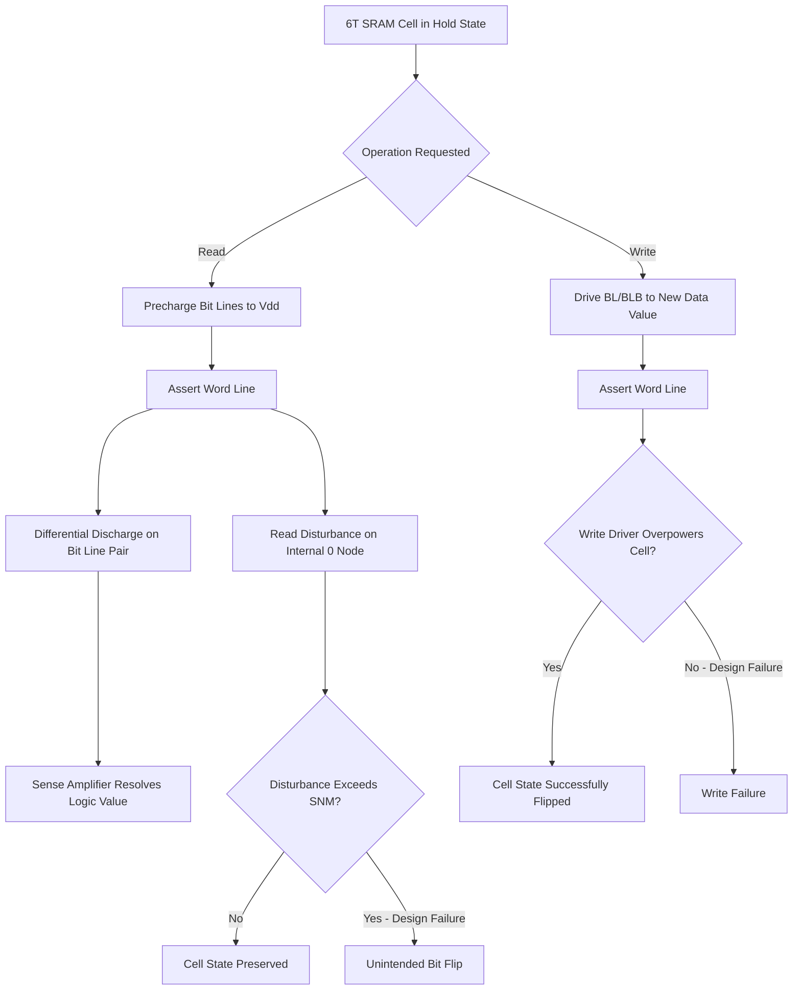

## SRAM Cell Design and Stability

### Overview

Static Random Access Memory (SRAM) is a volatile memory technology that stores each bit as a stable state in a bistable feedback circuit (a latch), rather than as leaking capacitor charge. This eliminates the need for periodic refresh (hence "static"), giving SRAM significantly faster access times than DRAM, at the cost of substantially lower storage density due to the larger number of transistors required per cell. SRAM is the dominant technology for on-chip caches (L1/L2/L3) and register files, where speed is paramount and the required capacity is comparatively modest.

### The 6T SRAM Cell

#### Structure

The standard SRAM cell uses six transistors (6T) arranged as two cross-coupled CMOS inverters plus two access transistors:

- **Cross-Coupled Inverter Pair**: Two CMOS inverters (each composed of one PMOS pull-up and one NMOS pull-down transistor, for four transistors total) are connected such that the output of each inverter feeds the input of the other, creating a positive feedback loop that latches into one of two stable states (representing logic '0' or '1').
- **Access Transistors**: Two additional NMOS transistors connect the two internal storage nodes to a pair of complementary bit lines (BL and BL-bar), gated by a shared word line, enabling read and write access to the cell.

#### Cell Schematic Concept (svg_diagram)

<svg xmlns="http://www.w3.org/2000/svg" viewBox="0 0 400 260">
<text x="200" y="20" text-anchor="middle" font-size="14" font-family="sans-serif" font-weight="bold">6T SRAM Cell (svg_diagram)</text>
<rect x="80" y="60" width="80" height="50" fill="none" stroke="#2266cc" stroke-width="2" />
<text x="120" y="90" text-anchor="middle" font-size="12" font-family="sans-serif" fill="#2266cc">Inverter 1</text>
<rect x="240" y="60" width="80" height="50" fill="none" stroke="#2266cc" stroke-width="2" />
<text x="280" y="90" text-anchor="middle" font-size="12" font-family="sans-serif" fill="#2266cc">Inverter 2</text>
<line x1="160" y1="75" x2="240" y2="75" stroke="#333" stroke-width="2" />
<line x1="240" y1="95" x2="160" y2="95" stroke="#333" stroke-width="2" />
<text x="200" y="70" text-anchor="middle" font-size="10" font-family="sans-serif">Node Q</text>
<text x="200" y="112" text-anchor="middle" font-size="10" font-family="sans-serif">Node QB</text>
<line x1="60" y1="75" x2="80" y2="75" stroke="#cc4422" stroke-width="2" />
<rect x="40" y="130" width="30" height="20" fill="none" stroke="#cc4422" stroke-width="2" />
<text x="55" y="145" text-anchor="middle" font-size="9" font-family="sans-serif" fill="#cc4422">AXL</text>
<line x1="55" y1="75" x2="55" y2="130" stroke="#cc4422" stroke-width="2" />
<line x1="55" y1="150" x2="55" y2="190" stroke="#333" stroke-width="2" />
<text x="40" y="205" font-size="10" font-family="sans-serif">BL</text>
<line x1="340" y1="95" x2="320" y2="95" stroke="#cc4422" stroke-width="2" />
<rect x="330" y="130" width="30" height="20" fill="none" stroke="#cc4422" stroke-width="2" />
<text x="345" y="145" text-anchor="middle" font-size="9" font-family="sans-serif" fill="#cc4422">AXR</text>
<line x1="345" y1="95" x2="345" y2="130" stroke="#cc4422" stroke-width="2" />
<line x1="345" y1="150" x2="345" y2="190" stroke="#333" stroke-width="2" />
<text x="350" y="205" font-size="10" font-family="sans-serif">BLB</text>
<line x1="10" y1="140" x2="40" y2="140" stroke="#009944" stroke-width="2" />
<text x="5" y="130" font-size="10" font-family="sans-serif">WL</text>
</svg>

### Cell Operations

#### Hold (Standby) State

When the word line is deasserted, the access transistors isolate the internal nodes from the bit lines. The cross-coupled inverter pair maintains its state indefinitely (as long as power is supplied) through positive feedback, with no refresh required.

#### Read Operation

1. Both bit lines are precharged to $V_{DD}$.
2. The word line is asserted, turning on both access transistors.
3. One bit line (connected to the internal node storing logic '0') begins discharging through the corresponding access transistor and pull-down NMOS, while the other bit line remains at $V_{DD}$ (or discharges much more slowly).
4. A sense amplifier detects the resulting differential voltage between the bit line pair and resolves it to a full logic-level output.

A critical design concern during read is that the read operation itself disturbs the internal storage nodes slightly (the node storing '0' rises briefly above ground as current flows through the access transistor), and the cell must be designed to ensure this disturbance never approaches a level that could flip the stored state—this requirement is termed **read stability**.

#### Write Operation

1. The desired data value and its complement are driven onto the bit line pair (BL and BL-bar) by the write driver circuitry.
2. The word line is asserted, connecting the internal nodes to the driven bit lines.
3. The bit line drivers, combined with the access transistors, must be strong enough to overpower the existing cross-coupled inverter state and force the internal nodes to the new value—this requirement is termed **write margin** or **writability**.

### Cell Stability Metrics

#### Static Noise Margin (SNM)

SNM quantifies the maximum DC noise voltage that can be tolerated at the cell's internal storage nodes before the cell's stored state becomes unstable and potentially flips. SNM is classically extracted graphically using the **butterfly curve** method:

- The voltage transfer characteristics (VTC) of the two cross-coupled inverters are plotted against each other (one inverter's VTC and the mirrored VTC of the other, overlaid on the same axes), forming two "lobes" resembling a butterfly shape.
- The largest square that can be inscribed within each lobe defines that lobe's noise margin; the side length of the smaller of the two inscribed squares is taken as the cell's SNM.

Because the read operation applies additional disturbance to the internal nodes (via the access transistor connecting to a precharged, then discharging, bit line), **read SNM** is evaluated under read-condition biasing (word line asserted, access transistors on) and is generally the more restrictive stability metric compared to **hold SNM** (evaluated with the cell in standby, word line deasserted). Write margin is often characterized as a distinct, separate metric (e.g., write trip voltage) rather than through the same butterfly-curve SNM construction, since write operation intentionally seeks to overcome and flip cell state.

#### Cell Ratio (Beta Ratio)

A design parameter historically used to characterize the relative strength of the pull-down NMOS transistor to the access NMOS transistor:

$$\beta_{ratio} = \frac{(W/L)_{pull\text{-}down}}{(W/L)_{access}}$$

A larger cell ratio (stronger pull-down relative to access transistor) improves read stability, since the pull-down transistor is better able to hold the '0' node low against the disturbance current flowing through the access transistor during read. This ratio-based sizing approach was more central to planar bulk CMOS SRAM design; contemporary designs (especially with FinFET or other advanced transistor architectures with discretized, quantized width steps) balance this consideration alongside other stability enhancement techniques described below. [Inference: the specific quantitative cell ratio targets referenced in classical SRAM design literature are process-node- and technology-specific and should not be treated as universal design constants.]

### Read/Write Stability Tension

The 6T cell design faces an inherent tension: read stability favors a strong pull-down relative to access transistor (larger cell ratio), while writability favors a relatively weaker pull-down/pull-up relative to the access transistor (or, alternatively, a stronger access transistor relative to the pull-up, sometimes characterized via a "pull-up ratio"), so that the write driver can more easily overpower the cell during write. This tension has motivated both careful transistor sizing optimization and alternative cell topologies.

### Alternative Cell Topologies

- **8T SRAM Cell**: Adds two additional transistors forming a separate, isolated read port/buffer, decoupling the read operation from directly disturbing the storage nodes through the same access transistors used for write. This substantially improves read stability (since the read path no longer directly loads the storage node) at the cost of increased cell area compared to 6T.
- **10T and Other Multi-Transistor Cells**: Further variations add additional transistors for enhanced stability margins, reduced leakage, or improved write assist, particularly relevant for very low operating voltage designs where standard 6T stability margins become insufficient. [Inference: the specific choice among multi-transistor SRAM topologies for a given product involves an area-versus-stability-versus-power tradeoff that is design- and application-specific, rather than a single universally preferred alternative.]

### Assist Techniques

Rather than solely relying on alternative topologies, many designs retain the area-efficient 6T cell but add circuit-level "assist" techniques to improve margins under aggressive voltage/process scaling:

- **Write Assist**: Techniques such as negative bit line boosting, word line voltage boosting, or temporarily lowering the cell's effective supply voltage during write, all aimed at making it easier to overpower and flip the cell state during write without changing the cell's intrinsic transistor sizing.
- **Read Assist**: Techniques such as raising the cell's effective supply voltage during read or lowering the word line voltage during read, aimed at reducing the read disturbance without altering cell transistor sizing.

### Process Variation Impact

SRAM cells are typically the smallest, most numerous repeated structure on a chip, making them particularly sensitive to random process variation—random dopant fluctuation, line-edge roughness, and (for advanced nodes) work-function variation in metal gates—since even small absolute transistor-to-transistor mismatches within a single cell can significantly affect the relative strength balance the cell's stability depends on. This has driven the adoption of statistical (Monte Carlo-based) SRAM design methodologies rather than purely nominal (typical-case) design verification, since a memory array contains a very large number of cells and even a very low per-cell failure probability can translate to a meaningfully high probability that at least one cell in a large array fails to meet stability requirements. [Inference: the specific statistical design margining approach and target per-cell failure probability are design-methodology choices that vary by company and product reliability requirements.]

### SRAM Read/Write Operation and Stability Flow (svg_diagram)

### Key Points

- The 6T SRAM cell uses two cross-coupled CMOS inverters for bistable storage plus two access transistors, requiring no refresh but consuming more area per bit than DRAM.
- Read operations disturb internal storage nodes through the access transistors, making read stability (quantified via read Static Noise Margin, using the butterfly-curve method) a critical design constraint distinct from hold stability.
- Read stability and writability impose opposing transistor sizing preferences, creating an inherent design tension addressed through careful sizing (historically via cell ratio/pull-up ratio), alternative topologies (8T, 10T), or circuit-level assist techniques.
- Read and write assist circuits (bit line/word line voltage boosting, dynamic supply adjustment) allow retention of the area-efficient 6T cell while improving margins for low-voltage or advanced-node operation.
- Because SRAM cells are the most numerous repeated structure on-chip, random process variation sensitivity necessitates statistical (Monte Carlo) design verification rather than purely nominal-case analysis, given the high cumulative failure probability across large memory arrays.

### Related Topics

- DRAM Cell Structure and Operation
- Bias Temperature Instability (SRAM Stability Impact)
- Random Telegraph Noise in Scaled Transistors
- Statistical/Monte Carlo Circuit Design Methodology
- FinFET Device Architecture and Variation
- Sense Amplifier Circuit Design