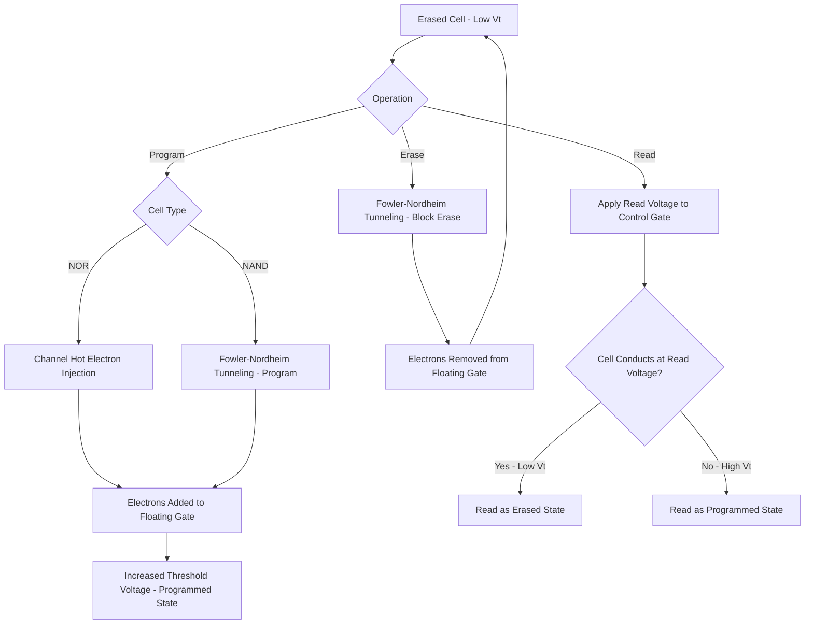

## NOR and NAND Flash Memory Physics

### Overview

Flash memory is a non-volatile memory technology that stores data by trapping charge on an electrically isolated floating gate (or, in newer designs, within a charge-trapping dielectric layer) within a modified MOSFET structure. Unlike DRAM and SRAM, flash memory retains its stored state without power, making it the dominant technology for solid-state storage. The two principal flash architectures—NOR and NAND—share the same fundamental charge-storage physics at the cell level but differ substantially in array architecture, access characteristics, and target applications.

### The Floating Gate Transistor

#### Structure

A standard floating gate flash cell is built as a MOSFET with two stacked gate electrodes:

- **Floating Gate (FG)**: A conductive (typically polysilicon) gate fully surrounded by insulating dielectric, electrically isolated from all other terminals. Charge stored on the floating gate is retained indefinitely under ideal conditions since it has no direct conductive path to leak away.
- **Control Gate (CG)**: A second gate electrode above the floating gate (separated by an interpoly dielectric), which is externally accessible and used to apply the voltage needed for programming, erasing, and reading the cell.
- **Tunnel Oxide**: A thin dielectric layer between the floating gate and the channel, thin enough to allow controlled charge transport (via mechanisms described below) during program/erase operations, while remaining thick enough to provide adequate charge retention during normal operation.

#### Threshold Voltage Modulation

The amount of charge stored on the floating gate directly shifts the cell's effective threshold voltage ($V_t$) as seen from the control gate: additional negative charge (electrons) on the floating gate requires a higher control gate voltage to invert the channel, increasing the apparent $V_t$. This $V_t$ shift is the fundamental physical mechanism by which stored data is distinguished during a read operation—a "programmed" cell (more electrons on the floating gate, higher $V_t$) and an "erased" cell (fewer electrons, lower $V_t$) are distinguished by whether the cell conducts current at a given applied read voltage.

### Charge Transport Mechanisms

#### Fowler-Nordheim (FN) Tunneling

A quantum mechanical tunneling process in which electrons tunnel through the tunnel oxide under a strong applied electric field, without requiring the electron to have specific kinetic energy matching the oxide barrier height (distinguishing it from thermionic emission). The tunneling current density follows the characteristic FN relationship:

$$J_{FN} = A E^2 \exp\left(-\fracncoded{B}{E}\right)$$

(where $A$ and $B$ are material/barrier-dependent constants and $E$ is the electric field across the oxide) FN tunneling is relatively low-power and is commonly used for both programming and erasing in NAND flash, and for erase operations in many NOR flash designs, due to its ability to move charge across the relatively large cell array efficiently.

#### Channel Hot Electron (CHE) Injection

Similar in physical origin to the HCI degradation mechanism described in the reliability chapter, but here deliberately exploited as the programming mechanism: applying a high drain-to-source voltage alongside an elevated control gate voltage accelerates channel electrons to high energy near the drain, allowing a fraction to surmount the tunnel oxide barrier and inject onto the floating gate. CHE injection requires higher current per cell than FN tunneling (since a continuous channel current must flow to generate hot electrons) but provides faster, more localized single-cell programming, making it historically favored for NOR flash programming where per-cell random-access programming is a key requirement.

### NOR Flash Architecture

#### Array Structure

In a NOR flash array, cells are connected in parallel between bit lines and ground, resembling the pull-down network structure of a NOR logic gate (hence the name)—each cell's drain connects directly to a bit line, and each cell's source connects to a common source line, with the control gate connected to the word line.

#### Key Characteristics

- **Random Access Read**: Because each cell has a direct, independent connection to its bit line, NOR flash supports fast, random-access reads at the individual byte/word level, comparable in access pattern (though not necessarily in absolute speed) to other random-access memories.
- **Programming**: Typically via Channel Hot Electron injection, enabling relatively fast, individually addressable programming, though at higher per-bit programming current than NAND's tunneling-based approach.
- **Erase**: Performed in relatively large blocks via Fowler-Nordheim tunneling (removing electrons from the floating gate back to the channel or source), since block-level (rather than single-cell) erase is a defining characteristic shared by both NOR and NAND flash technologies.
- **Applications**: NOR flash's random-access read capability makes it well suited for code storage/execute-in-place applications (e.g., firmware, embedded microcontroller program storage) where fast, low-latency random access to individual instructions is valuable, though at generally lower storage density than NAND.

### NAND Flash Architecture

#### Array Structure

In a NAND flash array, cells are connected in series, forming a string of typically 32, 64, or more cells between a bit line select transistor and a source select transistor—resembling the series pull-down structure of a NAND logic gate (hence the name). Each cell's control gate connects to a distinct word line shared across all strings in that row (a "page"), while the entire string shares a single bit line connection.

#### Key Characteristics

- **Sequential/Page-Based Access**: Because cells within a string are connected in series, reading or programming an individual cell requires passing current through (or otherwise accounting for) the other series-connected cells in the same string, making NAND flash inherently organized around page-level (a full row across many strings) read and program operations rather than true random single-cell access.
- **Programming**: Typically via Fowler-Nordheim tunneling (rather than CHE injection), since the series-string architecture and desire for low per-bit programming power favor tunneling-based charge transport; programming is performed page-by-page.
- **Erase**: Performed at the block level (a block comprising multiple pages/strings) via Fowler-Nordheim tunneling, removing charge from the floating gate to the substrate; NAND flash requires that a block be fully erased before any of its pages can be reprogrammed, a defining architectural constraint (the "erase-before-write" requirement) that shapes flash controller and file system design.
- **Density Advantage**: The series-connected string architecture eliminates the need for a dedicated contact to every individual cell (only string-end contacts are required), enabling significantly higher storage density than NOR flash for a given process generation, which is the primary reason NAND dominates high-capacity storage applications (SSDs, memory cards, USB drives).

### Comparison Table

| Attribute | NOR Flash | NAND Flash |
| --- | --- | --- |
| Cell Connection | Parallel (bit line to ground) | Series (string of cells) |
| Read Access | Random, byte/word-level | Page-level, sequential-oriented |
| Programming Mechanism | Channel Hot Electron (typical) | Fowler-Nordheim Tunneling (typical) |
| Erase Mechanism | FN Tunneling, block-level | FN Tunneling, block-level |
| Storage Density | Lower | Higher |
| Primary Application | Code storage / execute-in-place | Mass storage (SSD, memory cards) |

### Multi-Level Cell (MLC) Storage

Both NOR and NAND flash architectures can extend beyond simple binary (single-bit-per-cell, SLC) storage by exploiting the fact that floating gate charge—and thus threshold voltage—can be controlled to multiple distinct, precisely differentiated levels rather than just two:

- **SLC (Single-Level Cell)**: One bit per cell, two $V_t$ states, providing the highest performance, endurance, and reliability margin.
- **MLC (Multi-Level Cell)**: Two bits per cell, four distinct $V_t$ states, roughly doubling density relative to SLC at the cost of reduced read/write margin and endurance.
- **TLC (Triple-Level Cell)**: Three bits per cell, eight $V_t$ states, further increasing density with further-reduced per-state margin.
- **QLC (Quad-Level Cell)**: Four bits per cell, sixteen $V_t$ states, representing a further density/margin tradeoff point at the (currently) high-density end of the mainstream NAND product spectrum. [Inference: whether cell technologies beyond QLC become mainstream commercial products, and their specific characteristics, is subject to ongoing industry development and should be verified against current product announcements rather than assumed.]

Multi-level storage requires increasingly precise program/verify algorithms (iterative programming pulses with intermediate verification reads) to place the floating gate charge accurately within an increasingly narrow target $V_t$ window for each state, and correspondingly more sophisticated error correction coding (ECC) to manage the reduced noise margin between adjacent states.

### Charge Trapping Flash (Alternative to Floating Gate)

An alternative cell structure replaces the conductive floating gate with a charge-trapping dielectric layer (e.g., silicon nitride, as in SONOS-type structures), which stores charge in localized, spatially distributed trap states within the dielectric rather than as a single conductive charge pool. This approach:

- Reduces sensitivity to a single localized tunnel oxide defect causing catastrophic charge loss (since charge is distributed across many discrete trap sites rather than a single conductive node), potentially improving certain aspects of reliability/scalability.
- Has been adopted in various 3D NAND flash implementations as vertical scaling (stacking many memory layers) has become the primary density scaling approach for NAND flash, complementing or in some cases replacing traditional floating-gate structures at very high layer counts. [Inference: the specific charge-storage cell technology (floating gate vs. charge-trap) used in any particular current-generation 3D NAND product is vendor- and generation-specific, and should be verified against current vendor technical publications rather than assumed uniformly across the industry.]

### 3D NAND Scaling Context

As 2D (planar) NAND scaling approached fundamental physical limits (charge storage capacity per cell, cell-to-cell interference at very small pitch), the industry transitioned to **3D NAND**, stacking many layers of memory cells vertically within a single die, using vertical channel structures passing through the stacked word line layers. This architectural shift fundamentally changed the primary NAND density scaling lever from horizontal (planar) feature size reduction to vertical layer count increase. [Unverified: specific current layer counts and process details for leading-edge 3D NAND products change frequently across vendors and generations; current figures should be verified via vendor documentation rather than referenced from static values.]

### Reliability Considerations Specific to Flash

- **Endurance (Program/Erase Cycling)**: Each program/erase cycle causes cumulative tunnel oxide wear-out (trap generation, similar in underlying physics to TDDB), gradually degrading charge retention and increasing programming disturb sensitivity; endurance is typically specified as a maximum number of program/erase cycles per block.
- **Retention**: Stored charge can gradually leak from the floating gate/trap layer over time (accelerated by elevated temperature and by cumulative program/erase cycling wear-out), requiring specified minimum data retention periods and, in system-level implementations, periodic data refresh/rewriting strategies for aged flash media.
- **Read Disturb and Program Disturb**: Repeatedly reading or programming cells in the same block/string can induce small unintended charge changes in neighboring, non-targeted cells due to shared word line/bit line biasing during those operations, requiring careful voltage scheme design and error correction coding to manage cumulative disturb effects.

### Flash Cell Program/Erase/Read Flow (svg_diagram)

### Key Points

- Flash memory stores data as charge on an electrically isolated floating gate (or within a charge-trapping dielectric), which shifts the cell's threshold voltage in a way that is read out as the stored logic state.
- NOR flash connects cells in parallel for fast random-access reads, typically programs via Channel Hot Electron injection, and is favored for code storage/execute-in-place applications.
- NAND flash connects cells in series strings for higher density, typically programs via Fowler-Nordheim tunneling, and dominates mass storage applications due to its superior area efficiency.
- Both architectures erase in blocks via Fowler-Nordheim tunneling, imposing an erase-before-write constraint that shapes flash controller and file system design, particularly for NAND.
- Multi-level cell storage (MLC/TLC/QLC) increases density by encoding multiple bits per cell through precisely differentiated threshold voltage states, at the cost of reduced margin, endurance, and increased error correction requirements; 3D NAND has shifted the primary density scaling approach from planar feature scaling to vertical layer stacking.

### Related Topics

- Time Dependent Dielectric Breakdown (TDDB) — Tunnel Oxide Wear-out Analogy
- Hot Carrier Injection Degradation — Programming Mechanism Analogy
- 3D NAND Vertical Channel Process Integration
- Error Correction Coding (ECC) for Non-Volatile Memory
- DRAM Cell Structure and Operation
- SRAM Cell Design and Stability