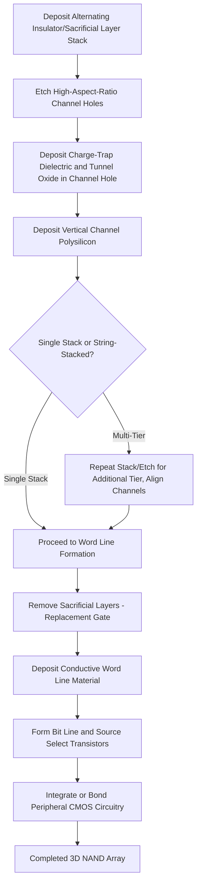

## 3D NAND Architecture

### Overview

3D NAND architecture stacks memory cells vertically across many layers within a single die, replacing the planar (2D) NAND scaling approach that relied on shrinking horizontal feature size. As 2D NAND scaling approached fundamental physical limits—severe cell-to-cell interference at very small pitch, insufficient floating gate charge storage capacity, and worsening reliability margins—the industry transitioned to a vertical channel architecture in which word lines are stacked as horizontal layers and a vertical conducting channel passes through them, fundamentally changing the primary density scaling lever from lateral dimension reduction to layer count increase.

### Motivation for the Vertical Transition

#### 2D NAND Scaling Limits

Planar NAND scaling faced compounding physical challenges as cell pitch shrank:

- **Cell-to-Cell Interference**: Reduced spacing between adjacent floating gate cells increased parasitic capacitive coupling, causing a programmed cell's threshold voltage to be disturbed by the programming of neighboring cells.
- **Limited Floating Gate Volume**: Shrinking cell area reduced the floating gate's physical charge storage capacity, narrowing the achievable threshold voltage margin between adjacent stored states (particularly problematic for multi-level cell storage).
- **Tunnel Oxide Scaling Limits**: Continued tunnel oxide thickness reduction (needed to maintain adequate programming/erase voltage as other dimensions shrank) increasingly compromised charge retention and endurance.

#### Vertical Scaling Rationale

By stacking cells vertically, 3D NAND relaxes the lateral pitch requirement (allowing a comparatively larger, more relaxed lithography node for the horizontal dimension) while achieving density increases primarily through adding more vertical layers—a scaling lever largely decoupled from the lateral lithographic and electrical limitations that constrained 2D NAND.

### Vertical Channel Cell Structure

#### Charge-Trap Layer (Typical Approach)

Most 3D NAND implementations use a **charge-trapping dielectric** (commonly silicon nitride, in a structure conceptually related to SONOS-type memory) rather than a discrete conductive floating gate, storing charge in spatially distributed, localized trap states within the dielectric layer that wraps around the vertical channel. [Inference: the specific charge-storage cell technology used varies by vendor and generation, and some 3D NAND implementations have used floating-gate-based approaches; current vendor-specific details should be verified against current technical publications rather than assumed uniformly.]

#### Gate-All-Around Vertical Structure

Unlike planar NAND's cell structure (floating gate above a horizontal channel), 3D NAND cells are typically structured as a **gate-all-around** configuration: the vertical channel (a cylindrical polysilicon pillar) passes through a stack of alternating conductive word line layers and insulating layers, with the charge-trapping dielectric and a thin tunnel oxide wrapping around the channel at each word line layer, forming an individual memory cell at each intersection of the vertical channel and a horizontal word line layer.

#### Structural Concept (svg_diagram)

<svg xmlns="http://www.w3.org/2000/svg" viewBox="0 0 360 300">
<text x="180" y="20" text-anchor="middle" font-size="14" font-family="sans-serif" font-weight="bold">3D NAND Vertical Channel (svg_diagram)</text>
<rect x="60" y="45" width="240" height="20" fill="#cccccc" stroke="#333" stroke-width="1" />
<text x="310" y="59" font-size="10" font-family="sans-serif">WL n</text>
<rect x="60" y="75" width="240" height="20" fill="#cccccc" stroke="#333" stroke-width="1" />
<text x="310" y="89" font-size="10" font-family="sans-serif">WL n-1</text>
<rect x="60" y="105" width="240" height="20" fill="#cccccc" stroke="#333" stroke-width="1" />
<text x="310" y="119" font-size="10" font-family="sans-serif">WL n-2</text>
<rect x="60" y="135" width="240" height="20" fill="#eeeeee" stroke="#999" stroke-width="1" stroke-dasharray="3,2" />
<text x="150" y="149" text-anchor="middle" font-size="10" font-family="sans-serif" fill="#777">(additional layers)</text>
<rect x="60" y="165" width="240" height="20" fill="#cccccc" stroke="#333" stroke-width="1" />
<text x="310" y="179" font-size="10" font-family="sans-serif">WL 1</text>
<rect x="60" y="195" width="240" height="20" fill="#cccccc" stroke="#333" stroke-width="1" />
<text x="310" y="209" font-size="10" font-family="sans-serif">WL 0</text>
<line x1="180" y1="45" x2="180" y2="230" stroke="#cc4422" stroke-width="10" />
<text x="230" y="240" font-size="11" font-family="sans-serif" fill="#cc4422">Vertical Channel</text>
<line x1="170" y1="45" x2="170" y2="230" stroke="#2266cc" stroke-width="3" />
<line x1="190" y1="45" x2="190" y2="230" stroke="#2266cc" stroke-width="3" />
<text x="60" y="240" font-size="10" font-family="sans-serif" fill="#2266cc">Charge-Trap Layer</text>
<rect x="150" y="230" width="60" height="20" fill="none" stroke="#009944" stroke-width="2" />
<text x="180" y="244" text-anchor="middle" font-size="9" font-family="sans-serif" fill="#009944">Bit Line Select</text>
</svg>

### Array Architecture

#### String and Block Organization

Similar in logical concept to 2D NAND, cells along a single vertical channel form a **NAND string**, with a bit line select transistor at the top and a source select transistor at the bottom of each vertical pillar. A **block** comprises a set of these vertical strings sharing a common set of word line layers, with erase performed at the block level as in planar NAND.

#### Word Line Layer Stacking

Word lines are formed as horizontal conductive layers (often deposited as an insulator-first "sacrificial" material later replaced with metal in a **replacement gate** process, described below) stacked with intervening insulating layers, with a common lithographically-defined vertical channel hole etched through the entire stack to define each string location.

### Manufacturing Process Considerations

#### High-Aspect-Ratio Channel Hole Etch

A defining fabrication challenge in 3D NAND is etching a very high-aspect-ratio (deep relative to diameter) vertical channel hole through the entire stack of alternating conductive/insulating layers, which must maintain a highly uniform, vertical (non-tapering) profile through dozens of layers to ensure consistent cell characteristics at every vertical position along the channel—an increasingly demanding requirement as layer counts increase.

#### Replacement Gate ("Gate-Last") Process

Many 3D NAND process flows use a **replacement gate** approach: the stack is initially built using alternating insulating layers and a sacrificial material (rather than the final conductive word line material) at each word line level, the vertical channel structure is formed, and then the sacrificial layers are selectively removed and replaced with the actual conductive word line material (often tungsten) through a subsequent process step. This approach is favored because it avoids exposing the final metal word line material to the high-temperature or chemically aggressive conditions of channel hole formation and other early process steps, and allows better control of the interface between the word line material and the charge-trap/tunnel dielectric stack formed around the channel. [Inference: the specific process flow details (materials, exact sequence) vary by vendor and generation and should be verified against current vendor technical publications rather than assumed as a single universal flow.]

#### String Stacking (Multi-Tier Fabrication)

As layer counts have increased, manufacturing a single continuous stack of alternating layers and etching a single channel hole through the entire stack becomes increasingly difficult (etch aspect ratio and profile uniformity challenges compound with stack height). Many high-layer-count 3D NAND designs address this via **string stacking**: fabricating the device as two (or more) separate, shorter stacks sequentially, with the vertical channel holes in each tier aligned and electrically joined at the tier interface, effectively achieving a higher total layer count than would be practical with single-pass channel hole etching alone. [Inference: the specific number of tiers and layer counts used in any current-generation product are vendor- and generation-specific figures that change frequently and should be verified against current vendor documentation rather than assumed static values.]

### Peripheral Circuit Integration

#### CMOS Under Array (CUA) / CMOS Bonded Array (CBA)

To improve die area efficiency, many 3D NAND designs place the peripheral CMOS logic circuitry (row/column decoders, sense amplifiers, charge pumps) either directly beneath the memory array (**CMOS Under Array**) or fabricated on a separate wafer and bonded to the memory array wafer (**CMOS Bonded Array** / wafer-to-wafer bonding approaches), rather than placing peripheral circuitry beside the array in the same planar area as in older architectures. This allows the peripheral circuit area to be effectively "hidden" beneath or bonded to the array rather than consuming additional die area alongside it, improving overall bit density. [Inference: the specific approach (CUA vs. wafer bonding) and its adoption timeline vary by vendor and product generation, and should be verified against current vendor technical disclosures.]

### Multi-Level Cell Storage in 3D NAND

3D NAND, like planar NAND, supports multi-level cell storage (MLC, TLC, QLC—see NOR/NAND Flash Memory Physics for the underlying threshold voltage state physics), with the additional per-cell charge storage volume and improved cell isolation characteristics of the 3D structure generally providing more comfortable margin for higher-bit-per-cell storage compared to highly scaled planar NAND, contributing to the industry's ability to commercialize QLC (and explore further multi-level approaches) predominantly in 3D NAND products. [Inference: the specific relationship between layer count, cell margin, and maximum practical bits-per-cell is an active area of ongoing device and process development.]

### Reliability and Scaling Considerations Specific to 3D NAND

- **Layer-to-Layer Variation**: Cells at different vertical positions along the same channel (different word line layers) can exhibit systematic differences in electrical characteristics due to process non-uniformity through the stack (e.g., channel hole diameter variation with depth, or charge-trap layer thickness variation), requiring layer-aware program/erase voltage calibration and error correction strategies.
- **String Current and Channel Resistance**: The vertical polysilicon channel generally has higher resistance than the single-crystal silicon channel used in planar NAND, affecting read current and access characteristics, and requiring careful channel material/doping engineering.
- **Word Line-to-Word Line Interference and Coupling**: While 3D NAND's larger lateral cell pitch reduces certain planar-scaling-driven interference mechanisms, vertically stacked word lines introduce their own layer-to-layer coupling and parasitic capacitance considerations distinct from 2D NAND's purely lateral interference concerns.

### 3D NAND Fabrication Flow (svg_diagram)

### Key Points

- 3D NAND stacks memory cells vertically across many layers with a vertical channel passing through stacked word lines, shifting the primary density scaling lever from lateral feature size reduction to layer count increase.
- The transition addressed fundamental 2D NAND scaling limits, including cell-to-cell interference, insufficient floating gate charge capacity, and tunnel oxide reliability constraints at very small pitch.
- Most implementations use a charge-trapping dielectric in a gate-all-around vertical structure, commonly fabricated via a replacement gate process that avoids exposing final word line metal to early high-stress process steps.
- String stacking (multi-tier fabrication) enables higher total layer counts than single-pass channel hole etching can practically achieve, as etch aspect ratio and profile uniformity challenges compound with stack height.
- CMOS Under Array or wafer-bonded peripheral circuit integration improves bit density by relocating peripheral logic beneath or bonded to the array rather than consuming adjacent planar die area.

### Related Topics

- NOR and NAND Flash Memory Physics
- Floating Gate and Charge Trap Mechanisms
- Wafer-to-Wafer Bonding Process Integration
- High-Aspect-Ratio Etch Process Development
- Error Correction Coding (ECC) for Non-Volatile Memory
- Multi-Level Cell Programming and Verify Algorithms