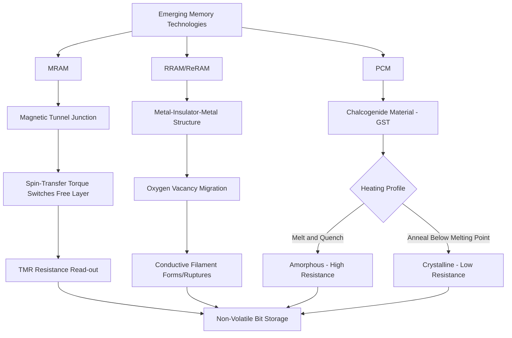

## Emerging Memories: MRAM, RRAM, and PCM

### Overview

Emerging memory technologies aim to combine attributes traditionally split across separate memory classes—the non-volatility of flash, the speed of SRAM, and the density/scalability of DRAM—into new device physics that avoid the specific limitations of each incumbent technology. Magnetoresistive RAM (MRAM), Resistive RAM (RRAM/ReRAM), and Phase-Change Memory (PCM) represent three distinct physical storage mechanisms, each with different characteristic strengths, targeting applications ranging from embedded non-volatile memory replacement to storage-class memory positioned between DRAM and NAND flash in the memory hierarchy.

### Magnetoresistive RAM (MRAM)

#### Physical Mechanism: Magnetic Tunnel Junction (MTJ)

MRAM stores data as the relative magnetic orientation of two ferromagnetic layers separated by a thin insulating tunnel barrier, forming a **Magnetic Tunnel Junction (MTJ)**:

- **Reference (Pinned) Layer**: A ferromagnetic layer with a fixed magnetic orientation, typically fixed via exchange coupling to an adjacent antiferromagnetic layer.
- **Free Layer**: A ferromagnetic layer whose magnetic orientation can be switched between parallel and antiparallel alignment relative to the reference layer, representing the stored bit.
- **Tunnel Barrier**: A thin insulating layer (commonly magnesium oxide, MgO) separating the two ferromagnetic layers, thin enough to allow electron tunneling.

The MTJ's electrical resistance depends on the relative orientation of the two ferromagnetic layers—a phenomenon known as **Tunneling Magnetoresistance (TMR)**: parallel alignment yields lower resistance, while antiparallel alignment yields higher resistance. This resistance difference is read out to determine the stored logic state.

#### Switching Mechanism: Spin-Transfer Torque (STT)

Modern MRAM predominantly uses **Spin-Transfer Torque (STT)** switching: a spin-polarized current (current whose electron spins are preferentially aligned, produced by passing through the fixed reference layer) is passed through the MTJ; when the current is sufficiently large, the transferred spin angular momentum can flip the free layer's magnetic orientation, switching the cell between low- and high-resistance states.

- **STT-MRAM**: The dominant modern MRAM implementation, offering a two-terminal cell (current flows directly through the MTJ stack for both read and write), enabling relatively compact cell area.
- **Spin-Orbit Torque (SOT) MRAM**: An emerging variant using a separate write current path (through an adjacent heavy-metal layer exhibiting strong spin-orbit coupling) decoupled from the read current path, potentially improving write speed and endurance at the cost of a more complex three-terminal cell structure. [Inference: SOT-MRAM's relative commercial maturity compared to STT-MRAM continues to evolve, and current adoption status should be verified against current industry publications.]

#### Key Characteristics

- **Non-Volatility**: Magnetic state is retained without power, similar in principle to flash but without flash's tunnel-oxide-based charge storage/leakage mechanism.
- **Endurance**: Generally offers substantially higher write endurance than NAND flash, since the STT switching mechanism does not involve the same cumulative dielectric wear-out physics as flash tunnel oxide cycling. [Inference: specific endurance figures vary significantly by MRAM generation, cell design, and manufacturer, and should be referenced against current datasheets rather than treated as a fixed universal value.]
- **Speed**: STT-MRAM write/read speeds are generally positioned closer to SRAM/DRAM speed than to flash, though specific figures depend on cell design and array architecture.
- **Applications**: Embedded non-volatile memory (replacing embedded flash in some microcontroller/SoC applications), and standalone MRAM for applications requiring fast, non-volatile storage with high endurance.

### Resistive RAM (RRAM/ReRAM)

#### Physical Mechanism: Conductive Filament Formation

RRAM stores data as a resistance state within a metal-insulator-metal (MIM) structure, where the insulating layer (commonly a metal oxide such as hafnium oxide or tantalum oxide) can be switched between a high-resistance state (HRS) and low-resistance state (LRS) through the formation and rupture of a **conductive filament**:

- **SET Operation**: Applying a voltage of appropriate polarity/magnitude drives migration of oxygen vacancies (or, in some material systems, metal ions) within the oxide layer, forming a localized conductive filament that bridges the two electrodes, switching the cell to the low-resistance state.
- **RESET Operation**: Applying an opposite-polarity (or, in unipolar designs, sufficiently high-current) voltage disrupts or partially dissolves the conductive filament, returning the cell to the high-resistance state.

#### Switching Modes

- **Bipolar Switching**: SET and RESET require opposite voltage polarities; the more commonly emphasized mode in contemporary oxide-based RRAM research and development.
- **Unipolar Switching**: SET and RESET occur under the same voltage polarity, distinguished instead by voltage/current magnitude and compliance current control; historically explored in certain material systems though generally considered to offer less controllable switching behavior in many implementations. [Inference: the relative research and commercial emphasis between bipolar and unipolar switching approaches has evolved over time and varies by specific material system under study.]

#### Key Characteristics

- **Simple Structure**: The basic MIM structure is relatively simple and compatible with back-end-of-line (BEOL) integration, potentially enabling cost-effective, scalable fabrication and multi-layer stacking.
- **Variability**: Filament formation is inherently a somewhat stochastic process (since it depends on random distribution of defects/vacancies), which can introduce cycle-to-cycle and device-to-device resistance state variability, a key device engineering challenge for achieving reliable, tightly-distributed resistance states. [Inference: the degree of variability and the effectiveness of various mitigation approaches are active areas of ongoing device research and vary substantially by specific material system and cell design.]
- **Applications**: Embedded non-volatile memory, neuromorphic/analog computing applications (exploiting RRAM's ability to hold intermediate, continuously-variable resistance states for synaptic weight representation), and potential storage-class memory applications.

### Phase-Change Memory (PCM)

#### Physical Mechanism: Amorphous-Crystalline Phase Transition

PCM stores data by exploiting the large electrical resistivity contrast between the amorphous and crystalline phases of a chalcogenide material (commonly a germanium-antimony-tellurium alloy, GST):

- **Amorphous Phase (High Resistance)**: Achieved by heating the material above its melting point via a short, high-current electrical pulse, then rapidly quenching (cooling) it faster than the material can crystallize, freezing it into a disordered, high-resistance amorphous structure—this is the RESET operation.
- **Crystalline Phase (Low Resistance)**: Achieved by heating the material to a temperature above its crystallization temperature but below its melting point, and holding it there long enough (a longer, lower-current pulse than RESET) for the material to reorganize into an ordered, low-resistance crystalline structure—this is the SET operation.

#### Cell Structure

A typical PCM cell consists of a small volume of chalcogenide material in contact with a resistive heater electrode, with an access device (commonly a diode or transistor, referred to in combination as the "selector" in cross-point array designs) providing current control and cell selection within the array.

#### Key Characteristics

- **Resistance Contrast**: The amorphous-to-crystalline resistance ratio is typically large (often cited as multiple orders of magnitude), providing a wide margin for distinguishing stored states and supporting multi-level cell storage by controlling partial crystallization to achieve intermediate resistance states.
- **Programming Current**: The RESET operation (requiring localized melting) generally demands relatively high current density, historically a key scaling and power consumption challenge for PCM, an area of ongoing materials and cell design optimization. [Inference: specific programming current requirements and their trend with continued scaling are technology- and generation-specific and should be verified against current technical literature.]
- **Endurance**: PCM endurance is generally positioned between flash and DRAM/SRAM, with cumulative thermal cycling and material fatigue at the heater-chalcogenide interface being a primary wear-out consideration. [Inference: specific endurance figures vary substantially by PCM generation, material formulation, and cell design.]
- **Applications**: Storage-class memory (positioned between DRAM and NAND flash in latency/cost/density), with cross-point array architectures (in which PCM or similar selector-based cells are stacked without a dedicated per-cell access transistor) explored for high-density, byte-addressable non-volatile memory applications.

### Comparison Table

| Attribute | STT-MRAM | RRAM/ReRAM | PCM |
| --- | --- | --- | --- |
| Storage Mechanism | Magnetic orientation (MTJ) | Conductive filament formation | Amorphous/crystalline phase |
| Switching Physics | Spin-transfer torque | Ionic/vacancy migration | Thermally-induced phase change |
| Key Strength | High endurance, fast switching | Simple structure, BEOL-compatible | Large resistance contrast, MLC capability |
| Key Challenge | Tunnel barrier scaling, thermal stability | Cycle/device-to-device variability | High programming current (RESET) |
| Typical Target | Embedded NV memory | Embedded NV memory, neuromorphic | Storage-class memory |

### Cross-Point Array Architecture

Several emerging memory technologies (particularly RRAM and PCM) are compatible with **cross-point array** architectures, in which memory cells are placed at the intersection of perpendicular word lines and bit lines without a dedicated per-cell transistor, relying instead on a two-terminal (or selector-integrated) cell to provide sufficient non-linearity/rectification to suppress unwanted current leakage ("sneak path" current) through unselected cells sharing a row or column with the selected cell. This architecture can enable very high storage density (approaching or exceeding transistor-based array density) and supports multi-layer 3D stacking, but requires careful selector device design to manage sneak path current and half-select disturb across the array. [Inference: cross-point array adoption and specific selector device technology choices vary by product and vendor and should be verified against current technical publications.]

### Positioning in the Memory Hierarchy

Emerging memories are often discussed in the context of **storage-class memory (SCM)**—a conceptual tier positioned between DRAM (fast, volatile, byte-addressable, expensive) and NAND flash (slower, non-volatile, block-addressable, cheaper), aiming to provide near-DRAM speed with flash-like (or better) non-volatility and potentially lower cost per bit than DRAM at high density. [Inference: the degree to which any specific emerging memory technology has achieved sustained commercial success in the storage-class memory tier, versus remaining primarily in embedded non-volatile memory or niche applications, continues to evolve and should be verified against current market and product publications rather than assumed as an established, settled outcome.]

### Emerging Memory Mechanism Comparison Flow (svg_diagram)

### Key Points

- MRAM stores data as magnetic orientation within a magnetic tunnel junction, read via tunneling magnetoresistance and switched via spin-transfer torque, offering high endurance and speed positioned closer to SRAM/DRAM than flash.
- RRAM stores data via conductive filament formation/rupture within a metal-insulator-metal structure driven by ionic or vacancy migration, offering simple BEOL-compatible structure but facing filament-formation variability challenges.
- PCM stores data via the large resistance contrast between amorphous and crystalline phases of a chalcogenide material, induced by controlled thermal pulses, offering strong multi-level cell capability at the cost of relatively high programming current for the RESET operation.
- Cross-point array architectures, compatible with RRAM and PCM two-terminal/selector-based cells, enable high density and 3D stacking without per-cell transistors, but require careful selector design to manage sneak-path leakage current.
- These technologies are frequently discussed in the context of storage-class memory, aiming to bridge the performance/cost/density gap between DRAM and NAND flash, alongside embedded non-volatile memory replacement applications.

### Related Topics

- NOR and NAND Flash Memory Physics
- DRAM Cell Structure and Operation
- Storage-Class Memory and Memory Hierarchy Design
- Neuromorphic Computing and Analog Memory Devices
- Back-End-of-Line (BEOL) Process Integration
- Selector Device Design for Cross-Point Arrays