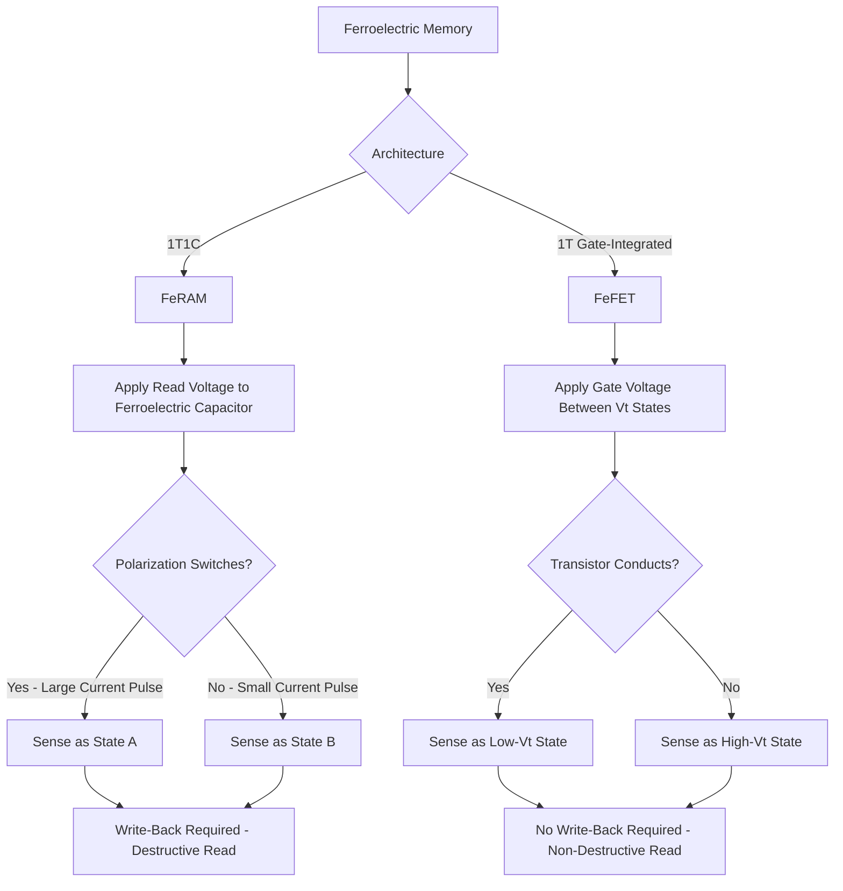

## Ferroelectric Memory and FeFET Devices

### Overview

Ferroelectric memory exploits the spontaneous, electrically switchable polarization of ferroelectric materials to store data non-volatilely. Two principal device architectures implement this physics: **Ferroelectric RAM (FeRAM)**, which uses a discrete ferroelectric capacitor in a 1T1C cell structure conceptually similar to DRAM, and the **Ferroelectric Field-Effect Transistor (FeFET)**, which integrates a ferroelectric layer directly into the transistor gate stack, using polarization state to modulate threshold voltage. The discovery that hafnium oxide-based thin films exhibit robust ferroelectricity has significantly renewed interest in both architectures for CMOS-compatible, scalable non-volatile memory.

### Ferroelectric Physics Fundamentals

#### Spontaneous Polarization

A ferroelectric material possesses a spontaneous electric dipole moment (polarization) that persists even in the absence of an applied electric field, and—critically for memory applications—this polarization direction can be switched between two stable states by applying an electric field of sufficient magnitude and appropriate polarity.

#### Hysteresis Loop

The relationship between applied electric field and resulting polarization traces a characteristic hysteresis loop rather than a simple linear response:

- **Remnant Polarization ($P_r$)**: The polarization state that persists after the applied field is removed, representing the non-volatile stored state.
- **Coercive Field ($E_c$)**: The minimum applied field magnitude required to switch the polarization direction; the memory cell's write voltage must exceed this threshold, while normal read/disturb voltages must remain safely below it to avoid unintended state changes.

The two remnant polarization states (positive and negative $P_r$) provide the two distinguishable non-volatile logic states used for binary storage.

#### Materials

- **Legacy Perovskite Ferroelectrics**: Materials such as lead zirconate titanate (PZT) and strontium bismuth tantalate (SBT) were used in earlier-generation FeRAM products, offering well-characterized, robust ferroelectric behavior but facing CMOS process integration challenges (e.g., compatibility with standard back-end-of-line thermal budgets and potential lead content considerations).
- **Hafnium Oxide-Based Ferroelectrics**: The discovery that appropriately doped hafnium oxide thin films (e.g., with silicon, zirconium, or other dopants) can exhibit ferroelectric behavior in a specific crystalline phase has substantially improved CMOS process compatibility, since hafnium-based dielectrics are already widely used in standard high-k metal gate transistor processes, easing integration relative to legacy perovskite materials. [Inference: the specific dopant formulations and process conditions used to achieve reliable ferroelectric hafnium oxide vary across research and commercial development efforts, and current best practices should be verified against current technical literature.]

### Ferroelectric RAM (FeRAM)

#### Cell Structure (1T1C)

The most common FeRAM cell architecture closely parallels the DRAM 1T1C cell (see DRAM Cell Structure and Operation), replacing the DRAM's linear dielectric storage capacitor with a ferroelectric capacitor:

- **Access Transistor**: Connects the ferroelectric capacitor to the bit line under word line control, as in DRAM.
- **Ferroelectric Capacitor**: Stores the bit as one of two stable remnant polarization states, rather than as leaking linear-dielectric charge.

#### Read Operation (Destructive)

FeRAM read is inherently destructive, similar in concept to DRAM but through a different physical mechanism:

1. The bit line is set to a reference voltage, and the word line is activated, applying a read voltage across the ferroelectric capacitor.
2. If the applied read voltage direction opposes the stored polarization state, the capacitor undergoes a polarization switching event, producing a comparatively large charge/current pulse on the bit line as the polarization reverses.
3. If the applied read voltage direction matches the stored polarization state, no switching occurs, and only a smaller, non-switching charge/current response is produced.
4. A sense amplifier distinguishes the switching versus non-switching current response to determine the originally stored logic state.
5. Because the read operation itself may have switched (and thus altered) the stored polarization state, a write-back step restores the original data, similar in principle to DRAM's read-then-restore requirement, though driven by ferroelectric switching physics rather than capacitor charge leakage/sharing.

#### Key Characteristics

- **Non-Volatility with Fast Access**: Unlike flash, FeRAM does not rely on charge tunneling through a barrier oxide for programming, generally enabling substantially faster write operations and higher write endurance than flash, while retaining non-volatility (unlike DRAM).
- **Endurance**: Ferroelectric polarization switching causes gradual fatigue (a reduction in switchable remnant polarization with cumulative switching cycles), which is generally the dominant endurance-limiting mechanism, though FeRAM endurance is typically substantially higher than flash endurance. [Inference: specific endurance figures vary by material system, cell design, and manufacturer, and should be referenced against current datasheets.]
- **Scaling Considerations**: Because the destructive read/sense mechanism relies on detecting a charge/current signal proportional to the ferroelectric capacitor's switchable polarization charge, maintaining adequate signal margin as cell area (and thus capacitor area) shrinks is a key scaling challenge, conceptually analogous to DRAM's capacitance scaling challenge but driven by different underlying physics.

### Ferroelectric Field-Effect Transistor (FeFET)

#### Structure

The FeFET integrates a ferroelectric layer into the gate stack of a standard MOSFET, typically positioned between the gate electrode and a thin interfacial dielectric layer above the silicon channel (a structure sometimes described as Metal-Ferroelectric-Insulator-Semiconductor, MFIS). The ferroelectric layer's polarization state directly modulates the effective electric field seen by the channel, shifting the transistor's threshold voltage.

#### Non-Destructive Read

Unlike FeRAM's destructive read mechanism, FeFET read is **non-destructive**: reading the cell involves simply applying a gate voltage between the two possible threshold voltage states and sensing whether the transistor conducts (similar in concept to flash's threshold-voltage-based read, described in NOR and NAND Flash Memory Physics), without requiring a polarization-switching event during read. This is a key structural advantage of FeFET over FeRAM, since it eliminates the read disturb and mandatory write-back overhead inherent to destructive-read architectures.

#### Write Operation

Programming involves applying a sufficiently large gate voltage (exceeding the ferroelectric layer's coercive field) of the appropriate polarity to switch the ferroelectric polarization to the desired state, directly analogous in circuit-level operation to how a gate voltage pulse programs a flash cell's floating gate charge, though the underlying physical storage mechanism (polarization versus trapped charge) is entirely distinct.

#### Key Characteristics and Challenges

- **Single-Transistor Cell**: Because the ferroelectric layer is integrated directly into the transistor gate stack rather than requiring a separate capacitor structure, FeFET offers potential for a compact single-transistor (1T) non-volatile memory cell, an attractive density advantage compared to FeRAM's 1T1C structure or flash's floating-gate-plus-tunnel-oxide stack requirements.
- **Retention-Endurance Tradeoff**: A widely discussed challenge in FeFET device engineering is a tradeoff between data retention (how long the polarization state, and thus threshold voltage shift, persists) and endurance/cycling behavior, often attributed to depolarization field effects and interfacial charge trapping at the ferroelectric-semiconductor (or ferroelectric-interfacial dielectric) interface. [Inference: the specific magnitude of this retention-endurance tradeoff and the effectiveness of various proposed mitigation approaches (e.g., interfacial layer engineering) remain active areas of ongoing device research, and current state-of-the-art results should be verified against current technical literature rather than treated as settled.]
- **Wake-up and Imprint Effects**: Hafnium-oxide-based FeFETs have been reported to exhibit "wake-up" behavior (an initial increase in switchable polarization over the first several program/erase cycles before stabilizing) and "imprint" effects (a preference for one polarization state developing over extended operation or storage), both of which are active areas of materials and device reliability characterization. [Unverified: the precise physical origin and universality of these effects across different hafnium oxide formulations and device structures continues to be studied, and specific claims should be checked against current published research.]

### Comparison: FeRAM vs. FeFET

| Attribute | FeRAM (1T1C) | FeFET (1T) |
| --- | --- | --- |
| Storage Element | Separate ferroelectric capacitor | Ferroelectric layer within gate stack |
| Read Mechanism | Destructive (requires write-back) | Non-destructive |
| Cell Area (Conceptual) | Larger (transistor + capacitor) | Potentially smaller (single transistor) |
| Key Challenge | Signal margin scaling (capacitor area) | Retention-endurance tradeoff, wake-up/imprint |
| Read Speed Consideration | Write-back overhead adds latency | No write-back required |

### Comparison to Other Emerging Memories

Relative to MRAM, RRAM, and PCM (see Emerging Memories: MRAM, RRAM, and PCM), ferroelectric memory technologies are generally positioned as offering:

- Fast write speed and high endurance broadly comparable to or exceeding MRAM in some respects, without requiring the specialized magnetic materials and spin-polarized current physics of MRAM.
- A more mature, longer commercial history for FeRAM specifically (having been in niche commercial production for lower-density, high-endurance applications for an extended period), while FeFET remains comparatively earlier in its development and commercialization trajectory, particularly for CMOS-integrated hafnium-oxide-based implementations. [Inference: relative commercial maturity and adoption across these various emerging memory technologies continues to evolve and should be verified against current market and product publications.]

### Ferroelectric Memory Operation Flow (svg_diagram)

### Key Points

- Ferroelectric memory stores data as one of two stable remnant polarization states in a ferroelectric material, switched via applied electric field exceeding the material's coercive field, and retained non-volatilely without power.
- FeRAM uses a 1T1C cell structure conceptually similar to DRAM, but with a destructive read mechanism based on detecting polarization-switching current, requiring a write-back step analogous to DRAM's restore operation.
- FeFET integrates the ferroelectric layer directly into the transistor gate stack, enabling non-destructive threshold-voltage-based reads and a potentially more compact single-transistor cell, at the cost of an actively researched retention-endurance tradeoff.
- The discovery of ferroelectricity in doped hafnium oxide thin films has significantly improved CMOS process compatibility compared to legacy perovskite ferroelectric materials (PZT, SBT), renewing commercial and research interest in both FeRAM and FeFET architectures.
- FeFET-specific reliability phenomena, including wake-up and imprint effects, remain active areas of device physics research, particularly for hafnium-oxide-based implementations.

### Related Topics

- DRAM Cell Structure and Operation
- NOR and NAND Flash Memory Physics
- Emerging Memories: MRAM, RRAM, and PCM
- High-k Metal Gate Reliability Characterization
- Bias Temperature Instability
- Storage-Class Memory and Memory Hierarchy Design