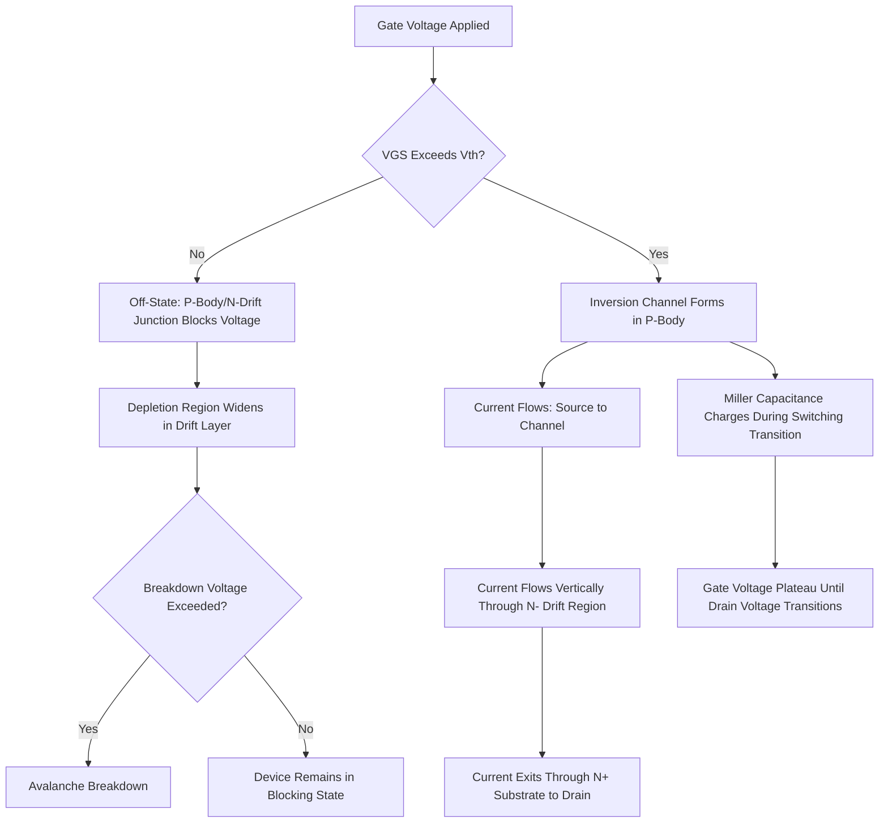

## Power MOSFET Structure and Operation

### Overview

The Power MOSFET is a voltage-controlled switching device engineered to handle high voltages and currents while retaining the fast switching speed and simple gate-drive characteristics of conventional MOSFETs. Unlike logic-level MOSFETs, which are optimized for lateral current flow at low voltage, power MOSFETs use a vertical current flow structure to achieve high breakdown voltage and current-handling capability within a compact die area. The dominant modern power MOSFET architecture is the **Double-Diffused MOSFET (DMOS)**, most commonly implemented in a vertical configuration (VDMOS).

### Vertical Structure Rationale

#### Why Vertical Current Flow

In a conventional lateral MOSFET, current flows horizontally near the surface between source and drain, with breakdown voltage capability limited by the lateral spacing between these terminals—achieving high voltage capability this way would require substantial die area consumed purely by lateral drift region length. Power MOSFETs instead route current **vertically** through the die thickness, placing the drain contact on the backside of the wafer. This allows the voltage-blocking drift region to be built using the wafer's vertical thickness rather than consuming lateral die area, and allows many parallel vertical current paths (cells) to be tiled across the die to achieve high current capability, since current-carrying capacity scales with the number of parallel cells rather than requiring wider individual lateral channels.

### VDMOS Cell Structure

#### Key Regions

- **N+ Substrate (Drain)**: A heavily doped substrate forming the drain terminal, contacted on the wafer backside.
- **N- Epitaxial Layer (Drift Region)**: A lightly doped epitaxial layer grown on the substrate, whose thickness and doping concentration are the primary design parameters determining the device's breakdown voltage rating—thicker, more lightly doped drift regions support higher blocking voltage but at the cost of increased on-state resistance.
- **P-Body Region**: A diffused (or implanted) p-type region forming the channel region when inverted; the "double-diffused" name originates from the process of sequentially diffusing the p-body and n+ source regions through a common gate-edge-defined mask opening, allowing the channel length to be precisely controlled by the difference in the two diffusion depths rather than by lithographic gate length alone.
- **N+ Source Region**: A heavily doped n-type region within the p-body, forming the source terminal.
- **Gate**: A polysilicon gate electrode positioned over the channel region (the portion of the p-body between the source and the drift region), typically also extending laterally to control multiple adjacent cells in a repeating cell array.

#### Cell Schematic Concept (svg_diagram)

<svg xmlns="http://www.w3.org/2000/svg" viewBox="0 0 380 300">
<text x="190" y="20" text-anchor="middle" font-size="14" font-family="sans-serif" font-weight="bold">VDMOS Cell Structure (svg_diagram)</text>
<rect x="40" y="230" width="300" height="30" fill="#888888" stroke="#333" stroke-width="1" />
<text x="190" y="250" text-anchor="middle" font-size="11" fill="#fff" font-family="sans-serif">N+ Substrate (Drain)</text>
<rect x="40" y="150" width="300" height="80" fill="#cceeff" stroke="#333" stroke-width="1" />
<text x="190" y="195" text-anchor="middle" font-size="11" font-family="sans-serif">N- Epitaxial Drift Region</text>
<path d="M 70 150 Q 100 110 140 150 Z" fill="#ffcc99" stroke="#333" stroke-width="1" />
<path d="M 240 150 Q 280 110 310 150 Z" fill="#ffcc99" stroke="#333" stroke-width="1" />
<text x="105" y="145" text-anchor="middle" font-size="9" font-family="sans-serif">P-Body</text>
<text x="275" y="145" text-anchor="middle" font-size="9" font-family="sans-serif">P-Body</text>
<rect x="90" y="120" width="30" height="20" fill="#66cc66" stroke="#333" stroke-width="1" />
<rect x="260" y="120" width="30" height="20" fill="#66cc66" stroke="#333" stroke-width="1" />
<text x="190" y="115" text-anchor="middle" font-size="9" font-family="sans-serif">N+ Source</text>
<rect x="130" y="90" width="120" height="20" fill="#cc4422" stroke="#333" stroke-width="1" />
<text x="190" y="104" text-anchor="middle" font-size="10" font-family="sans-serif" fill="#fff">Polysilicon Gate</text>
<line x1="90" y1="90" x2="90" y2="70" stroke="#333" stroke-width="2" />
<line x1="290" y1="90" x2="290" y2="70" stroke="#333" stroke-width="2" />
<text x="60" y="65" font-size="10" font-family="sans-serif">Source</text>
<text x="300" y="65" font-size="10" font-family="sans-serif">Source</text>
</svg>

### Operating Principle

#### On-State Conduction

When a sufficiently positive gate-to-source voltage (exceeding the threshold voltage, $V_{GS(th)}$) is applied, an inversion layer forms at the surface of the p-body region beneath the gate, creating a conductive n-type channel connecting the n+ source to the underlying n- drift region. Current then flows vertically: from the source, through the lateral inversion channel, down through the drift region, and out through the substrate to the drain contact on the backside of the die.

#### Off-State Blocking

When the gate voltage is below threshold, no inversion channel forms, and the p-body/n-drift region junction forms a reverse-biased p-n junction when a positive drain voltage is applied, blocking current flow. The device's voltage-blocking capability is primarily determined by this junction's ability to support a wide depletion region within the drift layer without avalanche breakdown.

### On-State Resistance ($R_{DS(on)}$)

A key power MOSFET figure of merit is the on-state drain-to-source resistance, which determines conduction power loss ($P_{cond} = I_D^2 \times R_{DS(on)}$). $R_{DS(on)}$ is composed of several series resistance contributions:

$$R_{DS(on)} = R_{source} + R_{channel} + R_{JFET} + R_{drift} + R_{substrate}$$

- **Channel Resistance ($R_{channel}$)**: Resistance of the inversion layer channel, influenced by channel length (set by the double-diffusion process) and gate oxide/threshold characteristics.
- **JFET Resistance ($R_{JFET}$)**: A parasitic resistance component arising from current constriction as it passes between adjacent p-body regions before spreading into the drift region, named for its conceptual similarity to a junction field-effect transistor's pinch-off behavior.
- **Drift Resistance ($R_{drift}$)**: Typically the dominant resistance component in higher-voltage-rated power MOSFETs, since achieving higher breakdown voltage requires a longer, more lightly doped drift region, which directly increases its resistance—this creates a fundamental tradeoff between breakdown voltage and on-resistance in conventional VDMOS structures.

#### Breakdown Voltage vs. On-Resistance Tradeoff

For a conventional (non-superjunction) drift region design, on-resistance scales approximately with breakdown voltage according to a well-known silicon-limit relationship often cited as:

$$R_{DS(on)} \propto BV^{2.5}$$

where $BV$ is the breakdown voltage rating. This strong super-linear scaling means that achieving significantly higher voltage ratings in conventional VDMOS structures comes at a substantial on-resistance (and thus conduction loss) penalty, motivating advanced drift region engineering approaches such as superjunction structures at higher voltage ratings. [Inference: the specific exponent value is a commonly cited theoretical/empirical approximation for silicon devices and can vary somewhat depending on the specific device design and voltage range under consideration.]

### Superjunction MOSFET Structures

To improve the breakdown voltage/on-resistance tradeoff beyond the conventional silicon limit, **superjunction** power MOSFETs replace the uniform n-type drift region with alternating, charge-balanced n-type and p-type vertical pillars:

- Under blocking conditions, the alternating pillars deplete laterally into each other (rather than relying solely on vertical depletion as in conventional VDMOS), enabling the drift region to support high voltage with a more heavily doped (and thus lower-resistance) n-type pillar than would be possible in a conventional uniform drift region design.
- This charge-balance approach substantially improves the on-resistance/breakdown voltage tradeoff relative to conventional VDMOS at higher voltage ratings, though it introduces additional process complexity (precise charge balance control between n- and p-pillars) and can introduce switching-related tradeoffs (e.g., increased output capacitance nonlinearity) relative to conventional structures. [Inference: the specific magnitude of improvement and associated switching tradeoffs are design- and vendor-specific and continue to be refined across product generations.]

### Trench Gate MOSFET Structures

An alternative to the planar gate structure described above, **trench gate** power MOSFETs place the gate electrode within a vertical trench etched into the silicon, with the channel formed along the vertical sidewall of the trench rather than at the horizontal surface:

- Eliminates the JFET resistance component present in planar structures (since there is no lateral current constriction between adjacent cells in the same way), improving on-resistance, particularly beneficial for lower-voltage-rated devices where JFET and channel resistance represent a larger fraction of total $R_{DS(on)}$.
- Enables higher cell density (more parallel channels per unit die area) compared to planar structures, further improving on-resistance for a given die area.
- Widely adopted in modern low- and medium-voltage power MOSFET products, particularly relevant where drift resistance is not yet the dominant resistance term.

### Switching Characteristics and Parasitic Capacitances

Power MOSFET switching performance is significantly influenced by parasitic capacitances inherent to the vertical structure:

- **Gate-Source Capacitance ($C_{GS}$)**: Primarily determined by gate-to-source overlap area; must be charged/discharged during turn-on/turn-off, contributing to switching delay and gate drive power requirements.
- **Gate-Drain (Miller) Capacitance ($C_{GD}$)**: Arises from gate overlap with the underlying drift region; this capacitance is particularly significant for switching behavior due to the **Miller effect**—during the switching transition, as drain voltage changes rapidly, the effective capacitance seen by the gate drive is amplified by the voltage gain across this capacitance, creating a characteristic "Miller plateau" in the gate voltage waveform during switching that must be traversed before drain voltage transition completes.
- **Drain-Source Capacitance ($C_{DS}$)**: Associated with the drain-body junction depletion capacitance, influencing resonant/ringing behavior in switching circuits and contributing to switching (turn-on) energy loss when charging/discharging against the applied drain voltage.

### Body Diode

The p-body/n-drift junction inherent to the VDMOS structure forms a parasitic **body diode** in parallel with the MOSFET channel, conducting current when the drain is driven negative relative to the source (reverse conduction). This body diode is often exploited intentionally in circuit applications (e.g., synchronous rectification, freewheeling current paths in switching power converters) but exhibits generally slower reverse recovery characteristics than a dedicated fast-recovery diode, which can be a design consideration in high-frequency switching applications requiring fast body diode commutation.

### Safe Operating Area (SOA)

Power MOSFET datasheets specify a **Safe Operating Area**, defining the combination of drain current and drain-source voltage the device can withstand without damage, considering:

- **Thermal Limits**: Sustained power dissipation ($I_D \times V_{DS}$) must remain within the device's thermal dissipation capability, considering the specific pulse duration (short pulses allow higher instantaneous power due to thermal mass/transient thermal impedance effects, while continuous/DC operation requires lower steady-state power).
- **Second Breakdown Considerations**: Unlike bipolar transistors (which are prone to a distinct thermally-driven second breakdown failure mode), power MOSFETs are generally less susceptible to this specific failure mechanism due to their positive temperature coefficient of on-resistance (which tends to promote current sharing self-stabilization across the die, actively discouraging current localization/hotspotting), though careful thermal and avalanche energy management is still required within the specified SOA limits.

### Power MOSFET Switching and Structure Flow (svg_diagram)

### Key Points

- Power MOSFETs use vertical current flow, routing the drain contact to the wafer backside, allowing the drift region to be built using wafer thickness rather than lateral die area, enabling high voltage and current capability in compact die area.
- The double-diffused (DMOS) process precisely controls channel length via the difference between sequential p-body and n+ source diffusion depths, a defining characteristic of the VDMOS structure.
- On-resistance is dominated by drift region resistance at higher voltage ratings, creating a fundamental breakdown-voltage-versus-on-resistance tradeoff, addressed at high voltage through superjunction charge-balanced drift structures and at low/medium voltage through trench gate structures eliminating JFET resistance.
- Parasitic gate-drain (Miller) capacitance significantly shapes switching behavior, producing a characteristic gate voltage plateau during the drain voltage transition period of a switching event.
- The inherent body diode and positive temperature coefficient of on-resistance are structurally significant characteristics, the latter contributing to power MOSFETs' general resistance to thermally-driven second breakdown compared to bipolar power devices.

### Related Topics

- Superjunction and Charge-Balance Device Engineering
- Insulated Gate Bipolar Transistor (IGBT) Structure and Operation
- Wide Bandgap Power Devices (SiC, GaN)
- Gate Driver Circuit Design for Power Switching
- Thermal Management and Package Design for Power Devices
- Avalanche and Second Breakdown Reliability in Power Devices