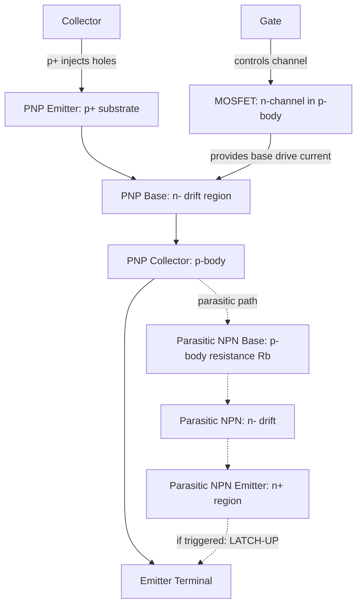

## Insulated Gate Bipolar Transistor Physics


### Overview

The Insulated Gate Bipolar Transistor (IGBT) is a hybrid power semiconductor device that combines a MOSFET's voltage-controlled gate input with a bipolar junction transistor's low conduction-loss current path. It was developed to overcome the trade-off between the high input impedance of power MOSFETs and the high current-carrying capacity but current-driven gate requirements of bipolar power transistors. The IGBT is the dominant switching device in the 600V–6.5kV, medium-to-high current range, used in motor drives, traction inverters, renewable energy converters, and industrial power supplies.

### Device Structure

**Basic Cross-Section (Vertical NPT/PT IGBT)**



```
       Emitter                Gate
|                    |
     [n+]   [n+]          [Gate Oxide]
    -------------------------------------
|  p-body (channel region)          |
    -------------------------------------
|          n- drift region          |  <-- lightly doped, blocks voltage
    -------------------------------------
|        n+ buffer (PT/FS only)     |
    -------------------------------------
|          p+ substrate/injector    |
    -------------------------------------
                Collector
```

The IGBT is structurally a four-layer p-n-p-n device (like a thyristor) but with a MOS-controlled channel region, giving it the alternate name "MOS-gated thyristor" in early literature — though it is engineered to avoid thyristor latch-up under normal operation.

**Key Layers**

- **p+ substrate (collector/injector layer)**: Injects minority carriers (holes) into the drift region during conduction — this is the layer that fundamentally distinguishes the IGBT from a power MOSFET.
- **n- drift region**: Lightly doped, wide layer that supports the blocking voltage; its thickness and doping set the device's voltage rating.
- **p-body region**: Contains the MOS channel; also forms the base of the parasitic NPN and the collector of the internal PNP.
- **n+ emitter (source) regions**: Heavily doped regions forming the MOSFET source, shorted to the p-body via the emitter metal (critical for suppressing latch-up).
- **Gate**: Polysilicon over gate oxide, identical in principle to a power MOSFET gate.

### Equivalent Circuit Model

The IGBT is accurately modeled as a **wide-base PNP bipolar transistor driven by an n-channel MOSFET**, with a parasitic NPN transistor forming an unwanted thyristor path:



The equivalent circuit is often drawn simply as an n-channel MOSFET supplying base current to a PNP bipolar transistor, with the MOSFET's drain connected to the PNP base and the PNP's collector connected to the MOSFET's source/emitter terminal.

### Operating Principle

**Turn-On**

1. A positive gate-emitter voltage ($V_{GE}$) above the threshold voltage ($V_{GE(th)}$, typically 4–6V) inverts the p-body surface beneath the gate, forming an n-type channel.
2. Electrons flow from the n+ emitter through this channel into the n- drift region — this is identical to MOSFET action and constitutes the "MOS" part of the device.
3. This electron flow forms the base drive current for the internal PNP transistor (p+ substrate / n- drift / p-body).
4. The PNP transistor turns on, injecting holes from the p+ substrate into the n- drift region.
5. The injected holes undergo **conductivity modulation** of the lightly doped drift region — dramatically reducing its effective resistivity and enabling much lower on-state voltage drop than an equivalent-voltage power MOSFET.

**On-State Voltage Drop**

The total forward voltage drop decomposes into a diode-like component (from the forward-biased p+/n- junction) plus a resistive component:

$$V_{CE(on)} = V_{J1} + I_C \cdot R_{drift(mod)} + I_C \cdot R_{channel}$$

where $V_{J1}$ is the forward voltage of the p+ substrate/n- drift junction (~0.7–1V), and $R_{drift(mod)}$ is the conductivity-modulated (much reduced) drift resistance. This diode-like offset voltage means IGBTs have a relatively constant $V_{CE(on)}$ (~1.5–3.5V) largely independent of current at rated levels — unlike MOSFETs, whose $R_{DS(on)}$ produces a linearly rising voltage drop with current. This crossover point is why IGBTs outperform MOSFETs at high current/high voltage, while MOSFETs remain superior at low voltage/high frequency.

**Turn-Off**

1. Removing $V_{GE}$ (bringing it to 0V or negative) collapses the MOS channel, cutting off electron injection.
2. The MOSFET-driven base current disappears, but the PNP transistor does not turn off instantly — stored minority carriers (holes) in the drift region must recombine or be swept out. This produces the characteristic **current tail** during turn-off.

**Current Tail and Switching Loss**

$$i_C(t) \approx I_{C0} \exp\left(-\frac{t}{\tau_{HL}}\right) \quad \text{(tail region, after initial fast MOSFET-like turn-off)}$$

where $\tau_{HL}$ is the high-level minority carrier lifetime in the drift region. This tail current, flowing simultaneously with rising $V_{CE}$, is the dominant contributor to turn-off switching energy loss ($E_{off}$) and is the central design trade-off in IGBT engineering: reducing $\tau_{HL}$ (via lifetime-killing techniques) speeds turn-off but raises on-state voltage drop.

### Latch-Up Mechanism (Critical Failure Mode)

The parasitic NPN transistor (n+ emitter / p-body / n- drift) forms a thyristor (PNPN) together with the main PNP. If the parasitic NPN turns on, the device enters a regenerative, gate-uncontrollable latch-up state — the IGBT behaves as a triggered thyristor and cannot be turned off via the gate, typically leading to destructive failure.

**Trigger Condition**: The lateral hole current flowing through the p-body resistance ($R_b$) beneath the n+ emitter creates a voltage drop:

$$V_{Rb} = I_{hole} \cdot R_b$$

If $V_{Rb}$ exceeds the built-in potential of the n+/p-body junction (~0.7V), that junction forward-biases, injecting electrons and turning on the parasitic NPN — triggering latch-up.

**Mitigation techniques**:

- Heavily doped p+ region directly beneath the n+ emitter to lower $R_b$ (deep p+ "shorting" region)
- Reduced p-body sheet resistance via optimized doping profiles
- Careful cell pitch and geometry design to minimize lateral current path length
- Limiting maximum controllable collector current ($I_{C,max}$) below the static/dynamic latch-up threshold

### IGBT Generations and Structural Variants

**Punch-Through (PT) IGBT**

- Built on a p+ substrate with an n+ buffer layer inserted between drift region and substrate.
- The buffer layer allows the depletion region to "punch through" to the substrate at rated voltage, permitting a thinner (and thus lower-loss) drift region.
- Requires lifetime killing (electron irradiation, heavy metal diffusion) to reduce switching losses, which increases on-state drop.
- Asymmetric blocking voltage capability (cannot block significant reverse voltage).

**Non-Punch-Through (NPT) IGBT**

- Thicker, lightly doped drift region on a lightly doped p+ substrate (no buffer layer).
- Wider drift region provides inherently softer turn-off and better short-circuit ruggedness without requiring aggressive lifetime killing.
- Symmetric blocking capability.
- Generally higher on-state voltage drop than PT for the same voltage rating due to the thicker drift region.

**Field-Stop (FS) / Trench Field-Stop IGBT (modern standard)**

- Combines a thin drift region (like PT) with a lightly doped n-type field-stop layer that shapes the electric field without requiring the heavy carrier lifetime reduction of classic PT designs.
- Achieves both low on-state voltage drop and low switching loss simultaneously — the key innovation enabling modern 3rd/4th/5th-generation IGBTs (e.g., Infineon TRENCHSTOP, Mitsubishi CSTBT).

**Trench Gate vs. Planar Gate**

- **Planar gate**: Gate runs along the horizontal surface; simpler process, lower channel density.
- **Trench gate**: Gate etched vertically into silicon, eliminating the JFET-like resistance region present in planar cells and enabling much higher channel/cell density, lowering on-state resistance.

**Carrier-Stored Trench-Gate Bipolar Transistor (CSTBT / IEGT)**

- Adds an additional n-type carrier-storage layer beneath the p-body to enhance hole accumulation near the emitter side (Injection Enhancement Effect), further reducing $V_{CE(on)}$ without degrading switching performance.

### Reverse Conducting and Reverse Blocking Variants

- **RC-IGBT (Reverse Conducting)**: Integrates an anti-parallel freewheeling diode monolithically within the same die (shorted p+ collector regions act as diode injection points), reducing package size and cost versus discrete diode pairing.
- **RB-IGBT (Reverse Blocking)**: Engineered with a deep isolation junction to support reverse voltage blocking, used in matrix converters and current-source inverters requiring bidirectional blocking.

### Safe Operating Area (SOA) Considerations

- **Forward Bias Safe Operating Area (FBSOA)**: Bounded by maximum current, maximum voltage, and thermal limits during turn-on.
- **Reverse Bias Safe Operating Area (RBSOA)**: Defines the safe turn-off trajectory; limited by dynamic avalanche and the risk of triggering latch-up during the voltage rise/current fall transient.
- **Short-Circuit Withstand Time (SCWT)**: A critical rating (~typically 10 μs class, [Unverified: exact figures are highly device- and vendor-specific] ) specifying how long the IGBT can sustain short-circuit current before thermal runaway or dynamic latch-up occurs — essential for motor-drive fault protection design.

### Switching Waveform Characteristics



```
V_CE  |                    ___________________
|                   /
|__________________/    <- turn-on: fast MOSFET-like edge
|
|________         
|         \
|          \________________   <- turn-off: fast edge + long tail
|                          \___
      +------------------------------------> time

I_C   |          ______________
|         /              \
|        /                \___
|_______/                     \____________ <- current tail (bipolar recombination)
      +------------------------------------> time
```

### Comparison: IGBT vs Power MOSFET vs BJT

| Parameter | Power MOSFET | IGBT | Power BJT |
| --- | --- | --- | --- |
| Gate/base drive | Voltage-controlled, high impedance | Voltage-controlled, high impedance | Current-controlled, low impedance |
| On-state drop mechanism | $I \times R_{DS(on)}$ (resistive) | Diode drop + modulated resistance | Diode drop (V_CE,sat) |
| High-voltage/high-current performance | Poor ($R_{DS(on)}$ rises steeply with voltage rating) | Excellent | Good but drive-intensive |
| Switching speed | Very fast (majority carrier only) | Moderate (limited by tail current) | Slow (high stored charge) |
| Switching losses | Low | Moderate (tail-dominated) | High |
| Typical application voltage | <600V (mainstream) | 600V–6.5kV | Largely obsolete for new designs |

### Key Points

- IGBT = MOSFET-controlled gate driving a bipolar PNP conduction path, combining voltage-mode gate drive with conductivity-modulated low-loss conduction.
- On-state drop has a diode-like offset instead of pure resistance, making IGBTs superior to MOSFETs at high voltage/high current.
- Turn-off is limited by the bipolar current tail from stored minority carriers — the central design trade-off between conduction loss and switching loss.
- Latch-up via the parasitic NPN/PNP thyristor path is the dominant destructive failure mechanism, mitigated through p+ shorting regions and controlled current limits.
- Modern devices use Field-Stop + Trench (and CSTBT/IEGT) structures to simultaneously minimize on-state and switching losses, superseding older PT/NPT-only designs.

### Related Topics

- Power MOSFET structure and $R_{DS(on)}$ scaling physics
- Thyristor (SCR) and GTO device physics
- Super-junction MOSFET technology
- SiC and GaN wide-bandgap power device physics
- Snubber circuits and gate drive design for IGBT switching
- Power module packaging and thermal management (DBC substrates, bond wires)
- Short-circuit protection and desaturation detection circuits

### Next Steps

- Wide-bandgap power devices (SiC MOSFET, GaN HEMT) as emerging IGBT alternatives
- IGBT dynamic characterization: switching energy measurement ($E_{on}$/$E_{off}$) methodology
- Power module reliability: bond wire fatigue, solder layer degradation, thermal cycling